# 0から始めるBUYMAロードマップ

## 仕入れ・高値売り・外注化・AI活用まで

<!--
制作状態: 新版本文完成（第0章〜第12章・特典1〜5・無料部分は独立レビューPASS）
正本台帳: 教材_BUYMA全素材対応表_2026-07-12.md
公式再確認日: 2026-07-15
無料部分と有料ライン位置は作成済み。販売価格は2,980円（税込）で確定
旧Brain入稿本文は上書きしない
-->

※本教材はBUYMA運営元とは一切関係のない非公式教材です。

※BUYMA、買付先、配送会社、決済サービス等の規約や条件は変わります。本文に確認日がある数値も、実践前に必ず公式情報で再確認してください。

※章頭画像・挿絵内の画面や数値は構成イメージです。販売実績、利益、成果を示すものではありません。

この教材は、これまで別々に作成・提供してきたBUYMA教材を、初心者が上から順番に進められる1本のロードマップへ再構成したものです。

登録・出品の基礎だけでなく、国内買付、海外買付、直営店連携、オンラインVIP、高値売り、出品外注化、フル外注化、AI活用までを、実践する順番でまとめています。

古い教材をそのままつなげたものではありません。現在のBUYMA公式ガイド、募集サービスの規約、フリーランス法、個人情報、画像権利、AIサービスの現行案内を確認し、危険・古い・根拠のない手順は削除または注意事項へ変更しています。

## この教材で分かること

- BUYMA開始前に確認する規約、画像権利、利益計算、管理記録
- 国内・海外・直営店連携・オンラインVIPの違いと実務フロー
- 旧ショップ68件を「現在使える一覧」と誤認せず、確認日付きで調査する方法
- 安売りだけに頼らず、商品・仕入れ・配送・見せ方・価格を組み立てる考え方
- 出品作業を仕様化し、募集・契約・教育・権限・引継ぎまで管理する方法
- AIを事実の決定者にせず、5つの業務の下書き・整理へ使う方法

## 収録内容

| 収録 | 内容 |
|---|---|
| 本編 | 第0章＋第1〜12章 |
| 特典 | 海外買付、国内買付、直営店・VIP、出品外注化、問い合わせ運営の5キット |
| 問い合わせ | 受注前後・在庫・代替・発送・キャンセル等の30場面＋補足文 |
| 商品文章 | 感性ワード251候補＋商品コメント28カテゴリ |
| 実践資料 | 出品SOP、公開前チェック、募集文、判断フロー、発注・契約確認 |
| 管理表 | 原教材のExcel 6ファイル・39シートを現行化して説明し、購入者版7ファイル・22シートを収録 |

本編・特典本文・テンプレート本文は同じBrain本文内に収録し、編集用Excel 7点は購入者用ZIPにまとめています。教材を読むためにNotionへ移動する必要はありません。

## こんな人向け

- BUYMAを始めたいが、何から確認すればよいか分からない
- 仕入れ方法が複数あり、自分がどれから始めるか整理したい
- 出品数だけでなく、1件ごとの総コストと利益を確認したい
- 自分で再現できた作業から外注化したい
- AIを使いたいが、誤情報や個人情報の扱いが不安
- 古い教材の手順を現在の規約に合わせて見直したい

## この教材が合わない人

- コピペだけで売上や利益が保証される方法を求めている
- 未確認のショップ一覧をそのまま仕入先として使いたい
- 無許諾の自動出品、大量取得、複数アカウント等を使いたい
- 他者の画像・文章・募集文をコピーして使いたい
- AIへBUYMA運営の判断や公開をすべて任せたい

## この教材を書いている人

著者: 池田祐馬

本教材は、私がBUYMAで実際に作ってきた、START UP、国内・海外買付、直営店、VIP、高値売り、外注化、AI活用、各種特典を統合したものです。

今回の新版では、当時の固定数値やサービス名を現在の正解として残さず、原教材の内容と現行の公式情報を照合しました。実績数字を誇張して見せるのではなく、購入者が自分の条件で確認・判断できる教材にすることを優先しています。

## 読み方

| 目的 | 読む順番 |
|---|---|
| 初心者 | 第0章→第1章→第2〜6章を理解→実践する仕入れ方式を1つ選ぶ |
| 仕入れを強化 | 第2〜6章→第7章→特典1〜3 |
| 出品を外注化 | 第1章→第8章→第9章→特典4 |
| フル外注化へ進む | 第8章→第9章→第10章 |
| AIを使う | 第11章→第12章。公開・送信前は該当する実務章へ戻る |
| 顧客対応 | 第9章資料3→特典5 |

最初から全部を同時に実践する必要はありません。第2〜5章の仕入れ方法を一度理解し、今回使う方式を1つ選びます。外注化は、自分で正常・異常・停止条件を説明できる作業から始めます。

## 購入前の注意

- 本教材は成果や利益を保証するものではありません。
- 本教材および特典（リスト・文章テンプレートを含む）の転載・再配布・共有・二次販売を禁止します。
- 購入者都合による返品・返金には原則対応しません。返品・返金条件は販売ページと購入時の最終確認画面に明示し、法令、Brain規約、または当事者間で別途合意した対応がある場合は、その定めに従います。
- 文章テンプレートはそのまま使用せず、ご自身の状況に合わせて書き換えてください。
- 特典のブランド・ショップ情報は変動します。同一文面での一斉交渉など、相手方の迷惑になる使い方はしないでください。
- AI出力はそのまま公開せず、商品、買付先、価格、規約、権利、顧客対応を人が確認してください。
- 章名の「完全解説」は、本教材の対象範囲を順序立ててまとめた名称です。あらゆる取引事例への対応や、将来の規約・法令・サービス条件まで保証するものではありません。

## 販売価格

**2,980円（税込）**

本教材に動画講義、個別コンサル、個別案件の添削、利益保証は含まれません。

## 総合目次

### START UP

1. 第0章 全体ロードマップと実践前の注意
2. 第1章 BUYMA START UP

### 仕入れ

3. 第2章 BUYMA国内買付完全解説マニュアル
4. 第3章 海外買付完全解説マニュアル
5. 第4章 直営店連携仕入れ完全解説マニュアル
6. 第5章 BUYMA オンラインVIP仕入れ完全解説マニュアル
7. 第6章 BUYMAショップリスト

### 高値売り

8. 第7章 高値売りの戦略

### 外注化

9. 第8章 出品外注化・採用・教育マニュアル
10. 第9章 出品外注化 実践資料集
11. 第10章 フル外注化と運営設計

### AI活用

12. 第11章 BUYMA運営へのAI活用
13. 第12章 BUYMA実践プロンプト集

### 特典

14. 特典1 海外買付パートナー実務キット
15. 特典2 国内買付パートナー実務キット
16. 特典3 直営店・VIP開拓キット
17. 特典4 出品外注化スターターキット
18. 特典5 問い合わせ・運営テンプレート集

<!-- PUBLISH-TODO: 販売価格は2,980円（税込）で確定。紹介料率・紹介対象・カテゴリ・タグ・サポート範囲はBrain公開直前にユーザー確認する -->

<!-- ★Brain入稿時: ここに有料ラインを設定する -->

---

## 第0章 全体ロードマップと実践前の注意

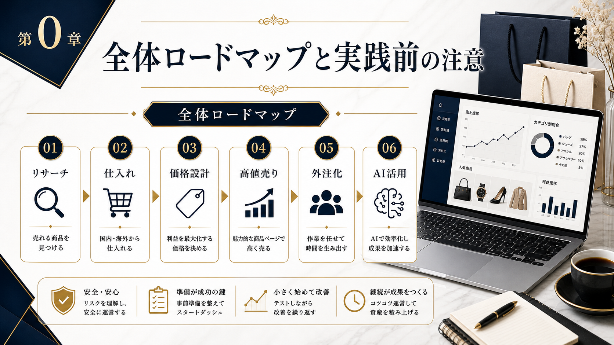

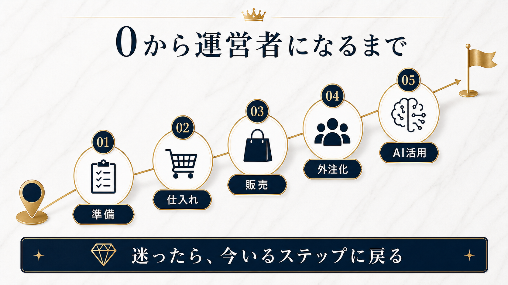

<!-- SOURCE: 商品設計=統合構成案 第0章 / 原本=ROOT-01 / 公式更新=本章末リンク -->

### 0-1 この教材で進む4段階

この教材は、BUYMAの作業を次の4段階に分けています。

1. **登録・出品**: ルール、利益計算、商品ページの作り方を理解する
2. **仕入れ**: 国内、海外、直営店連携、VIPから、自分が実践する方式を選ぶ
3. **高値売り**: 安さだけではなく、商品・仕入れ・配送・見せ方の違いを作る
4. **外注化・AI活用**: 自分で確認できる作業だけを切り出し、下書きと整理を効率化する

章頭画像は、この4段階を「リサーチ、仕入れ、価格設計、高値売り、外注化、AI活用」の6作業へ細分化したものです。最初から全作業を同時に始める必要はありません。

### 0-2 正しい読み順

| 段階 | 読む章 | この段階で決めること |
|---|---|---|
| 基礎 | 第0〜1章 | 公式ルール、総コスト、初出品の確認方法 |
| 仕入れ | 第2〜6章 | 各方式を理解し、最初に実践する方式を1つ選ぶ |
| 高値売り | 第7章 | 候補商品の差別化理由と価格根拠 |
| 採用・教育 | 第8章 | 委託する業務、募集サービス、契約、教育 |
| 実践資料 | 第9章 | 作業に使うSOP、管理表、チェック表、文例 |
| 運営設計 | 第10章 | 承認、停止条件、証憑、権限、引継ぎ |
| AI活用 | 第11〜12章 | AIへ渡す資料、人が確認する項目、5つのプロンプト |

第2〜5章は、すべての仕入れ方法を一度理解したうえで、今回実践する方式を1つ選びます。理解していない方式を飛ばしてよいという意味ではありません。

### 0-3 日数ではなく完了条件で進む

本教材では「30日で外注化」「何日目までに何品」といった固定日程を設定しません。前の段階の確認が終わってから次へ進みます。

| 次へ進む前の確認 | 完了条件 |
|---|---|
| 第1章から仕入れ編へ | 根拠資料と総コストを確認した商品ページの下書きが1件ある |
| 仕入れ編から第7章へ | 選んだ仕入れ方式で、商品・買付先・配送・関税・利益を説明できる |
| 第7章から第8章へ | 自分で一度行い、正常時と異常時の判断を説明できる作業がある |
| 第10章からAI編へ | AIへ渡してよい情報と、人が承認する情報を分けられる |

この表は学習順を整理するための商品設計です。売上や利益の達成時期を保証するものではありません。

### 0-4 最初に守る5つのルール

#### 1. 買付先を確認する

BUYMAでは、国内EC、CtoCサービス、品質や真贋に不安のある買付先など、利用できない買付先があります。禁止・要注意一覧は随時更新されるため、教材内のショップ名だけで判断しません。

[BUYMA公式: 出品を禁止されている買付先](https://qa.buyma.com/shopper/prohibited-item/4007.html)

#### 2. 画像の権利を確認する

ブランドやECサイトなど、第三者が著作権を持つ画像は、加工しても無断掲載できません。自分が権利を持つ画像、または利用許諾を得た画像を使い、必要に応じて許諾の根拠を提出できる状態にします。

[BUYMA公式: 出品画像による権利侵害の禁止](https://qa.buyma.com/shopper/prohibited-item/15733.html)

#### 3. 出品者責任で検品する

商品は、注文内容、色、サイズ、数量、付属品、汚れ、傷、破損などを確認してから購入者へ発送します。出品者責任での検品を経ない買付先からの直送は禁止されています。

[BUYMA公式: 検品・梱包・発送で気をつける点](https://qa.buyma.com/shopper/order-to-delivery/4201.html)

#### 4. 事実だけを表示する

商品と関係のないキーワード、誤ったカテゴリ・ブランド・テーマ、虚偽や誤解を招く説明・画像、許可のない著名人画像は使いません。「限定」「日本未入荷」「即発」なども、その条件を確認できる場合だけ使います。

[BUYMA公式: 出品時の禁止事項](https://qa.buyma.com/shopper/prohibited-item/11394.html)

#### 5. アカウントの責任は登録者にある

作業の一部を外部へ委託することや、パートナーがログインすることは一律に禁止されていません。ただし、パートナーの操作を含むアカウント上の全行為は登録者の責任です。利用制限歴のある人への委託も避けます。

[BUYMA公式: 出品者登録に関するよくある質問](https://qa.buyma.com/shopper/reg/13732.html)

### 0-5 数値・リスト・ツールの読み方

教材には、元教材が作られた当時の価格、利益率、報酬、ショップ、配送日数、サービス名が含まれていました。新版では次のように扱います。

| 表示 | 意味 | 実践時の行動 |
|---|---|---|
| 現行値 | 公式情報で確認した数値 | 記載された確認日と公式URLを確認する |
| 当時例 | 元教材で実際に使われていた例 | 現在の標準・相場とは扱わず、自分の条件で再計算する |
| 未確認 | 営業・正規性・規約適合を確認できていない情報 | 確認が終わるまで使わない |
| 保留 | 原本や適法性を確認できていない手順 | 推測で実行しない |

自動出品など、BUYMAが許諾していない外部プログラムやサーバーへ負荷をかけるツールは使いません。

[BUYMA公式: 副業・高額コンサル・スクール勧誘に関する注意](https://qa.buyma.com/shopper/tips/30118.html)

### 0-6 最初に用意する4つの記録

> **購入者配布資料:** `BUYMA_購入者配布資料_7点セット.zip`
> 利益計算、出品管理、国内買付、海外買付、直営店連携、VIP交渉、ショップ確認の編集可能なExcelを収録しています。Brain入稿時は、このZIPを購入者用ファイルとして添付します。

<!-- ATTACHMENT-READY: BUYMA購入者配布資料/BUYMA_購入者配布資料_7点セット.zip -->

1. **利益計算**: 仕入、税、送料、為替、関税、手数料、外注費、利益
2. **出品管理**: 商品、URL、型番、色、サイズ、買付地、発送地、価格、確認日
3. **買付・配送管理**: 在庫確認、注文番号、受取、検品、発送、追跡番号
4. **証憑保管**: 注文明細、レシート、検品画像、発送伝票、許諾資料

管理表へ個人情報を入れる場合は、必要な項目だけにし、閲覧できる人と保存期間を決めます。管理表の配布版は、原xlsxの固定値・数式エラー・不要なサンプル値を除いたものを使います。

### 第0章 準備チェック

- [ ] 教材を日数ではなく完了条件で進めると理解した
- [ ] 禁止・要注意買付先の公式ページを開いた
- [ ] 第三者画像は加工しても無断利用できないと理解した
- [ ] 未検品直送を行わないと理解した
- [ ] 出品情報には確認できる事実だけを書くと決めた
- [ ] アカウント上の行為は登録者責任だと理解した
- [ ] 4つの記録をどこで管理するか決めた

### 第0章の公式確認先

確認日: **2026-07-15**

- [禁止・要注意買付先](https://qa.buyma.com/shopper/prohibited-item/4007.html)
- [画像の権利](https://qa.buyma.com/shopper/prohibited-item/15733.html)
- [出品時の禁止事項](https://qa.buyma.com/shopper/prohibited-item/11394.html)
- [出品活動における禁止事項](https://qa.buyma.com/shopper/prohibited-item/27277.html)
- [検品・梱包・発送](https://qa.buyma.com/shopper/order-to-delivery/4201.html)
- [外部委託時のアカウント管理](https://qa.buyma.com/shopper/reg/13732.html)
- [副業・高額コンサル・スクール勧誘に関する注意](https://qa.buyma.com/shopper/tips/30118.html)

---

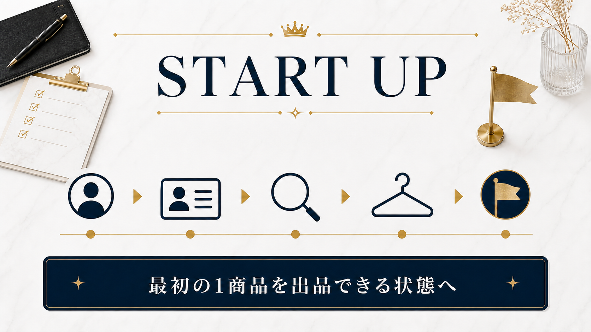

## 第1章 BUYMA START UP

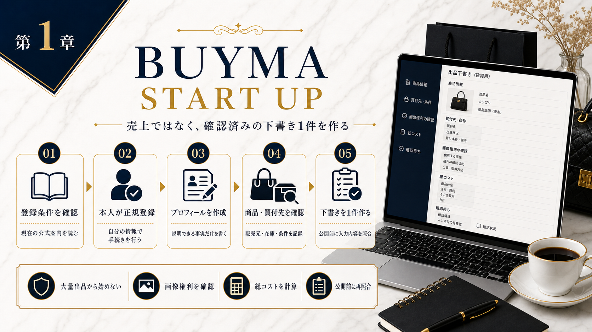

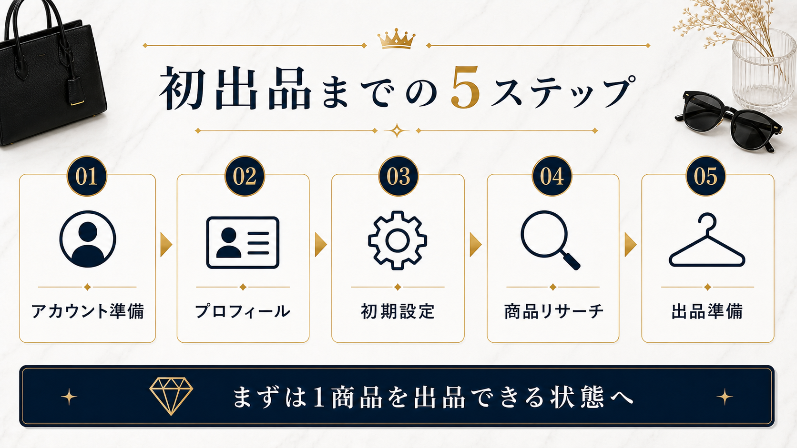

<!--
SOURCE:
- ROOT-01 BUYMA START UP
- CHILD-07 登録部分のみ。パッチテスト部分は不使用
- CHILD-04 / PDF-SOP-01〜17,20〜29（現行化）
- PDF-SOP-18 数量2固定は削除
- PDF-SOP-19 空白ページは削除
- 公式更新=本章末リンク（確認日2026-07-15）
-->

### この章のゴール

この章の完了状態は、出品数や売上ではありません。

> **買付先、画像権利、商品情報、総コスト、変更できない項目を確認した商品ページの下書きが1件あること。**

実際に公開する前に、仕入先資料と入力内容をもう一度照合します。

### 1-1 BUYMAと無在庫販売の基本

BUYMAでは、商品を出品し、注文が入った後に買付を行う運営が可能です。先に大量の在庫を持つ必要はありませんが、在庫切れ、価格変動、配送遅延、返品・再送などのリスクがなくなるわけではありません。

基本の流れ:

1. 商品と買付予定先を確認する
2. 商品ページを作る
3. 注文後に在庫と条件を再確認する
4. 商品を買い付ける
5. 注文内容と品質を検品する
6. 追跡できる方法等、商品ページで約束した条件で発送する
7. 発送通知と取引対応を行う

初心者が最初に整えるのは、大量出品ではなく、1件の取引を正しく追跡できる状態です。

### 1-2 出品者登録の条件

2026年7月15日にBUYMA公式ガイドで確認できた一般出品者の必須条件は次の3つです。

- 満20歳以上
- 日本語で購入者と円滑にやり取りできる
- 日本へ商品を発送できる

一般出品者は個人登録です。法人で活動する場合は、一般出品者とは別にショップ登録の案内を確認します。居住国によって事前の登録や届出が必要な場合もあります。

[BUYMA公式: 出品者になるための条件](https://qa.buyma.com/shopper/reg/2303.html)

### 1-3 正規の登録手順

元教材の「BUYMA登録とパッチテストマニュアル」からは、本人が自分のアカウントを正規登録する部分だけを使います。外注候補者に新規アカウントを作成・出品・退会させるパッチテストは行いません。

現在の公式手順:

1. BUYMAの会員登録を完了する
2. ログインしてマイページを開く
3. 会員情報から「パーソナルショッパー登録」を選ぶ
4. 基本情報、プロフィール、PR情報を入力する
5. 入力内容を確認して登録を完了する
6. 成約代金の振込先口座を登録する

同じ入力画面を長時間開いたままにすると内容が消える場合があるため、プロフィールとPR文は事前に事実だけで下書きしておきます。

[BUYMA公式: 出品者登録方法](https://qa.buyma.com/shopper/reg/2301.html)

### 1-4 プロフィールとPR情報

元教材には、アパレル経験、海外経験、コネクションなどを含むプロフィール例がありました。自分にない経歴や関係性は使いません。

事実確認用の下書き:

```text
【活動について】
[実際の居住地・対応地域]から活動しています。

【取り扱い】
[実際に調査・買付できるブランドやカテゴリ]を中心にご案内します。

【ご注文前】
在庫と買付条件は変動するため、ご注文前に確認いたします。

【検品・発送】
注文内容と商品の状態を確認し、商品ページでご案内した方法で発送します。

【お問い合わせ】
確認が必要な内容は、買付先等へ確認したうえで回答します。
```

書いてよいのは、現在の自分が説明・証明できる内容だけです。「日本未入荷」「入手困難」「正規品保証」「関税込み」なども、商品や取引条件を確認してから使います。

### 1-5 開始前に準備するもの

- BUYMA専用のメールアドレス
- 成約代金を受け取る本人名義等の対応口座
- 自分の資金計画と買付先に合う決済手段
- 利益計算と出品管理の表
- 注文明細、レシート、検品画像、発送伝票の保管場所
- 自分が権利を持つ画像、または利用許諾を確認できる画像
- 問い合わせと発送期限を確認する連絡環境

特定のカードや銀行を、全員に最適なものとして推奨しません。年会費、海外利用、為替手数料、締日、支払日、利用可能枠、繰上返済の条件を各社公式情報で比較します。生活費や納税資金を買付に流用しない資金計画も必要です。

### 1-6 手数料・上限・利益計算

#### 2026年7月15日の現行値

| 項目 | 一般出品者向け公式案内 |
|---|---|
| 出品料 | 無料 |
| 成約手数料 | 5.5〜7.7%税込。一般出品者は原則7.7%。新バージョンは商品価格＋配送料、旧バージョンは販売価格が計算対象 |
| 振込手数料 | 海外口座1,000円、国内口座385円、楽天銀行220円 |
| 販売価格 | 500〜9,000,000円 |
| 出品数上限 | 5,000品 |
| 100品以上の出品 | 特定商取引法上の販売事業者に該当 |

成約手数料は、ポイントやクーポンによる割引前の金額に料率を掛けて計算されます。計算対象は配送方法のバージョンで異なり、新バージョンは商品価格＋購入者向け配送料、旧バージョンは販売価格です。自分の出品画面とアカウントに表示される方式・料率を確認してください。

購入者向け配送料を別に設定しない場合も、利益計算表と出品管理表の配送料欄には`0`を入力します。空欄のままでは、入力漏れと0円を区別できません。

- [BUYMA公式: 出品者側の手数料](https://qa.buyma.com/bm/usage-fee/4503.html)
- [BUYMA公式: 商品の価格設定](https://qa.buyma.com/shopper/4104.html)
- [BUYMA公式: 出品価格・出品件数の上限](https://qa.buyma.com/shopper/sell/4102.html)

#### 1件ごとの総コスト

```text
仕入商品代
+ 現地税・買付先送料
+ 国際送料
+ 関税・輸入消費税・立替手数料（出品者負担の場合）
+ 決済・為替コスト
+ 国内送料
+ 梱包費・外注費
+ 振込手数料の配賦額
+ 返品・再送等に備える金額
= 成約手数料を除く総コスト
```

一般出品者の成約手数料を`r`、成約手数料を除く総コストを`C`、確保したい利益を`P`とすると、確認用の販売価格は次の式で逆算できます。

```text
確認用販売価格 = (C + P) ÷ (1 - r)
```

端数を調整したら、実際の販売価格でもう一度、成約手数料と利益額を計算します。元教材の「利益率20%」を標準値として固定しません。

> **この章の配布資料:** `BUYMA_利益計算表_購入者版.xlsx`、`BUYMA_出品管理表_購入者版.xlsx`

<!-- ATTACHMENT-READY: BUYMA購入者配布資料/BUYMA_利益計算表_購入者版.xlsx / BUYMA購入者配布資料/BUYMA_出品管理表_購入者版.xlsx -->

### 1-7 初出品までの5ステップ

#### STEP 1 アカウントとプロフィールを準備する

本人の正しい情報で登録し、プロフィールとPR情報を事実だけで整えます。

#### STEP 2 商品と買付先を確認する

次を証拠と一緒に保存します。

- 買付先名、運営主体、商品URL
- ブランド、商品名、型番
- 色、サイズ、素材、付属品
- 商品価格、税、送料、返品条件
- 在庫確認日
- 禁止・要注意買付先との照合結果

マーケットプレイスの場合は、サイト名だけでなく実際の販売元まで確認します。

#### STEP 3 利用できる画像を準備する

商品画像は最大20枚まで掲載できます。ただし、枚数よりも権利と正確さを優先します。

- 自分で撮影し、自分が著作権を持つ画像
- 第三者からBUYMA掲載の利用許諾を得た画像
- BUYMAの正規機能で利用条件を満たす画像

ブランドやECサイトの画像は、保存・加工しただけでは使えません。許諾を得た場合は、その根拠も保管します。

#### STEP 4 商品ページを入力する

画面の並びは変わることがあります。項目名が違う場合は、BUYMAの現在の入力画面と公式ガイドを優先します。

| 項目 | 入力時の確認 | 出品後 |
|---|---|---|
| 商品画像 | 権利、商品一致、色味、付属品 | 追加・削除・並び替え可能 |
| 商品名 | ブランド、商品名、型番等の事実 | 変更不可。誤りは再出品 |
| 商品コメント | 仕様、付属品、配送、注意事項 | 変更可能 |
| カテゴリ | 実際の商品カテゴリ | 変更不可。誤りは再出品 |
| ブランド | 正式なブランド | 変更不可。誤りは再出品 |
| シーズン・テーマ・タグ | 条件を満たすものだけ選ぶ | 変更可能 |
| 色・サイズ・在庫 | 仕入先情報と照合 | 変更可能 |
| 発送方法 | 追跡、送料、日数等を実態どおり設定 | 変更可能 |
| 購入期限 | 在庫・買付条件に合わせる | 変更可能 |
| 買付地 | 実際の買付予定地 | 変更不可。誤りは再出品 |
| 発送地 | 実際の発送地 | 変更不可。誤りは再出品 |
| 商品価格 | 全コスト、手数料、利益を反映 | 変更可能 |
| 参考価格 | 公式な根拠がある場合だけ入力 | 現行条件を再確認 |
| 関税 | 発送地と負担者を正確に設定 | 取引条件と一致させる |
| 型番・管理メモ | 商品特定と内部管理に使う | 購入者表示との違いを確認 |

[BUYMA公式: 出品後に変更できる項目](https://qa.buyma.com/shopper/sell/4107.html)

#### STEP 5 公開前確認と出品審査へ対応する

公開前に、商品ページと仕入先資料を上から順に照合します。確認者が別にいる場合も、最終責任は登録者にあります。

BUYMAの条件に一致した商品は自動的に「出品審査中」となり、審査には最大4営業日かかります。追加確認では、登録情報、出品商品・方法、買付先情報などの提示を求められる場合があります。

レシートや注文明細等は、BUYMA公式案内に従い取引完了から1年程度保管します。未買付の場合は、買付予定先を説明できる資料を残します。

[BUYMA公式: 出品審査](https://qa.buyma.com/shopper/sell/12609.html)

### 1-8 商品コメントを事実と提案に分ける

商品コメントでは、確認できる事実と、着こなし等の提案を混同しません。

```text
【商品情報】
ブランド:
商品名・型番:
色:
サイズ:
素材・仕様:
付属品:
情報確認元:

【ご案内】
在庫確認:
買付予定先:
発送地・発送方法:
お届け目安:
関税負担:

【スタイリング等の提案】
確認できる商品仕様を前提に、断定せず記載:
```

次の表現は根拠なしに使いません。

- 限定、日本未入荷、新作、完売、残り1点
- 大人気、入手困難、希少
- 著名人愛用、雑誌掲載
- 正規品保証、関税なし、返品不可

商品と関係のないキーワードを並べる行為や、誤ったカテゴリ・ブランド・テーマへの出品も禁止されています。

### 1-9 初心者のリサーチ

元教材では、他の出品者を参考に商品を探す方法が扱われていました。新版では、文章・画像・商品構成をそのまま真似るのではなく、観察した事実と自分の仮説を分けます。

| 区分 | 記録する内容 |
|---|---|
| 観察できる事実 | ブランド、カテゴリ、販売価格、取引表示、問い合わせ、配送条件等 |
| 仮説 | なぜ選ばれた可能性があるか |
| 自分で確認する事実 | 買付先、在庫、総コスト、画像権利、配送、規約 |
| 判断 | 出品候補／保留／見送りと、その理由 |

他の出品者の販売価格だけを見て、その人の利益額を断定することはできません。仕入値、割引、税、送料、返品、外注費などが見えないためです。

リサーチした候補は、最低でも次を埋めてから出品判断へ進みます。

- 商品URLと確認日
- 買付先と販売元
- 商品識別情報
- 在庫と仕入総額
- 最低販売価格
- 需要理由の仮説
- 画像の利用根拠
- 未確認事項

### 1-10 チェックリスト

#### 次章へ進む準備チェック

- [ ] 出品者登録の必須条件を確認した
- [ ] 正規の登録手順で本人のアカウントを登録した、または登録手順を説明できる
- [ ] プロフィールとPR文に、事実でない経歴・実績・関係性がない
- [ ] 自分の成約手数料を確認した
- [ ] 総コストから販売価格と利益額を再計算できる
- [ ] 禁止・要注意買付先を確認した
- [ ] 画像の権利根拠を説明できる
- [ ] 変更できない5項目を説明できる
- [ ] 根拠資料付きの商品ページ下書きが1件ある

#### 実際に出品・取引するときのチェック

- [ ] 商品URL、販売元、在庫、価格、確認日を保存した
- [ ] 商品と関係のないキーワードを入れていない
- [ ] カテゴリ、ブランド、商品名、買付地、発送地を公開前に確認した
- [ ] 色、サイズ、素材、付属品を仕入先資料と照合した
- [ ] 配送方法、追跡、到着目安、関税負担が実態と一致している
- [ ] 成約手数料を含めても必要な利益が残る
- [ ] 画像の権利または利用許諾の証拠がある
- [ ] 注文明細、レシート、検品画像、発送伝票を保管できる
- [ ] 出品審査のメールを受け取れる

### 第1章の公式確認先

確認日: **2026-07-15**

- [出品者になるための条件](https://qa.buyma.com/shopper/reg/2303.html)
- [出品者登録方法](https://qa.buyma.com/shopper/reg/2301.html)
- [出品者側の手数料](https://qa.buyma.com/bm/usage-fee/4503.html)
- [出品価格・出品件数の上限](https://qa.buyma.com/shopper/sell/4102.html)
- [商品詳細の内容](https://qa.buyma.com/shopper/sell/4106.html)
- [出品後に変更できる項目](https://qa.buyma.com/shopper/sell/4107.html)
- [出品審査](https://qa.buyma.com/shopper/sell/12609.html)
- [出品時の禁止事項](https://qa.buyma.com/shopper/prohibited-item/11394.html)
- [画像の権利](https://qa.buyma.com/shopper/prohibited-item/15733.html)
- [禁止・要注意買付先](https://qa.buyma.com/shopper/prohibited-item/4007.html)

<!--
第1章 完了判定:
- 原本由来の登録・出品・リサーチを収録
- パッチテスト、数量2固定、固定21日、無許諾画像を不使用
- 公式更新を確認日付きで反映
- 利益計算表と出品管理表の購入者版を作成し、代表入力値による数式テストと再読込後のエラー検査を完了

第0〜1章 出典対応:
- 0-1〜0-3: 商品設計（統合構成案。新規BUYMAノウハウではなく学習順の整理）
- 0-4: ROOT-01 + BUYMA公式（買付先、画像権利、検品、表示、アカウント責任）
- 0-5: ROOT-01、ROOT-07〜11の旧記述監査 + BUYMA公式ツール注意
- 0-6: SHEET-DOM/OVS/DIR/REC/VIPの共通項目 + 商品設計
- 1-1: ROOT-01
- 1-2: BUYMA公式 reg/2303
- 1-3: ROOT-01 + CHILD-07の登録部分 + BUYMA公式 reg/2301
- 1-4: ROOT-01 + CHILD-07のプロフィール部分を事実表示へ現行化 + 商品設計
- 1-5: ROOT-01の準備項目を特定サービス非推奨へ現行化
- 1-6: ROOT-01の利益計算 + BUYMA公式 fee/4503・sell/4102 + 公式値からの算式整理
- 1-7: ROOT-01 + CHILD-04 + PDF-SOP-02〜29 + BUYMA公式 sell/4106・4107・12609
- 1-8: ROOT-01 + PDF-SOP-08〜10 + BUYMA公式 prohibited-item/11394
- 1-9: ROOT-01のモデリングリサーチを盗用防止・事実確認へ現行化 + 商品設計
- 1-10: 1-1〜1-9の確認項目を学習時／実取引時へ再配置した商品設計
-->

---

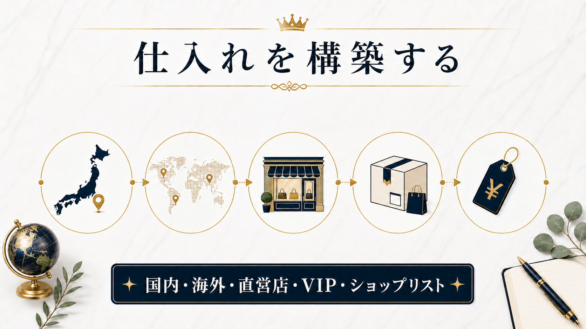

## 第2章 BUYMA国内買付完全解説マニュアル

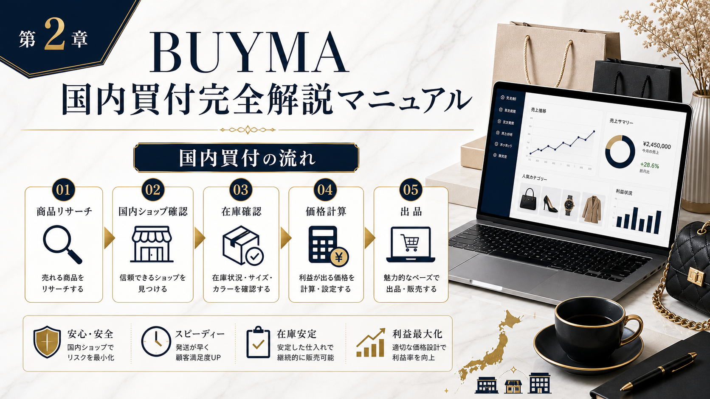

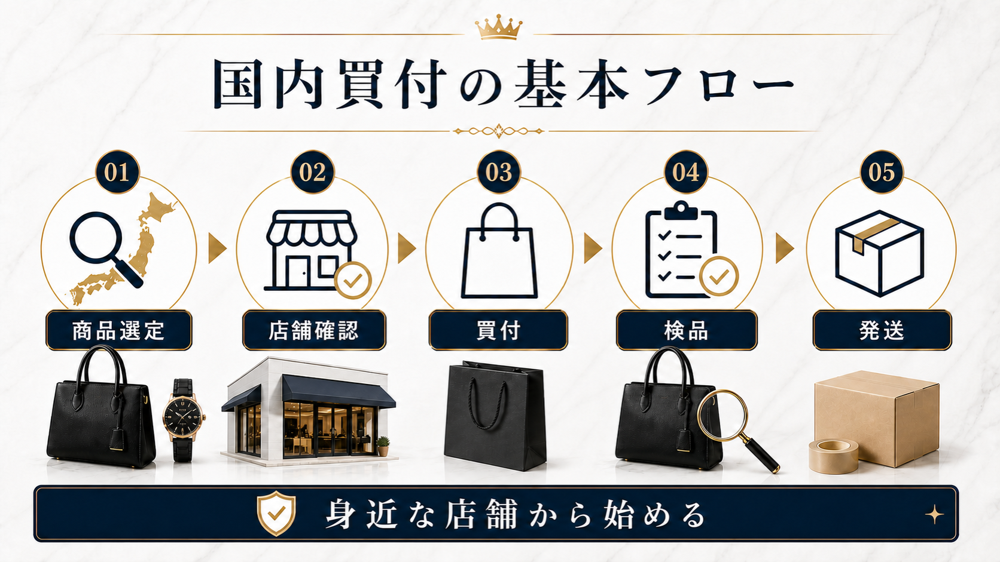

<!--
SOURCE:
- ROOT-02 BUYMA国内買付完全解説マニュアル
- ROOT-14 国内買付サンプルマニュアル
- CHILD-03 国内買付管理表
- SHEET-DOM-01〜03
- 公式更新=本章末リンク（確認日2026-07-15）
-->

### この章のゴール

この章では、国内の実店舗で買い付ける1件について、次を説明できる状態を作ります。

> **商品、店舗、在庫確認、総コスト、検品、発送、証憑、精算の流れを1つの管理記録へまとめ、実行可否を判断できること。**

実取引がまだない場合は、候補1件を使って判断項目を埋めます。レシート取得や発送通知など、注文後にしか行えない作業を章の学習完了条件にはしません。

### 2-1 国内買付の対象

本章で扱う国内買付は、**日本国内の実店舗で商品を買い付ける方法**です。

BUYMAでは、主に日本人向けで、運営拠点と発送地が日本国内にある国内ECサイトからの買付が禁止されています。楽天市場、Amazon.co.jp、Yahoo!ショッピング、Qoo10などが公式ガイドの例に含まれています。メルカリ、ラクマ、ヤフオクなどのCtoCサービスも買付先にできません。

[BUYMA公式: 出品を禁止されている買付先](https://qa.buyma.com/shopper/prohibited-item/4007.html)

国内ブランドの公式オンラインサイトは、型番・仕様・店舗在庫等の確認に使う場合がありますが、本章の買付は実店舗で行います。オンラインで注文する場合や、店舗から商品を発送してもらう場合は、第4章の検品経路とBUYMAの現行ルールも確認します。

### 2-2 国内実店舗買付の強みと注意点

#### 強みになり得ること

- 商品を直接確認してから買い付けられる
- 国内発送までの工程を把握しやすい
- 店舗限定、地域限定、国内完売等の商品を扱える場合がある
- 店舗の取り置き、返品、交換、付属品の条件を確認しやすい
- 海外配送や為替変動がない取引では、経費項目を整理しやすい

#### 必ず確認すること

- 同じ商品への出品が多い場合は価格競争になりやすい
- 交通費、買付時間、配送料、梱包費、報酬を入れると利益が残らない場合がある
- 取り置き、購入制限、電話注文、転売、返品・交換の条件は店舗ごとに異なる
- 国内定価より高い価格でも売れることはあるが、必ず売れるわけではない
- 国内発送でも、商品ページの発送地・配送方法・到着目安を実態どおりに設定する

元教材には初心者向け価格帯として2万〜6万円の例がありましたが、現在の推奨価格や成功条件として固定しません。自分の資金、総コスト、需要、返品リスクを商品ごとに確認します。

### 2-3 国内買付の3STEP

#### STEP 1 リサーチして候補を作る

1. BUYMA内で、国内買付で動いているブランド、カテゴリ、商品、価格、配送条件を観察する
2. 商品名、型番、画像等から商品を特定し、ブランド公式情報と照合する
3. 自分または契約済みパートナーが訪問できる国内実店舗を確認する
4. 店舗での取扱、在庫確認方法、取り置き、購入制限、返品・交換条件を調べる
5. 商品代、交通費、配送、梱包、報酬、BUYMA手数料を含めて利益を計算する

商品名や型番で検索しても特定できない場合、画像検索は商品識別の補助に使えます。ただし、検索で見つけた第三者画像を出品画像として保存・転載してはいけません。

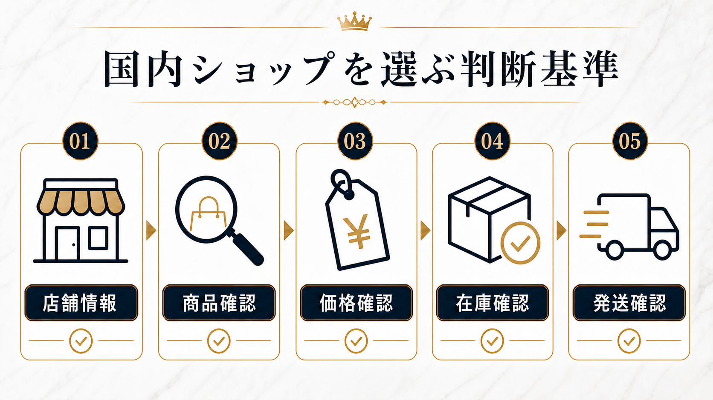

#### STEP 2 問い合わせ・受注後に在庫を確認する

在庫確認では、商品を取り違えないための識別情報と、買付条件を分けて確認します。

```text
お世話になっております。

[ブランド名]の下記商品について、店頭在庫を確認したくご連絡しました。

商品名:
型番:
カラー:
サイズ:

在庫の有無、取り置きの可否と期限、付属品、購入制限、返品・交換条件を教えていただけますでしょうか。
```

店舗への連絡時に、BUYMA出品に関係のない虚偽の身分・購入目的を伝えません。店舗が転売や代理購入を禁止している場合は、その条件に従います。

確認結果は次のように記録します。

| 項目 | 記録内容 |
|---|---|
| 店舗 | 正式名称、所在地、公式連絡先 |
| 確認日時 | 電話・訪問・公式在庫情報を確認した日時 |
| 商品 | ブランド、商品名、型番、色、サイズ |
| 在庫 | 在庫あり／なし、数量、再確認が必要な時点 |
| 取り置き | 可否、期限、名義、受取条件 |
| 購入条件 | 購入制限、支払方法、本人確認等 |
| 商品状態 | 新品、展示品、訳あり等 |
| 付属品 | 箱、保存袋、タグ、保証書等 |
| 返品・交換 | 可否、期限、条件 |

#### STEP 3 買付・検品・発送する

1. 注文内容、在庫、買付上限を再確認する
2. 実店舗で商品を買い付け、レシート等の購入証明を受け取る
3. 型番、色、サイズ、数量、付属品を注文内容と照合する
4. 汚れ、傷、ほつれ、破損、機能不良を確認する
5. 日付や取引IDと商品状態が分かる検品画像を残す
6. 商品が動いたり傷ついたりしないよう梱包する
7. 商品ページで約束した配送方法で購入者へ発送する
8. 購入者宛てに発送した後、追跡番号等を確認して発送通知する

発送していないのに通知する行為や、店舗から出品者・パートナーへの配送開始時点で購入者向け発送通知を行う「仮発送」は禁止されています。

### 2-4 店舗・商品・総コストの判断

候補商品は、次の5項目をすべて確認してから出品判断を行います。

| 判断項目 | 確認すること | 見送り・保留の例 |
|---|---|---|
| 店舗情報 | 実在、公式連絡先、購入条件、証憑 | 出所や販売主体を確認できない |
| 商品確認 | 型番、色、サイズ、付属品、状態 | 同一商品と確認できない |
| 価格確認 | 商品代、交通費、送料、梱包、報酬、手数料 | 現在価格では必要利益が残らない |
| 在庫確認 | 在庫、取り置き期限、再確認時点 | 受注後に確保できる見込みがない |
| 発送確認 | 検品者、発送地、配送方法、期限 | 未検品直送になる、期限を守れない |

国内買付だからという理由だけで高い価格を設定しません。配送速度、商品状態、入手経路、付属品、問い合わせ対応など、購入者が確認できる違いと総コストの両方から判断します。

### 2-5 国内買付パートナーへ依頼する12工程

BUYMAでは、共に買付を行うパートナーが商品を検品することは認められています。ただし、パートナーの行為を含め、購入者へ問題のない商品を届ける責任は出品者にあります。買付先店舗のスタッフは買付パートナーとして認められません。

[BUYMA公式: 買付先から購入者への直送](https://qa.buyma.com/shopper/order-to-delivery/4205.html)

#### 1. 在庫確認を依頼する

管理番号、商品URL、ブランド、商品名、型番、色、サイズ、店舗、確認期限を伝えます。

#### 2. 在庫と買付条件を確認する

在庫、取り置き、商品状態、付属品、購入制限、返品・交換条件を記録してもらいます。

#### 3. 買付条件と前払を承認する

商品代、交通費上限、支払方法、精算方法、買付期限を書面または記録が残る方法で合意します。パートナーへ自己負担や自身のカード利用を当然の条件として求めません。

#### 4. 実店舗で買い付ける

依頼内容と現物を照合し、差異や異常があれば購入前に作業を止めて連絡してもらいます。

#### 5. 買付完了と証憑を報告する

レシート、購入日時、店舗、支払額、商品情報を報告してもらいます。不要なカード番号等は共有しません。

#### 6. パートナーが検品する

商品、付属品、状態の3系統を確認し、必要な検品画像を撮影してもらいます。

#### 7. 出品者が画像と注文内容を照合する

出品者が検品画像、注文情報、商品ページを確認し、問題がある場合は発送を止めます。

#### 8. 商品に合う方法で梱包する

薄葉紙、緩衝材、箱、テープ等は商品の素材・形・配送方法に応じて選びます。元教材の資材一覧を全商品共通の必須セットにはしません。

#### 9. 購入者へ発送する

出品時に設定した発送地と配送条件に従い、購入者の住所・氏名を確認して発送します。

#### 10. 追跡番号と発送証憑を報告する

発送日、配送会社、追跡番号、送料、発送控えを管理表へ記録します。

#### 11. 経費と報酬を精算する

前払金、商品代、交通費、送料、梱包資材、その他承認済み経費、契約した報酬を照合します。固定3,000円等を標準報酬として使いません。

#### 12. BUYMAで発送通知する

購入者宛ての発送が完了し、追跡情報等を確認した後に発送通知を行います。

### 2-6 パートナー募集は利用サービスごとに確認する

外部委託自体がBUYMAで一律禁止されているわけではありません。しかし、募集に使うサービス側が、代理購入やEC運営代行を禁止している場合があります。

クラウドワークスは、無在庫販売、ECの出品・商品登録・在庫管理代行、アカウント共有、注文・購入・受取・買付等の代理を禁止対象として明記しています。そのため、**クラウドワークスを国内買付パートナーの募集先として案内しません。** 規制を別表現で「すり抜ける」募集も行いません。

[クラウドワークス公式: 仕事依頼ガイドライン](https://crowdworks.jp/pages/guidelines/job_offer.htm)

募集方法、取引条件、契約、教育、個人情報、アクセス停止の詳細は第8章で扱います。本章では、すでに適切な手続きで契約済みのパートナーへ実務を依頼する流れだけを説明します。

### 2-7 検品・梱包・発送・精算

#### 検品

| 区分 | 確認内容 |
|---|---|
| 商品一致 | ブランド、商品名、型番、色、サイズ、数量 |
| 付属品 | 箱、保存袋、タグ、保証書、替え部品等 |
| 外観 | 汚れ、傷、穴、ほつれ、変色、型崩れ |
| 機能 | ファスナー、留め具、ボタン、電池、可動部等 |
| 表示 | 商品ページの画像・説明と異なる点がないか |

異常がある場合は発送せず、買付先と購入者への連絡、交換、返品、発送期限延長等を判断します。検品画像は、日付や取引IDが分かる状態で保管します。

#### 梱包

- 商品を清潔な状態で整える
- 素材や付属品が擦れないよう保護する
- 箱の中で商品が動かないよう隙間を埋める
- 水濡れ、潰れ、破損のリスクに合わせて資材を選ぶ
- 値札や商品タグは、BUYMA公式案内と商品の状態に合わせて扱う

#### 発送

- 注文住所・氏名と送り状を照合する
- 商品ページで設定した配送条件を守る
- 発送控えと追跡番号を保存する
- 発送期限は注文確定日時から18日後の同じ時刻であることを受注リストで確認する
- 期限内に発送できない場合は、期限前に購入者へ連絡し、同意が必要な延長申請を行う
- 期限経過後は延長申請や発送通知ができないため、日付だけでなく時刻まで管理する

#### 精算

```text
承認済み経費
= 商品代
+ 交通費
+ 配送料
+ 梱包資材
+ その他事前承認した費用

最終精算額
= 承認済み経費
- 前払金
+ 契約した報酬
```

金額だけでなく、レシート、発送控え、支払日も同じ管理番号へ紐付けます。

### 2-8 国内買付管理表の使い方

> **この章の配布資料:** `BUYMA_国内買付管理表_購入者版.xlsx`

<!-- ATTACHMENT-READY: BUYMA購入者配布資料/BUYMA_国内買付管理表_購入者版.xlsx -->

旧原管理表は次の項目群を持っています。

| 項目群 | 主な列 | 入力する人・時点 |
|---|---|---|
| 依頼 | 管理番号、買付方法、依頼日 | 出品者が依頼前に入力 |
| 商品 | ブランド、URL、型番、色、サイズ、商品価格 | 出品者が根拠資料から入力 |
| 実行日 | 買付日、受取日、注文番号、発送日、追跡番号 | 実作業を行った人が都度入力 |
| 配送先 | 郵便番号、住所、氏名、電話番号 | 旧原表の項目。購入者版の共有表には置かず、発送に必要な人へ必要期間だけ共有 |
| 経費 | 商品代、配送料、交通費、その他、経費計 | 証憑を確認して入力 |
| 精算 | 前払金、差額、報酬、最終精算 | 出品者が契約・証憑と照合 |

原xlsxは、そのまま配布しません。

- 空行に大量の`#N/A`が出る数式を修正する
- ずれた参照範囲を固定する
- 固定報酬を契約値の入力方式へ変える
- 本章で扱わないオンライン買付の固定報酬行を削除する
- 国内表に残る「海外買付スタッフ」表記を直す
- 円建て国内取引で不要な為替列は削除し、必要な場合だけ用途を定義する
- 実在個人データと不要なサンプル値を削除する
- 配送先情報の閲覧権限と削除時期を明記する
- 代表入力値と期待結果で数式テストを行う

配布版完成後は、サンプル1行を使い「誰が、いつ、どの証拠を見て入力するか」を確認してから実取引に使います。

### 2-9 チェックリスト

#### 次章へ進む準備チェック

- [ ] 国内買付は国内実店舗で行うと理解した
- [ ] 国内EC・CtoCを買付先にしていない
- [ ] 候補商品の型番、色、サイズ、付属品を確認した
- [ ] 店舗の在庫確認方法、購入条件、返品・交換条件を確認した
- [ ] 交通費、配送、梱包、報酬、BUYMA手数料まで試算した
- [ ] 自分または契約済みパートナーが検品する経路を決めた
- [ ] 国内買付管理表へ候補1件を記録した、または必要列を説明できる

#### 実取引時チェック

- [ ] 買付前に在庫、価格、商品、買付上限を再確認した
- [ ] レシート等の購入証明を取得した
- [ ] 注文内容、付属品、商品状態を検品した
- [ ] 検品画像へ日付または取引IDを紐付けた
- [ ] 異常がある商品を発送していない
- [ ] 商品ページどおりの発送地・配送方法で購入者へ発送した
- [ ] 発送控えと追跡番号を保存した
- [ ] 購入者宛ての発送後に発送通知した
- [ ] 前払、経費、証憑、報酬を同じ管理番号で精算した
- [ ] 取引完了後、不要になった配送先情報を運用方針に従って処理した

### 第2章の公式確認先

確認日: **2026-07-15**

- [BUYMA 禁止・要注意買付先](https://qa.buyma.com/shopper/prohibited-item/4007.html)
- [BUYMA 検品・梱包・発送](https://qa.buyma.com/shopper/order-to-delivery/4201.html)
- [BUYMA 買付先から購入者への直送](https://qa.buyma.com/shopper/order-to-delivery/4205.html)
- [BUYMA 発送期限までに発送できない場合](https://qa.buyma.com/shopper/order-to-delivery/4303.html)
- [BUYMA 外部委託時のアカウント管理](https://qa.buyma.com/shopper/reg/13732.html)
- [クラウドワークス 仕事依頼ガイドライン](https://crowdworks.jp/pages/guidelines/job_offer.htm)

<!--
第2章 出典対応:
- 2-1: ROOT-02 国内実店舗の定義 + BUYMA公式 prohibited-item/4007
- 2-2: ROOT-02のメリット・デメリットを成果保証・固定条件なしへ現行化
- 2-3: ROOT-02の3STEP + BUYMA公式の画像権利・発送通知ルール
- 2-4: ROOT-02の商品・店舗・利益判断 + 商品設計
- 2-5: ROOT-02の12工程 + ROOT-14の11工程を統合 + BUYMA公式 order-to-delivery/4205
- 2-6: ROOT-02の募集先記述を不採用 + CrowdWorks公式ガイドライン + 採用詳細を第8章へ移動
- 2-7: ROOT-02・ROOT-14の検品・梱包・発送・精算 + BUYMA公式 order-to-delivery/4201・4303
- 2-8: CHILD-03 + SHEET-DOM-01〜03。原xlsxの数式・固定報酬・個人情報を現行化
- 2-9: 2-1〜2-8を学習時／実取引時へ再配置した商品設計

不採用:
- 固定2万〜6万円の推奨
- CrowdWorks等で規制をすり抜ける募集
- 女性限定、年齢質問、身分証の相互交換
- 固定3,000円、在庫確認50〜100円の相場扱い
- パートナーの自己資金・個人カード利用を前提とする依頼
-->

---

## 第3章 海外買付完全解説マニュアル

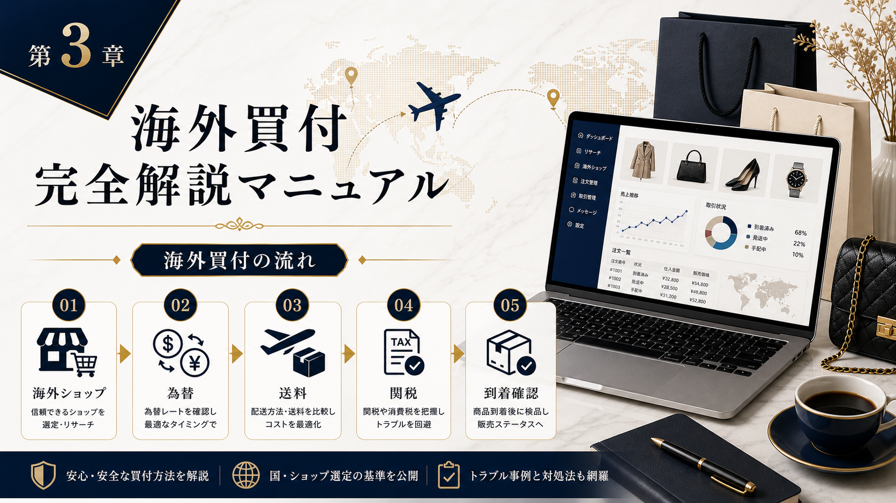

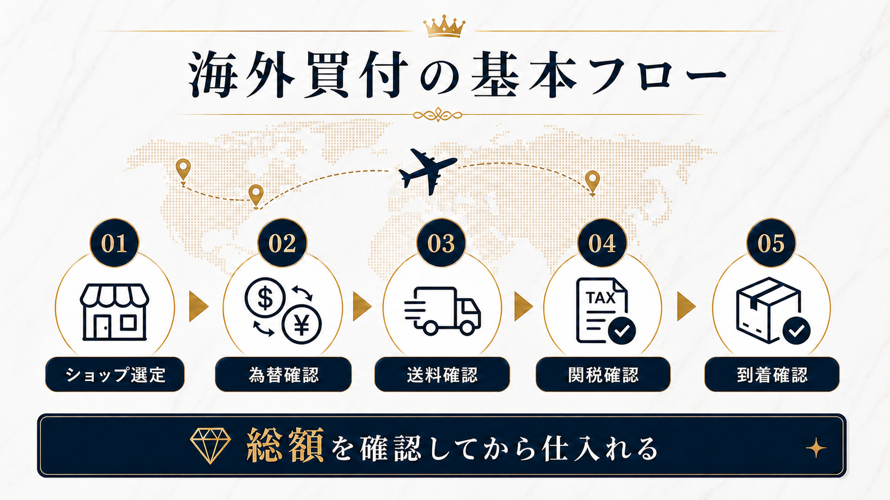

<!-- SOURCE: ROOT-03 / ROOT-12 / CHILD-05 / SHEET-OVS-01〜03 / 公式更新=本章末リンク -->

海外買付は、海外にいるパートナーへ丸投げする仕組みではありません。

**出品者が商品・価格・期限・買付先を決め、パートナーが決められた範囲で買付または受取、現物検品、梱包、発送を行い、出品者が証拠を確認して取引全体に責任を持つ仕組み**です。

本章のゴールは、候補商品1件について次の5点を説明できる状態になることです。

1. 店舗買付、オンライン買付、転送のどれを使うか
2. 誰が買付、受取、現物検品、発送を行うか
3. 為替や国際送料を含む仕入れ総額はいくらか
4. 購入者情報を海外へ渡す必要があるか
5. 関税負担と発送期限をどう案内・管理するか

### 3-1 店舗買付・オンライン買付・転送の違い

海外買付には、主に次の3方式があります。

| 方式 | 買付する人 | 受取する人 | 現物検品する人 | 向いている場面 | 主な注意点 |
|---|---|---|---|---|---|
| 店舗買付 | 海外パートナー | 海外パートナー | 海外パートナー | 実店舗の在庫を確認して買付したい | 移動費、店舗条件、買付上限、購入証明 |
| オンライン買付 | 海外パートナー | 海外パートナー | 海外パートナー | 現地オンラインストアから買付したい | 実際の販売者、注文名義、返品条件、配送遅延 |
| 転送 | 出品者 | 海外パートナー | 海外パートナー | 出品者が注文し、現地で受取・検品してほしい | 買付先規約、決済名義、配送先名義、受取拒否 |

ここでいう海外パートナーは、出品者と業務内容を合意し、現物を確認できる人です。買付先の店舗スタッフは、BUYMA上の買付パートナーとして認められていません。オンラインショップから発送する場合も、出品者または正式な買付パートナーによる現物検品を経ない直送は行いません。

また、パートナーから届いた写真を出品者が確認することは大切ですが、**写真確認だけで現物検品を代替することはできません**。現物を手に取ったパートナーが検品し、出品者はその検品結果と証拠を確認します。

#### 方式を選ぶ5つの質問

1. その買付先はBUYMAで利用できるか
2. 買付先の規約上、購入名義・決済名義・配送先に問題がないか
3. 誰が現物を受け取り、検品するか
4. 返品・交換が必要になった時、誰がいつまでに動けるか
5. 為替、報酬、現地費用、国際送料、関税まで含めて利益が残るか

ブランドごとに販売経路や購入条件は異なり、同じブランドでも国、店舗、時期、商品によって変わります。「このブランドは必ず店舗買付だけ」と固定せず、注文時点の公式販売経路と店舗条件を確認してください。

### 3-2 海外買付のメリットとリスク

#### メリット

- 日本から購入しにくい現地在庫へ買付範囲を広げられる
- オンライン在庫だけでは見つからない商品を実店舗で探せる
- 複数国の在庫、価格、配送条件を比較できる
- 現地で商品を受け取り、購入者へ送る前に検品できる
- 継続取引により、店舗の入荷時期や購入条件を正確に確認しやすくなる場合がある

#### リスク

- 為替変動、送金手数料、国際送料、報酬で仕入れ総額が増える
- 現地税、関税、輸入消費税の扱いが取引経路で変わる
- 返品期限内に検品や連絡が間に合わないことがある
- 高額商品、配送事故、紛失、破損への備えが必要になる
- パートナーへ資金や購入者情報を渡すため、契約・権限・記録管理が必要になる
- 現地法、配送会社、決済会社、買付先の規約も確認する必要がある

海外買付の強みは「海外だから安い」ことではありません。**その商品を、許可された買付先から、検品可能な経路で、期限内に届けても利益が残ること**が判断基準です。

### 3-3 仕入れ総額を先に計算する

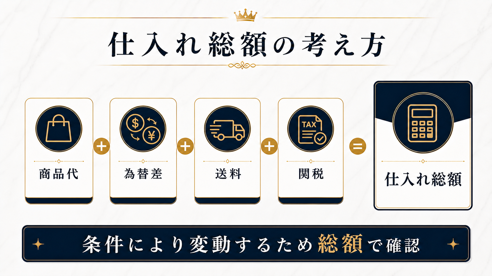

商品価格だけを見て買付を決めると、為替差や国際送料で利益が消えます。依頼前に次を試算します。

```text
海外買付の仕入れ総額
= 商品代の円換算額
+ 現地税の円換算額
+ 現地送料または店舗までの交通費の円換算額
+ パートナー報酬の円換算額
+ 梱包資材費の円換算額
+ 国際送料・必要な補償
+ 決済・送金手数料
+ 出品者負担となる関税・輸入消費税等
+ 返品・再配送に備える予備費

見込利益
= 販売価格
- BUYMA成約手数料等
- 海外買付の仕入れ総額
- その他の販売関連費用
```

各費用は同じ通貨単位、ここでは円へ換算して合計します。カードや送金サービスの為替スプレッドは、参考レートへ別に足すのではなく、明細で確定した実際の円換算額または手数料として反映します。

試算時と確定時は分けて記録します。

| 段階 | 為替の扱い | 記録するもの |
|---|---|---|
| 依頼前 | 確認時点の参考レート | レート提供元、確認日時、通貨、想定手数料 |
| 注文時 | 決済時のレートまたは請求予定額 | 決済額、決済通貨、利用サービス、注文日時 |
| 精算時 | 実際に確定した円換算額 | 明細の確定額、送金手数料、着金額、差額 |

固定の為替率や関税率を管理表へ埋め込まず、取引ごとに根拠と確認日を残します。報酬も一律相場として決めず、業務範囲、移動、保管、高額商品の責任、通貨、税務上の扱いを確認して契約します。

### 3-4 依頼前に共通指示書を作る

3方式のどれを使う場合も、チャットだけで依頼を完結させません。1件につき1つの管理番号を付け、次を指示書と管理表へ記録します。

| 項目 | 記録内容 |
|---|---|
| 商品 | ブランド、商品名、URL、品番、色、サイズ、数量、状態 |
| 買付先 | 店舗・サイト名、所在地またはURL、実際の販売者 |
| 価格 | 表示価格、通貨、購入上限、許容しない追加費用 |
| 付属品 | 箱、保存袋、保証書等、商品ページ上のセット内容 |
| 期限 | 在庫回答、買付、受取、検品、発送の各期限 |
| 禁止事項 | 代替品の無断購入、上限超過、未検品発送、虚偽申告 |
| 証拠 | 注文確認、レシート、商品写真、発送控え、追跡番号 |
| 異常時 | 購入停止条件、返品期限、連絡先、判断を待つ状態 |

商品URLだけでは、色違い、サイズ違い、別販売者への切替を防げません。品番、色、サイズ、価格上限を文章で固定し、変更があれば購入前に再承認します。

### 3-5 店舗買付の標準フロー

店舗買付は、パートナーが現地店舗へ在庫確認し、店舗で商品を購入する方式です。

1. **出品者：在庫確認を依頼する**
   管理番号、店舗、商品URL、品番、色、サイズ、数量、価格上限、回答期限を伝えます。

2. **パートナー：店舗在庫を確認する**
   店舗名、確認日時、在庫、税込価格、購入条件、取置期限、担当者名を分かる範囲で記録します。

3. **出品者：買付可否と上限を最終承認する**
   注文状況、利益、発送期限を再確認します。承認前にパートナーへ購入させません。

4. **出品者：承認済み費用を準備する**
   商品代と合意した交通費等を、契約した方法で前払いします。パートナーの自己資金や個人カード利用を当然の前提にしません。

5. **パートナー：店舗で買付する**
   品番、色、サイズ、価格、付属品に加え、購入前に確認できる傷、汚れ、破損を照合します。異常がある場合、上限を超える場合、代替提案がある場合は購入を止めて確認します。

6. **パートナー：購入完了を報告する**
   購入日時、支払額、通貨、レシート等の購入証明、返品・交換期限を共有します。

7. **パートナー：現物を検品する**
   商品、付属品、汚れ・傷・ほつれ・破損を確認し、管理番号が分かる状態で写真を撮ります。

8. **出品者：検品証拠を確認する**
   指示内容と画像・報告が一致するか確認します。不鮮明、撮影不足、異常ありの場合は発送を止めます。

9. **出品者：発送を承認する**
   配送方法、補償、申告内容、発送先を確定します。購入者直送の場合は、この段階で必要最小限の配送先情報だけを共有します。

10. **パートナー：梱包して発送する**
    商品特性に合う梱包を行い、追跡可能な方法で確定した発送先へ発送します。

11. **パートナー／出品者：発送を記録・通知する**
    パートナーは発送控え、追跡番号、発送日時を共有します。出品者は購入者宛ての発送を確認してからBUYMAで発送通知します。

12. **出品者：経費と報酬を精算する**
    前払金、実費証憑、為替、追加費用、契約報酬を管理番号単位で照合し、差額を精算します。

#### 店舗スタッフとの関係づくり

継続して同じ店舗へ問い合わせる場合は、丁寧で正確なやり取りを積み重ねます。

- 商品名だけでなく品番、色、サイズを伝える
- 営業時間、連絡手段、取置条件を守る
- 買わない場合も放置せず、不要になったことを連絡する
- 在庫の優遇や取り寄せを当然の権利として要求しない
- 店舗スタッフへBUYMAの検品責任を負わせない

良好な関係は在庫確認を円滑にする可能性がありますが、在庫確保や特別対応を保証するものではありません。

### 3-6 オンライン買付の標準フロー

オンライン買付は、海外パートナーが現地オンラインストアで注文し、自宅等で受け取る方式です。

1. **出品者：商品と買付先を指定する**
   URL、実際の販売者、品番、色、サイズ、価格上限、配送先、期限を指示します。

2. **パートナー：注文条件を確認して報告する**
   在庫、総額、送料、返品条件、注文名義、決済名義、配送可能地域を確認して出品者へ報告します。マーケットプレイスではサイト名だけでなく実際の販売者も確認し、出品者が内容を照合して最終承認します。

3. **出品者：承認済み費用を準備する**
   契約に従って必要額を前払いし、通貨、送金額、着金予定額、手数料を記録します。

4. **パートナー：指定商品を注文する**
   品番、色、サイズ、数量、価格を注文確定画面で再確認し、無断で類似品や別販売者へ変更しません。

5. **パートナー：注文情報を報告する**
   注文番号、注文日時、総額、到着予定日を共有し、買付先の発送後に配送会社と買付先→パートナー追跡番号を追記します。

6. **パートナー：商品を受け取る**
   外装の破損や個数を確認し、受取日時を記録します。異常があれば開封前後の状態を撮影します。

7. **パートナー：現物を検品する**
   商品、付属品、汚れ・傷・ほつれ・破損を確認し、管理番号が分かる状態で写真を撮ります。

8. **出品者：検品証拠を確認する**
   指示との一致、画像、返品期限を確認します。問題があれば購入者へ送らず、買付先への連絡方法を決めます。この時点ではまだ発送を指示しません。

9. **出品者：発送条件と発送先を確定し、発送を承認する**
   配送方法、補償、申告内容を決め、購入者直送の場合は必要最小限の配送先情報を共有してから発送を承認します。

10. **パートナー：梱包して発送する**
    商品に合う梱包を行い、追跡可能な方法で発送します。

11. **パートナー／出品者：発送を記録・通知する**
    発送控え、パートナー→購入者追跡番号、発送日時を共有し、出品者が実際の発送を確認してからBUYMAで発送通知します。

12. **出品者：経費と報酬を精算する**
    前払金、実際の注文額、送料、為替差、証憑、契約報酬を照合して差額を精算します。

### 3-7 転送の標準フロー

転送は、出品者が商品を注文し、海外パートナーが受取、検品、梱包、発送を担当する方式です。

1. **出品者／パートナー：受取可否を確認する**
   商品、サイズ、数量、予定日、保管期間を伝え、パートナーが受け取れることを確認します。

2. **出品者：買付先と注文条件を確認する**
   BUYMAで利用できる買付先か、買付先規約上の注文名義、決済名義、配送先名義、転送可否に問題がないか確認します。

3. **出品者：商品を注文する**
   パートナーの承諾を得た配送先へ注文し、商品URL、品番、色、サイズ、数量、注文番号、到着予定日を記録します。

4. **出品者：配送情報を共有する**
   配送会社、買付先→パートナー追跡番号、送り主名、荷物数を共有します。BUYMAのログイン情報や決済情報は共有しません。

5. **パートナー：商品を受け取る**
   受取日時、荷物数、外装状態を記録し、異常があれば写真で報告します。

6. **パートナー：現物を検品する**
   商品、付属品、汚れ・傷・ほつれ・破損を確認し、管理番号が分かる状態で写真を撮ります。

7. **出品者：検品証拠を確認する**
   指示内容と画像・報告を照合し、返品期限も確認して発送可否を判断します。

8. **出品者：発送を承認する**
   配送方法、補償、申告内容、発送先を確定し、必要最小限の配送先情報を共有します。

9. **パートナー：梱包して発送する**
   商品に合う梱包を行い、追跡可能な方法で発送します。

10. **パートナー／出品者：発送を記録・通知する**
    発送控え、パートナー→購入者追跡番号、発送日時を共有し、出品者が実際の発送を確認してからBUYMAで発送通知します。

11. **出品者：経費と報酬を精算する**
    現地で発生した送料、資材費等の証憑と契約報酬を照合し、管理番号単位で精算します。

### 3-8 相互検品・梱包・追跡付き発送

#### 相互検品の役割

相互検品は、次の2段階で行います。

1. **パートナーの現物検品**: 実物を手に取り、商品・付属品・状態を確認する
2. **出品者の証拠確認**: 指示書と報告・写真が一致しているか確認し、発送可否を決める

#### 現物検品の3項目

| 項目 | 確認内容 |
|---|---|
| 商品 | ブランド、品番、色、サイズ、数量、左右・セット内容 |
| 付属品 | 商品ページに記載した箱、保存袋、説明書、保証書等 |
| 状態 | 汚れ、傷、シミ、穴、ほつれ、破損、金具、ファスナー、におい等 |

商品特性に応じて、靴の左右とサイズ、衣類の縫製、バッグの内外、時計の動作等を追加します。真贋判断を写真だけで断定せず、まず買付先と購入証明を確実に管理します。

#### 検品写真

- 商品全体の前面・背面
- 品番、サイズ、色を確認できるタグや表示
- 付属品一式
- 傷や汚れが疑われる部分の近接写真
- 外箱や包装に破損がある場合の状態
- 管理番号または撮影日が分かる状態

レシート画像を共有する時は、検品や精算に不要なカード番号、会員番号、住所等を隠します。

#### 梱包

- 商品と付属品が擦れないよう個別に保護する
- 水濡れ、潰れ、衝撃に合わせて資材を選ぶ
- 箱の中で商品が動かないよう隙間を埋める
- 外箱やブランド箱を商品の一部として案内した場合は、その状態も保護する
- 梱包後の重量と寸法を確認し、送料見積との差を記録する

基本の順序は次のとおりです。

1. 衣料品は形を整えて畳み、薄葉紙や保護袋等で包む
2. 商品特性に応じて気泡緩衝材で保護する
3. 適切な大きさの段ボールへ緩衝紙を敷いて商品を入れる
4. 商品が動かないよう隙間へ緩衝材を入れる
5. 段ボールの合わせ目と両端をH字になるようテープで閉じる

#### 国際発送

- 配送先の氏名、住所、郵便番号、電話番号を送り状と照合する
- 発送人の氏名、住所、電話番号も正しく記載し、偽名や架空情報を使わない
- 追跡できる配送方法を使い、商品価値とリスクに応じて補償を検討する
- 購入者が選んだ配送方法を変更する場合は、発送前に購入者の了承を得る
- 海外発送での郵便局留めは避け、購入者が指定した住所へ発送する
- 配送会社の禁制品、危険物、素材・容量制限を確認する
- BUYMAで禁止されている船便を使わない
- 税関申告では品名、数量、価格等を事実どおり記載し、過少申告をしない
- 発送控え、追跡番号、申告書類の控えを管理番号へ紐付け、発送伝票は6か月間保管する
- 発送通知は、購入者宛ての荷物を配送会社へ実際に引き渡した後に行う

BUYMA上の発送期限は、受注リストに表示される注文確定日時から18日後の同じ時刻です。買付先からパートナーへの配送やパートナーの受取が遅れ、購入者宛ての発送が間に合わない見込みの場合は、期限前に購入者へ状況を説明し、BUYMA上で延長申請します。延長には購入者の承認が必要です。購入者が別日を指定した場合はその日が新期限、拒否した場合は延長不可、返答がない場合は延長申請で指定した期限まで仮延長となります。期限経過後は延長申請や発送通知ができないため、日付だけでなく時刻まで管理してください。

### 3-9 送金・前払・精算の管理

特定の送金サービスを教材の固定推奨にはしません。利用国、受取国、通貨、取引目的、本人確認、上限、手数料、為替、着金時間、返金条件は変わるため、取引時点の公式条件を比較します。

#### 送金前の確認項目

- 送金者と受取人の契約上の氏名
- 送金元国、受取国、通貨、業務上の送金目的
- 送金額、表示手数料、為替レート、相手の着金予定額
- 着金予定日と買付・取置期限
- キャンセル、組戻し、返金時の扱い
- 利用規約上、業務委託費や商品代の送金に使えるか
- 現地の法令・税務・外為規制上の確認事項

#### 管理表へ残す記録

| 項目 | 記録内容 |
|---|---|
| 送金 | サービス名、送金日時、送金額、通貨、手数料、取引番号 |
| 為替 | 適用レート、レート確認日時、実際の円換算額 |
| 着金 | 着金日時、受取額、通貨、差額 |
| 支出 | 商品代、交通費、送料、資材費、その他承認済み費用 |
| 証憑 | 注文確認、レシート、明細、発送控え |
| 精算 | 前払金、実費、返金、契約報酬、最終支払額、支払日 |

```text
最終精算額
= 承認済み実費
- 前払金
+ 契約した報酬
```

パートナーの立替を認める場合は、上限、対象費目、事前承認、証憑、返済日を契約で決めます。高額商品を個人の自己資金やカードで先に買わせる運用を標準にしないでください。

本人確認が必要な場合も、パスポート画像をお互いに送り合うことを標準手順にはしません。契約・決済・本人確認サービスの正規手続を使い、取得目的、必要項目、保管場所、閲覧者、削除時期を決めます。

### 3-10 購入者情報を海外パートナーへ渡す時

海外パートナーから購入者へ発送する場合、氏名、住所、郵便番号、電話番号等を海外へ渡すことがあります。これは単なる発送作業だけでなく、個人データの外国にある第三者への提供に関する確認が必要になり得ます。

個人情報保護委員会の現行ガイドラインを確認し、少なくとも次を決めてから運用します。

1. 提供先の国・地域と受取人
2. 提供する項目と発送に必要な理由
3. 本人同意、同等水準と指定された国・地域、提供先が相当措置を継続的に講ずる体制、法定例外のうち、どの要件に基づくか
4. 再提供の禁止、目的外利用の禁止、秘密保持
5. 安全な共有方法と閲覧できる人
6. 保管期限と削除確認
7. 誤送信、紛失、不正利用が起きた時の連絡手順

本人同意を根拠に外国にある第三者へ個人データを提供する場合は、同意を得る前に、提供先の外国名、その国の個人情報保護制度に関する情報、提供先が講ずる個人情報保護措置に関する情報を本人へ分かりやすく提供します。外国や提供先の措置を特定できない場合は、特定できない旨と理由、代わりに参考となる情報の有無等、現行ガイドラインが求める内容を示してから判断します。

相当措置を継続的に講ずる体制を根拠にする場合は、契約書や確認書を作るだけで終わりではありません。措置の実施状況や提供先国の制度を継続的に確認し、支障が生じた時の是正・提供停止、本人への情報提供等、ガイドライン上の義務を確認します。

外国にある第三者への提供は、提供先や安全管理措置等により扱いが変わります。「業務委託だから必ず同意不要」「契約書があれば必ず適法」と自己判断せず、運用開始前に公式ガイドラインを確認し、判断が難しい場合は個人情報保護委員会の相談窓口や専門家へ確認してください。

#### 共有を最小限にする

発送時に通常必要となるのは、氏名、郵便番号、住所、配送会社が求める電話番号、管理用の注文識別子です。

次の情報は発送担当者へ共有しません。

- BUYMAのID・パスワード・認証コード
- 購入者とのメッセージ履歴全体
- クレジットカード・銀行口座情報
- パスポート等の本人確認書類
- 発送に不要な生年月日、購入履歴、他の取引情報

公開リンクの表計算ファイルへ配送先を置かず、対象案件の担当者だけが期限付きで閲覧できる方法を使います。発送完了、返品可能期間、問い合わせ対応等で必要な期間を定め、不要になった情報は削除またはアクセス不能にします。

### 3-11 関税・輸入消費税・発送通知

#### 購入者へ海外から直接発送する場合

BUYMAでは、海外発送の商品に関税等が発生した場合、通常は購入者が輸入者として支払います。ただし、商品ページで「関税込み」または関税返金対象として案内した取引は、最終的に出品者が負担します。

関税等は必ず発生するものではなく、発生の有無と金額は税関が判断します。原産国、品目、素材、価格、数量等で変わるため、教材内の一律税率で購入者へ確約しません。輸入消費税等を含め、必要に応じて税関の品目分類・税率・課税価格の公式情報を確認します。

商品ページと取引メッセージでは、次を曖昧にしません。

- 発送地
- 配送方法と追跡の有無
- 関税等の通常の負担者
- 関税込み・返金対応を行う場合の条件と手順
- 配送遅延や通関照会が起きた時の連絡方法

#### 発送通知の条件

パートナーが現物を検品し、購入者宛ての荷物を配送会社へ引き渡し、発送控えと追跡番号を出品者が確認してから発送通知します。

次は発送通知をしてはいけない状態です。

- 店舗またはオンラインショップがパートナーへ発送しただけ
- パートナーが商品をまだ受け取っていない
- 現物検品が終わっていない
- 梱包しただけで配送会社へ引き渡していない
- 追跡番号を仮入力している

### 3-12 海外買付管理表の使い方

> **この章の配布資料:** `BUYMA_海外買付管理表_購入者版.xlsx`

<!-- ATTACHMENT-READY: BUYMA購入者配布資料/BUYMA_海外買付管理表_購入者版.xlsx -->

旧原管理表は、海外買付の依頼から精算までを同じ管理番号で追える構成です。

| 項目群 | 主な列 | 入力する人・時点 |
|---|---|---|
| 依頼 | 管理番号、買付方法、依頼日 | 出品者が依頼前に入力 |
| 商品 | ブランド、URL、品番、色、サイズ、商品価格 | 出品者が根拠資料から入力 |
| 買付先の注文・配送 | 買付日、注文番号、買付先発送日、買付先→パートナー追跡番号 | 注文した人が注文時・買付先発送時に入力 |
| 受取・購入者発送 | パートナー受取日、購入者宛て発送日、パートナー→購入者追跡番号、BUYMA発送通知日時 | パートナーと出品者が実行後に入力 |
| 配送先 | 郵便番号、住所、氏名、電話番号 | 旧原表の項目。購入者版の共有表には置かず、購入者向け発送に必要な人へ必要期間だけ共有 |
| 経費 | 商品代、配送料、交通費、その他、経費計 | 証憑を確認して入力 |
| 為替 | 通貨、適用レート、確認日時、円換算額 | 注文時と確定時に分けて入力 |
| 精算 | 前払金、差額、報酬、最終精算 | 出品者が契約・証憑と照合 |

原xlsxは、そのまま配布しません。

買付先からパートナーまでと、パートナーから購入者までの配送は別区間です。2つの発送日・追跡番号を同じセルへ入れず、**BUYMAへ登録する発送日・追跡番号は、パートナーから購入者へ発送した区間だけ**にします。

- 空行に大量の`#N/A`が出る数式を修正する
- 行を増やすとずれる参照範囲を固定する
- 買付先→パートナーと、パートナー→購入者の発送日・追跡番号を別列にする
- BUYMA発送通知日時を追加し、購入者宛て発送との前後関係を検証する
- 店舗・オンラインの固定報酬を削除し、契約値を入力する
- 報酬の通貨、換算日、支払日を追加する
- 参考レートと実際の決済レートを分ける
- 送金額、手数料、着金額、取引番号を追加する
- 3方式ごとに不要な列を非表示または入力不要と明示する
- 実在個人データと不要なサンプル値を削除する
- 配送先情報の閲覧権限、共有期限、削除日を追加する
- 代表入力値と期待結果で数式テストを行う

`経費立替`シートは、購入日、費目、現地通貨額、為替、円換算額、証憑、支払完了日を管理します。`報酬価格`シートは固定単価表ではなく、契約した業務、単価、通貨、適用開始日、改定履歴を参照する台帳へ変更します。

配布版完成後は、店舗買付・オンライン買付・転送を各1件ずつ模擬入力し、利益計算、前払差額、個人情報の権限、削除日まで確認してから実取引に使います。

### 3-13 パートナー採用との境界

本章は、契約済みの海外パートナーへ業務を依頼する手順です。募集、選考、契約、教育、評価の詳細は第8章で扱います。

海外パートナーを探す時も、利用サービスの禁止事項を回避する募集は行いません。クラウドワークスは、無在庫販売に関係するEC出品・商品登録・在庫管理、代理注文・代理購入・代理受取・買付、アカウント共有等を禁止対象として案内しています。そのため、本教材では海外買付パートナーの募集先として推奨しません。

また、採用時に次を標準条件にしません。

- 業務遂行と無関係な性別・年齢で候補者を限定・優先する
- パスポート画像を相互交換する
- BUYMAアカウントを共有する
- パートナーの個人カード・自己資金を前提にする
- 特定ツールでの顔出し面談を一律必須にする
- 根拠のない固定報酬を「相場」として提示する

必要なのは属性ではなく、買付環境、言語、連絡可能時間、検品精度、配送環境、資金取扱い、個人情報管理、異常時対応を業務要件として確認することです。

### 3-14 チェックリスト

#### 次章へ進む準備チェック

- [ ] 店舗買付、オンライン買付、転送の役割分担を説明できる
- [ ] 候補商品の買付先がBUYMAで利用できるか確認した
- [ ] 買付先の注文名義、決済名義、配送先、返品条件を確認した
- [ ] 商品代以外の費用を含む仕入れ総額を試算した
- [ ] 参考為替の提供元と確認日時を記録した
- [ ] 誰が現物を検品するか決めた
- [ ] 検品写真、発送控え、追跡番号の保存方法を決めた
- [ ] 購入者情報を海外へ渡す必要があるか判定した
- [ ] 個人情報の法的根拠、共有方法、削除時期を確認した
- [ ] 関税等の通常の負担者を商品ページで案内できる
- [ ] 海外買付管理表へ候補1件を記録した、または必要列を説明できる

#### 実取引時チェック

- [ ] 管理番号、品番、色、サイズ、価格上限、期限を指示した
- [ ] 変更・代替・上限超過を購入前に再承認した
- [ ] 前払金、送金手数料、為替、着金額を記録した
- [ ] 注文確認またはレシート等の購入証明を保存した
- [ ] パートナーが現物の商品、付属品、状態を検品した
- [ ] 出品者が指示書と検品証拠を照合した
- [ ] 異常がある商品を購入者へ発送していない
- [ ] 配送先情報を必要な担当者だけへ共有した
- [ ] 税関申告を事実どおり行った
- [ ] 船便を使わず、発送人情報を正しく記載した
- [ ] 配送方法を変更した場合は購入者の了承を得て、郵便局留めにしていない
- [ ] 追跡可能な方法で購入者宛てに発送した
- [ ] 2区間の追跡番号を分け、購入者宛ての番号だけをBUYMAへ入力した
- [ ] 発送控えと追跡番号を確認後、BUYMAで発送通知した
- [ ] 発送伝票を6か月保管する記録を残した
- [ ] 注文確定日時から18日後の発送期限を時刻まで管理した
- [ ] 前払、実費、証憑、為替差、報酬を管理番号単位で精算した
- [ ] 不要になった購入者情報を運用方針に従って処理した

### 第3章の公式確認先

確認日: **2026-07-15**

- [BUYMA 禁止・要注意買付先](https://qa.buyma.com/shopper/prohibited-item/4007.html)
- [BUYMA 検品・梱包・発送](https://qa.buyma.com/shopper/order-to-delivery/4201.html)
- [BUYMA 買付先から購入者への直送](https://qa.buyma.com/shopper/order-to-delivery/4205.html)
- [BUYMA 発送期限までに発送できない場合](https://qa.buyma.com/shopper/order-to-delivery/4303.html)
- [BUYMA 外部委託時のアカウント管理](https://qa.buyma.com/shopper/reg/13732.html)
- [BUYMA 関税の支払い](https://qa.buyma.com/buy/pay/3104.html)
- [BUYMA 関税はいくらかかるか](https://qa.buyma.com/buy/pay/3105.html)
- [税関 輸出入手続](https://www.customs.go.jp/tsukan/)
- [個人情報保護委員会 外国にある第三者への提供](https://www.ppc.go.jp/personalinfo/legal/guidelines_offshore/)
- [クラウドワークス 仕事依頼ガイドライン](https://crowdworks.jp/pages/guidelines/job_offer.htm)

<!--
第3章 出典対応:
- 3-1: ROOT-03・ROOT-12の店舗／オンライン／転送3方式 + BUYMA公式 order-to-delivery/4205
- 3-2: ROOT-03のメリット・デメリットを成果保証・固定ブランド条件なしへ現行化
- 3-3: ROOT-03の経費計算 + SHEET-OVS-01〜03 + 現行の関税・為替管理
- 3-4: ROOT-03・ROOT-12の依頼情報を3方式共通指示書へ再配置
- 3-5: ROOT-03の店舗12工程 + ROOT-12の店舗11工程を統合
- 3-6: ROOT-03のオンライン12工程 + ROOT-12のオンライン11工程を統合
- 3-7: ROOT-03の転送11工程 + ROOT-12の転送10工程を統合
- 3-8: ROOT-03・ROOT-12の相互検品・梱包・追跡発送 + BUYMA公式 order-to-delivery/4201・4303
- 3-9: ROOT-03・ROOT-12の送金・精算を、特定サービス固定なしの証拠管理へ現行化
- 3-10: CHILD-05の配送先情報 + 個人情報保護委員会の外国第三者提供ガイドライン
- 3-11: BUYMA公式 buy/pay/3104・3105 + 税関公式 + 発送通知ルール
- 3-12: CHILD-05 + SHEET-OVS-01〜03。原xlsxの数式・固定報酬・個人情報を現行化
- 3-13: ROOT-03の募集・契約部分を第8章へ移動 + CrowdWorks公式ガイドライン
- 3-14: 3-1〜3-13を学習時／実取引時へ再配置した商品設計

不採用:
- COVID前提の導入
- 特定ブランドは店舗買付しかできないという固定断定
- TransferWise、PayPal、Xendpay等の固定推奨
- CrowdWorks等の規制をすり抜ける募集
- Skype、Chatwork等の固定ツール指定
- 女性限定、年齢質問、パスポート画像の相互交換
- 店舗3,000円、オンライン1,500〜2,000円、転送1,000円等の固定相場
- パートナーの自己資金・個人カード利用を前提とする依頼
- 店舗スタッフを買付パートナーまたは検品者として扱う運用
-->

---

## 第4章 直営店連携仕入れ完全解説マニュアル

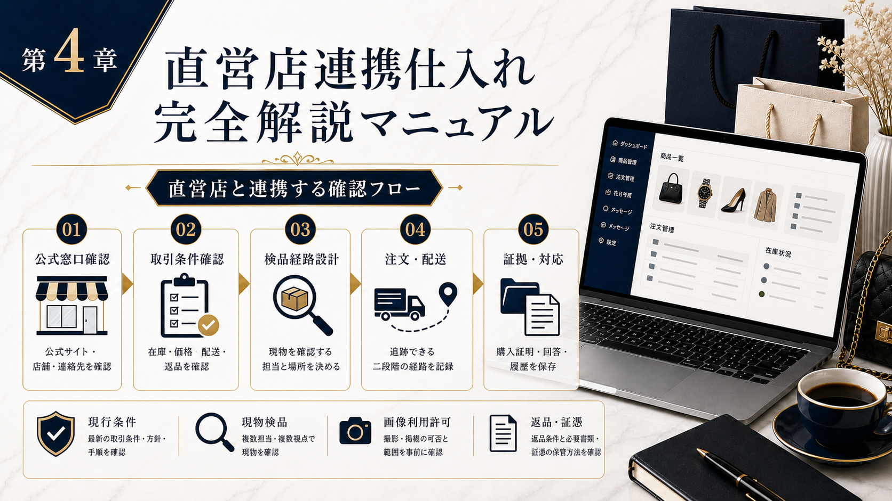

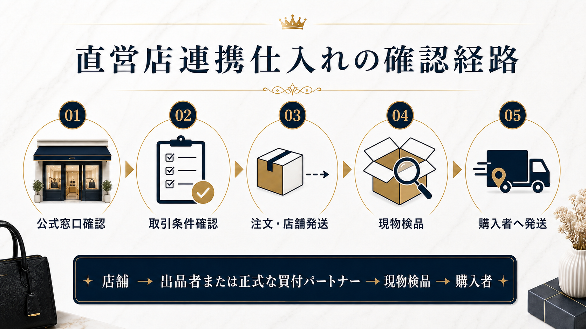

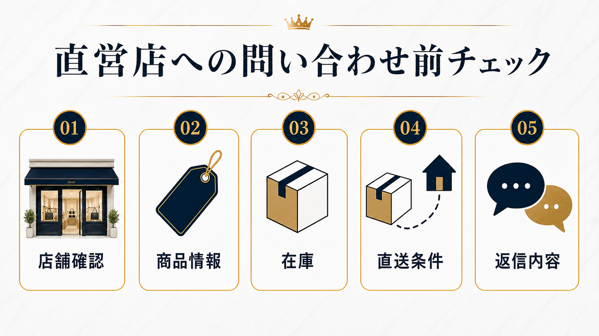

<!--
SOURCE: ROOT-04 / ROOT-13 / CHILD-02 / SHEET-DIR-01〜02 / 公式更新=本章末リンク
-->

旧教材では、直営店のスタッフが検品し、店舗から購入者へ直接発送する方法を「直営店直送」として解説していました。しかし、BUYMAでは、買付先から購入者へ未検品で直接送ることは原則禁止されています。店舗スタッフは、出品者と共に買付を行うパートナーとしても認められていません。

そこで本章では、旧教材の強みである「直営店の在庫・担当者・購入証明・輸出条件へ直接確認できること」を残し、発送経路だけを現行ルールへ合わせます。

```text
旧教材の経路
直営店 → 購入者
店舗スタッフの確認だけで発送

本章の経路
直営店 → 出品者または正式な買付パートナー
→ 現物検品 → 購入者へ発送
```

本章では、この現行経路を**直営店連携仕入れ**と呼びます。

本章のゴールは、候補店舗1件について次を完了できることです。

1. ブランド公式の店舗・連絡先を確認する
2. 輸出、支払、配送、購入証明、返品の条件を確認する
3. 出品者または買付パートナーが現物検品する経路を決める
4. 店舗から検品者までと、検品者から購入者までの配送を分けて管理する
5. 回答日と根拠を管理表へ残し、受注時に再確認する

### 4-1 直営店連携仕入れの仕組み

利用できる基本経路は次の2つです。

| 経路 | 店舗の配送先 | 現物検品 | 購入者への発送 |
|---|---|---|---|
| 出品者受取 | 出品者本人 | 出品者本人 | 出品者本人 |
| パートナー受取 | 正式な買付パートナー | 買付パートナー | 買付パートナー |

どちらも、店舗から届いた商品を一度受け取り、注文内容と品質を確認してから購入者へ発送します。

#### 店舗スタッフができること

- 在庫、価格、品番、色、サイズを確認する
- 店舗方針の範囲で商品写真や動画を送る
- 取り置き、他店舗からの取り寄せ、輸出条件を案内する
- 公式の決済方法で注文を受ける
- 出品者または買付パートナーへ商品を発送する
- レシート、インボイス、注文確認等を発行する

#### 店舗スタッフへ任せられないこと

- BUYMA上の出品者責任を負う現物検品
- 出品者の買付パートナーとしての購入者直送
- BUYMAの発送通知に使う最終発送判断
- 購入者クレーム時の出品者責任

店舗から届く写真は事前確認の補助です。最終的には、出品者または正式な買付パートナーが実物を手に取って検品します。

### 4-2 メリットとリスク

#### メリット

- ブランド公式の実店舗在庫を確認できる
- 公式オンラインに表示されない店舗在庫が見つかる場合がある
- 他店舗からの取り寄せ可否を直接確認できる
- 購入証明、輸出条件、配送条件を店舗へ確認できる
- 継続取引により、同じ担当者へ正確に問い合わせやすくなる場合がある
- 店舗の許可があれば、実物写真や動画を商品確認に使える場合がある

#### リスク

- 同じブランドでも国、店舗、担当者、時期で対応が異なる
- 国外配送、輸出時の税、取り置き、取り寄せは保証されない
- 店舗から検品者までの配送分だけ日数と送料が増える
- 返品・交換期限が短く、購入者発送前に対応できない場合がある
- 決済リンク、送金先、連絡先が本物か確認する必要がある
- 店舗から受け取った画像の利用には、著作権や利用許可の確認が必要になる
- 購入者情報を海外パートナーへ渡す場合は、第3章の外国第三者提供の確認が必要になる

直営店との連絡ルートができても、在庫確保、国外配送、税の免除、割引、高値販売を保証するものではありません。候補商品ごとに、仕入れ総額と発送期限まで成立するかを確認します。

### 4-3 候補店舗の探し方

候補店舗は、ブランド公式サイトのストアロケーターから探します。検索結果、地図サービス、SNSプロフィールだけで公式店舗と決めません。

#### 候補登録の手順

1. ブランド公式サイトを開く
2. 公式のストアロケーターへ移動する
3. 国、都市、店舗名、住所、電話番号、公式メール等を確認する
4. 公式サイト上のURLを保存する
5. 確認日と対応言語を記録する
6. 連絡前の状態を「未確認」として登録する

競合出品者の商品画像、サイズ表示、発送地、配送会社から「このブランドは直営店直送できる」と断定しません。それらは候補を探す仮説にはなっても、店舗との現行条件を証明する情報ではありません。

#### 旧特典に記録されていた6ブランド

旧特典には、過去に交渉できた例として次の6ブランドが記録されていました。これは**当時の実績メモであり、現在の国外配送、税、支払、画像提供、取り寄せ条件を保証する一覧ではありません**。

| 旧教材の候補 | 現行の公式店舗確認先 | 2026-07-13時点の扱い |
|---|---|---|
| MANOLO BLAHNIK | [公式Store Locator](https://www.manoloblahnik.com/us/storelocator) | 店舗別条件は未確認 |
| Dolce&Gabbana | [公式Store Locator案内](https://support.dolcegabbana.com/hc/en-us/articles/360005976759-How-can-I-find-the-nearest-boutique) | 店舗別条件は未確認 |
| Burberry | [公式Store Locator](https://stores.burberry.com/) | 店舗別条件は未確認 |
| Max Mara | [公式Store Locator](https://store.maxmara.com/en/directory) | 店舗別条件は未確認 |
| Sergio Rossi | [公式Store Locator](https://www.sergiorossi.com/en-int/pages/store-locator) | 店舗別条件は未確認 |
| Ferragamo | [公式Store Locator](https://store.ferragamo.com/en-us) | 店舗別条件は未確認 |

旧特典の`Salvatore Ferragam`は、現行表示に合わせて`Ferragamo`へ修正しました。6ブランドは「交渉可能ブランド一覧」ではなく、公式店舗を探して現在の条件を確認する候補として使います。

### 4-4 問い合わせ前の準備

問い合わせ前に、買付と検品の設計を決めます。

| 項目 | 決める内容 |
|---|---|
| 商品 | 商品名、品番、色、サイズ、数量、商品URL |
| 店舗 | ブランド、国、都市、店舗名、公式連絡先 |
| 注文者 | 出品者本人または契約済みパートナー |
| 店舗の配送先 | 出品者または現物検品を行う買付パートナー |
| 検品者 | 誰が実物を確認するか |
| 購入者発送 | 誰がどの配送方法で発送するか |
| 支払 | 通貨、上限、公式決済経路、送金の要否 |
| 期限 | 在庫回答、取置、決済、店舗発送、検品、購入者発送 |
| 証拠 | 回答記録、注文確認、購入証明、検品写真、配送伝票 |

連絡ツールは店舗が公式に案内する手段を使います。特定のメッセージアプリ、通話サービス、翻訳サービスへ固定しません。

翻訳を使う場合も、商品、価格、税、配送先、返品等の重要条件は原文と日本語を照合し、曖昧な回答を推測で確定しません。交渉担当へ任せる場合の採用・契約・教育は第8章で扱います。

### 4-5 店舗へ確認する10項目

旧管理表の7項目を残しつつ、未検品直送を避けるための検品経路、返品、回答根拠を追加します。

#### 1. 店舗の基本情報

- ブランド公式の直営店または公式に確認できる店舗か
- 店舗名、住所、国、電話番号、公式メール
- 回答者名または部署、回答日時、対応言語

#### 2. 出品者または買付パートナーへの配送

- 指定した国・住所へ発送できるか
- 配送先名義と決済名義に条件があるか
- 私書箱、転送先、ホテル等に制限があるか
- 商品を店舗から購入者へ未検品で直送する提案になっていないか

#### 3. 輸出時の税の扱い

- 表示価格に含まれる税の種類と金額
- 店舗が国外へ発送する時の税の扱い
- 免税または輸出扱いに必要な配送証明・書類
- 返金方式の場合の条件、時期、手数料
- 税を除いた最終請求額と根拠

EUではEU域外への輸出にVAT免除の枠組みがありますが、実際の適用には輸出方法や証拠等の条件があります。店舗が必ずVATを差し引くとは限りません。EU以外の国も含め、「VAT OFFできますか」だけで終わらせず、店舗が適用する税務処理と最終請求額を書面で確認します。

#### 4. 支払方法

- 店舗公式の決済リンクまたは公式オンライン決済が使えるか
- 対応カード、銀行送金等の方法と通貨
- 決済名義、請求先住所、本人確認の条件
- 追加手数料、返金方法、決済期限

カード番号、セキュリティコード、認証コードを、チャット、SMS、メールへ送信しません。電話注文を使う場合も、店舗の正式な決済手順、通話録音の扱い、カード情報を保存しない運用を確認します。

#### 5. 配送方法・送料

- 配送会社、サービス名、追跡、補償
- 商品サイズ・重量別の送料
- 発送までの日数と到着目安
- 通常便と速達便の違い
- 輸出申告、インボイス、禁制品の扱い
- 店舗発送後に受け取る追跡番号

#### 6. 他店舗からの取り寄せ

- 取り寄せ可能な地域・店舗
- 取り寄せ費用、所要日数、キャンセル条件
- 取り寄せ後の購入期限

取り寄せ可否を店舗スタッフの能力評価には使いません。ブランド方針、在庫、国境、店舗区分等で変わる業務条件として記録します。

#### 7. 連絡先

- 継続連絡に使ってよい公式連絡先
- 担当者名、部署、対応時間、使用言語
- 個人連絡先を取得する場合の店舗方針と利用目的
- 担当変更時の公式な引継ぎ先

#### 8. 購入証明・インボイス

- 店舗名、住所、購入日、商品、価格が分かる証憑を発行できるか
- 紙、PDF、メール等の受取方法
- 商品同梱書類と電子送付書類の違い
- BUYMAから買付先確認があった時に提出できる内容か

購入証明は価格を隠す目的で受け取らないのではなく、出品者が必ず保管します。購入者へ価格部分を見せない場合も、出品者の証拠原本まで削除・加工しません。

#### 9. 返品・交換

- 返品・交換できる条件と期限
- 返品先、送料、返金方法、必要書類
- セール品、取り寄せ品、国外発送の例外
- 不良、誤商品、配送破損時の連絡手順

#### 10. 検品補助と画像利用

- 店舗方針の範囲で、発送前に品番・色・サイズ・状態を確認できるか
- 商品写真や動画を送付できるか
- 画像を商品確認以外、特に出品画像として使ってよいか
- 利用許可の範囲、期限、クレジット表記

店舗の事前確認や写真は、正式な買付パートナーによる現物検品の代わりにはなりません。利用許可が確認できない画像はBUYMAへ掲載しません。

### 4-6 誠実な問い合わせ文

次は、旧教材の挨拶文と7確認項目を、現行経路へ合わせた問い合わせ例です。自分の氏名、事業、配送先、商品、実績に合わせて書き換えます。

```text
Subject: Inquiry about purchase, export, and shipping arrangements

Hello [Boutique / Client Advisor name],

My name is [your name], and I operate an online retail business in Japan.
I am interested in purchasing the item below from your boutique.

Product: [product name]
Reference / SKU: [reference]
Color: [color]
Size: [size]

Before placing the order, could you please confirm the following?

1. Is the item currently available, and until when can it be reserved?
2. Can you ship it to my designated receiving partner in [city, country]?
   My partner will physically inspect the item before it is sent to the customer.
3. What is the final price and the VAT or local-tax treatment
   when the item is exported?
4. Which official and secure payment methods are available?
5. Which carrier will you use, and what are the shipping cost,
   estimated delivery time, tracking, and insurance conditions?
6. If unavailable, can the item be transferred from another boutique?
7. Can you issue a detailed invoice or receipt showing the boutique,
   purchase date, product, and price?
8. What are the return or exchange conditions for an international order?
9. If your policy allows, could you share photos of the item before shipment?
   Please also let me know whether those photos may be used on a product page.

I understand that all services and conditions are subject to your boutique policy.
Thank you for your time.

Kind regards,
[your name]
[business contact]
```

相手が回答しやすいよう、最初から全店舗へ同一文面を大量送信せず、商品と店舗に合わせて必要項目を絞ります。回答が届いたら当日または次の営業日を目安にお礼を伝え、回答内容を管理表へ記録します。

### 4-7 問い合わせから購入者発送までの12工程

1. **出品者：公式店舗を確認する**
   ブランド公式のストアロケーターで店舗、国、住所、公式連絡先を確認し、確認日を残します。

2. **出品者または交渉担当：条件を問い合わせる**
   4-5の項目から必要な質問を選び、本人の役割と目的を偽らず問い合わせます。

3. **出品者：回答を管理表へ記録する**
   回答者、日時、原文、税、支払、配送、購入証明、返品、連絡先を保存します。

4. **出品者：検品経路と仕入れ総額を決める**
   店舗から出品者または正式な買付パートナーへ送り、誰が現物検品するかを確定します。商品代、現地税、2区間の送料、報酬に加え、関税込み・関税返金等で出品者負担となる関税等を原価へ含めます。通常の海外発送で購入者負担となる関税等は原価へ混ぜず、商品ページの表示条件として別に管理します。

5. **出品者：受注後に在庫と条件を再確認する**
   品番、色、サイズ、数量、価格、取置期限、返品、店舗から検品者までの発送予定を再確認します。購入者宛ての発送が、注文確定日時から18日後の同じ時刻までに間に合うかも確認します。

6. **出品者：公式の安全な方法で決済する**
   店舗の公式決済リンク、公式オンライン決済、確認済み口座等を使い、決済額、通貨、手数料、取引番号を保存します。

7. **出品者：購入証明を受け取る**
   注文確認、レシート、インボイス等を受け取り、店舗名、住所、日時、商品、価格を確認します。

8. **店舗：出品者または買付パートナーへ発送する**
   店舗→検品者の発送日、配送会社、追跡番号を記録します。この時点ではBUYMAの発送通知を行いません。

9. **出品者または買付パートナー：受取・現物検品する**
   商品、品番、色、サイズ、付属品、傷、汚れ、破損を確認し、日付または取引IDが分かる写真を残します。

10. **出品者：検品証拠を確認して発送を承認する**
    指示内容、購入証明、検品報告を照合します。異常がある場合は購入者へ送らず、返品・交換の判断をします。

11. **出品者または買付パートナー：購入者へ発送する**
    購入者が選んだ条件に従い、追跡可能な方法で発送します。配送方法を変更する場合は発送前に購入者の了承を得て、海外発送では郵便局留めを指定しません。海外パートナーへ購入者情報を渡す場合は、発送に必要な最小限だけを共有し、第3章3-10で確認した外国提供の条件、保管期限、削除手順に従います。検品者→購入者の発送控え、発送日、追跡番号を保存します。

12. **出品者：BUYMAで発送通知し、取引を管理する**
    購入者宛ての発送を確認してから、検品者→購入者の追跡番号をBUYMAへ入力します。受取、問い合わせ、関税、返品等を取引完了まで管理します。

店舗→検品者と、検品者→購入者は別の配送です。2区間の発送日・追跡番号を同じセルへ入れず、BUYMAへ登録するのは購入者宛ての区間だけにします。

店舗発送や検品者の受取が遅れ、購入者宛て発送が期限に間に合わない見込みの場合は、期限前に購入者へ状況を説明し、BUYMA上で発送期限の延長を申請します。延長の承認・別日指定・拒否・無回答時の扱いは第3章3-8の手順で確認します。

### 4-8 決済・輸出時の税・購入証明

#### 決済

優先するのは、店舗公式ドメインの決済画面、店舗が発行した検証可能な決済リンク、店舗名義を確認できる送金先です。

- リンク元、ドメイン、店舗名、金額、通貨を確認する
- 短縮URLや個人名義口座は、店舗公式窓口で真偽を再確認する
- カード情報を平文のチャット、SMS、メールで送らない
- セキュリティコードや認証コードを保存しない
- 交渉担当者へカード情報、銀行認証、決済アカウントを共有しない
- 特定の送金サービスを固定推奨せず、国・通貨・規約・手数料を取引時に確認する

電話決済では、カード情報を含む通話録音やメモが残る可能性があります。店舗の公式なカード取扱手順を確認できない場合は、決済リンク等の別手段を依頼します。

#### 輸出時の税

EU域外への輸出はEU VAT上の免除対象になり得ますが、店舗が輸出者となるか、輸出証明を保持できるか等で実際の請求が変わります。国名や表示税率だけから値引額を計算しません。

管理表には次を残します。

- 表示価格と通貨
- 税込み・税抜きの別
- 税の名称と店舗回答
- 最終請求額
- 適用条件と必要書類
- 回答日、回答者、原文または根拠URL
- 返金方式の場合の予定日と実際の返金額

購入者へ海外発送する場合の関税等は第3章のルールに従い、通常取引か関税込み取引かを商品ページで明確にします。

#### 購入証明

BUYMAから買付先確認を求められた時に備え、次が分かる注文確認、レシート、インボイス等を保管します。

- 購入先店舗名と住所
- 買付日時
- 商品名、品番、数量
- 商品価格、税、送料、通貨
- 注文番号または取引番号

検品写真、店舗から検品者への発送伝票、購入者への発送伝票と同じ管理番号へ紐付けます。

### 4-9 店舗写真と現物検品

店舗が発送前の写真を送ってくれる場合、次の順に扱います。

1. 商品確認用として受け取る
2. 品番、色、サイズ、付属品を画像で事前確認する
3. 出品画像に使う場合は、店舗または権利者の利用許可を確認する
4. 許可の範囲、回答者、回答日を保存する
5. 出品者または買付パートナーが受取後に現物検品する

店舗写真に問題がなくても、配送中の破損、誤同梱、付属品不足は受取後に判明することがあります。店舗写真だけで「検品済み」と判断せず、購入者発送前の現物検品を必須にします。

現物検品と梱包の詳細は第3章の3-8を使います。

### 4-10 直営店連携管理表の使い方

> **この章の配布資料:** `BUYMA_直営店連携確認台帳_購入者版.xlsx`
> 旧候補267件は、現行営業・公式連絡先・条件を確認できていないため収録していません。確認済みの候補だけを追加する空の台帳として配布します。

<!-- ATTACHMENT-READY: BUYMA購入者配布資料/BUYMA_直営店連携確認台帳_購入者版.xlsx -->

原xlsxには、`電話先一覧`と`管理表`の2シートがあります。

#### 電話先一覧

原シートは`A1:D267`で、チェック欄、ブランド、URL、国等の備考を持っています。ただし、空行が多く、確認日のないURL、検索パラメータ付きURL、住所・電話番号の直書き、リンク欠損が混在しています。267行を「現在使える267店舗」として配布しません。

配布版では、次の候補台帳へ作り直します。

| 項目 | 内容 |
|---|---|
| ブランド | 現行の公式表記 |
| 国・都市・店舗 | 公式ストアロケーターの表示 |
| 公式URL | ブランド公式ドメインの店舗ページ |
| 公式連絡先 | 公開されている店舗窓口 |
| 対応言語・時間帯 | 現地時間とタイムゾーン |
| 確認状態 | 未確認、回答待ち、条件確認済み、停止 |
| 最終確認日 | URL・営業・連絡先を確認した日 |
| 根拠 | 公式ページ、メール回答等 |

#### 管理表

原シートは`A1:U3`、21列で、基本情報と次の7項目を持っています。

1. 直送可否
2. VAT OFF
3. 支払方法
4. 配送方法・送料
5. 他店取り寄せ
6. 連絡先
7. インボイス

配布版では、次のように現行化します。

- `直送可否`を`出品者・買付パートナーへの配送可否`へ変更する
- 検品者、店舗→検品者、検品者→購入者の2区間配送を追加する
- `VAT OFF`を`輸出時の税処理・根拠・最終請求額`へ変更する
- 支払欄から固定サービス名を削除し、安全な決済経路と通貨を記録する
- カード番号、セキュリティコード、本人確認書類を保存しない
- 配送会社、送料、所要日数、追跡、補償、回答日を分ける
- インボイスを「抜けるか」ではなく、購入証明の発行・受取方法として管理する
- 返品・交換、画像利用許可、個人情報、回答根拠を追加する
- 3回分の電話時間帯を、日時・タイムゾーン・担当・結果を持つ問い合わせ履歴へ変更する
- 回答を集める欄と、採用・条件付き・保留・除外を決める`最終判断`欄を分ける
- 実在の担当者連絡先は閲覧権限と削除・更新ルールを設定する

1回目と異なる回答を得るためだけに時間帯を変えて何度も電話しません。回答が曖昧または担当者によって異なる場合は、その差を記録し、注文時に書面で最終確認します。

配布版完成後は、出品者受取とパートナー受取を各1件ずつ模擬入力し、2区間の追跡番号、税、購入証明、検品、発送通知の前後関係を検証します。

### 4-11 問い合わせ業務を任せる場合

店舗調査や問い合わせを外部へ任せても、回答の採用、買付、決済、検品、出品者責任はアカウント登録者に残ります。

- 交渉担当は、自分が出品者本人ではなく、許可を得た担当・アシスタント・通訳であることを正しく伝える
- 架空の購入実績、購入予定額、顧客、会社規模を伝えない
- 通話・録音・個人情報は、相手国の法令と利用サービスの条件を確認する
- 回答原文、日時、店舗、担当者を記録し、出品者が重要条件を再確認する
- 1件30円、成功200円等の旧固定報酬を相場として使わない
- 不通なら無報酬等、一方だけにリスクを負わせる条件にしない
- 募集サービスの禁止事項を隠す、別表現ですり抜ける募集をしない

クラウドワークスは、無在庫販売、EC運営代行、代理注文・購入・受取・買付等を禁止対象として案内しています。直営店問い合わせ業務を含め、BUYMA関連業務を募集する際は目的を偽装せず、利用前にサービスへ可否を確認します。本教材では募集先として固定推奨しません。

募集、契約、報酬、教育、品質評価の詳細は第8章で扱います。

### 4-12 チェックリスト

#### 次章へ進む準備チェック

- [ ] 直営店連携仕入れと未検品直送の違いを説明できる
- [ ] ブランド公式ストアロケーターから候補店舗を確認した
- [ ] 出品者または正式な買付パートナーの検品経路を決めた
- [ ] 店舗へ確認する10項目を説明できる
- [ ] 店舗→検品者と、検品者→購入者の2区間を試算した
- [ ] 輸出時の税を固定率で判断していない
- [ ] 公式の安全な決済経路を確認した
- [ ] 購入証明、返品、画像利用の条件を確認した
- [ ] 候補店舗を回答日・根拠付きで管理表へ記録した

#### 実取引時チェック

- [ ] 受注後に品番、色、サイズ、価格、在庫を再確認した
- [ ] 店舗の配送先が出品者または正式な買付パートナーになっている
- [ ] カード情報・認証コードを平文で送信・共有・保存していない
- [ ] 税、送料、通貨、手数料を含む最終請求額を確認した
- [ ] 注文確認、レシート、インボイス等を保存した
- [ ] 店舗→検品者の発送日・追跡番号を記録した
- [ ] 出品者または買付パートナーが現物検品した
- [ ] 店舗写真だけで検品済みにしていない
- [ ] 画像を掲載する場合は利用許可を保存した
- [ ] 異常がある商品を購入者へ発送していない
- [ ] 検品者→購入者の発送日・追跡番号を別に記録した
- [ ] 配送方法を変更した場合は購入者の了承を得て、郵便局留めにしていない
- [ ] 海外パートナーへ渡す購入者情報を必要最小限にし、削除時期を記録した
- [ ] 購入者宛て発送後にだけBUYMAで発送通知した
- [ ] 注文確定日時から18日後の発送期限を時刻まで管理した
- [ ] 関税等の負担条件を商品ページどおりに案内した
- [ ] 取引完了まで受取、通関、返品、問い合わせを管理した

### 第4章の公式確認先

確認日: **2026-07-15**

- [BUYMA 買付先から購入者への直送](https://qa.buyma.com/shopper/order-to-delivery/4205.html)
- [BUYMA 検品・梱包・発送](https://qa.buyma.com/shopper/order-to-delivery/4201.html)
- [BUYMA 発送期限までに発送できない場合](https://qa.buyma.com/shopper/order-to-delivery/4303.html)
- [BUYMA 禁止・要注意買付先](https://qa.buyma.com/shopper/prohibited-item/4007.html)
- [BUYMA 外部委託時のアカウント管理](https://qa.buyma.com/shopper/reg/13732.html)
- [BUYMA 関税の支払い](https://qa.buyma.com/buy/pay/3104.html)
- [個人情報保護委員会 外国にある第三者への提供](https://www.ppc.go.jp/personalinfo/legal/guidelines_offshore/)
- [欧州委員会 VAT Exemptions](https://taxation-customs.ec.europa.eu/taxation/vat/vat-directive/vat-exemptions_en)
- [PCI SSC 暗号化されていないカード番号をメール・SMS・チャットで送れるか](https://www.pcisecuritystandards.org/faqs/1085/)
- [PCI SSC カード確認コードを保存できるか](https://www.pcisecuritystandards.org/faqs/1319/)
- [クラウドワークス 仕事依頼ガイドライン](https://crowdworks.jp/pages/guidelines/job_offer.htm)

<!--
第4章 出典対応:
- 4-1: ROOT-04の直営店直送定義を不採用にし、BUYMA公式 order-to-delivery/4205の検品経路へ現行化
- 4-2: ROOT-04のメリット・デメリットを保証表現なしへ現行化
- 4-3: ROOT-04の競合特徴推測を候補仮説へ格下げ + ROOT-13の旧6ブランドを過去候補として全件収録
- 4-4: ROOT-04の準備項目を特定ツール固定なしへ現行化
- 4-5: ROOT-04・SHEET-DIR-02の7確認項目を、検品・返品・画像利用を含む10項目へ拡張
- 4-6: ROOT-04の挨拶文・問い合わせ項目を誠実な現行テンプレートへ再構成
- 4-7: ROOT-04の在庫確認／決済／インボイス／画像確認／追跡を、2区間配送と現物検品を含む12工程へ現行化
- 4-8: ROOT-04のカード・送金・VAT記述をPCI SSC・欧州委員会・BUYMA公式に合わせて現行化
- 4-9: ROOT-04・ROOT-13の実物画像を、利用許可と現物検品を分けて現行化
- 4-10: CHILD-02 + SHEET-DIR-01〜02。267行・21列の実体を確認し、配布不可理由と修正仕様を明記
- 4-11: ROOT-04の募集・報酬・電話運用を第8章へ移動し、外注時の責任と規約確認だけを残した
- 4-12: 4-1〜4-11を学習時／実取引時へ再配置した商品設計

不採用:
- 店舗スタッフを買付パートナーまたは最終検品者として扱う運用
- 直営店から購入者への未検品直送
- 競合の商品画像・サイズ・発送地だけで仕入れ経路を断定する方法
- VAT OFF、関税購入者負担、高値販売を一律のメリットとして保証する表現
- カード番号・セキュリティコードをチャット等で共有する運用
- Wise、Xendpay等の固定推奨とパスポート情報準備の推奨
- WhatsApp、WeChat、Zoom、DeepL等の固定ツール指定
- クラウドワークス等の規約をすり抜ける募集
- 1件30円、成功200円、200件6,000円等の固定報酬
- 回答を変える目的で同じ店舗へ朝昼夕3回電話する運用
- 旧6ブランドを現在も交渉可能とする保証
- COVID前提と全戦略をマスターすべきという断定
-->

---

## 第5章 BUYMA オンラインVIP仕入れ完全解説マニュアル

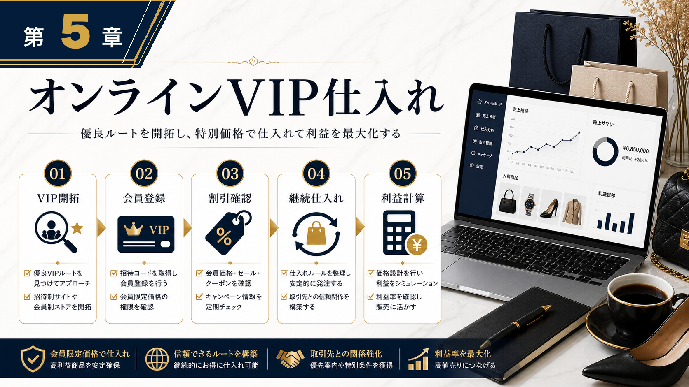

<!-- SOURCE: ROOT-05 / SHEET-VIP-01 / 公式更新=本章末リンク -->

本章でいう「オンラインVIP仕入れ」は、海外ショップと誠実な取引関係を作り、店舗が公式に提供する会員、常連顧客、取引、購入量等の条件を確認して仕入れる方法です。

条件は、個別クーポン、会員価格、アカウント別価格、期間限定オファー、購入量に応じた提案等、ショップによって異なります。すべてのショップに「VIP制度」があるわけではなく、割引率や承認を保証するものでもありません。

本章のゴールは、候補ショップ1件について次を完了できることです。

1. 現在営業している正規のショップか確認する
2. 割引がなくても成立する通常条件を計算する
3. 自分の実績だけを使って問い合わせる
4. 対象、除外、期限、最低購入額、併用、返品を確認する
5. 決済直前の総額で利益を再計算する
6. 条件と証拠を管理表へ記録する

### 5-1 オンラインVIP仕入れとは

| 項目 | 通常仕入れ | VIP・会員・取引条件あり |
|---|---|---|
| 価格 | 公開価格 | 店舗が承認した条件による価格 |
| 利用者 | 一般購入者 | 会員、常連、取引先等の条件を満たす人 |
| 適用 | 公開条件 | 対象ブランド、商品、期間、回数等に制限がある場合 |
| 管理 | 決済時の価格確認 | 承認証拠、条件、期限、除外、コード等の管理が必要 |
| 継続 | 都度確認 | 条件変更・停止を前提に再確認 |

旧教材では「専用クーポンで通常価格より10〜30%安くなり、免税でもっと安くなる」と説明していました。現行版では、この固定幅を使いません。

- 割引率はゼロを含めてショップ判断
- 税の扱いは販売国、配送先、店舗の輸出処理で変わる
- セール、ブランド、商品、配送先によって適用外になる場合がある
- 割引があっても送料、為替、関税、返品条件で利益が残らない場合がある
- 承認済み条件でも、期限切れや店舗判断で変更・終了する場合がある

「VIP」という名前より、**今回の注文へ適用できる条件が書面と決済画面で確認できるか**を重視します。

### 5-2 交渉前にショップを確認する

候補を見つけても、すぐに交渉文を送りません。先に次を確認します。

1. 運営会社、住所、公式連絡先が確認できる
2. 利用規約、販売条件、返品・返金、配送、プライバシーが公開されている
3. ブランド公式または正規販売の根拠を確認できる
4. BUYMAの禁止・要注意買付先を確認した
5. マーケットプレイスの場合は、サイト名ではなく実際の販売元を確認した
6. 日本または検品者住所への配送条件が確認できる
7. 注文確認、レシート、インボイス等を保存できる
8. 出品者本人または買付パートナーが現物検品できる

BUYMAの禁止買付先一覧に名称がないことだけでは、安全性や利用可否の保証になりません。サイト、販売者、商品、購入証明を自分で確認します。

#### 旧教材に掲載されていた探索先の現状

| 旧教材の掲載先 | 2026-07-13時点の確認 | 本教材での扱い |
|---|---|---|
| [ShoppingMap.it](https://www.shoppingmap.it/chi-siamo) | ブティック等を紹介するディレクトリ。自らECではないと案内 | 候補発見用。掲載だけで正規性を判断しない |
| [FARFETCH Partner Boutiques](https://www.farfetch.com/uk/boutiques/index.aspx) | パートナーブティック一覧が現存 | FARFETCH上の購入と、掲載店との直接取引を分けて確認 |
| [海外通販WALKER](https://www.kaigai-tsuhan.com/%E5%88%A9%E7%94%A8%E8%A6%8F%E7%B4%84/) | 海外通販の参考情報サイト。規約で営業・営利行為やその準備目的の利用・アクセスを禁止 | 原教材にあった探索先として記録だけ残し、BUYMAの候補探索には使わない |
| [FRMODA](https://frmoda.com/) | 公式トップでEC閉鎖を案内 | 新規の交渉・仕入れ候補にしない |

原教材と原管理表はFRMODAを成功例にしていましたが、現在は新規の買付先として使えません。過去の交渉結果やサンプルコードも実績として引き継ぎません。

### 5-3 VIP交渉管理表の作り直し

> **この章の配布資料:** `BUYMA_VIP交渉管理表_購入者版.xlsx`

<!-- ATTACHMENT-READY: BUYMA購入者配布資料/BUYMA_VIP交渉管理表_購入者版.xlsx -->

原xlsxは`管理表`1シート、範囲`A1:I2`です。

| 原管理表の列 | 問題 |
|---|---|
| サイト名、URL | 運営会社、販売元、正規性、最終確認日がない |
| 交渉結果 | 結果の定義と根拠がない |
| クーポンコード | 共有範囲、所有者、期限、漏えい対策がない |
| 割引率 | 対象、除外、最低額、併用条件がない |
| 備考欄 | 重要条件が自由記述へ混ざる |
| 交渉日1〜3 | 連絡手段、回答、次回理由を追えない |

サンプル行`A2:I2`には、閉鎖済みの`frmoda`、結果`○`、ダミーとみられる`ABC123`、20%、旧交渉日`2020-10-15`が入っています。配布版ではこの行を丸ごと削除し、`BUYMA_VIP交渉管理表_購入者版.xlsx`として次の列へ作り直します。

#### ショップ確認

- ショップ名、URL、運営会社、国
- 実際の販売元
- 正規性の根拠URL
- BUYMA禁止・要注意買付先の確認日
- 返品、配送、購入証明の確認日

#### 交渉と条件

- VIP制度の有無と確認日
- 初回連絡日、連絡手段、宛先
- 交渉結果と回答原文・証拠
- プログラム種別
- 割引率または価格条件
- 対象ブランド・商品・カテゴリ
- 適用外ブランド・商品・カテゴリ
- セール・他コードとの併用
- 最低購入額、購入回数、利用上限
- 有効開始日、有効期限、タイムゾーン
- 対象アカウント、譲渡・共有可否

#### 注文条件と継続管理

- 対象通貨、対象国・サイト
- 送料、税、関税、決済手数料
- 返品・返金時の割引処理
- 最終利用日、実際の購入額
- 最終確認日、次回確認日、再連絡理由
- 状態: 未確認、連絡済み、条件あり、条件なし、期限切れ、停止
- 最終判断: 採用、条件付き、保留、除外

クーポンコードや担当者情報は公開リンクへ置かず、必要な担当者だけが閲覧できるようにします。コードを本文特典として配布したり、第三者へ転売したりしません。

### 5-4 交渉するタイミング

交渉は、相手へ伝えられる事実がある時に行います。

#### 購入前

購入したい具体的な商品があり、通常条件でも利益と買付意思がある場合に、会員・常連・取引条件の有無を問い合わせます。割引をもらうためだけに、買う予定のない商品や架空の月間購入額を伝えません。

#### 購入時

実際に注文する直前に、今回使える公開キャンペーン、会員条件、個別条件があるか確認します。条件確認を待つ間に在庫や発送期限へ影響する場合は、注文を優先するかキャンセルするかを利益計算と購入者対応から判断します。

#### 購入後

実在する注文番号、購入商品、対応への感謝を伝え、今後も利用したい場合に継続条件を相談します。購入していない商品や存在しない注文を実績として使いません。

#### 再交渉

旧教材の「1か月後・2か月後に再交渉」を固定ルールにしません。次のような理由がある時だけ再連絡します。

- 実際の購入実績が増えた
- 以前案内された再連絡時期になった
- 条件の期限が近い
- 新しい取引・会員プログラムが公開された
- 対象ブランドや配送国を変更したい

同じ内容を短期間に繰り返し送らず、ショップの営業時間、連絡方針、配信停止意思を尊重します。

### 5-5 候補選定から継続確認までの10工程

1. **候補ショップを登録する**
   候補名、URL、国、発見元、登録日を管理表へ入れます。

2. **正規性とBUYMA利用可否を確認する**
   運営会社、販売元、ブランド公式の根拠、BUYMA禁止・要注意買付先、購入証明を確認します。

3. **通常条件の利益を計算する**
   割引ゼロの価格、送料、税、為替、決済に加え、出品者負担となる関税等を原価へ入れて利益を試算します。通常の海外発送で購入者負担となる関税等は原価へ混ぜず、商品ページの表示条件として別に管理します。割引がないと赤字になる商品を、未確定の交渉結果だけで出品しません。

4. **自分の事実を整理する**
   実際の購入履歴、購入したい商品、取り扱いブランド、今後の現実的な購入意向を整理します。

5. **公式窓口へ問い合わせる**
   公式メール、問い合わせフォーム、店舗が案内する連絡先を使い、役割や実績を偽らず連絡します。

6. **回答と証拠を保存する**
   回答日時、送信元、原文、添付、条件、担当者を管理表へ紐付けます。

7. **適用条件を確認する**
   対象、適用外、最低額、併用、期限、利用回数、アカウント、配送国、返品を確認します。

8. **決済直前に適用と総額を確認する**
   コードや会員価格を適用し、商品価格、送料、税、手数料を含む決済総額を確認して利益を再計算します。

9. **実際の注文と結果を記録する**
   注文番号、購入額、割引額、対象商品、利用日、購入証明を保存します。出品者または買付パートナーが現物検品してから購入者へ発送します。

10. **継続・再交渉・停止を判断する**
    返品、配送、利益、対応品質、条件変更を振り返り、継続、再確認、停止の状態を更新します。

### 5-6 誠実な交渉文テンプレート

#### 初回問い合わせ

次のテンプレートは、角括弧内を自分の事実へ置き換えてから使います。事業を運営している場合だけ`I operate...`を使い、準備中なら`I am preparing...`を使います。どちらも事実でなければその行を削除し、角括弧が残ったまま送信しません。

```text
Subject: Inquiry about a regular-customer or trade program

Dear Customer Support Team,

My name is [your name].
[If true: I operate an online retail business in Japan.]
[If true: I am preparing to start an online retail business in Japan.]
I am interested in purchasing authentic fashion items from your store,
including [brand / category / specific item].

Could you please let me know whether you offer any regular-customer,
trade, loyalty, or volume-purchase program?

If a program is available, I would appreciate details about:
- eligible and excluded brands or products,
- minimum purchase requirements,
- validity and usage limits,
- combination with sale prices or other promotions,
- shipping countries, taxes, and return conditions.

I understand that approval and all conditions are at your discretion.
Thank you for your time.

Kind regards,
[your name]
[business contact]
```

#### 購入後の問い合わせ

```text
Subject: Inquiry after order [order number]

Dear Customer Support Team,

My name is [your name]. I recently purchased [product name]
from your store under order [order number].
Thank you for your support with the order.

I would be interested in purchasing from your store again.
Could you please let me know whether you offer any regular-customer,
trade, loyalty, or volume-purchase program?

If available, I would appreciate the eligible brands or products,
minimum purchase requirements, validity, usage limits,
shipping conditions, and return conditions.

I understand that approval and all conditions are at your discretion.
Thank you for your time.

Kind regards,
[your name]
[business contact]
```

原教材にあった「月1万〜2万USD以上購入する」「架空の俳優アカウントを作る」等は使いません。購入予定額、購入履歴、肩書、顧客、SNSは、確認できる事実だけを伝えます。

### 5-7 条件をもらった後の確認

「20%コードをもらった」だけでは、仕入れ条件は確定していません。次を確認します。

| 確認項目 | 記録する内容 |
|---|---|
| 対象 | ブランド、商品、カテゴリ、価格帯 |
| 適用外 | 新作、定番、セール、限定、特定ブランド等 |
| 率・価格 | 割引率、会員価格、通貨、小数・端数処理 |
| 最低条件 | 最低注文額、累計額、注文回数、数量 |
| 併用 | セール、公開コード、ポイント、送料無料との併用 |
| 回数 | 1回、期間内回数、数量上限 |
| 期限 | 開始日時、終了日時、タイムゾーン |
| アカウント | 対象メール、会員ID、地域サイト、譲渡可否 |
| 配送 | 対象国、送料、追跡、補償、到着目安 |
| 税・関税 | 表示税、輸出時の処理、関税負担、手数料 |
| 返品 | 返品可否、返金額、期限、送料、割引失効 |
| 証拠 | メール、規約URL、画面、回答者、確認日 |

担当者の口頭回答だけで出品価格を決めず、可能な範囲でメール、規約、決済画面等の証拠を残します。利用条件に守秘や個人利用の指定がある場合は従います。

### 5-8 割引後の利益計算

```text
決済前の見込仕入れ総額
= 店舗が確定した割引・税処理後の商品請求額の円換算額
+ 送料・補償の円換算額
+ 決済・送金手数料
+ 出品者負担となる関税・輸入消費税等
+ 検品・梱包・パートナー報酬等

決済前の見込利益
= 販売価格
- BUYMA成約手数料等
- 決済前の見込仕入れ総額
- その他の販売関連費用

決済後の実績仕入れ総額
= カード・送金明細で確定した商品代・送料等の円請求額
+ その円請求額に含まれていない決済・送金手数料
+ 出品者負担として確定した関税・輸入消費税等
+ 検品・梱包・パートナー報酬等

決済後の実績利益
= 販売価格
- BUYMA成約手数料等
- 決済後の実績仕入れ総額
- その他の販売関連費用
```

決済前は店舗表示、決済条件、利用するカード・送金サービスの条件から見込額を作ります。決済後はカード・送金明細と関税等の確定額へ置き換えます。カードや送金サービスの為替スプレッドは、商品代へ別に重ねず、明細で確定した実際の円請求額または手数料として反映します。送料、税、手数料等が注文総額や円請求額に含まれている場合は再加算しません。「20%OFFだから利益が20%増える」とは限りません。

#### 決済前の2つのシナリオ

| シナリオ | 使う価格 | 目的 |
|---|---|---|
| 通常条件 | 割引なしの決済総額 | 条件が使えない場合の撤退判断 |
| 承認条件 | 決済画面で実際に適用された総額 | 今回の見込利益更新 |

決済完了後も、カード・送金明細、関税等、返品・返金が確定するまでは実績利益と呼びません。

コードが無効、対象外、期限切れ、併用不可になった場合は、無断で通常価格購入へ切り替えません。受注価格、購入者への案内、在庫、発送期限を確認し、買付またはキャンセルを判断します。

### 5-9 コード・会員アカウントの管理

- ショップから許可されたアカウント・注文だけに使う
- 第三者の個人コードや会員アカウントを借りない
- コードや会員価格を公開、販売、特典配布しない
- 担当者の個人連絡先や条件を無断で共有しない
- パスワードと認証コードを交渉担当へ渡さない
- アカウントのメール、地域、通貨、配送先を注文前に確認する
- 期限切れ、停止、利用済みの状態を更新する
- 条件変更の連絡を保存する
- 管理表には証拠ファイルそのものではなく、アクセスを限定した保管先リンクと確認日を記録する
- パスワード、認証コード、カード番号、本人確認書類を管理表へ保存しない
- 収集する担当者情報は取引に必要な範囲へ絞り、保存期限を決めて不要になったら削除する
- 外注担当の契約・業務終了時は、管理表と証拠保管先へのアクセスを停止する

店舗が本人確認や事業情報を求める場合は、必要性、提出先、利用目的、保管方法を公式窓口で確認します。交渉のために架空のSNS、俳優、インフルエンサー、会社、購入実績を作りません。

### 5-10 交渉を外部へ任せる場合

翻訳や問い合わせの下書きを外部へ任せても、ショップの選定、実績の正しさ、条件の採用、決済、BUYMAでの責任はアカウント登録者に残ります。

- 本人ではなく許可を得た担当・アシスタント・通訳であることを正しく伝える
- 架空の購入額や成功しやすい肩書を作らない
- ショップのアカウント、決済、カード情報を共有しない
- 1件電話＋成功200円等の旧固定報酬を相場として使わない
- 回答原文と条件を出品者が再確認する
- 利用サービスの禁止事項を回避する募集をしない

クラウドワークスは、無在庫販売、EC運営代行、代理注文・購入・受取・買付等を禁止対象として案内しています。本教材ではVIP交渉担当の募集先として固定推奨しません。採用、契約、報酬、教育、品質評価は第8章で扱います。

### 5-11 チェックリスト

#### 次章へ進む準備チェック

- [ ] VIP仕入れが固定割引を保証する方法ではないと理解した
- [ ] 候補ショップの運営会社、正規性、販売元を確認した
- [ ] BUYMAの禁止・要注意買付先を確認した
- [ ] 割引ゼロの通常条件で利益を試算した
- [ ] 自分の実績と購入意向だけで交渉文を作った
- [ ] 対象、適用外、最低額、併用、期限、返品の確認項目を説明できる
- [ ] 管理表へ候補1件を根拠付きで入力した

#### 実取引時チェック

- [ ] 条件が現在有効か注文時に再確認した
- [ ] 対象ブランド、商品、セール併用を確認した
- [ ] コードや価格を決済画面へ適用した
- [ ] 商品代、送料、税、手数料を含む決済総額を確認した
- [ ] 関税等が出品者負担か購入者負担かを確認し、原価と商品ページ条件へ分けた
- [ ] 通常条件と承認条件の両方で利益を計算した
- [ ] コードが使えない時に無断で通常価格購入へ変更していない
- [ ] 注文確認、購入証明、適用条件の証拠を保存した
- [ ] 出品者本人または買付パートナーが現物検品した
- [ ] コード、アカウント、担当者情報を第三者へ共有していない
- [ ] 利用後に購入額、割引額、最終確認日を更新した
- [ ] 条件変更・期限切れ・停止を管理表へ反映した

### 第5章の公式・現況確認先

確認日: **2026-07-15**

- [BUYMA 禁止・要注意買付先](https://qa.buyma.com/shopper/prohibited-item/4007.html)
- [BUYMA 検品・梱包・発送](https://qa.buyma.com/shopper/order-to-delivery/4201.html)
- [BUYMA 買付先から購入者への直送](https://qa.buyma.com/shopper/order-to-delivery/4205.html)
- [BUYMA 外部委託時のアカウント管理](https://qa.buyma.com/shopper/reg/13732.html)
- [BUYMA 関税の支払い](https://qa.buyma.com/buy/pay/3104.html)
- [クラウドワークス 仕事依頼ガイドライン](https://crowdworks.jp/pages/guidelines/job_offer.htm)
- [ShoppingMap.it 運営説明](https://www.shoppingmap.it/chi-siamo)
- [FARFETCH Partner Boutiques](https://www.farfetch.com/uk/boutiques/index.aspx)
- [海外通販WALKER 利用規約](https://www.kaigai-tsuhan.com/%E5%88%A9%E7%94%A8%E8%A6%8F%E7%B4%84/)
- [FRMODA EC閉鎖案内](https://frmoda.com/)
- [JCB 海外利用時の換算日・換算レート](https://j-faq.jcb.co.jp/faq/show/412)

<!--
第5章 出典対応:
- 5-1: ROOT-05のオンラインVIP定義を、固定10〜30%・免税保証なしへ現行化
- 5-2: ROOT-05の探索先4件を2026-07-13に再確認し、海外通販WALKERは営利利用禁止のため探索先から除外
- 5-3: SHEET-VIP-01のA1:I2実体を確認し、A2:I2の旧サンプル行を丸ごと削除する配布版仕様を定義
- 5-4: ROOT-05の購入前／購入時／購入後／再交渉を固定期間・誇張なしへ現行化
- 5-5: ROOT-05のリストアップ→交渉→条件獲得→再交渉を10工程へ再構成
- 5-6: ROOT-05のビジネス／購入後／顧客テンプレートを、虚偽の月間購入額なしの2テンプレートへ統合
- 5-7: ROOT-05の交渉結果・コード・割引率・備考を、対象・除外・期限・併用・返品等へ拡張
- 5-8: ROOT-05の割引率向上を成果保証にせず、決済総額と2シナリオの利益確認へ現行化
- 5-9: ROOT-05の個別コードとSNS運用を、非共有・非譲渡・実在情報のみへ現行化
- 5-10: ROOT-05の電話交渉・英語担当採用を第8章へ移動し、外注時の責任だけを残した
- 5-11: 5-1〜5-10を学習時／実取引時へ再配置した商品設計

不採用:
- 初心者でもすぐできる、誰でもできるという成果保証
- 通常価格より10〜30%OFF、免税でもっと安くなるという固定条件
- 1か月後・2か月後の再交渉を固定ルールにすること
- Skype、Instagram DM、特定翻訳・通話ツールの固定推奨
- 架空の俳優・インフルエンサーSNSで信用を作る方法
- 月1万〜2万USD以上購入するという未確認の実績・予定
- 電話1件＋成功200円等の固定報酬
- クラウドワークス等の規約をすり抜ける募集
- FRMODAを現在も営業する成功例として掲載すること
- 原xlsxのABC123・20%を実在コード・実績として扱うこと
-->

---

## 第6章 BUYMAショップリスト

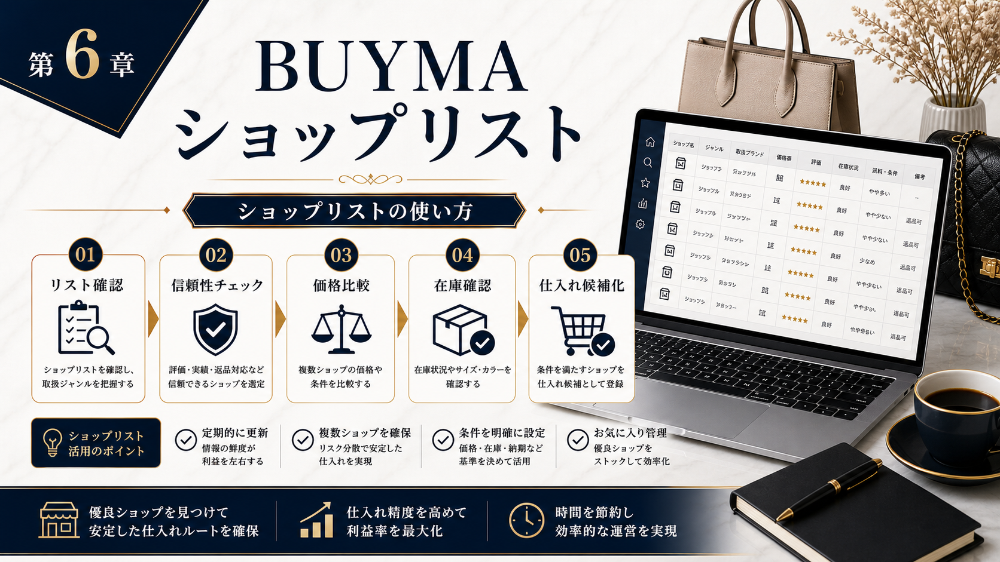

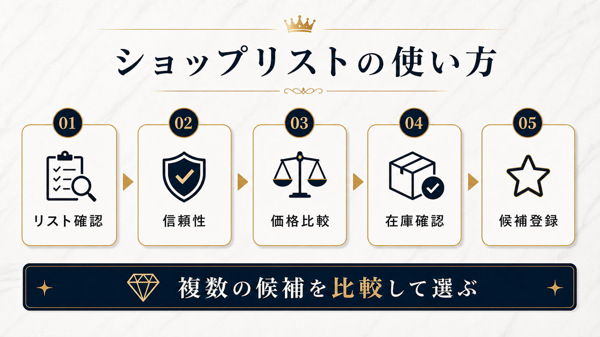

<!-- SOURCE: ROOT-06 / PDF-SHOP-01〜02 / 公式更新=本章末リンク -->

この章は、第2〜5章で学んだ買付先確認を、原教材のショップリストへ当てはめる実践資料です。

旧対応表では「約69件」と見積もっていましたが、原PDFの実物を数えると**1ページ目43件、2ページ目25件、合計68件**でした。68件はすべて下表へ残しますが、掲載は推薦を意味しません。

本章のゴールは、ショップ名を見てすぐ注文することではありません。候補1件について、現在の運営、販売元、正規性、配送、返品、証憑、BUYMAルール、検品経路を確認し、使う・保留・除外を自分で記録できる状態にすることです。

### 6-1 先に知っておく4つの判定

現況分類日: **2026-07-13** / URL到達性・主要状態の再確認日: **2026-07-15**

原PDF68件を現況だけで分類すると、次の内訳でした。

| 現況判定 | 件数 | 意味 |
|---|---:|---|
| 営業表示あり | 44 | 商品、カート、規約等の現行表示を確認できた。正規性やBUYMA利用可の保証ではない |
| URL・名称・運営変更 | 12 | 旧URLや旧名称のまま使えない。新しい販売主体を別の買付先として再確認する |
| 公式EC確認不可・閉鎖告知等 | 9 | 商品ECを確認できない、公式閉鎖告知、ドメイン駐車、DNS消失等。閉鎖を一律断定せず、仕入れには使わない |
| 要再確認 | 3 | 原表の国・事業との不一致、SSL・アクセス不良等があり、現行店と断定できない |

この44件には、日本国内ECのANTEPRIMAも含まれます。サイト自体は営業中でも、BUYMAは国内ECサイトを禁止買付先としているため、買付候補から除外します。

4分類の所属は次のとおりです。個別表の「注意」「URL変更」「単独EC終了」等は、その4分類内の詳細状態です。

- 営業表示あり44件: `1〜8、10〜11、13〜17、19、21〜22、24〜26、29、32〜33、35〜37、40、43〜46、48〜49、52、54、57、59〜61、63〜64、66〜67`
- URL・名称・運営変更12件: `20、23、30、31、38、42、50、51、55、62、65、68`
- 公式EC確認不可・閉鎖告知等9件: `12、18、27、28、34、41、47、53、56`
- 要再確認3件: `9、39、58`

### 6-2 原教材68件の現況監査表

表の「営業表示あり」は、2026-07-13時点でサイト上の営業表示を確認できたという意味です。**安全、正規品、BUYMAで利用可能、日本配送可能を保証する表示ではありません。**

原PDFのショップ名にある曲線アポストロフィは読みやすい記号へ正規化し、途中までしか表示されていない国名`アラブ首長国連`は`アラブ首長国連邦`へ補正しています。以下の「原教材の表記・国」は、この記号と明白な欠字だけを補正した表示です。

#### アメリカ・アラブ首長国連邦・イギリス

| No. | 原教材の表記（記号補正） | 原教材の国（欠字補正） | 2026-07-13時点 | 現行リンク・扱い |
|---:|---|---|---|---|
| 1 | Nordstrom | アメリカ | 営業表示あり | [現行サイト](https://www.nordstrom.com/)。商品、販売元、発送国を注文ごとに確認 |
| 2 | SHOPBOP | アメリカ | 営業表示あり | [現行サイト](https://www.shopbop.com/)。掲載だけでBUYMA利用可とはしない |
| 3 | Revolve Clothing | アメリカ | 営業表示あり | [REVOLVE](https://www.revolve.com/)。現名称へ更新 |
| 4 | Saks Fifth Avenue | アメリカ | 営業表示あり・注意 | [現行サイト](https://www.saksfifthavenue.com/)。請求主体、販売元、返品条件を注文時に再確認 |
| 5 | Urban Outfitters | アメリカ | 営業表示あり | [現行サイト](https://www.urbanoutfitters.com/)。地域版と発送元を確認 |
| 6 | Neiman Marcus | アメリカ | 営業表示あり・注意 | [現行サイト](https://www.neimanmarcus.com/)。販売元、配送条件、返品条件を注文時に再確認 |
| 7 | Bluefly | アメリカ | 営業表示あり・注意 | [現行サイト](https://www.bluefly.com/)。販売元、請求書、正規取扱根拠を商品単位で確認 |
| 8 | TiLLY'S | アメリカ | 営業表示あり | [Tillys](https://www.tillys.com/)。現表記へ更新 |
| 9 | Hu's | アメリカ | 要再確認 | [原ドメイン](https://husonline.com/)。SSL・アクセス不良があり、現行ECとして掲載しない |
| 10 | HAMPDEN | アメリカ | 営業表示あり | [現行サイト](https://hampdenclothing.com/)。商品と注文導線を確認 |
| 11 | The Trend Boutique | アメリカ | 営業表示あり | [現行サイト](https://shop.trendcincinnati.com/)。現在の販売主体、発送条件、返品条件を確認 |
| 12 | Ron Herman | アメリカ | 現行の海外ECを確認できず | [現在の案内](http://ronherman.com/)は店舗案内中心。原教材の海外EC候補として使わない。日本ECは国内ECとして除外 |
| 13 | Macy's | アメリカ | 営業表示あり | [現行サイト](https://www.macys.com/)。地域制限と発送可否を確認 |
| 14 | Karmaloop | アメリカ | 営業表示あり | [現行サイト](https://www.karmaloop.com/)。商品と注文導線を確認 |
| 15 | Anthropologie | アメリカ | 営業表示あり | [現行サイト](https://www.anthropologie.com/)。地域版と発送元を確認 |
| 16 | Bloomingdale's | アメリカ | 営業表示あり | [現行サイト](https://www.bloomingdales.com/)。商品単位の販売元を確認 |
| 17 | BYSYMPHONY | アラブ首長国連邦 | 営業表示あり・注意 | [BySymphony](https://bysymphony.com/)。商品、店舗、連絡先はあるが、更新日と在庫の鮮度を確認 |
| 18 | Boutique1 | アラブ首長国連邦 | 現行公式ECを確認できず | [原ドメイン](https://www.boutique1.com/)は駐車ページ。仕入れに使わない |
| 19 | Harrods | イギリス | 営業表示あり | [現行サイト](https://www.harrods.com/en-us/)。国際配送とブランド制限を確認 |
| 20 | Surfdome | イギリス | URL・事業変更 | [BrandAlley内の案内](https://www.brandalley.co.uk/surfdome)。旧単独ECとして使わず、現販売主体を別途確認するまで保留 |
| 21 | END. | イギリス | 営業表示あり | [END. Clothing](https://www.endclothing.com/us)。現名称へ更新 |
| 22 | LN-CC | イギリス | 営業表示あり | [現行サイト](https://www.ln-cc.com/ja-jp/)。地域、通貨、発送元を確認 |
| 23 | All Sole | イギリス | 単独EC終了 | [転送先Flannels](https://www.flannels.com/)は別の販売主体として再調査。AllSoleの実績を引き継がない |
| 24 | ZOO FASHIONS | イギリス | 営業表示あり | [現行サイト](https://www.zoofashions.com/)。商品と注文導線を確認 |
| 25 | The Outnet | イギリス | 営業表示あり・注意 | [現行サイト](https://www.theoutnet.com/en-us/)。請求主体、販売元、返品先、規約を再確認 |
| 26 | NET-A-PORTER | イギリス | 営業表示あり | [現行サイト](https://www.net-a-porter.com/en-us/)。配送国と返品条件を確認 |
| 27 | MATCHESFASHION | イギリス | 公式EC停止・再始動待ち | [現在の公式ページ](https://matchesfashion.com/)は再始動予告のみ。商品、決済、返品が再開するまで使わない |

#### イタリア

| No. | 原教材の表記（記号補正） | 原教材の国（欠字補正） | 2026-07-13時点 | 現行リンク・扱い |
|---:|---|---|---|---|
| 28 | FRMODA | イタリア | 公式EC閉鎖 | [公式閉鎖案内](https://frmoda.com/)。仕入れに使わない |
| 29 | ANTEPRIMA | イタリア | 国内ECのため除外 | 原URL[wirebag.jp](https://www.wirebag.jp/)は日本向け国内EC。BUYMA買付候補へ入れない |
| 30 | DELL'O GLIO | イタリア | URL変更 | [Dell'Oglio](https://doboutique.com/)へドメイン変更。現法人、正規性、規約を再確認 |
| 31 | Chirulli | イタリア | URL変更 | [現行サイト](https://chirullishop.com/gb/)。地域、通貨、配送国を確認 |
| 32 | Dante5 | イタリア | 営業表示あり | [現行サイト](https://www.dante5.com/en-US)。アクセス制限時は注文せず公式窓口で確認 |
| 33 | G&B NEGOZIO | イタリア | 営業表示あり | [現行サイト](https://gebnegozionline.com/)。運営主体と配送条件を確認 |
| 34 | the clutcher | イタリア | 現行公式ECを確認できず | 原ドメインを確認できない。類似名の別サイトへ置き換えない |
| 35 | YOOX | イタリア | 営業表示あり | [現行サイト](https://www.yoox.com/us/women)。地域、販売元、返品条件を確認 |
| 36 | BRUNA ROSSO | イタリア | 営業表示あり | [現行サイト](https://www.brunarosso.com/)。商品と注文導線を確認 |
| 37 | Leam | イタリア | 営業表示あり | [現行サイト](https://www.leam.com/it_eu/)。地域と配送先設定を確認 |
| 38 | LIDIA SHOPPING | イタリア | URL変更 | [現行トップ](https://www.lidiashopping.com/)。旧地域パスを使わず、配送国を選び直す |
| 39 | Satu | イタリア | 要再確認 | [現在の同ドメイン](https://shopsatu.com/)はカンボジアの別事業。原教材のイタリア店として使わない |
| 40 | Bernardelli | イタリア | 営業表示あり | [現行サイト](https://www.bernardellistores.com/en)。アクセス制限時は注文せず公式窓口で確認 |
| 41 | Atelier On Web | イタリア | 現行公式ECを確認できず | 原ドメインのEC表示を確認できない。仕入れに使わない |
| 42 | ANTONIA | イタリア | URL変更 | [現行サイト](https://www.antonia.it/en-us/collections/mens-clothing)。商品カテゴリ、配送国、返品条件を確認 |
| 43 | VINICIO | イタリア | 営業表示あり | [現行サイト](https://www.vinicioboutique.com/en/)。アクセス制限時は注文せず公式窓口で確認 |
| 44 | italist | イタリア | 営業表示あり・注意 | [現行サイト](https://italist.com/)。複数ブティック連携型のため、実販売元、請求書、返品先を商品単位で確認 |
| 45 | TESSABIT | イタリア | 営業表示あり | [現行サイト](https://www.tessabit.com/row/woman/)。アクセス制限時は注文せず公式窓口で確認 |
| 46 | LUISAVIAROMA | イタリア | 営業表示あり | [現行サイト](https://www.luisaviaroma.com/ja-us/)。地域と配送条件を確認 |
| 47 | L'INDE LE PALAIS | イタリア | 現行公式ECを確認できず | 原URLはショップ自身のECではなくディレクトリ。実店舗・公式ドメインとも現行営業を確認できず使わない |
| 48 | GIGLIO | イタリア | 営業表示あり | [現行サイト](https://www.giglio.com/eng/)。広告パラメータを外し、地域と配送条件を確認 |
| 49 | galiano | イタリア | 営業表示あり | [Galiano Store](https://www.galianostore.com/it-ita)。現表記へ更新 |
| 50 | FORZIERI | イタリア | 運営変更・保留 | [現在のForzieri](https://www.forzieri.com/)は新運営。旧マルチブランドECの実績を引き継がず、新規候補として再確認するまで保留 |
| 51 | ANTONIOLI | イタリア | URL変更 | [現行トップ](https://antonioli.eu/)。旧セールURLを使わず、商品と配送条件を選び直す |
| 52 | ELEONORA BONUCCI | イタリア | 営業表示あり | [現行サイト](https://eleonorabonucci.com/)。商品と注文導線を確認 |

#### オーストラリア・カナダ・スウェーデン・ドイツ・フランス・ベルギー

| No. | 原教材の表記（記号補正） | 原教材の国（欠字補正） | 2026-07-13時点 | 現行リンク・扱い |
|---:|---|---|---|---|
| 53 | LALABAZAAR | オーストラリア | 現行公式ECを確認できず | 原ドメインは売却ページ。仕入れに使わない |
| 54 | Beginning Boutique | オーストラリア | 営業表示あり | [現行サイト](https://www.beginningboutique.com.au/)。商品と注文導線を確認 |
| 55 | ANOTHER LOVE | オーストラリア | URL変更 | [現行サイト](https://www.anotherloveclothing.com/)。販売主体と配送条件を確認 |
| 56 | HOUSE OF ZOI | オーストラリア | 現行公式ECを確認できず | 原ドメインを確認できない。類似名の別サイトへ置き換えない |
| 57 | SSENSE | カナダ | 営業表示あり・注意 | [現行サイト](https://www.ssense.com/ja-jp/men/sale)。販売元、決済、配送、返品条件を注文時に確認 |
| 58 | COUP | カナダ | 要再確認 | [現在の同ドメイン](https://coupeg.com/)はエジプトの別事業。原教材のカナダ店として使わない |
| 59 | Sneakersnstuff.com | スウェーデン | 営業表示あり | [SNS](https://www.sneakersnstuff.com/)。地域配送を確認 |
| 60 | SAVANNAHS | スウェーデン | 営業表示あり | [現行サイト](https://savannahs.com/)。連絡先、配送、返品を確認 |
| 61 | NELLY.com | スウェーデン | 営業表示あり | [現行サイト](https://nelly.com/ww/womens-fashion/)。アクセス制限時は注文せず公式窓口で確認 |
| 62 | Voo Store | ドイツ | URL変更 | [VOO STORE](https://voostore.com/)へ更新。運営主体と配送条件を確認 |
| 63 | ANITA HASS | ドイツ | 営業表示あり | [現行サイト](https://anitahass.com/)。商品と注文導線を確認 |
| 64 | FASHIONESTA | ドイツ | 営業表示あり | [現行サイト](https://www.fashionesta.com/en-us)。会社情報、配送、返品を確認 |
| 65 | STYLEBOP | ドイツ | 単独EC終了・運営変更 | [Peek & Cloppenburg](https://www.peek-cloppenburg.de/de/designer)の現販売主体を別の買付先として確認。旧STYLEBOPの実績を引き継がない |
| 66 | mytheresa | ドイツ | 営業表示あり | [現行サイト](https://www.mytheresa.com/)。地域、配送、返品を確認 |
| 67 | 24S | フランス | 営業表示あり | [現行サイト](https://www.24s.com/en-us/)。地域とブランド別配送制限を確認 |
| 68 | IRINA KHA | ベルギー | URL・表記変更 | [Irina Kha](https://irina-kha.com/en/)。法人、実店舗、配送、返品を確認 |

### 6-3 購入者版ショップ管理表の列

> **この章の配布資料:** `BUYMA_ショップ確認台帳_購入者版.xlsx`
> 旧教材68件の2026-07-13時点の現況と、空の新規候補行、注文前確認シートを収録しています。

<!-- ATTACHMENT-READY: BUYMA購入者配布資料/BUYMA_ショップ確認台帳_購入者版.xlsx -->

原PDFの「ショップ名・国・URL」だけでは、現在使えるか判断できません。購入者版では、最低限次の列を使います。

#### 基本情報

- ショップNo.と、注文単位の管理番号
- 原教材のショップ名、国
- 現在のショップ名、国、現行URL
- 運営会社、販売主体
- 状態: 未確認、営業表示あり、URL・名称・運営変更、公式EC確認不可・閉鎖告知等、要再確認、除外
- 現況確認メモ、BUYMA禁止先確認日、次回確認日、確認者、変更履歴

#### 正規性とBUYMA確認

- ブランド公式または正規販売の根拠URL
- マーケットプレイス・提携店型か
- 実際の販売元
- BUYMA禁止・要注意買付先の確認日
- 国内EC、CtoC、品質・真贋不安の該当確認
- 購入証明、レシート、インボイスの発行可否

#### 注文と取引条件

- 日本または検品者住所への配送可否
- 送料、追跡、補償、検品者・場所
- 価格・通貨、税・関税の表示と負担者
- 実際の決済・請求主体
- 返品・返金条件、期限、返送料
- 現物検品者と検品場所
- 確認証拠の保管先
- 最終判断、判断理由、次回確認日

URLだけを一覧で公開せず、各URLへ確認日と根拠を付けます。管理表には証拠ファイルそのものではなく、アクセスを限定した保管先リンクと確認日を記録します。ログイン情報、カード番号、本人確認書類、購入者の個人情報はショップ管理表へ保存しません。

注文確認や問い合わせ回答に氏名、住所、注文番号等が含まれる場合、共有用は必要箇所をマスキングし、原本は権限を限定した保管先へ分離します。担当終了時は保管先と管理表へのアクセスを停止し、担当者側の不要なローカル複製を削除します。

### 6-4 初めてのショップを使う前の10工程

1. **URLと運営主体を確認する**
   広告パラメータを外した公式トップ、会社名、住所、連絡先、規約を確認します。旧ドメインが別事業へ転用されていたら使いません。

2. **BUYMAの禁止・要注意買付先を確認する**
   固有名の一致だけでなく、国内EC、CtoC、品質・真贋不安、マーケットプレイス等の分類も確認します。

3. **実際の販売元を確認する**
   マーケットプレイス、提携ブティック、複数販売元型では、サイト名だけで判断せず商品ページの販売元まで記録します。

4. **ブランド取扱根拠を確認する**
   ブランド公式の店舗・取扱店情報、ショップの会社情報、購入証明等を確認します。確認項目を満たしても安全保証にはなりません。

5. **商品情報を照合する**
   ブランド名、商品名、型番、色、サイズ、素材、付属品、販売元、商品状態を公式情報と照合します。

6. **配送と検品経路を決める**
   日本または買付パートナー住所への配送、追跡、補償、到着目安を確認し、出品者本人または買付パートナーが現物検品する経路を作ります。

7. **税・関税・決済を確認する**
   表示価格、税処理、関税等の負担者、送料、決済手数料、通貨、請求主体を確認し、二重計上せず利益を試算します。

8. **返品・返金を確認する**
   返品可否、期限、対象外、返送料、返金通貨、割引や関税等の扱いを確認します。

9. **証拠を保存する**
   商品ページ、注文確認、規約、購入証明、問い合わせ回答、確認日を保存します。個人情報を含む原本は権限を限定した保管先へ分離し、管理表にはリンクだけを記録します。共有用は必要箇所をマスキングし、公開範囲、保存期限、担当終了時のアクセス停止とローカル複製削除を決めます。

10. **注文直前に再確認する**
    在庫、販売元、価格、配送、税、返品、規約、検品経路を再確認し、管理表の最終確認日を更新します。

### 6-5 ショップリストを安全保証として使わない

BUYMAの公式ガイドは、禁止買付先の一覧にないショップでも利用を控える場合があり、個別ショップの利用可否には回答せず、出品者自身が真贋と品質を確認するよう案内しています。

そのため、本リストでは次の判断をしません。

- 営業中だから安全
- 有名店だから全商品が利用可能
- BUYMAの固有名一覧にないから許可
- ブランドを扱っているから正規販売店
- カートへ入るから日本へ配送可能
- 過去に買えたから現在も同じ条件
- URLが同じだから運営会社も同じ

ショップ、販売元、商品、注文条件、検品経路を1件ずつ確認します。現況が変わった行は上書きせず、変更日と旧状態を履歴へ残します。

### 6-6 チェックリスト

#### 候補登録時

- [ ] 原PDFは68件であることを確認した
- [ ] 原教材の表記と現在の表記を分けて登録した
- [ ] URLの移転、閉鎖、別事業化を確認した
- [ ] 国内ECとCtoCを候補から除外した
- [ ] BUYMAの禁止・要注意買付先を分類まで確認した
- [ ] 営業表示ありを安全保証として扱っていない

#### 注文前

- [ ] 運営会社と実際の販売元を確認した
- [ ] ブランド取扱根拠と商品情報を確認した
- [ ] 日本または検品者住所への配送条件を確認した
- [ ] 出品者本人または買付パートナーの現物検品経路を確定した
- [ ] 税、関税等の負担者、送料、決済、返品を確認した
- [ ] 注文確認、購入証明、規約、問い合わせ回答を保存できる
- [ ] 注文直前に価格、在庫、販売元、規約を再確認した
- [ ] 管理表の最終確認日と判断理由を更新した

### 第6章の公式・現況確認先

確認日: **2026-07-15**

- [BUYMA 出品を禁止されている買い付け先](https://qa.buyma.com/shopper/prohibited-item/4007.html)
- [BUYMA 検品・梱包・発送](https://qa.buyma.com/shopper/order-to-delivery/4201.html)
- [MATCHESFASHION 現在の公式ページ](https://matchesfashion.com/)
- [FRMODA EC閉鎖案内](https://frmoda.com/)
- [BySymphony 公式サイト](https://bysymphony.com/)
- [STYLEBOP転送先](https://www.peek-cloppenburg.de/de/stylebop)
- [Forzieri 現在の公式サイト](https://www.forzieri.com/)
- [Satu 現在の同ドメイン](https://shopsatu.com/)
- [COUP 現在の同ドメイン](https://coupeg.com/)

<!--
第6章 出典対応:
- 6-1: 旧対応表の「約69件」という見積もりを原PDF2ページの実数68件へ訂正し、2026-07-13現況の4分類を追加
- 6-2: PDF-SHOP-01〜02の全68件を欠落なく移植し、営業、URL・名称・運営変更、閉鎖、要再確認、国内EC禁止を記録
- 6-3: 原PDFの3列を、運営主体・正規性・販売元・BUYMA分類・配送・税・返品・証憑・検品・確認日へ拡張
- 6-4: 第2〜5章とBUYMA公式の買付先・検品ルールを、初回ショップ確認10工程へ再配置
- 6-5: BUYMA公式の「一覧外も利用を控える場合」「個別可否には回答しない」「最終判断は出品者責任」を反映
- 6-6: 6-1〜6-5を候補登録時／注文前へ再配置した商品設計

保留・除外:
- Hu's、Ron Herman海外EC、Boutique1、Surfdome、All Sole、MATCHESFASHION、FRMODA、the clutcher、Satu、Atelier On Web、L'INDE LE PALAIS、FORZIERI、LALABAZAAR、HOUSE OF ZOI、COUPは、原教材と同じ買付候補として公開しない
- ANTEPRIMAのwirebag.jpは国内ECのため買付候補から除外
- 旧第6章章頭画像は「優良ショップ」「利益率最大化」等の安全保証・成果保証に見えるため不採用
-->

---

## 第7章 高値売りの戦略

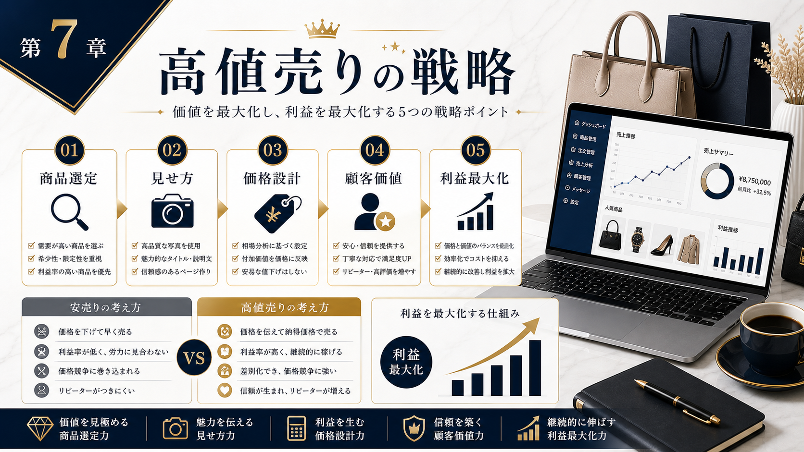

<!-- SOURCE: ROOT-07 / ROOT-08の高値売り・年間計画部分 / 公式更新=本章末リンク -->

原教材では、高値売りを「国内定価より高い値段で売れること」と定義していました。本章では、その考えを残しながら、理由なく価格を上げる方法とは分けます。

高値売りは、購入者が**同一商品、同じ配送・関税・在庫条件を比べたうえで、その条件に見合う価格だと判断できる設計**です。価格を上げれば売れるという保証ではなく、国内定価より高ければ成功という意味でもありません。

本章のゴールは、候補商品1件について次を完了できることです。

1. 高く売れる可能性の根拠を事実で1つ以上示す
2. 同一条件の競合と国内価格を比較する
3. 固定利益率を使わず最低販売価格を計算する
4. 新作・完売・未入荷・限定・即発等の表示根拠を残す
5. 出品後の結果から継続、改善、停止を判断する

### 7-1 高値売りの定義

高値で売れる理由は、商品の名前だけでは決まりません。

| 要素 | 確認すること |
|---|---|
| 商品 | 型番、仕様、色、サイズ、付属品、商品状態 |
| 入手性 | 国内販売、在庫、地域・店舗・期間限定の事実 |
| 時間 | 手元在庫、買付日、発送地、追跡、到着目安 |
| 安心 | 買付先、購入証明、検品、梱包、問い合わせ対応 |
| 条件 | 送料、関税等の負担者、返品、補償、価格 |

同じ型番でも、海外発送と国内発送、在庫未確認と手元在庫、関税購入者負担と出品者負担では条件が違います。比較するときは、価格だけでなくこれらの条件を揃えます。

### 7-2 高値売り候補になる5つの理由

原教材で挙げていた候補は次の5つです。

1. **新シーズン商品**
   これから需要が動く時期に、正確な商品情報と在庫を確認できる場合です。「新作」は発売時期や公式掲載を確認します。

2. **国内完売品**
   日本のブランド公式・直営店等で在庫が確認できず、海外等の許可された買付先では在庫を確認できる場合です。1回の検索だけで「国内完売」と断定しません。

3. **国内未入荷品・ブランド**
   日本公式の取扱状況を確認し、同じ型番・色・仕様が国内で販売されていない場合です。後から入荷する可能性があるため確認日を付けます。

4. **国・地域・店舗・期間限定の商品や色**
   ブランドや店舗の公式案内で限定範囲と期間を確認できる場合です。販売地域が違うだけで「限定」と書きません。

5. **早く受け取りたい需要**
   手元在庫、国内実店舗で確認済みの在庫、短い検品・発送経路等、実際に早く届けられる根拠がある場合です。在庫未確認や海外取り寄せで「即発」と表示しません。

これらは候補理由です。どれかに当てはまっても、需要、競合、総コスト、在庫、返品リスクを確認しなければ出品判断はできません。

### 7-3 戦略1 ニッチブランド・新シーズン・サイズ展開

原教材の1つ目は、**ニッチブランド × 新シーズン × サイズ展開**を組み合わせる戦略です。

ここでいうニッチは「知名度が低い」という断定ではなく、現在のBUYMA内で同じ商品・条件の出品が少なく、需要の手掛かりがある状態を指します。競合が少ないだけでは需要がない可能性もあります。

#### 候補を絞る8工程

1. **ブランド候補を集める**
   自分の販売履歴、問い合わせ、最近の成約表示、ブランド公式の新着等から候補を集めます。

2. **新シーズンの根拠を確認する**
   ブランド公式、正規取扱店の商品ページ、シーズン表記、発売日等を確認します。

3. **同一商品の競合を確認する**
   型番、色、サイズ、発送地、関税等の負担、在庫条件が同じ出品を比較します。

4. **サイズ展開を確認する**
   サイズが多いこと自体を価値にせず、どのサイズを実際に買い付けできるか確認します。

5. **需要の根拠を残す**
   売れた商品、問い合わせ、ほしいもの登録等、確認できる事実と確認日を記録します。数値を作りません。

6. **買付先を確認する**
   原教材のYOOX、END.、italist等は第6章の旧掲載例です。固定推奨せず、販売元、正規性、在庫、配送、返品、証憑を商品ごとに確認します。

7. **通常条件で価格を計算する**
   未確定のVIP割引を前提にせず、割引ゼロでも成立するか計算します。

8. **少数の候補から結果を記録する**
   出品数を目的にせず、表示、問い合わせ、注文、在庫切れ、作業時間を記録し、次の候補選定へ反映します。

旧教材にあった「ライバルが少ないので価格は自由」「新シーズンなら価格競争がない」という断定は使いません。価格は需要、競合、国内価格、配送条件、信頼、総コストから決めます。

### 7-4 戦略2 ロープライス商品の高付加価値販売

原教材の2つ目は、ハイブランドの高額品だけでなく、比較的低価格の商品でも付加価値を整える戦略です。

ここでいうロープライスは固定金額ではなく、そのブランドやカテゴリ内で比較的低い価格帯という意味です。購入者を「お金に余裕がある人」等の属性だけで決めず、**用途と購入条件**を見ます。

#### 価格以外で確認する価値

- 国内では見つけにくい用途、色、サイズ、カテゴリ
- 正規の買付先と購入証明
- 出品者または買付パートナーによる現物検品
- 手元在庫または確認済みの配送経路
- 型番、素材、サイズ、付属品の分かりやすい説明
- 追跡、補償、梱包、問い合わせ対応
- 関税等の負担者と返品条件の明確さ

原教材には「1万円の商品を1万5,000円で売れば利益率30%」という例がありましたが、現行版では使いません。差額5,000円からBUYMA成約手数料、送料、決済、税、検品、梱包等が引かれるため、販売価格だけでは利益率を計算できないからです。

また、「低価格を扱う競合はブランディングが下手」「市場は空いている」という断定も使いません。商品単位で現在の出品と成約状況を確認します。

### 7-5 戦略3 海外で売れている商品の国内実店舗買付

原教材の3つ目は、海外発送の出品で需要が見える商品について、国内実店舗等の許可された買付経路を確認し、配送の早さを価値にする戦略です。

#### 実行する8工程

1. 海外発送の同一商品に成約・問い合わせ等の需要があるか確認する
2. 国内発送で同一条件の出品が少ないか確認する
3. ブランド直営店等の国内実店舗へ在庫を確認する
4. 国内ECやCtoC等、BUYMAの禁止買付先を使っていないか確認する
5. 店頭で型番、色、サイズ、付属品、商品状態を確認する
6. レシート等の購入証明を保管できるか確認する
7. 手元在庫または実際の買付・発送日程で到着目安を計算する
8. 海外発送との条件差と総コストを比較して価格を決める

「海外より高くてもすぐ欲しい人が買う」とは限りません。実際の在庫、発送地、到着目安、追跡、関税等の条件を正確に表示し、購入者が比較できる状態を作ります。

国内のブランド公式ECであっても、BUYMAの国内EC禁止ルールに該当する場合は買付先に使いません。第2章の国内買付確認を省略しないでください。

### 7-6 年間計画と2〜3か月前の準備

原教材では、季節商品を2〜3か月前に準備し、4月の商品なら1〜2月に出品する例がありました。これは固定正解ではなく、初期仮説として使います。

#### 年間計画の作り方

1. 月ごとの気候、行事、旅行、式典、休暇等を挙げる
2. その場面で使うカテゴリを挙げる
3. 自分の過去データから、売れた日、出品日、問い合わせ日、売れた理由を記録する
4. ブランド公式の発売時期と正規店の入荷時期を確認する
5. BUYMA内の現在の需要・競合・成約表示を確認する
6. 準備開始日、出品予定日、再確認日、停止日を決める
7. 実績を翌年の計画へ追加する

雑誌、SNS、検索結果は需要仮説の入口です。掲載画像を無断で出品へ使わず、「掲載多数」「流行」等の表現は確認できる根拠がある場合だけ使います。

2〜3か月前で早すぎる商品も、遅すぎる商品もあります。ブランド、カテゴリ、発売日、買付期間、過去の成約日から前倒し期間を更新します。

### 7-7 固定利益率を使わない価格計算

原教材の「5万〜30万円の商品」「固定利益率20〜25%」は、当時の運用例です。現在の標準や成果保証として使いません。

```text
見込利益
= 売上見込額
- 現在のBUYMA成約手数料等
- 見込仕入れ・販売総費用

見込仕入れ・販売総費用
= 商品代・送料等の見込円換算額
+ 決済・送金手数料
+ 出品者負担となる関税・輸入消費税等
+ 検品・梱包・パートナー報酬等
+ 上記にまだ含めていない販売関連費用
```

ここでいう売上見込額は、BUYMAの出品画面で設定する商品価格と配送料のうち、今回の取引で実際に成約代金へ反映される見込額です。新旧の配送方法で商品価格と送料の入力方法が異なるため、現在の出品画面と公式ガイドを確認します。

カード・送金明細、関税等が確定したら、見込額を実績額へ置き換えます。すでに円請求額や見込仕入れ・販売総費用へ含めた送料、税、手数料、検品、梱包、外注費等を再加算しません。

#### 発送地と関税等の3区分

| 出品・発送条件 | 利益計算での扱い |
|---|---|
| 海外発送・購入者負担 | 購入者が受取時に別途支払う関税等は、出品者の売上にも原価にも入れない |
| 海外発送・関税負担なし等の出品者負担 | 出品者が負担・返金する見込関税等を見込仕入れ・販売総費用へ入れる |
| 国内発送 | 海外から国内へ受け取る際の関税等は出品者負担として総費用へ入れ、購入者へ別途請求しない |

同じ商品でも発送地と関税設定が違えば比較条件が変わります。出品画面の発送地と関税設定を利益計算・商品説明と一致させます。

#### 価格を決める順番

1. 割引ゼロの通常条件で見込仕入れ・販売総費用を計算する
2. 必要利益と、在庫切れ・返品・為替・作業時間の負担を確認する
3. 現在のBUYMA成約手数料等を反映する
4. 国内定価と、その根拠・確認日を確認する
5. 同じ型番、発送地、関税、在庫、配送条件の出品を比較する
6. 販売価格で見込利益が残るか再計算する
7. 注文直前と決済後に再計算する

国内定価より高い価格で販売する場合は、購入者が条件を誤認しないよう、参考価格、送料、関税等の負担、発送地、在庫、到着目安を正確に表示します。

### 7-8 参考価格と誇張表示

BUYMAの参考価格・通常出品価格は、自由な比較用数字ではありません。

- 通常出品価格は、同じ商品を14日間以上販売・出品した実績がある価格だけを使う。設定から14日経過すると非表示になり、再設定には改めて14日間以上の販売・出品実績が必要
- 参考価格は、日本の公式店舗・ブランド公式サイトの国内販売定価、または公式に明らかな現地通貨の定価を条件に使う
- 現地通貨の定価は、BUYMAが指定する換算説明を商品コメント上部へ入れる
- 送料込み・関税込みの金額を参考価格へ入れない
- 価格、根拠URL、通貨、換算レート、確認日を保存する

消費者庁も、実際と異なる価格、あいまいな比較価格、同一でない商品の価格、根拠のない希望小売価格等を使った二重価格表示は不当表示となるおそれがあると案内しています。

#### 表示前に根拠が必要な言葉

| 表現 | 必要な確認 |
|---|---|
| 新作・新シーズン | 公式の発売日、シーズン、掲載日 |
| 国内完売 | 日本公式・直営店等の在庫確認元と確認日 |
| 国内未入荷 | 日本公式の取扱状況、型番・色・仕様の一致 |
| 限定 | 限定する国、地域、店舗、期間、数量の公式根拠 |
| 残り1点 | 実在庫の確認元と確認時刻 |
| 即発・手元在庫 | 出品者が実際に商品を保有し、検品を終え、注文確定後に即日発送できる状態。国内店舗の在庫確認だけでは即発としない |
| 雑誌掲載・著名人愛用 | 掲載媒体・本人・権利・商品一致の確認 |
| 大人気 | 具体的な確認事実。根拠がなければ使わない |

新作、国内未入荷、限定等は時間とともに変わります。出品後も再確認し、事実でなくなった表示を放置しません。

### 7-9 出品後の改善

価格だけを変える前に、次の順で見直します。

1. 型番、色、サイズ、素材、付属品に誤りがないか
2. 画像の利用権と商品一致を確認できるか
3. 発送地、到着目安、追跡、関税、返品が分かりやすいか
4. 在庫と買付先を再確認できるか
5. 問い合わせ内容へ正確に答えられているか
6. 同一条件の競合と需要が変化していないか
7. 見込利益が最低条件を下回っていないか

需要の根拠が弱い、在庫確認ができない、表示根拠が失われた、総コストで利益が残らない場合は、値下げで延命せず停止または再調査します。

### 7-10 チェックリスト

#### 候補選定時

- [ ] 高く売れる可能性の根拠を事実で説明できる
- [ ] 新作、完売、未入荷、限定、早い配送の根拠と確認日がある
- [ ] 同じ型番、発送地、関税、在庫、配送条件の競合を比較した
- [ ] 買付先、販売元、在庫、返品、証憑を確認した
- [ ] 固定価格帯や固定利益率を使っていない
- [ ] 複数アカウントや自動出品ツールを検証手段にしていない

#### 出品・注文時

- [ ] 割引ゼロの通常条件で見込利益を計算した
- [ ] 参考価格・通常出品価格の根拠を保存した
- [ ] 誇張した限定、人気、在庫、掲載、愛用表現を使っていない
- [ ] 国内ECやCtoC等の禁止買付先を使っていない
- [ ] 出品者本人または買付パートナーの検品経路がある
- [ ] 注文直前に在庫、価格、販売元、配送、税、返品を再確認した
- [ ] 決済後に実績原価と利益へ更新した

### 第7章の公式確認先

確認日: **2026-07-15**

- [BUYMA 参考価格（価格二重表記）](https://qa.buyma.com/shopper/sell/4105.html)
- [BUYMA 出品価格の設定](https://qa.buyma.com/shopper/4104.html)
- [BUYMA 海外発送と国内発送の注意点](https://qa.buyma.com/shopper/sell/9408.html)
- [BUYMA 商品一覧で自分の出品商品を目立たせよう](https://qa.buyma.com/shopper/sell/6151.html)
- [BUYMA 出品活動における禁止事項](https://qa.buyma.com/shopper/prohibited-item/27277.html)
- [BUYMA 出品者登録に関するよくある質問](https://qa.buyma.com/shopper/reg/13732.html)
- [BUYMAの副業・高額コンサル・スクール勧誘に関する注意](https://qa.buyma.com/shopper/tips/30118.html)
- [BUYMA 出品を禁止されている買い付け先](https://qa.buyma.com/shopper/prohibited-item/4007.html)
- [BUYMA 検品・梱包・発送](https://qa.buyma.com/shopper/order-to-delivery/4201.html)
- [消費者庁 二重価格表示](https://www.caa.go.jp/policies/policy/representation/fair_labeling/representation_regulation/double_price/)

<!--
第7章 出典対応:
- 7-1: ROOT-07とROOT-08の「国内定価より高い」を、同一商品・配送・関税・在庫条件を比較する定義へ現行化
- 7-2: ROOT-07とROOT-08の新シーズン、国内完売、国内未入荷、限定、早く欲しい需要を根拠付き候補へ再構成
- 7-3: 両原本のニッチブランド・新シーズン・サイズ展開を、競合断定なしの8工程へ現行化
- 7-4: 両原本のロープライス高値売りを、属性決めつけ・競合批判・固定利益率なしの付加価値確認へ現行化
- 7-5: 両原本の海外で売れる商品×国内買付を、国内実店舗等の許可経路・実在庫・配送条件へ現行化
- 7-6: ROOT-08の年間計画と2〜3か月前準備を、固定時期でなく自分の実績で更新する計画へ現行化
- 7-7: 両原本の5万〜30万円・固定20〜25%を削除し、見込原価と実績原価で商品別に計算
- 7-8: 両原本の訴求語をBUYMA参考価格ルール・変動表示・消費者庁価格表示へ接続
- 7-9: ROOT-08の継続改善を、誤記・権利・配送・在庫・需要・利益の順で見直す工程へ再構成
- 7-10: 7-1〜7-9を候補選定時／出品・注文時へ再配置した商品設計

不採用:
- 複数アカウントで早く検証する方法
- 自動出品ツールで大量出品する方法
- 5万〜30万円を固定の出品価格帯にすること
- 固定20〜25%や1万円→1万5,000円なら30%という利益率
- ニッチ、新シーズン、ロープライスなら高値で売れるという保証
- 競合はブランディングが下手、市場は空いているという断定
- 富裕層等の属性だけで購入理由を決めること
- 国内ECからの買付
- 根拠のない新作、完売、未入荷、限定、残り1点、即発、掲載、愛用、大人気
- 旧第7章章頭画像と安売り比較画像は「利益最大化」「高値なら利益確保」「価格で比べられにくい」等の成果保証に見えるため不採用
-->

---

## 第8章 出品外注化・採用・教育マニュアル

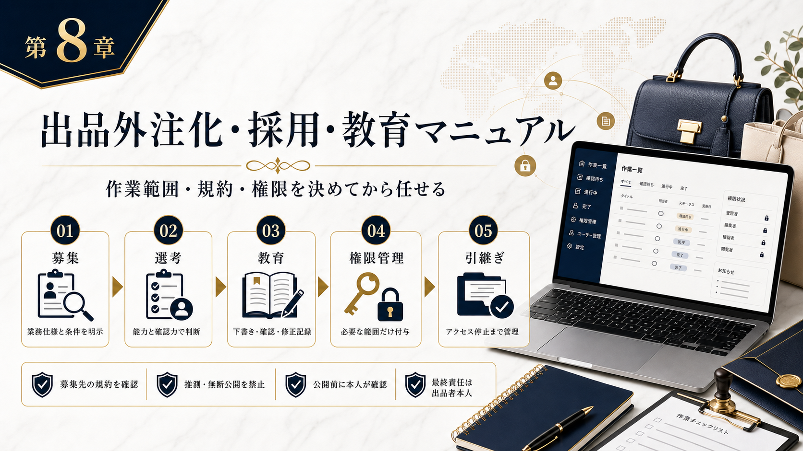

出品外注化は、募集を出してログイン情報を渡すことではありません。

先に作業を分け、正しい完成条件を決め、取引条件を明示し、下書きで教育してから、必要な範囲だけを任せます。誰に何を任せても、BUYMA上の活動に対する最終責任は出品者本人にあります。

この章のゴールは、次の5点です。

1. 募集前に、任せる作業と任せない作業を決める
2. 募集経路の規約に反しない募集文を作る
3. 属性ではなく、業務に必要な能力と条件で選考する
4. 下書き、確認、修正記録を使って教育する
5. 権限付与から退任時のアクセス停止まで管理する

### 8-1 募集前に作る業務仕様

最初に「出品作業をお願いします」と募集すると、候補者ごとに作業範囲の理解が変わります。募集前に、1つの作業を入力、処理、納品物、確認者、例外対応へ分解します。

#### 業務仕様の基本項目

| 項目 | 決める内容 |
|---|---|
| 業務名 | 例: 商品情報の整理、出品下書きの作成、画像候補の整理 |
| 入力 | 公式商品URL、買付先URL、型番、使用許可を確認した画像、価格条件 |
| 作業 | どの項目を、どの資料に基づいて入力・整理するか |
| 納品物 | 管理表、下書き、確認待ち一覧、質問一覧 |
| 完成条件 | 型番一致、必須欄入力、根拠URL記録、計算確認等 |
| 禁止事項 | 推測、無断転載、虚偽表示、アカウント作成、無断公開、無断購入等 |
| 確認者 | 出品者本人、または承認済みの担当者 |
| 例外対応 | 在庫不明、価格不明、画像権利不明、利益不足時は止めて質問する |
| 納期・数量 | いつまでに何件を納品するか。募集時の実数と一致させる |
| 報酬 | 単価・固定額・時間単価等を、実際の業務と募集経路のルールに合わせる |

#### 初期に分ける4つの領域

| 領域 | 初期の扱い |
|---|---|
| 商品情報の整理 | 公式情報と提供資料を使う。推測で埋めない |
| 画像候補の整理 | 使用権を確認した素材だけを扱う。無断取得・無断加工をしない |
| 出品下書き | 公開前の下書きとして作り、出品者本人が事実・権利・利益を確認する |
| 公開・問い合わせ・買付・送金 | 下書き業務と分離する。初期募集へまとめて入れない |

国内買付、海外買付、直営店連携、VIP交渉は、必要能力、扱う個人情報、金銭、配送責任が異なります。出品下書き担当へ一括して任せず、第2〜5章の業務仕様を別契約・別権限で管理します。

### 8-2 利用サービス別の委託可能・禁止業務を確認する

募集サービスは、知名度ではなく、依頼したい業務を現在の規約で募集できるかを確認して選びます。

| 募集経路 | 本教材での扱い | 公開前に確認すること |
|---|---|---|
| クラウドワークス | BUYMAの出品、商品登録、在庫管理、代理購入・受取、アカウント作成・貸与・共有等の募集先にしない | 仕事依頼ガイドライン、外部連絡、支払方式、サンプル作業の規定 |
| その他のクラウドソーシング | 利用可能とは一律判断しない | 対象EC、出品代行、アカウント操作、外部連絡、知的財産、テスト、報酬の最新規約 |
| 紹介・直接募集 | サービス規約だけでなく、BUYMA規約と法令に沿って個別設計する | 募集表示、本人確認の必要範囲、契約、支払、個人情報、知的財産、機密保持 |
| 既存の契約先 | 過去に依頼した事実だけで適法・許可済みとは判断しない | 今回の業務範囲、契約期間、取引条件、権限、再委託、利用ツール |

クラウドワークスの仕事依頼ガイドラインは、無在庫販売、ECの商品登録・在庫管理等の代行、アカウント作成・貸与・共有、代理購入・受取、著作権を侵害する画像利用、無報酬のサンプル作業等を禁止対象として案内しています。名称を「データ入力」「リサーチ」へ変えて実態を隠しても、依頼内容が禁止業務なら掲載しません。

本教材では、特定の募集サービスをBUYMA外注の安全な募集先として固定推奨しません。掲載直前に、実際の募集文と業務仕様を現在の規約へ照合します。

### 8-3 現行ルールに沿う募集文

以下は、募集経路の規約確認後に使うための共通ひな型です。**クラウドワークス掲載用ではありません。** BUYMA・ECの出品下書き業務を掲載できると現在の規約で確認した募集経路、または適切に設計した直接募集だけで使います。`［　］`を実際の条件へ置き換え、実施しない業務は削除します。

BUYMAは外部パートナーのログイン自体を一律禁止していませんが、パートナーの操作を含む全行為の責任は登録者にあります。本教材の初期運用では、アカウントの新規作成、貸与、認証情報共有を業務に含めません。実アカウントの操作を後から委託する場合は、第8章8-6の権限・履歴・停止条件を先に満たします。

特定業務委託事業者が広告等でフリーランスを募集する場合は、募集を行う者の氏名・名称、住所・所在地、連絡先、業務内容、業務に従事する場所、報酬の6情報を、正確かつ最新の内容で示します。仲介事業者を使う場合に募集者情報を個別照会で示す運用は、仲介事業者が照会へ回答する旨と照会先を募集情報とともに表示する等、厚生労働省の現行案内を満たすか確認します。

#### 募集文ひな型

```text
タイトル
EC商品情報の整理・出品下書き作成［件数／期間］

募集を行う者
氏名・名称: ［氏名または事業者名］
住所・所在地: ［原則としてビル名・階数・部屋番号まで記載。仲介事業者の照会方式を使う場合は、公式案内の例外要件と照会先を確認］
連絡先: ［応募者が照会できる連絡先］
業務に従事する場所: ［在宅／指定場所等］

業務内容
当方が指定する公式商品ページと管理表を使い、次の作業をお願いします。
・商品名、型番、色、サイズ、素材、付属品等の整理
・指定フォーマットへの入力
・使用許可を確認した提供素材による画像候補の整理
・公開前の出品下書き作成
・不明点、在庫切れ、価格変更等の報告

初期業務に含まれないもの
・BUYMAアカウントの新規作成、貸与、認証情報共有（本教材の初期業務では扱わない）
・確認を受けていない公開操作
・問い合わせ対応、代理購入、受取、送金
・第三者の画像や文章の無断利用
・確認できない事実の推測入力

納品物
［管理表／下書き／質問一覧］

件数・期間
［開始日］から［終了日］まで、［件数］件

報酬・支払条件
［報酬の額または算定方法］
［検査を行う場合の完了期日］
［支払期日・支払方法］
※契約後の追加作業は、内容と追加報酬を合意してから依頼します。

必要な経験・環境
・［業務上必要な表計算／文章入力／画像整理等の経験］
・指定した情報源と手順を確認できること
・不明点を推測せず質問できること
・機密情報と個人情報を適切に扱えること

選考
応募内容、関連経験、提出可能な既存実績、面談をもとに判断します。
選考のための実作業を依頼する場合は、利用サービスの規約確認と条件合意を先に行います。

応募時に記載する内容
・契約に必要な氏名またはサービス上の表示名
・関連する実務経験
・対応可能な曜日・時間帯・期間
・提出可能な既存実績の有無
・業務内容に関する質問

注意
年齢、性別、家族構成、趣味、詳細住所等、選考に不要な情報は応募時に求めません。
募集終了、件数変更、報酬変更があれば募集情報を更新または終了します。
```

「誰でも簡単」「未経験でも必ず稼げる」「作業すれば売上が上がる」等の表示は使いません。報酬例を掲載する場合も、確約額に見せず、算定方法、対象業務、条件を明記します。

### 8-4 旧パッチテストを使わない

旧教材には、候補者が自分でBUYMA出品者アカウントを作り、商品を出品し、確認後に退会するテストがありました。新版では使用しません。

#### 行わない選考

- 候補者へBUYMAアカウントを新規作成させる
- 候補者のアカウントでテスト出品させる
- テスト後にアカウントを退会させる
- 出品者本人のログイン情報を選考段階で渡す
- 契約前に実運用の商品を公開させる
- 採用されなければ無報酬になる実作業をさせる
- 禁止された外部連絡や面談へ誘導する

選考は、応募内容、既存実績、業務説明への理解、面談を基本にします。実作業による確認が必要な場合の具体的な方法は、募集経路と最新規約を確定し、業務内容、納品物、報酬、利用権、データ削除を合意してから別途設計します。本教材では、全サービスに共通するテスト方法を一律指定しません。

### 8-5 面談・契約・取引条件の明示

面談では、私生活上の属性ではなく、業務を安全に完了できるかを確認します。

#### 面談で確認すること

- 指定資料から事実を抜き出した経験
- 不明点や矛盾を見つけた場合の報告方法
- 対応可能な期間、曜日、連絡可能時間帯
- 使用できる表計算・文章入力・画像整理環境
- 画像、文章、個人情報、ログイン情報を扱う際の考え方
- 納期に遅れる場合の連絡方法
- 他者へ再委託する可能性の有無
- 利益相反や競合業務の有無
- 過去のBUYMA利用・運営補助経験と、利用制限を受けたことがあるか

年齢、性別、婚姻、子どもの有無、家族構成、趣味、容姿等を応募条件にしません。本人確認や支払に必要な情報は、採用判断と分け、契約・法令・利用サービスで必要な範囲だけを適切な時点で取得します。

#### 発注時に明示する項目

フリーランス法の対象となる取引では、業務委託をしたとき、直ちに書面またはメール等の電磁的方法で取引条件を明示します。口頭だけで済ませません。

同法でいう「従業員を使用する」は、原則として週所定労働時間が20時間以上かつ継続して31日以上の雇用が見込まれる労働者を雇用することです。発注者が法人の場合は、従業員だけでなく代表者以外の役員の有無も義務区分の判定に関係します。受注者が法人の場合は、一の代表者以外に他の役員がなく、かつ従業員を使用しない法人であるかも、特定受託事業者の判定に必要です。取引条件の明示は、発注者側の従業員・役員の有無を問わず適用され得ますが、60日以内の支払期日等は特定業務委託事業者に適用される義務として分けて確認します。

1. 発注者と受注者の名称
2. 業務委託をした日
3. 業務の内容
4. 納品日または役務提供日
5. 納品場所または役務提供場所
6. 検査をする場合の検査完了期日
7. 報酬額と支払期日
8. 金銭以外で支払う場合の方法

発注者が特定業務委託事業者に該当し、同法第4条の支払期日義務が適用される場合、報酬の支払期日は給付の受領日または役務の提供日から60日以内のできる限り短い期間内で定めます。同じ区分の発注者が1か月以上継続して委託する場合は、受領拒否、報酬減額、返品、買いたたき、購入・利用強制、不当な利益提供要請、不当な変更・やり直しの禁止も確認します。

電磁的方法で取引条件を明示した後、受注者から書面交付を求められた場合は、保護に支障を生じない例外を除き、遅滞なく書面を交付します。

発注者が特定業務委託事業者に該当し、6か月以上継続して委託する場合は、育児・介護等との両立への配慮、中途解除・不更新の30日前予告等、期間に応じた追加義務があります。解除・不更新の予告後、受注者から理由の開示を求められた場合は、定められた方法で遅滞なく開示します。同じ区分の発注者は、6か月未満でも育児・介護等との両立へ必要な配慮をするよう努め、委託期間にかかわらずハラスメント相談への体制を整えます。

1か月・6か月の期間は、契約書1通の表示だけで判定しません。同じ当事者間で給付・役務の内容に一定の同一性があり、契約間の空白が1か月未満の場合は、更新による継続として最初の委託の始期から最後の委託の終期まで、空白期間を含めて通算します。

フリーランス法上の対象や義務は、発注者側の従業員・役員、受注者側の法人形態・代表者以外の役員・従業員、委託期間、取引形態等で変わります。適用関係や契約形態に迷う場合は、専門家または行政窓口へ確認します。

#### 個人情報と機密情報

- 利用目的を決め、必要な情報だけを取得する
- 応募情報を閲覧できる人を限定する
- 管理表、顧客情報、注文情報、証憑へのアクセスを業務別に分ける
- 個人のカード情報、本人確認書類、アカウントのパスワードを共有表へ保存しない
- 外部ツールへ保存する前に、利用規約、保存先、権限、削除方法を確認する
- 個人データを扱わせる場合は、必要な安全管理ができる委託先を選定する
- 契約へ安全管理、目的外利用禁止、返却・削除、事故時の即時報告、監査・確認方法を反映する
- 取扱状況を継続的に把握し、権限・保存先・端末・事故の有無を定期確認する
- 再委託の可否と事前承認、再委託先の選定・監督・終了時削除を決める
- 漏えい等が疑われる場合の即時報告先、初動、証拠保全、BUYMA・本人・行政等への連絡判断を決める
- 選考終了・契約終了後の保存期間と削除方法を決める

### 8-6 初期教育と出品管理表

教育は、説明を一度送って終わりではありません。出品者本人が正常例と異常例を説明できる作業だけを、下書きから段階的に任せます。

#### 初期教育の順番

1. 業務仕様と禁止事項を共有する
2. 正しい完成例と、止めるべき例を見せる
3. 使用できる情報源・画像・文章の範囲を確認する
4. 実アカウントを使わず、指定フォーマットで下書きを作る
5. 出品者本人が型番、事実、権利、価格、送料、関税、利益を確認する
6. 修正理由を記録し、次回の手順へ反映する
7. 同じ誤りが減ったか、例外時に止めて質問できたかを確認する

#### 公開前の確認項目

- [ ] 商品、型番、色、サイズ、素材、付属品が情報源と一致する
- [ ] 買付先と販売元を確認した
- [ ] 画像と文章の利用権を確認した
- [ ] 在庫、発送地、配送、関税、返品の表示が実態と一致する
- [ ] 参考価格、新作、限定、完売、人気等の根拠がある
- [ ] 割引ゼロの通常条件でも見込利益を計算した
- [ ] 不明点を推測で埋めていない
- [ ] 公開者と確認者を記録した

#### 旧 `recruit.xlsx` の監査結果

旧管理表には、商品URL、担当名、管理番号、ブランド、商品名、コメント、原価、国際送料、為替、関税、消費税、諸費用、仕入れ合計、利益、販売価格、利益率等の有用な項目がありました。一方、次の式は現行版へそのまま移しません。

- 販売手数料等を固定値`/0.9244`で逆算する式
- 輸入消費税を8%で計算する式
- 課税価格を常に商品価格の60%とする式
- 革靴30%または4,300円、その他10%、非課税0%へ一律分類する式

手数料、税率、課税価格、品目分類、EPA等は取引条件で変わります。現行の公式情報、商品分類、発送条件、確認日、根拠URLを記録し、固定の旧式だけで注文判断をしません。

#### 新しい出品管理表の列

| 区分 | 主な列 |
|---|---|
| 管理 | 管理番号、担当、作成日、確認者、状態、最終確認日 |
| 商品 | ブランド、商品名、型番、色、サイズ、素材、付属品 |
| 根拠 | 公式商品URL、買付先URL、販売元、在庫確認日時、画像利用根拠 |
| 見込費用 | 商品代、通貨、円請求額、円請求額の含有済み費用、換算レート・日、送料、決済・送金、税・関税、検品、梱包、国内送料、委託費、その他費用 |
| 販売 | 商品価格、配送料、現在の成約手数料等、発送地、関税負担、到着目安 |
| 見込結果 | 手数料控除前の売上見込額、見込総費用、見込利益、見込判定 |
| 実績 | 手数料控除前の実績売上額、証憑から確定した実績総費用、自動計算する実績利益 |
| 確認 | 根拠不足、質問、修正内容、公開日時、停止理由 |

```text
売上見込額 = 今回の成約代金へ反映される商品価格 + 配送料
見込総費用 = 円請求額 + 円請求額に含まれない送料・決済・税・検品・梱包・国内送料・委託費・その他費用 + 成約手数料等
見込利益 = 売上見込額 - 見込総費用

実績売上額 = 実際の成約代金へ反映された商品価格 + 配送料
実績利益 = 実績売上額 - 証憑から確定した実績総費用
```

売上見込額・実績売上額は、成約手数料等を差し引く前の金額で統一します。成約手数料等は総費用へ1回だけ入れます。円請求額については、商品代、送料、税、決済手数料等のどれを含むかを明細で確認し、`円請求額の含有済み費用`へ記録します。別列へ加えるのは未包含分だけです。外貨は通貨、円請求額、換算レート、換算日、決済手数料を分けて残します。見込総費用と見込利益は、円請求額、販売価格、配送料、手数料が未入力なら空欄にし、販売元、在庫確認日時、画像利用根拠、確認者を含む必須項目が揃うまでは`STOP: 必須未確認`と表示します。見込値は注文前の判断に、実績値は決済・配送完了後の改善に使い分けます。

### 8-7 公開権限を渡す条件

旧教材の「最初の1か月は確認し、その後は公開を任せる」という固定ルールは使いません。経過日数ではなく、作業内容、規約、認証方法、誤りの傾向、例外時の行動、情報管理を確認して判断します。

| 段階 | 任せる範囲 | 出品者本人が行うこと |
|---|---|---|
| 0 閲覧・研修 | マニュアルと匿名化した例の確認 | アクセス範囲と禁止事項を説明 |
| 1 下書き | 管理表、商品情報、画像候補、質問一覧の作成 | 全件確認し、修正理由を返す |
| 2 限定運用 | 承認済みの手順・商品・範囲だけを処理 | 抽出確認、例外承認、公開責任を持つ |
| 3 指導補助 | 修正記録の整理、下書きレビュー、質問の一次整理 | 契約、報酬、権限、最終判断を管理 |

実アカウントの操作を含める場合は、BUYMAの最新ルールと認証方法を確認します。個人のパスワードを共有表へ保存せず、利用者、端末、権限、開始日、停止日を記録します。仕組み上安全に分離できない権限は渡さず、出品者本人が操作します。

BUYMAは、外部パートナーへ運営補助を依頼する場合でも、過去に利用制限を受けた人が作業すると委託元の活動も制限される可能性があると案内しています。実アカウント操作前に、過去のBUYMA利用・運営補助経験と利用制限歴を本人申告で確認します。利用制限歴がある、または確認できない場合は実アカウント権限を付与せず、別アカウントの作成や旧パッチテストで回避しません。必要に応じてBUYMAへ確認します。

公開範囲を広げない条件は、次のとおりです。

- 根拠がない内容を推測で入力する
- 無断利用の画像・文章を使う
- 型番、発送地、関税、送料、返品等の重大項目を誤る
- 在庫切れ、価格変更、利益不足を報告せず進める
- 顧客情報やログイン情報を無断で保存・共有する
- 手順外の公開、問い合わせ、購入、送金を行う

### 8-8 出品リーダーと採用・教育の仕組み化

出品リーダーは、単に作業が速い人ではありません。下書きの品質を確認し、判断できないものを止め、修正理由を同じ基準で伝えられる人です。

#### リーダー候補を確認する観点

- 業務仕様と禁止事項を説明できる
- 根拠URLと商品事実を照合できる
- 画像・文章の権利不明を見逃さない
- 価格、送料、税、手数料の二重計上を見つけられる
- 例外を勝手に処理せず、質問として上げられる
- 修正記録を更新し、同じ誤りを予防できる
- 個人情報とアクセス権限を必要最小限に保てる

#### 仕組み化の流れ

1. 出品者本人が業務仕様と正解例を更新する
2. リーダー候補が下書きを確認し、判断根拠を記録する
3. 出品者本人がレビュー内容を抽出確認する
4. よくある誤りをSOP、チェック表、募集文へ戻す
5. 件数、手戻り、重大誤り、質問、停止判断を定期的に振り返る
6. 業務量や責任が変わる前に、役割、報酬、納期、検査条件を再合意する

採用、契約、報酬決定、アカウント権限、送金、重大な顧客対応は、リーダーへ自動移管しません。どこまで任せるかを個別に決め、出品者本人が管理します。

### 8-9 退任・引継ぎ・アクセス停止

外注化は、採用時より退任時に情報が残りやすい作業です。契約終了、長期休止、担当変更が決まったら、次の順で処理します。

1. 新規作業の割当てを止める
2. 作業中の商品、質問、未納品、未精算を一覧化する
3. 納品物を確認し、合意した報酬を精算する
4. 管理表、ストレージ、連絡ツール、メール、端末等のアクセスを停止する
5. 共有リンク、招待、APIトークン、外部連携、認証済み端末を失効させる
6. 認証情報を知り得た担当者の退任時は、パスワードを変更し、全セッションを終了する
7. 二要素認証、復旧先、復旧コード、バックアップコードを見直し、必要なものを再発行する
8. 業務上保存したローカルコピーと個人情報の削除を確認する
9. 顧客、注文、取引先、証憑等の機密情報が残っていないか確認する
10. 担当、権限停止日、認証情報の失効、削除確認、未解決事項を記録する

秘密保持の期間を旧契約の「3年」へ一律固定しません。情報の性質、法令、取引先との義務、保存目的を確認し、契約書で適切に定めます。

### 8-10 契約書は専門家確認が必要

旧教材の契約文を、名前と金額だけ変えてそのまま使いません。業務内容や関係性によって、フリーランス法、個人情報保護、知的財産、秘密保持、再委託、損害、契約解除、労働関係法令等の確認点が変わります。

契約書または発注書では、少なくとも次を業務実態と一致させます。

- 当事者、契約期間、業務内容、納品物
- 納期、納品方法、検査方法、検査完了期日
- 報酬、費用負担、支払期日、支払方法
- 追加作業とやり直しの扱い
- 画像、文章、テンプレート、成果物の知的財産と利用範囲
- 個人情報、顧客情報、取引先情報、秘密情報の取扱い
- アカウント、端末、ツール、アクセス権限の管理
- 再委託の可否と条件
- 事故、遅延、誤公開、情報漏えい時の報告
- 契約終了、予告、引継ぎ、返却、削除、アクセス停止
- 法令・BUYMA規約・募集サービス規約へ反する指示を行わないこと

この章は一般的な運用整理であり、個別の法的助言ではありません。契約書を配布用特典へ入れる場合は、業務実態を確定したうえで弁護士等の専門家確認を受けます。

### 第8章チェックリスト

#### 募集前

- [ ] 業務名、入力、作業、納品物、完成条件、禁止事項を決めた
- [ ] 出品下書きと、公開・問い合わせ・買付・送金を分けた
- [ ] 募集経路の最新規約で、実際の依頼内容を確認した
- [ ] 件数、期間、報酬、支払、検査条件を実態と一致させた
- [ ] 年齢、性別、家族構成、詳細住所等を応募条件にしていない
- [ ] 「誰でも簡単」「必ず稼げる」等の誤認表示を使っていない

#### 選考・契約

- [ ] 旧パッチテストを使っていない
- [ ] 無報酬の実作業や、禁止された外部連絡を求めていない
- [ ] 実アカウント操作前に、BUYMA利用・運営補助経験と利用制限歴を確認した
- [ ] 取引条件を口頭だけでなく書面または電磁的方法で明示した
- [ ] 個人情報の利用目的、閲覧者、保存、削除を決めた
- [ ] 契約内容を業務実態に合わせ、必要に応じて専門家へ確認した

#### 教育・運用

- [ ] 実アカウントの前に下書きで確認した
- [ ] 型番、事実、権利、価格、配送、税、利益を公開前に確認した
- [ ] 固定の旧手数料・税率・関税率を使っていない
- [ ] 修正理由と例外をSOPへ戻している
- [ ] 経過日数だけで公開権限を広げていない
- [ ] 出品者本人が最終責任と停止判断を持っている

#### 退任時

- [ ] 作業中、未納品、未精算を一覧化した
- [ ] 特定業務委託事業者に該当し6か月以上委託する場合は、解除・不更新の30日前予告と、請求された場合の理由開示を確認した
- [ ] すべてのアクセス、共有リンク、認証済み端末、API連携を失効した
- [ ] 必要に応じてパスワード変更、全セッション終了、二要素認証・復旧情報の再発行を行った
- [ ] ローカルコピーと個人情報の削除を確認した
- [ ] 引継ぎ、停止日、未解決事項を記録した

### 第8章の公式確認先

確認日: **2026-07-15**

- [BUYMA 出品者登録に関するよくある質問](https://qa.buyma.com/shopper/reg/13732.html)
- [BUYMAの副業・高額コンサル・スクール勧誘に関する注意](https://qa.buyma.com/shopper/tips/30118.html)
- [クラウドワークス 仕事依頼ガイドライン](https://crowdworks.jp/pages/guidelines/job_offer.htm)
- [クラウドワークス サービス外連絡申請について](https://crowdworks.jp/pages/guidelines/message)
- [公正取引委員会 フリーランス法特設サイト](https://www.jftc.go.jp/freelancelaw_2025/index.html)
- [厚生労働省 フリーランス法](https://www.mhlw.go.jp/stf/seisakunitsuite/bunya/bunya/freelance_00006.html)
- [個人情報保護委員会 個人情報保護法ガイドライン（通則編）](https://www.ppc.go.jp/personalinfo/legal/guidelines_tsusoku/)
- [税関 実行関税率表](https://www.customs.go.jp/tariff/)
- [税関 課税価格の原則的な決定方法](https://www.customs.go.jp/tetsuzuki/c-answer/imtsukan/1111_jr.htm)
- [税関 輸入品に対する内国消費税の課税標準](https://www.customs.go.jp/tetsuzuki/c-answer/imtsukan/1204_jr.htm)

<!--
第8章 出典対応:
- 8-1: ROOT-09、PDF-REC-02の役割分解を、下書き／公開／問い合わせ／買付等の権限分離へ現行化
- 8-2: ROOT-09の募集先一覧を固定推奨せず、CrowdWorks公式ガイドラインと掲載直前確認へ置換
- 8-3: ROOT-09、PDF-REC-01〜05の募集文を、属性限定・固定旧報酬・成果保証なしの共通ひな型へ再構成
- 8-4: CHILD-07の正規登録部分だけ第1章で採用し、候補者のアカウント作成・出品・退会テストを削除
- 8-5: ROOT-02、ROOT-03、ROOT-09、PDF-REC-03〜04の応募・契約項目を、フリーランス法と必要最小限の個人情報へ現行化
- 8-6: CHILD-06、SHEET-REC-01〜02の管理項目を採用し、旧手数料・8%消費税・一律関税式を削除
- 8-7: ROOT-09の1か月後公開を、日数固定なしの権限段階と出品者責任へ現行化
- 8-8: ROOT-09の出品リーダー、採用、教育、定例確認を、固定報酬・固定会議なしの役割設計へ現行化
- 8-9: ROOT-09の引継ぎ・秘密保持を、アクセス停止・データ削除・未精算確認まで拡張
- 8-10: ROOT-09の旧契約文を配布せず、個別業務確定後の専門家確認事項へ置換

不採用:
- 「誰でもできる」「必ず稼げる」等の募集表示
- 女性、主婦、母親、年齢、家族構成等による応募限定
- Skype、Chatwork、Zoom、Dropbox等の固定指定
- 1件40〜60円、月500件2万円、固定月額1万円、利益5%・10%・20%等の旧固定報酬
- CrowdWorksでのBUYMA出品、商品登録、在庫管理、代理購入・受取、アカウント共有
- 候補者によるBUYMAアカウント作成・テスト出品・退会
- 無報酬または不採用時に報酬が出ない実作業テスト
- 第三者画像・文章の無断取得、無断加工、無断転載
- 自動出品ツール、複数アカウント、常時対応の要求
- 1か月経過だけで公開権限を渡す運用
- 旧`recruit.xlsx`の固定手数料・8%輸入消費税・一律関税計算
- 旧契約文のそのまま配布と、秘密保持3年の一律固定
- 既存の第8章・第9章画像は章番号または内容が新版と一致しないため不採用
-->

---

<!-- NEXT: 第9章 出品外注化 実践資料集 -->

## 第9章 出品外注化 実践資料集

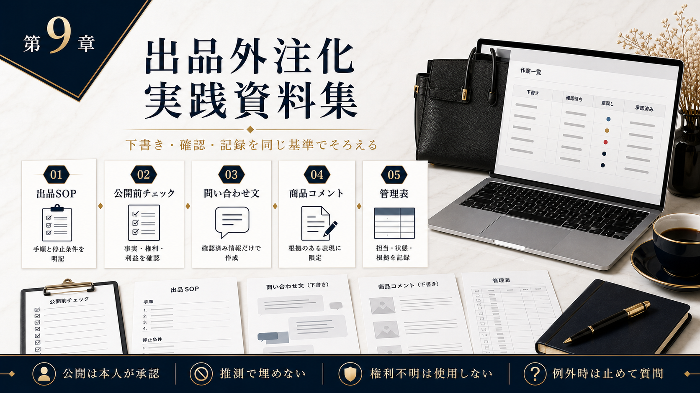

この章は、実際に作業するときに開く資料集です。旧教材のNotionリンク、PDF、Excelへ移動しなくても使えるよう、本文へ必要事項を書き直しています。

ただし、テンプレートは事実確認を省略するための文章ではありません。`［　］`を実際の商品・取引条件へ置き換え、不要な行を削除し、公開・送信前に現在のBUYMA画面と公式ガイドを確認します。

収録資料は次の9点です。

1. 現行化した出品SOP完全版
2. 公開前チェック表
3. 現行化した問い合わせテンプレート30場面
4. 感性ワード集
5. 商品コメント28カテゴリ
6. 現行化した募集文と応募受付
7. 買付・発送・問い合わせの判断フロー
8. 取得済みExcel 6ファイルの項目説明
9. 契約・発注時の確認項目

### 資料1 現行化した出品SOP完全版

#### SOPの先頭に記録する情報

```text
SOP名: BUYMA出品下書き作成
版: ［版番号］
更新日: ［YYYY-MM-DD］
適用範囲: ［対象ブランド／カテゴリ／担当業務］
作成者: ［氏名・担当］
確認者: ［氏名・担当］
公開者: ［氏名・担当］
公式ガイド確認日: ［YYYY-MM-DD］
```

画面名やボタン位置は変更されることがあります。スクリーンショットだけで手順を固定せず、「何を確認して、どの状態にするか」を本文の正本にします。

#### STEP 0 作業指示を確認する

作業を始める前に、管理番号、担当、商品URL、買付先URL、型番、色、サイズ、発送地、関税負担、配送、価格、公開者を確認します。

次のどれかが欠けている場合は、推測で開始しません。

- 商品を一意に特定できる公式情報
- 買付先と販売元の確認
- 使用できる画像またはBUYMAカタログ画像
- 在庫・価格の確認日時
- 発送地、配送、関税負担
- 見込利益の計算
- 公開前確認者

#### STEP 1 商品画像を準備する

1. 自分で撮影した画像、利用許諾を確認した画像、またはBUYMAが提供するカタログ画像だけを使う
2. 1枚目は、商品全体が見える画像にする
3. 2枚目以降は、素材感、開閉部、付属品、型番、傷等、購入判断に必要な箇所を載せる
4. ピント、明るさ、色、向き、切れ、文字の誤りを確認する
5. 実物と色味が異なって見える場合は、商品コメントにも事実を補足する
6. 自分で撮影した画像として申告する場合は、自分で撮影した対象画像だけへ正しくチェックする
7. 第三者から利用許諾を得た画像は「自分で撮影した画像」にチェックせず、許諾の証拠を保存する。BUYMAの専用申告フォームの対象となる場合は、商品IDと証拠を添えて申告する

現在のBUYMAガイドでは、商品画像は最大20枚、1枚5MB以下、JPEG・GIF・PNGが案内されています。GIFアニメーションはアップロードできません。枚数を埋めることを目的にせず、商品と一致し、使用権を確認でき、購入判断に役立つ画像だけを使います。

##### 画像を止める条件

- 権利者や利用条件が分からない
- 別型番、別色、別仕様の商品が混ざっている
- ロゴや著名人画像を許可なく追加している
- 傷、訳あり箇所、付属品等の重要情報が見えない
- 実物より著しく色や形が違って見える

#### STEP 2 商品名を入力する

商品名は、購入者が商品を識別できる事実を優先します。

```text
［根拠がある見出し］ ［ブランド名］ ［商品名・モデル名］ ［型番］ ［商品種別］
```

すべてを無理に詰めず、現在の入力欄に収まる範囲で整えます。出品後に商品名は編集できないため、公開前に型番・綴り・商品一致を確認します。

使ってよい見出しは、事実を確認できるものだけです。

| 見出し | 使う条件 |
|---|---|
| 限定品 | 限定する国、地域、店舗、期間、数量を公式情報で確認した |
| SALE | 現在の実売価格と比較根拠を確認した |
| 即発 | 手元に在庫があり、検品済みで即日発送できる |
| 日本未入荷 | 日本の直営店・正規代理店で取り扱いがない同一商品だと確認した |
| 訳あり | 現物の訳あり箇所を確認し、画像・コメント・指定タグへ正確に表示した |

「最安値」「絶対お得」「売り切れ必須」「大人気」等、担保できない言葉を商品名へ入れません。検索語を増やす目的で、商品と無関係なブランド、色、カテゴリ、人物名を入れません。

#### STEP 3 商品コメントを入力する

商品コメントは、次の順で作ります。

1. 商品の特定: ブランド、商品名、型番、商品種別
2. 仕様: 色、素材、寸法、開閉、収納、付属品等
3. デザイン: 画像と公式説明から確認できる特徴
4. 利用場面: 仕様から自然に説明できる範囲
5. 配送: 買付、検品、発送、到着目安
6. 取引条件: 在庫、関税、追跡、返品・補償等

```text
［ブランド名］の［商品名／型番］です。

［色・素材・形・開閉・収納・付属品等、確認できた仕様］
［仕様に基づくデザインの説明］

商品情報
・型番: ［型番］
・色: ［公式色名／BUYMA色系統］
・素材: ［公式表記］
・サイズ: ［公式寸法・単位］
・付属品: ［実際に付属するもの］

お届けについて
・買付先確認日: ［YYYY-MM-DD HH:MM／時差］
・発送地: ［国内／海外・国地域］
・発送まで: ［商品別の現在の見込］
・発送後のお届け目安: ［配送方法別の現在の見込］
・追跡: ［あり／なし・条件］
・関税等: ［購入者負担／出品者負担・出品設定と一致］

購入前に、色・サイズ・配送条件・返品補償の対象をご確認ください。
```

固定の配送日数、絶対に返品できないという表示、配送中の事故をすべて免責する表示、海外製品なら傷やほつれは不良でないという一律表示は使いません。商品状態とBUYMAの制度に沿って個別に案内します。

#### STEP 4 カテゴリ・ブランド・シーズン・テーマ・タグを選ぶ

- カテゴリは、商品名ではなく実際の商品種別・仕様から最も近いものを選ぶ
- ブランドは、正しい公式表記とBUYMAの候補を照合する
- モデル欄がある場合は、公式型番・モデルと一致するものだけを選ぶ
- シーズンは、公式の発表、商品ページ、ルック等で確認できる場合だけ選ぶ
- タグ・テーマは、現在の選択肢と適用条件に合うものだけを選ぶ
- 訳あり商品は、現在の専用ルールに沿ってタイトル、画像、コメント、タグを一致させる

旧SOPの「サイト上でドレスでも一律ワンピース」「シーズンは毎回口頭確認」等は固定ルールにしません。判断基準と根拠URLを管理表へ残します。

#### 公開後に変更できない項目

現在のBUYMAガイドでは、カテゴリ、ブランド名、商品名、買付地、発送地は、公開後に追加・変更できません。誤りを見つけた場合は、該当商品を出品停止または取り下げし、正しい情報で新しい商品として出品します。色・サイズ、在庫、画像、商品コメント、価格等の変更可能項目と混同しません。

#### STEP 5 色・サイズを入力する

##### 色

- BUYMAの色系統は、商品の実物・公式画像に最も近いものを選ぶ
- 色名には、公式ページの原語色名を記録する
- 日本語補足を入れる場合は、原語色名と混同しない
- 画像と実物の見え方に差がある場合はコメントへ補足する

##### サイズ

- バリエーションあり／なしを商品仕様に合わせる
- 公式サイズ表、実寸、モデル着用情報のどれかを区別する
- 単位、測定箇所、測定方法、個体差を確認する
- 日本サイズへ換算する場合は、ブランド公式情報等の根拠を残す
- サイズ感を「小さめ」「大きめ」と断定する場合は根拠が必要
- 不明な寸法を推測で補わない

#### STEP 6 販売可否・在庫を設定する

BUYMAの現在の区分に合わせて、色・サイズごとに設定します。

| 区分 | 使う条件 |
|---|---|
| 買付可 | 注文後に買付する商品で、公開時点に買付可能と確認した |
| 在庫なし | 現在は買付できない |
| 手元に在庫あり | 出品者側で現物を確保し、注文時に確実に用意できる |

数量を一律`2`にしません。手元在庫は実数、買付可は実際に対応できる数量を入力します。買付できないと判明したら速やかに在庫なしへ変更します。「残り1点」通知を狙って実在庫と異なる数量を入れません。

#### STEP 7 型番・内部メモを入力する

- ブランド型番は、公式商品ページ、タグ、箱、インボイス等で確認する
- 型番が分からない場合は空欄または確認待ちにし、別商品の型番を流用しない
- 内部管理番号とブランド型番を分ける
- 購入者に見える欄へ、原価、担当者名、仕入先の機密情報、顧客情報を書かない
- 管理番号は出品管理表、買付表、証憑、問い合わせ履歴で共通にする

#### STEP 8 配送方法・販売期限・買付地・買付先・発送地を入力する

##### 配送方法

- 実際に使える配送方法だけを選ぶ
- 追跡あり／なしは、購入者が届け先まで確認できるかで判断する
- 配送料、所要日数、補償、配送対象地域を確認する
- 買付先から出品者までの追跡番号を、購入者向け追跡番号として登録しない

##### 販売期限

一律21日後にしません。現在のBUYMAでは、購入期限を1〜90日の範囲で設定し、期限を過ぎると商品は「リクエスト受付中」になります。買付可能期間、在庫変動、シーズン、価格有効期限、休業日、配送状況に合わせて設定し、期限前にも在庫と価格を確認します。

##### 買付地・買付先・発送地

- 実際に買い付ける国・地域、店舗名、URLを入力する
- 禁止買付先に該当しないことを確認する
- 発送地は、商品を購入者へ発送する実際の地点と一致させる
- 国内で検品後に購入者へ送る場合は国内発送として扱う
- 表示した買付先・発送地と異なる経路へ無断で変えない

#### STEP 9 商品価格・参考価格・関税を入力する

商品価格は、価格末尾を機械的に丸める前に、総費用と見込利益を確認します。

```text
見込利益 = 売上見込額 - 見込仕入れ・販売総費用
```

見込仕入れ・販売総費用には、商品代、送料、決済・送金、税・関税、検品、梱包、国内送料、成約手数料等、今回の取引で出品者が負担する費用を一度ずつ入れます。

参考価格・通常出品価格は第7章の条件に従い、根拠URL、価格、通貨、換算、確認日を残します。表示のためだけに架空の価格を入れません。

関税設定は、発送地と負担者に合わせます。

- 海外発送・購入者負担
- 海外発送・出品者負担
- 国内発送・出品者負担

旧管理表の固定税率や一律関税率を使わず、商品分類と現在の公式情報を確認します。

#### STEP 10 出品メモ・買付先メモを入力する

```text
出品メモ
・管理番号: ［ID］
・担当: ［担当］
・確認者: ［確認者］
・根拠確認日: ［YYYY-MM-DD HH:MM］

買付先メモ
・買付先名: ［正式名称］
・商品URL: ［URL］
・販売元: ［運営者・マーケットプレイス出品者］
・在庫確認日時: ［YYYY-MM-DD HH:MM／時差］
・価格有効期限: ［分かる場合］
・返品条件: ［要点］
```

パスワード、カード情報、本人確認書類、顧客の住所・電話番号等を出品メモへ書きません。

#### STEP 11 下書き保存・公開前確認・公開

1. 入力内容を下書き保存する
2. 第9章の公開前チェック表で確認する
3. 重大項目の根拠URLと確認日時を開き直す
4. 見込利益を再計算する
5. 確認者が承認する
6. 権限を持つ公開者が公開する
7. 公開日時、URL、公開者、確認者を管理表へ記録する
8. 公開後の表示を購入者側の画面で確認する

研修中の下書き件数を一律10件、確認期間を一律2週間とは決めません。重大誤りがなく、例外時に止めて質問でき、権限・規約・認証条件を満たしたかで判断します。

### 資料2 公開前チェック表

#### 商品特定

- [ ] 商品URL、ブランド、商品名、型番が同一商品を示している
- [ ] 色、サイズ、素材、仕様、付属品が公式情報と一致する
- [ ] 別商品、別色、別シーズンの情報が混ざっていない
- [ ] カテゴリ、ブランド、モデル、シーズンが正しい
- [ ] カテゴリ、ブランド名、商品名、買付地、発送地の変更不可項目を公開前に確認した

#### 画像・文章

- [ ] 画像の利用権を確認した
- [ ] 1枚目で商品を識別できる
- [ ] 1枚目に商品全体が見える画像を使い、GIFアニメーションを使っていない
- [ ] 第三者の許諾画像を自分で撮影した画像として申告せず、必要な申告と証拠保存を行った
- [ ] 実物と色味・仕様が異なる可能性を必要に応じて補足した
- [ ] 第三者のロゴ、人物、媒体画像、文章を無断利用していない
- [ ] 限定、新作、完売、人気、掲載、愛用、即発等に根拠がある
- [ ] 商品と無関係な検索語を入れていない

#### 在庫・価格

- [ ] 在庫確認元と確認日時がある
- [ ] 買付可、在庫なし、手元在庫を実態どおり設定した
- [ ] 数量を一律2にしていない
- [ ] 割引ゼロの通常条件で見込利益を計算した
- [ ] 送料、税、手数料、委託費等を二重計上していない
- [ ] 参考価格・通常出品価格の根拠と条件を確認した

#### 配送・取引条件

- [ ] 買付地、買付先、発送地が実際の経路と一致する
- [ ] 追跡あり／なしの設定が届け先までの追跡可否と一致する
- [ ] 到着目安を固定の旧日数で書いていない
- [ ] 発送地と関税負担の設定が一致する
- [ ] 返品・交換・補償を一律免責にしていない
- [ ] 禁止買付先、禁止出品、重複出品に該当しない

#### 管理・公開

- [ ] 管理番号、担当、確認者、公開者を記録した
- [ ] 内部メモにパスワード、カード、本人確認書類、不要な顧客情報がない
- [ ] 不明点を推測で埋めていない
- [ ] 公開権限のない担当者が公開していない
- [ ] 公開後の表示、画像順、価格、配送、関税を確認した

### 資料3 現行化した問い合わせテンプレート30場面

#### 送信前の共通ルール

- `［購入者名］`、`［出品者名］`、`［商品名］`等を実データへ置き換える
- 在庫、価格、日時、配送、サイズ、制度を送信直前に確認する
- 確認していない「人気」「残り1点」「必ず間に合う」を加えない
- 注文後の色・サイズ・価格・配送変更は、購入者の明確な同意とBUYMA上の手順なしに進めない
- 外注担当が判断できないものは送信せず、質問として出品者本人へ戻す

#### 1. 受注前・基本返信

```text
［購入者名］様
お問い合わせいただき、ありがとうございます。［出品者名］です。
［質問内容］について確認のうえ、［回答内容］をご案内します。
ほかに確認したい点がございましたら、お知らせください。
```

#### 2. 受注前・在庫あり・ワンサイズ

```text
［購入者名］様
お問い合わせありがとうございます。
［確認先］へ［確認日時・時差］に確認したところ、現在［色名］・ワンサイズは買付可能です。
在庫は変動するため、ご注文前または注文直後に再確認いたします。
```

#### 3. 受注前・在庫あり・サイズ展開

```text
［購入者名］様
お問い合わせありがとうございます。
［確認先］へ［確認日時・時差］に確認し、ご希望の［色名／サイズ］は現在買付可能です。
ご注文時に、色・サイズの選択内容をご確認ください。
```

#### 4. 受注前・希望サイズなし・別サイズ提案

```text
［購入者名］様
お問い合わせありがとうございます。
ご希望の［サイズA］は、［確認日時］時点で買付できませんでした。
同じ商品の［サイズB］は現在確認できています。寸法は［公式寸法］です。
サイズ感には個人差がありますので、公式サイズ表とお手持ちの商品もあわせてご確認ください。
```

#### 5. 受注前・別サイズ・価格変更あり

```text
［購入者名］様
ご希望の［サイズA］は買付できませんでしたが、［サイズB］は［別の買付条件］で確認できました。
仕入条件が異なるため、販売価格は［変更後価格］円となります。
商品、サイズ、価格、配送条件をご確認いただき、ご希望の場合のみ専用の案内をいたします。
```

#### 6. 受注前・希望色なし・別色提案・ワンサイズ

```text
［購入者名］様
ご希望の［色A］は、［確認日時］時点で買付できませんでした。
同じ商品の［色B］は現在確認できています。
商品URL: ［代替商品のURL］
色・型番・仕様をご確認のうえ、ご希望をお知らせください。
```

#### 7. 受注前・希望色なし・同サイズの別色提案

```text
［購入者名］様
ご希望の［色A／サイズ］は買付できませんでしたが、［色B／同サイズ］は［確認日時］時点で確認できています。
商品URL: ［代替商品のURL］
色以外の型番・仕様が同一か確認済みです。ご検討の場合はお知らせください。
```

#### 8. 受注前・別色・価格変更あり・ワンサイズ

```text
［購入者名］様
ご希望の［色A］は買付できませんでしたが、［色B］は［別の買付条件］で確認できました。
商品URL: ［代替商品のURL］
販売価格は［変更後価格］円、配送条件は［条件］です。
内容をご確認いただき、ご希望の場合のみ次の手続きをご案内します。
```

#### 9. 受注前・別色・同サイズ・価格変更あり

```text
［購入者名］様
ご希望の［色A／サイズ］は買付できませんでした。
［色B／同サイズ］は［確認日時］時点で確認でき、販売価格は［変更後価格］円です。
商品URL: ［代替商品のURL］
色、サイズ、型番、価格、配送条件をご確認ください。
```

#### 10. 受注前・在庫なし・再入荷確認中

```text
［購入者名］様
お問い合わせありがとうございます。
［確認日時］時点では在庫切れでした。現在、［買付先］へ再入荷予定を確認しています。
再入荷日はまだ確定していません。回答を確認できた場合に、改めてご連絡してもよろしいでしょうか。
```

#### 11. 受注前・完売・代替なし

```text
［購入者名］様
お問い合わせありがとうございます。
［買付先］へ［確認日時］に確認しましたが、ご希望の商品は現在買付できませんでした。
現時点で同一条件の代替商品も確認できておりません。ご希望に添えず申し訳ございません。
```

#### 12. 再入荷の連絡

```text
［購入者名］様
以前お問い合わせいただいた［商品名／色／サイズ］について、［確認日時］時点で再入荷を確認しました。
商品URL: ［URL］
在庫は変動しますので、ご希望の場合は注文前に再度確認いたします。
```

#### 13. 身長・体重からサイズを聞かれた

```text
［購入者名］様
お問い合わせありがとうございます。
身長・体重だけで、合うサイズを正確に判断することはできません。
公式情報では［サイズ］の寸法は［肩幅／身幅／着丈／ウエスト／ヒップ等］です。
測定方法と単位をご確認のうえ、お手持ちの似た商品との比較をおすすめします。
```

#### 14. ウエスト等の寸法を聞かれた

```text
［購入者名］様
お問い合わせありがとうございます。
公式情報では、［サイズ］の［測定箇所］は［数値・単位］です。
これは［平置き寸法／ヌード寸法／商品実寸］で、測定元は［公式URL］です。
測定方法や個体差もあわせてご確認ください。
```

#### 15. 靴が小さめ・大きめか聞かれた

```text
［購入者名］様
お問い合わせありがとうございます。
着用感には足幅・甲・足形による個人差があるため、こちらからサイズを断定できません。
公式サイズ表では［ブランドサイズ］は［日本参考サイズ］です。公式に幅や作りの案内がある場合は［内容］です。
可能であれば同ブランド商品の試着や、お手持ちの靴との比較もご検討ください。
```

返品補償は、あんしんプラス加入、対象カテゴリ、新品・未使用等の条件があります。「加入すれば必ず返品できる」と書かず、現在の対象条件を案内します。

#### 補足: イメージ・サイズ違いの返品補償案内

```text
［購入者名］様
ご連絡ありがとうございます。
商品に不良はなく、イメージ・サイズ違いによる返品をご希望の場合は、BUYMAの返品補償制度の対象となる可能性があります。
注文時のあんしんプラス加入、発送済み・取引完了前、新品・未使用、付属品が揃っていること、対象カテゴリ等の条件があります。
商品到着後7日以内に、購入リスト詳細から仮申請し、取引画面に表示される最新条件と発送期限をご確認ください。
適用時は現金返金ではなく、あんしんプラス加入料とクーポン利用による割引額を差し引いた合計商品価格相当のBUYMAポイントとなり、関税は対象外です。
https://qa.buyma.com/buy/hosho/5206.html
```

#### 補足: 傷・破損・注文相違等の連絡

```text
［購入者名］様
商品状態についてご連絡いただき、申し訳ございません。
取引完了は行わず、［傷・破損・注文との相違］が分かる全体と該当箇所の画像、外装の状態を取引欄からお知らせください。
イメージ・サイズ違いの返品補償とは別に、初期不良補償または注文相違として確認します。
あんしんプラスの加入状況、取引状態、対象カテゴリ、商品・付属品の状態により手順が異なるため、購入リストの表示と公式ガイドをご確認ください。
https://qa.buyma.com/buy/hosho/5201.html
```

出品者側で初期不良と断定したり、返品補償へ誘導して不良申告を避けたりしません。注文と異なる商品を送った場合は、出品者本人が事実を確認して対応します。

#### 16. お届けまでの日数を聞かれた

```text
［購入者名］様
お問い合わせありがとうございます。
現在の見込みは、買付・検品・発送準備に［日数］、発送後のお届けに［配送方法別日数］です。
発送地は［発送地］、配送方法は［方法］、追跡は［あり／なし］です。
通関、天候、配送会社等により変動するため、確約ではなく現在の目安としてご確認ください。
```

#### 17. 指定日までに間に合うか聞かれた

```text
［購入者名］様
ご希望日は［希望日］と承りました。
［現在地／在庫確認／発送予定］から、現時点の到着見込みは［見込期間］です。
配送遅延の可能性があるため、［希望日］までの到着は確約できません。
この条件でも手配をご希望か、ご確認をお願いいたします。
```

#### 18. 購入者から返信がない

```text
［購入者名］様
先日ご案内した［確認事項］について、その後のご希望を確認するためご連絡しました。
現在の在庫・価格は［確認日時］時点のため、手配前に再確認が必要です。
ご不要の場合は返信不要です。ご希望の場合は［回答してほしい内容］をお知らせください。
```

何度も送信したり、在庫逼迫を装って返信を迫ったりしません。

#### 19. 仕入先等へ確認中

```text
［購入者名］様
お問い合わせありがとうございます。
［確認事項］を［確認先］へ確認しております。
回答見込みは［日時／未定］です。確認でき次第、事実に基づいてご案内します。
お待たせして申し訳ございませんが、今しばらくお待ちください。
```

#### 20. レシート・インボイスの同梱依頼

```text
［購入者名］様
お問い合わせありがとうございます。
レシート／インボイスの［原本／写し］を同梱できるか、買付先の発行条件、個人情報、決済情報、取引上の制約を確認します。
現時点では［同梱可／一部マスキングした写しを案内可／同梱不可／確認中］です。
同梱できない場合は、その理由とBUYMAで利用できる確認制度を正確にご案内します。
```

「買付先漏えい防止」だけを理由に一律拒否せず、証憑の内容、個人情報、契約、BUYMAの案内を確認します。カード番号等が含まれる証憑をそのまま共有しません。

#### 21. 領収書発行の依頼

```text
［購入者名］様
領収書については、お支払方法により手順が異なります。
対象のお取引では、取引完了後に購入リスト詳細から領収書または取引明細書を発行できます。
最新の発行方法と対象期間はこちらをご確認ください。
https://qa.buyma.com/buy/ship-to-arrival/1104.html
```

#### 22. 受注後・支払確定・注文のお礼

```text
［購入者名］様
このたびは［商品名／色／サイズ］をご注文いただき、ありがとうございます。
ご注文内容と支払確定を確認しました。これから［買付／検品／発送準備］を進めます。
現在の発送予定は［予定］、配送方法は［方法］です。状況が変わった場合は、取引欄からご連絡します。
```

#### 23. 受注後・支払確定前

```text
［購入者名］様
ご注文ありがとうございます。現在は［支払確定前の状態］です。
支払確定後に在庫と価格を再確認し、手配を進めます。
確定までに在庫・価格が変わった場合は、手配前に取引欄からご案内します。
```

支払期限や利用制限について、確認していないペナルティを断定しません。

注文完了後は、支払金額や注文数量を変更できません。代替商品の価格が受注時と異なる場合は買付を止め、「買付けできなかった」で元取引をキャンセルし、正しい価格へ修正して再出品します。キャンセル完了後に再出品を案内し、再注文するかは購入者の判断に委ねます。価格差のある商品を、元取引のまま追加請求して手配しません。

#### 24. 受注後・希望サイズなし・別サイズ提案

```text
［購入者名］様
ご注文ありがとうございます。
手配時に確認したところ、ご注文の［サイズA］は買付できませんでした。
同価格・同一商品の［サイズB］は［確認日時］時点で確認でき、寸法は［公式寸法］です。
変更を希望されるか、キャンセルを希望されるか、ご返信をお願いいたします。ご同意前に別サイズは手配しません。
```

価格が異なる場合はこの文を使わず、キャンセル・価格修正・再出品・再注文の手順へ進みます。

#### 25. 受注後・希望色なし・別色提案・ワンサイズ

```text
［購入者名］様
手配時に確認したところ、ご注文の［色A］は買付できませんでした。
同価格・同一商品の［色B］は［確認日時］時点で確認できています。
商品URL: ［代替商品のURL］
変更またはキャンセルのご希望をお知らせください。ご同意前に別色は手配しません。
```

価格が異なる場合はこの文を使わず、キャンセル・価格修正・再出品・再注文の手順へ進みます。

#### 26. 受注後・希望色なし・同サイズの別色提案

```text
［購入者名］様
ご注文の［色A／サイズ］は買付できませんでした。
同価格・同一商品の［色B／同サイズ］は［確認日時］時点で確認でき、配送条件は［同一／変更内容］です。
商品URL: ［代替商品のURL］
商品、色、型番、配送条件をご確認いただき、変更またはキャンセルのご希望をお知らせください。ご同意前に別色は手配しません。
```

#### 補足: 受注後・価格差がある代替商品の案内

```text
［購入者名］様
ご注文の商品は、受注時の価格で買付できないことが分かりました。ご迷惑をおかけし、申し訳ございません。
元のお取引は「買付けできなかった」としてキャンセル手続きを行います。
［変更後価格］円で同一商品または代替商品を用意できる場合は、価格を修正して再出品します。
キャンセル処理の完了後に商品URLをご案内しますので、内容をご確認のうえ、再注文するかをご判断ください。
```

#### 27. 代替提案後にキャンセル希望を受けた

```text
［購入者名］様
ご返信ありがとうございます。キャンセルのご希望を承りました。
ご希望の商品を用意できず、申し訳ございません。
現在の取引状況を確認し、BUYMA上の正しい手順でキャンセル対応を進めます。
```

#### 28. 受注後・在庫なし・代替なし

```text
［購入者名］様
ご注文いただいた［商品名／色／サイズ］を［確認先］へ確認しましたが、買付できませんでした。
ご期待に添えず、申し訳ございません。
代替案を希望されない、または代替を用意できないため、BUYMA上で「買付けできなかった」理由によるキャンセル手続きを進めます。
```

#### 29. 発送期限の延長申請

```text
［購入者名］様
現在、［商品名］は［現在地・作業状況］です。
［具体的な理由］により、現在の発送見込みは［日付］となり、当初の発送期限までに発送できない可能性があります。
BUYMA上から発送期限を［申請日］まで延長する申請をお送りします。
現在の状況と見込みをご確認のうえ、承認・別日指定・拒否をご判断ください。
```

発送期限は注文完了日から18日後が基本です。支払方法ごとの最大延長期間、購入者の回答、特別延長の条件を確認し、期限後や一律1か月で申請しません。

#### 30. 予期しない配送・通関遅延による延長連絡

```text
［購入者名］様
［商品名］は現在［配送会社／通関／検品等の現在地］です。
［確認日時］に［確認先］へ確認したところ、［確認できた遅延理由］により［新しい見込み］との案内でした。
ご心配をおかけし、申し訳ございません。発送期限内の対応が難しい場合は、BUYMA上から必要な期限までの延長申請をお送りします。
新しい情報が確認でき次第、取引欄からご連絡します。
```

旧COVID専用文は使用しません。感染症、災害、ストライキ、通関等を理由にする場合も、今回の取引で実際に確認できた事実だけを書きます。

#### 取引完了後・満足評価への返信

```text
このたびはお取引いただき、ありがとうございました。
商品を気に入っていただけたとのこと、うれしく思います。
また機会がございましたら、よろしくお願いいたします。
```

#### 取引完了後・中立評価への返信

```text
このたびはお取引いただき、ありがとうございました。
今後の改善のため、差し支えなければ気になった点を取引欄からお知らせください。
いただいた内容を確認し、今後の案内と運用を見直します。
```

#### 取引完了後・不満評価への返信

```text
このたびはご不快な思いをおかけし、申し訳ございません。
［注文内容／商品状態／配送／案内履歴］を確認いたします。
差し支えなければ、問題が分かる内容と画像を取引欄からお知らせください。
BUYMAの手順と事実関係を確認し、必要な対応をご案内します。
```

評価変更を迫ったり、責任の有無を確認する前に購入者を責めたりしません。

#### 発送通知の補足文

```text
［購入者名］様
本日、［配送会社・配送方法］で商品を発送しました。
追跡番号: ［購入者のお届け先まで確認できる番号／追跡なし］
現在の到着目安: ［期間］
到着後は、注文内容と商品状態をご確認ください。問題がある場合は、評価や取引完了の前に取引欄からご連絡ください。
```

発送通知は、商品を購入者の届け先へ実際に発送した後に行います。買付先から出品者・国内パートナーへ向けて発送された時点の仮発送通知は行いません。

### 資料4 感性ワード集

原資料には、重複を含めて251候補がありました。以下では、OCRによる文字間の空きを直し、原カテゴリごとの語を残しています。同じ語が複数カテゴリにある場合も、原資料との対応確認のため残しています。

感性ワードは、商品の見た目や公式仕様を短く説明する補助語です。語を並べるだけで「売れる文章」になるわけではありません。商品の画像・形・素材・色・仕様から説明できる語だけを選びます。

#### シンプルなイメージ 60候補

落ち着いた、堅実な、知的な、ノーブルな、素朴な、嫌味のない、エレガントな、奥ゆかしい、おすましした、大人顔の、フォーマルな、気品のある、格好いい、清らかな、クリアな、クールな、気高い、媚びない、ソツない、静かな、シックな、しとやかな、主張し過ぎない、背伸びし過ぎない、シャープな、上品な、澄んだ、スタイリッシュ、スマートな、スラリとした、清潔な、清楚な、繊細な、洗練された、デリケートな、都会的な、凛とした、控えめな、程よい、ナチュラルな、清楚な、無垢な、純真な、シンプルな、理知的な、凛々しい、冷静な、文化的な、ベーシックな、保守的な、真面目な、実用的な、オールマイティな、スタンダードな、ナチュラルな、堅苦しくない、気取りのない、主張しすぎない、タウンユース、オンオフ問わず

#### 控えめ・落ち着いたイメージ 48候補

原資料の見出しは「地味なイメージ」でした。購入者や着用者を否定的に評価しないよう、商品説明では「控えめ・落ち着いた」等の具体的な言い方へ置き換えます。

甘過ぎない、嫌味のない、エレガントな、奥ゆかしい、穏やかな、大人顔の、気品のある、清らかな、切れ味の良い、気高い、小粋な、高尚な、媚びない、ソツない、静かな、シックな、しっとりした、しとやかな、渋い、しなやかな、主張し過ぎない、上品な、シンプルな、崇高な、スマートな、清潔な、清楚な、繊細な、洗練された、知的な、デリケートな、抜かりない、控えめな、フォーマルな、程よい、優雅な、幽玄な、理知的な、奥深い、しおらしい、柔和な、優しい、落ち着いた、堅実な、ノーブルな、堅苦しくない、肩の力を抜いた、気取りのない

#### 可愛いイメージ 51候補

フェミニンな、ロマンティックな、愛らしい、あどけない、甘い、甘口な、甘酸っぱい、初々しい、ウォーム感のある、うっとりする、乙女心に火をつける、女心をくすぐる、女であることを忘れさせない、温和な、家庭的な、可憐な、甘美な、華奢な、クリーミーな、キュートな、純粋な、スイートな、ソフトな、チャーミングな、とろけそうな、滑らかな、はかなげな、プリティな、朗らかな、ほんわかした、マイルドな、メルヘンの、優しい、柔らかな、ラブリーな、奥ゆかしい、いとおしい、いとしい、愛嬌のある、ナチュラルな、清楚な、無垢な、純真な、遊び心のある、ファンシーな、愛くるしい、いじらしい、ポップな、愛着を感じる、心が和む、気さくな・親しみのある

「乙女心」「女心」「女であること」等は、着用者の性別や感じ方を決めつけるため、原資料との対応語としてのみ残し、通常の商品コメントでは使いません。色、柄、形等の具体的な特徴へ置き換えます。

#### 華やかなイメージ 52候補

原資料の見出しは「派手なイメージ」でした。否定的な印象を避け、商品の色・装飾・形を具体的に説明します。

圧倒的な、アクティブな、鮮やかな、あでやかな、意志の強い、ヴィヴィッドな、円熟した、がっしりした、華麗な、究極の、強烈な、際立った、豪華な、極上の、ゴージャスな、個性の強い、凝った、主張のある、衝撃的な、成熟した、贅沢な、存在感のある、大胆な、ダイナミックな、目を惹く、通好みな、デコラティブな、ドラマティックな、濃厚な、迫力のある、他にはない、ひねりの効いた、華やかな、バイタリティのある、パワフルな、ユニークな、無敵の、豊かな、リッチな、アバンギャルドな、遊び心のある、意外性のある、革新的な、カラフルな、個性的な、斬新な、洒落た、新鮮な、進歩的な、前衛的な、先駆者的な、独創的な

「究極」「極上」「他にはない」「無敵」「圧倒的」等は、比較根拠や客観的な保証がない限り使いません。「鮮やかな赤」「大ぶりの装飾」「左右非対称の形」等、確認できる特徴へ置き換えます。

#### BUYMA特化ワード 40候補

| 原資料の候補 | 新版での扱い |
|---|---|
| 新作 | 公式発売日、掲載日、シーズンを確認した同一商品だけ |
| 大統領、ファーストレディ、歌手、スポーツ選手、インスタグラマー、社長、会長、CEO、国内モデル、海外モデル、セレブ、俳優、女優、英国女王 | 本人・公式媒体・権利・商品一致を確認できる場合だけ。無関係な人物名は使わない |
| ゴシップガール、テレビ、映画、PV、雑誌掲載、ランウェイ | 作品・媒体・掲載回・商品一致・画像や名称の利用条件を確認できる場合だけ |
| 高級ホテル、高級住宅街、高級デパート、本店、セレクトショップ、ブティック | その商品・店舗との実際の関係を確認できる場合だけ。雰囲気づくりだけで地名・施設名を使わない |
| デザイナー、創業○○年 | ブランド公式の人物・年数・確認日時を記録できる場合だけ |
| 染、色技法 | 公式の素材・製法説明に同じ技法がある場合だけ |
| 人気 | 現在の具体的な販売・ランキング等の根拠を示せる場合だけ。根拠がなければ使わない |
| 売り切れ必須 | 将来の完売を断定するため使用しない |
| 〇〇さん愛用 | 本人・公式媒体と同一商品の使用を確認し、権利上問題がない場合だけ |
| ラグジュアリー | 素材、仕立て、公式な位置付け等の具体的説明へ置き換える |
| 定番 | ブランドが継続的な定番として案内している場合だけ |
| 限定 | 限定する国、地域、店舗、期間、数量を公式に確認できる場合だけ |
| 希少、レア | 流通量や限定条件等の客観的根拠がある場合だけ |
| 日本未入荷 | 日本の直営店・正規代理店で取り扱いがない同一商品だと確認した場合だけ |

#### 感性ワードの使い方

```text
事実: ［公式に確認した色・素材・形・仕様］
補助語: ［画像と事実から説明できる感性ワードを1〜2語］
文章: ［事実］により、［具体的な印象・利用場面］を伝えます。
```

例:

```text
公式色名はNavy、素材はウール100%、前面は比翼仕立てです。
装飾を抑えたシンプルなデザインで、通勤時のジャケットにも合わせやすい形です。
```

「シンプル」「合わせやすい」を使う場合も、色、装飾、形等の理由を先に書きます。1文へ形容詞を重ね過ぎず、商品の識別に必要な仕様を優先します。

### 資料5 商品コメント28カテゴリ

#### 全カテゴリ共通の基本形

```text
［ブランド名］の［商品名／型番］です。
［公式情報と画像から確認した形・色・素材・意匠］。
［カテゴリ固有の仕様と寸法］。
［仕様から自然に説明できる利用場面］。

・公式色名: ［色名］
・素材: ［素材］
・サイズ: ［寸法・単位・測定方法］
・仕様: ［開閉・収納・セット内容・機能等］
・付属品: ［実際に付属するもの］
```

角括弧の候補を全部つなげません。確認できる語を選び、確認できない欄は調べるか削除します。

#### 1. シャツ

確認: 襟、袖丈、前開き、ボタン、ポケット、裾、柄、透け、素材、着丈、身幅。

```text
［襟・袖・前開き・柄］が特徴の［商品名］です。
［素材］を使用し、［着丈／身幅］は［寸法］です。
［一枚着／羽織り／ジャケットのインナー］等、実際の形に合う着方を説明します。
```

#### 2. ニット・セーター

確認: 素材混率、編み方、厚み、首元、袖、裾、伸縮性の公式説明、透け、寸法、手入れ表示。

```text
［編み方／首元／シルエット］が特徴の［商品名］です。
素材は［素材混率］、［厚み・伸縮性］は公式説明で［内容］と案内されています。
季節を断定する場合は、素材・厚み・ブランドのシーズン説明を根拠にします。
```

#### 3. ワンピース

確認: 総丈、シルエット、袖、襟、ウエスト、開閉、裏地、スリット、透け、伸縮、セット内容。

```text
［シルエット／襟／袖／柄］が特徴の［ワンピース／ドレス］です。
総丈は［寸法］、［開閉・裏地・スリット］は［仕様］です。
普段使い、会食、式典等は、丈・素材・装飾に合う場合だけ候補として記載します。
```

#### 4. カーディガン

確認: 素材、編み、前開き、ボタン、丈、ポケット、襟、袖、厚み、寸法。

```text
［前開き／ボタン／編み地］が特徴の［商品名］です。
素材は［素材］、着丈は［寸法］で、［ポケット・襟・袖］は［仕様］です。
羽織りとして説明する場合も、厚みと形を確認します。
```

#### 5. スカート

確認: 丈、形、ウエスト、開閉、裏地、スリット、ポケット、素材、透け、伸縮。

```text
［Aライン／プリーツ／タイト等］の［商品名］です。
丈は［寸法］、ウエストは［寸法・仕様］、［裏地／スリット／ポケット］は［内容］です。
組み合わせ例は、色・丈・ボリュームから説明できる範囲にします。
```

#### 6. パンツ

確認: シルエット、股上、股下、ウエスト、裾、開閉、ポケット、ベルトループ、素材、伸縮。

```text
［ストレート／ワイド／テーパード等］シルエットの［商品名］です。
股上［寸法］、股下［寸法］、ウエスト［寸法・仕様］で、［開閉・ポケット］は［内容］です。
美脚効果、履き心地、体形補整は、公式根拠なしに断定しません。
```

#### 7. コート

確認: 表地・裏地・中綿、丈、襟、開閉、ポケット、フード、ベルト、重量、撥水・防寒の公式仕様。

```text
［丈／襟／前開き］が特徴の［商品名］です。
表地は［素材］、裏地・中綿は［内容］、着丈は［寸法］です。
防寒性、撥水性、対応温度は、ブランドが仕様を示している場合だけ記載します。
```

#### 8. ジャケット

確認: 種別、表地、裏地、襟、ボタン・ジップ、ベント、ポケット、肩、丈、袖。

```text
［テーラード／レザー／ツイード等］の［商品名］です。
［襟・開閉・ポケット・ベント］は［仕様］で、表地は［素材］、裏地は［素材／なし］です。
ビジネス、フォーマル、普段使い等は、実際の素材と形に合わせて選びます。
```

#### 9. 水着

確認: ワンピース／上下セット、セット内容、裏地、パッド、ワイヤー、ストラップ、透け、素材、UV等の公式性能、サイズ。

```text
［形／色／柄］が特徴の［商品名］です。
セット内容は［内容］、［パッド・ワイヤー・ストラップ・裏地］は［仕様］です。
UV性能、速乾性、透けにくさ等は、公式仕様で確認できたものだけ記載します。
```

#### 10. スニーカー

確認: アッパー、ライニング、ソール、留め方、ヒール・ソール高、重量、サイズ表、付属品。

```text
［アッパー素材／配色／ソール］が特徴の［商品名］です。
留め方は［レース／面ファスナー等］、ソール高は［寸法］です。
履き心地、軽さ、スポーツ性能は、公式仕様や実測なしに断定しません。
```

#### 11. パンプス・バレエシューズ

確認: つま先形状、ヒール高、アッパー、裏地、ソール、ストラップ、幅、サイズ表。

```text
［つま先形状／ヒール／装飾］が特徴の［パンプス／バレエシューズ］です。
ヒール高は［寸法］、アッパーは［素材］、［ストラップ・留め具］は［仕様］です。
歩きやすさやサイズ感は断定せず、公式サイズ表を案内します。
```

#### 12. サンダル

確認: ストラップ、留め具、アッパー、インソール、ソール、ヒール高、サイズ、用途・防水等の公式仕様。

```text
［ストラップ／ソール／配色］が特徴の［商品名］です。
留め具は［仕様］、ヒール・ソール高は［寸法］、素材は［内容］です。
ビーチ用、防水、長時間向け等は公式用途・性能がある場合だけ記載します。
```

#### 13. ブーツ

確認: 丈、筒周り、ヒール、つま先、開閉、アッパー、裏地、ソール、サイズ表。

```text
［ショート／ロング等］丈と［つま先／ヒール］が特徴の［商品名］です。
筒丈［寸法］、筒周り［寸法］、ヒール高［寸法］で、開閉は［仕様］です。
歩きやすさ、防寒性、サイズ感は根拠なしに断定しません。
```

#### 14. レインブーツ

確認: 防水・耐水の公式仕様、素材、継ぎ目、筒丈、筒周り、ソール、開閉、手入れ、サイズ。

```text
［丈／色／ソール］が特徴の［商品名］です。
素材は［素材］、筒丈は［寸法］、ブランドの防水・耐水説明は［公式表記］です。
完全防水、滑りにくい等は、公式の性能・試験情報なしに断定しません。
```

#### 15. カードケース

確認: 素材、寸法、カードポケット数、その他収納、開閉、マチ、窓、付属品。

```text
［素材／配色／ロゴ位置］が特徴の［商品名］です。
寸法は［縦×横×厚さ］、カードポケットは［数］、［その他収納・開閉］は［仕様］です。
収納力や使いやすさは、実際のポケット数と寸法で説明します。
```

#### 16. 財布

確認: 長財布／二つ折り／ミニ、素材、寸法、開閉、札入れ、小銭入れ、カード、その他収納、付属品。

```text
［形／素材／配色］が特徴の［商品名］です。
寸法は［縦×横×厚さ］、カードポケット［数］、札入れ［数］、小銭入れ［仕様］です。
収納力抜群等の抽象表現ではなく、収納数と開閉方法を書きます。
```

#### 17. バッグ

原シートの「バック」は「バッグ」へ修正します。

確認: 種別、素材、寸法、持ち手、ストラップ、開閉、内外ポケット、裏地、底鋲、収納例、重量、付属品。

```text
［形／素材／持ち方］が特徴の［商品名］です。
寸法は［高さ×幅×マチ］、持ち手［寸法］、ストラップ［寸法・着脱可否］です。
開閉は［仕様］、内側［数］・外側［数］のポケットがあります。
通勤・旅行等は、収納寸法と持ち方から説明できる場合だけ記載します。
```

#### 18. ピアス

確認: 片耳／両耳、素材、ポスト、キャッチ、寸法、重量、石・装飾、ニッケル等の公式情報、付属品。

```text
［形／素材／装飾］が特徴の［商品名］です。
［片耳／両耳］用で、寸法は［寸法］、留め具は［仕様］です。
金属アレルギー対応は、素材名だけで判断せず公式案内がある場合だけ記載します。
```

#### 19. イヤリング

確認: 片耳／両耳、クリップ・ネジ等、素材、寸法、重量、石・装飾、クッション、付属品。

```text
［形／素材／装飾］が特徴の［商品名］です。
［片耳／両耳］用で、留め具は［クリップ／ネジ等］、寸法は［寸法］です。
痛くなりにくい等の着用感は個人差があるため断定しません。
```

#### 20. ネックレス

確認: チェーン長、調整幅、トップ寸法、素材、留め具、重量、石、片面・両面、付属品。

```text
［トップ／チェーン／素材］が特徴の［商品名］です。
チェーン長は［寸法］、調整幅［寸法］、トップは［寸法］、留め具は［仕様］です。
着用位置の目安は寸法として説明し、体格による見え方の違いを断定しません。
```

#### 21. ブレスレット

確認: 内周・全長、幅、サイズ展開、素材、留め具、調整、チャーム、重量、付属品。

```text
［チェーン／バングル／素材／装飾］が特徴の［商品名］です。
内周・全長は［寸法］、幅は［寸法］、留め具・調整は［仕様］です。
腕時計との相性等は、色や幅を根拠に提案する場合だけ記載します。
```

#### 22. アクセサリーその他

最初に商品種別を特定し、ピアス用文章等を流用しません。

確認: 商品種別、使用部位、個数、素材、寸法、重量、留め方、対応品、付属品。

```text
［商品種別］として使用する［商品名］です。
素材は［素材］、寸法は［寸法］、数量は［個数］、取付・留め方は［仕様］です。
対応する商品・部位・用途を公式情報どおり記載します。
```

#### 23. 腕時計

確認: ケース、ベルト、ムーブメント、表示、ケース径、厚さ、腕周り、防水、電池・充電、保証、付属品。

```text
［ケース形状／文字盤／ベルト］が特徴の［商品名］です。
ムーブメントは［種類］、ケース径［寸法］、腕周り［寸法・調整］です。
防水性能は［公式表記］、保証は［対象地域・期間・条件］です。
```

防水、保証、正規修理、電池寿命等は必ず公式条件を確認します。

#### 24. サングラス

確認: フレーム、レンズ色、素材、寸法、可視光線透過率、UV性能、偏光、フィット、ケース・クロス。

```text
［フレーム形状／配色］が特徴の［商品名］です。
レンズ幅［寸法］、ブリッジ［寸法］、テンプル［寸法］で、レンズ仕様は［公式表記］です。
UVカット、偏光等は、公式の性能表示を確認できる場合だけ記載します。
```

#### 25. 眼鏡

確認: フレーム、素材、寸法、レンズ有無、デモレンズ、度、レンズ交換、付属品。

```text
［フレーム形状／素材／配色］が特徴の［商品名］です。
レンズ幅［寸法］、ブリッジ［寸法］、テンプル［寸法］です。
付属レンズは［デモレンズ／度なし／度付き等］で、交換の必要性と対応可否は［公式案内］です。
```

すべての眼鏡がデモレンズとは限らないため、旧テンプレートの固定文を使いません。

#### 26. 帽子

確認: 種別、頭周り、深さ、つば、素材、裏地、調整、折り畳み、手入れ。

```text
［ハット／キャップ／ニット帽等］の［商品名］です。
頭周り［寸法］、深さ［寸法］、つば［寸法］で、［調整機能］は［仕様］です。
コーディネート例は、形・色・素材に合うものだけを記載します。
```

#### 27. スカーフ・ストール

確認: 寸法、素材、柄、縁、形、リバーシブル、手入れ、付属品。

```text
［色／柄／縁の仕様］が特徴の［スカーフ／ストール］です。
寸法は［縦×横］、素材は［素材］、形は［正方形／長方形等］です。
巻き方や用途は、寸法と素材で可能な範囲だけ提案します。
```

#### 28. マフラー

確認: 寸法、素材混率、編み、厚み、フリンジ、リバーシブル、手入れ、付属品。

```text
［編み／配色／フリンジ］が特徴の［商品名］です。
寸法は［縦×横］、素材は［素材混率］、［フリンジ・リバーシブル］は［仕様］です。
暖かさ、肌触り、上質さは、素材名だけで保証せず公式説明がある場合に限ります。
```

### 資料6 現行化した募集文と応募受付

この資料は、第8章の募集基準を実際に送受信するための短縮版です。クラウドワークス掲載用ではありません。対象業務を掲載できると現在の規約で確認した募集経路、または適切に設計した直接募集でのみ使います。

#### 募集文

```text
タイトル
EC商品情報の整理・公開前下書き作成［期間／件数］

募集を行う者
氏名・名称: ［氏名または事業者名］
住所・所在地: ［原則としてビル名・階数・部屋番号まで記載。仲介事業者の照会方式を使う場合は、公式案内の例外要件と照会先を確認］
連絡先: ［応募者が照会できる連絡先］
業務に従事する場所: ［在宅／指定場所等］

お願いする業務
・指定した公式商品ページから、商品名、型番、色、サイズ、素材、付属品を整理
・指定管理表への入力
・使用権を確認した提供素材による画像候補の整理
・公開前下書きと質問一覧の作成

含まれない業務
・BUYMAアカウントの新規作成、貸与、認証情報共有（本教材の初期業務では扱わない）
・承認前の公開、問い合わせ返信、代理購入、受取、送金
・第三者画像・文章の無断利用
・確認できない内容の推測入力

納品物
［管理表／公開前下書き／質問一覧］

件数・期間
［開始日］から［終了日］まで、［件数］件

報酬・支払
報酬: ［金額または算定方法］
検査完了期日: ［日付／条件］
支払期日: ［日付］
支払方法: ［方法］
追加作業は、内容・納期・追加報酬を合意してから依頼します。

必要な経験・条件
・［表計算／文章入力／画像整理等、実際に必要な能力］
・指定した情報源と手順を確認できる
・不明点を推測せず、質問として止められる
・機密情報と個人情報を適切に扱える

選考
応募内容、関連経験、提出可能な既存実績、面談をもとに判断します。
実作業を依頼する場合は、募集経路の規約確認と、業務・納品・報酬・利用権・削除条件の合意を先に行います。
```

#### 応募受付フォーム

```text
1. 契約に必要な氏名またはサービス上の表示名
2. 関連する実務経験
3. 使用できる表計算・文章入力・画像整理ツール
4. 対応可能な期間、曜日、時間帯
5. 提出可能な既存実績の有無
6. 指定資料に不明点や矛盾があった場合の対応
7. 他者へ再委託する可能性の有無
8. 過去のBUYMA利用・運営補助経験と利用制限歴
9. 業務内容・取引条件に関する質問
```

年齢、性別、婚姻、子どもの有無、家族構成、趣味、詳細住所、容姿等を採用判断のために聞きません。支払・本人確認に必要な情報は、採用後に必要な範囲と安全な方法を決めて取得します。

#### 応募受領

```text
ご応募ありがとうございます。
［確認予定日］までに、募集条件とご回答内容を確認します。
追加確認が必要な場合は、募集経路で許可された方法からご連絡します。
選考中に、パスワード、カード情報、本人確認書類を送らないでください。
```

#### 面談案内

```text
ご応募内容を確認し、業務説明と条件確認の面談をお願いしたくご連絡しました。
候補日時: ［日時・タイムゾーン］
方法: ［募集経路で許可された方法］
確認内容: 業務範囲、納品物、納期、報酬、連絡、情報管理、質問
面談前の実作業やBUYMAアカウント作成はありません。
```

#### 採用・条件確認

```text
選考の結果、［業務名］をお願いしたくご連絡しました。
発注前に、業務内容、納品日、納品場所、検査完了期日、報酬、支払期日、情報管理、権限、終了時削除を文書で確認します。
双方の合意と必要な手続きが完了するまで、実作業とアカウント操作は開始しません。
```

#### 不採用連絡

```text
このたびはご応募いただき、ありがとうございました。
募集条件と応募内容を確認した結果、今回は契約を見送らせていただきます。
選考のためにお預かりした情報は、募集時に示した取扱いと保存期間に従って管理・削除します。
```

### 資料7 買付・発送・問い合わせの判断フロー

この資料の買付、受取、発送、問い合わせ等を、クラウドワークス経由の担当者へ割り当てません。同サービスでは、EC運営代行、代理購入・受取等の依頼自体が禁止対象です。契約後に業務を追加する場合も、名称ではなく実際の作業内容を利用サービスの最新規約へ再照合します。

#### A. 買付判断フロー

```text
注文・依頼内容を確認
  ↓
商品、型番、色、サイズ、数量は一致しているか
  ├─ いいえ → 買付停止。購入者または出品者本人へ確認
  └─ はい
       ↓
現在の在庫、販売元、価格、配送、返品条件を確認できたか
  ├─ いいえ → 買付停止。確認元と日時を記録して再確認
  └─ はい
       ↓
禁止買付先でなく、証憑を取得でき、検品経路があるか
  ├─ いいえ → 買付停止。別経路を無断で使わない
  └─ はい
       ↓
通常条件で見込利益が残り、承認済みの予算内か
  ├─ いいえ → 買付停止。価格変更・キャンセル等を出品者本人が判断
  └─ はい
       ↓
承認者、支払方法、配送先、個人情報の送信範囲を確認
  ├─ 不明 → 買付停止
  └─ 確認済み → 買付し、注文番号・証憑・実績原価を記録
```

#### B. 受取・検品・発送フロー

```text
商品を受領
  ↓
注文情報と、商品・型番・色・サイズ・数量・付属品が一致するか
  ├─ いいえ → 発送停止。写真と事実を記録し、出品者本人へ報告
  └─ はい
       ↓
傷、汚れ、破損、動作、縫製、訳あり表示との不一致がないか
  ├─ 問題あり → 発送停止。買付先・購入者・BUYMAの手順を確認
  └─ 問題なし
       ↓
購入者住所、配送方法、追跡、梱包、発送期限を確認
  ├─ 不明・期限超過見込み → 発送停止。連絡・延長申請を先に行う
  └─ 確認済み
       ↓
購入者の届け先へ実際に発送
  ↓
届け先まで確認できる追跡番号と発送日時を記録
  ↓
発送通知を行う
```

買付先から出品者・国内パートナーへ発送された時点では、購入者向け発送通知を行いません。

#### C. 問い合わせ判断フロー

```text
問い合わせを受信
  ↓
何を聞かれているか分類
  ├─ 商品事実 → 公式商品情報・現物・買付先へ確認
  ├─ 在庫・価格 → 販売元と確認日時を記録
  ├─ サイズ → 公式寸法と個人差を案内。断定しない
  ├─ 配送 → 現在地、方法、見込み、変動要因を確認
  ├─ 返品・補償 → 現在のBUYMA制度と対象条件を確認
  ├─ 注文後の変更 → 購入者同意とBUYMA上の手順を確認
  ├─ 不具合・苦情 → 発送・完了を急がず、証拠と事実を保存
  └─ 法令・規約・権限不明 → 送信停止。出品者本人・BUYMA・専門家へ確認
       ↓
テンプレートの全変数を実データへ置換
  ↓
未確認の人気、在庫逼迫、到着確約、免責、人物名がないか確認
  ├─ ある → 削除または根拠確認
  └─ ない → 権限を持つ担当者が送信し、履歴を保存
```

### 資料8 取得済みExcel 6ファイルの項目説明

元教材から取得したExcelは6ファイル、合計39シートです。原ファイルには古い数式、固定報酬、未確認データ、個人情報欄、サンプル値があるため、そのまま購入者へ配布しません。5つの管理ファイルは購入者版へ作り直し、商品コメント28カテゴリは本文内の編集用テンプレートへ移しました。

#### 5管理ファイル共通の情報管理列

注文番号、追跡番号、証憑URL、氏名、住所、電話番号等を扱う表には、次の管理項目を追加します。

```text
情報区分, 証憑保管区分, 閲覧権限, マスキング確認,
保存開始日, 保存期限, 削除確認日, 最終権限確認日, 情報管理確認者
```

証憑URLを知っているだけで閲覧できる共有設定にしません。カード番号、セキュリティコード、パスワード、認証コード、復旧コード、本人確認書類は共有管理表へ保存しません。業務に不要な氏名・住所・電話・決済情報はマスキングし、担当変更・退任時はアクセス停止とローカルコピーの削除を確認します。

#### 1. 国内買付管理表 `domestic.xlsx`

原ファイル: `国内買付管理表`、`経費立替`、`報酬価格`の3シート。

##### 新しい国内買付管理表の列

```text
管理番号, 状態, 担当, 依頼日, 買付方法, ブランド, 商品名, 商品URL,
型番, 色, サイズ, 数量, 在庫確認日時, 店舗名, 店舗住所, 店舗連絡先,
買付日, 受取日, 検品日, 検品結果, 発送日, 購入者向け追跡番号,
商品代, 店舗送料, 交通費, 梱包費, 国内送料, その他費用,
前払金, 経費合計, 差額, 契約報酬, 精算額, 証憑URL,
入力者, 確認者, 支払日, 備考,
情報区分, 証憑保管区分, 閲覧権限, マスキング確認,
保存開始日, 保存期限, 削除確認日, 最終権限確認日, 情報管理確認者
```

原ファイルの郵便番号、住所、氏名、電話番号は、全担当者が見られる一覧へ置きません。配送を担当する人へ、注文単位・必要期間だけ共有します。

`報酬価格`の実店舗3,000円、オンライン1,500円、転送500円は旧サンプルです。現在の契約値を発注単位で記録し、空欄で`#N/A`になるVLOOKUPを使いません。

#### 2. 海外買付管理表 `overseas.xlsx`

原ファイル: `海外買付管理表`、`経費立替`、`報酬価格`の3シート。国内版とほぼ同じ構造ですが、外貨・国際配送・通関・時差を分けて管理します。

##### 新しい海外買付管理表の列

```text
管理番号, 状態, 担当, 国・地域, タイムゾーン, 依頼日, 買付方法,
ブランド, 商品名, 商品URL, 販売元, 型番, 色, サイズ, 数量,
在庫確認日時, 現地価格, 通貨, 送金額(JPY実績), 送金手数料(JPY),
換算レート, 換算日, 注文日, 注文番号, 店舗発送日, 担当受取日,
検品日, 検品結果, 購入者向け発送日, 国際配送会社, 購入者向け追跡番号,
国際送料(JPY), 税・関税(JPY), 梱包費(JPY), その他費用(JPY),
前払金(JPY), 実績経費合計(JPY), 差額(JPY), 契約報酬(JPY),
精算通貨, 精算額(JPY), 精算日, 外国提供確認, 証憑URL, 入力者, 確認者, 備考,
情報区分, 証憑保管区分, 閲覧権限, マスキング確認,
保存開始日, 保存期限, 削除確認日, 最終権限確認日, 情報管理確認者
```

現地通貨額と円換算額を混ぜません。換算レート、換算日、送金手数料、`送金額(JPY実績)`を残し、同じ費用を再計上しません。報酬は旧固定額を使わず、契約値・通貨・支払日を記録します。

#### 3. 直営店連携候補・確認表 `direct.xlsx`

原ファイル: `電話先一覧`、`管理表`の2シート。

電話先一覧には、ブランド名、旧URL、国等の候補が多数ありますが、現在の営業、公式性、番号、担当部署を全件確認できていません。未確認のまま電話先リストとして配布しません。

##### 新しい直営店候補表の列

```text
候補ID, ブランド, 国・地域, 公式店舗名, 公式店舗URL, 公式連絡先,
公式性の根拠URL, 営業確認日, 対応言語, 問い合わせ方法,
出品者・正式パートナーへの配送可否, 購入者へ直送しない確認,
検品経路, VAT取扱い, 支払方法, 配送方法, 送料, 追跡,
他店取寄せ, インボイス, 返品条件, 担当者, 回答日時, 回答原文,
有効期限, 再確認日, 確認者, 最終判断, 備考,
情報区分, 証憑保管区分, 閲覧権限, マスキング確認,
保存開始日, 保存期限, 削除確認日, 最終権限確認日, 情報管理確認者
```

旧列のXendpay・TransferWise表記、WhatsApp固定、VAT自動控除、直送可の丸印だけでは判断しません。第4章の7確認項目と検品経路をセットで記録します。

#### 4. VIP交渉管理表 `vip.xlsx`

原ファイル: `管理表`1シート。旧サンプル行には、閉鎖済みサイト、架空形式のコード、20%の値が含まれるため、行全体を配布版から削除します。

##### 新しいVIP交渉管理表の列

```text
候補ID, ショップ名, 公式URL, 運営者, 販売元確認日, 対象ブランド,
VIP制度の有無, 問い合わせ方法, 交渉日, 送信内容, 回答日, 回答原文, 担当者,
適用条件, 対象商品, 除外商品, 最低購入額, 割引率・条件,
コード, コード保管区分, 有効期限, 利用回数, VAT, 送料, 税・関税,
返品条件, 証憑, 見込利益確認, 結果, 最終判断, 次回確認日, 確認者, 備考,
情報区分, 証憑保管区分, 閲覧権限, マスキング確認,
保存開始日, 保存期限, 削除確認日, 最終権限確認日, 情報管理確認者
```

制限付きコードを公開共有せず、パスワード、カード、本人確認書類を保存しません。割引率だけでなく、対象、除外、期限、送料、税、返品、通常条件での利益を一緒に確認します。

#### 5. 出品管理表 `recruit.xlsx`

原ファイル: `出品管理表`、`関税率`の2シート。採用する列と削除する旧式は第8章資料に記載したとおりです。

##### 新しい出品管理表の列

```text
管理番号, 状態, 担当, 作成日, 確認者, 公開者, 公開日,
ブランド, 商品名, 型番, 色, サイズ, 素材, 付属品,
公式商品URL, 買付先URL, 販売元, 在庫確認日時, 画像利用根拠,
商品代, 通貨, 円請求額, 円請求額の含有済み費用, 換算レート, 換算日,
送料, 決済・送金, 税・関税, 検品, 梱包, 国内送料, 委託費, その他費用,
商品価格, 配送料, 成約手数料等, 売上見込額, 見込総費用, 見込利益, 見込判定,
実績売上額, 実績総費用, 実績利益, 発送地, 関税負担,
到着目安, 質問, 修正内容, 停止理由, 最終確認日,
情報区分, 証憑保管区分, 閲覧権限, マスキング確認,
保存開始日, 保存期限, 削除確認日, 最終権限確認日, 情報管理確認者
```

固定`/0.9244`、輸入消費税8%、課税価格一律60%、革靴30%または4,300円、その他10%、非課税0%の旧式は使いません。現在の手数料、商品分類、発送地、負担者、公式確認日、根拠URLを入力します。

#### 6. 商品コメント集（原 `comments.xlsx`／新版は本文収録）

原ファイル: 28カテゴリ・28シート。新版では別添`comments.xlsx`を配布せず、28カテゴリを第9章資料5の編集用テンプレートとして本文内へ収録します。

##### 本文収録テンプレートの共通項目

```text
カテゴリ, ブランド, 商品名, 型番, 公式URL, 公式色名, 素材,
カテゴリ固有仕様, 寸法, 単位, 測定方法, 付属品,
使用できる感性ワード, 根拠必須語, 根拠URL, 確認日,
商品コメント下書き, 確認者, 修正内容, 公開可否
```

原文の「大人気・新作・著名人着用・雑誌掲載」を共通の選択肢として自動挿入しません。「活躍間違いなし」「収納力抜群」「履き心地抜群」「最適」「上質」等も、商品仕様から確認できる内容へ置き換えます。

### 資料9 契約・発注時の確認項目

この資料は契約書そのものではありません。1件の発注条件を、口頭だけで終わらせないための確認フォームです。

#### 発注条件明示フォーム

```text
発注者: ［名称］
受注者: ［名称］
発注日: ［YYYY-MM-DD］

業務内容:
［対象商品、作業、数量、使用資料、禁止事項、判断を止める条件］

納品物:
［管理表、下書き、画像候補、質問一覧等］

納品・役務提供期日:
［YYYY-MM-DD／時間・タイムゾーン］

納品・役務提供場所:
［指定システム、共有先、作業場所等］

検査を行う場合の検査内容・完了期日:
［完成条件／YYYY-MM-DD］

報酬:
［金額、通貨、算定方法、対象作業］

支払期日・支払方法:
［YYYY-MM-DD／方法。同法第4条の支払期日義務が適用される場合は、給付の受領日または役務提供日から60日以内のできる限り短い期間］

費用負担:
［ツール、通信、交通、立替、送金手数料、税等］

追加・変更・やり直し:
［事前合意、追加報酬、受注者に責任がない変更の扱い］

知的財産:
［提供素材、成果物、利用範囲、第三者素材の禁止］

個人情報・機密情報:
［利用目的、閲覧者、保存先、安全管理、再委託、事故報告、削除］

アカウント・権限:
［利用者、対象、開始日、停止日、禁止操作、認証情報の管理］

再委託:
［可否、事前承認、再委託先の管理］

事故・遅延時:
［即時報告先、初動、証拠保存、購入者・BUYMAへの連絡判断］

契約終了時:
［予告、引継ぎ、未精算、アクセス停止、返却、データ削除、確認記録］

相談・ハラスメント窓口:
［連絡先・対応者］

双方確認:
発注者 ［確認日・方法］
受注者 ［確認日・方法］
```

#### 発注前の法令確認

- [ ] 発注者側の従業員・役員、受注者側の法人形態・代表者以外の役員・従業員、取引形態、委託期間から、フリーランス法の適用と義務を確認した
- [ ] 発注時に、法定の取引条件を直ちに書面または電磁的方法で明示した
- [ ] 電磁的方法で明示し、受注者から書面を求められた場合の交付手順がある
- [ ] 同法第4条の支払期日義務が適用される場合、給付の受領日または役務提供日から60日以内のできる限り短い期間へ設定した
- [ ] 特定業務委託事業者に該当し1か月以上委託する場合は、受領拒否、報酬減額、返品、買いたたき、購入・利用強制、不当な利益提供要請、不当な変更・やり直しを行わない
- [ ] 特定業務委託事業者に該当する場合は、6か月未満でも育児・介護等との両立への必要な配慮に努める
- [ ] 特定業務委託事業者に該当し6か月以上委託する場合は、育児・介護等との両立配慮、中途解除・不更新の30日前予告、請求された場合の理由開示を確認した
- [ ] 同一当事者・一定程度同一の業務を1か月未満の空白で更新する場合、空白を含めて期間を通算した
- [ ] 特定業務委託事業者に該当する場合は、ハラスメント相談への体制と、不利益な取扱いをしないことを確認した

#### 発注変更記録

```text
変更日: ［YYYY-MM-DD］
対象発注: ［ID］
変更前: ［内容］
変更後: ［内容］
納期への影響: ［内容］
報酬・費用への影響: ［内容］
発注者同意: ［日時・方法］
受注者同意: ［日時・方法］
```

#### 納品・検査・支払記録

```text
発注ID: ［ID］
納品日時: ［日時］
受領日時: ［日時］
検査結果: ［合格／修正依頼／一部受領］
修正理由: ［業務仕様との不一致］
検査完了日: ［日付］
報酬額: ［金額・通貨］
支払期日: ［日付］
支払日: ［日付］
証憑: ［URL／ID］
```

契約期間、取引形態、発注者側の従業員・役員、受注者側の法人形態・代表者以外の役員・従業員、扱う個人情報、知的財産、アカウント権限等によって必要条項は変わります。配布用の契約書を作る場合は、業務実態を確定して専門家の確認を受けます。

### 第9章チェックリスト

- [ ] 旧Notionリンク、PDF、Excelを開かなくても本文で作業できる
- [ ] 出品SOPの全入力領域を、現在のBUYMA画面で確認した
- [ ] 数量2、21日後、価格末尾、10品、2週間等を固定していない
- [ ] 問い合わせ30場面の変数を実データへ置換した
- [ ] COVID専用文、固定配送日数、根拠のない人気表現を使っていない
- [ ] 感性ワード251候補のうち、商品から説明できる語だけを使った
- [ ] 商品コメント28カテゴリで、カテゴリ固有仕様を確認した
- [ ] クラウドワークスで、BUYMA・EC運営代行、代理購入・受取等を募集・契約・追加割当していない
- [ ] 買付・発送・問い合わせの停止条件を担当者へ共有した
- [ ] 旧Excelの固定報酬、旧税率、旧手数料、未確認先、サンプル行を使っていない
- [ ] 証憑と個人情報の閲覧権限、マスキング、保存期限、削除確認を記録した
- [ ] フリーランス法の適用、支払期限、委託期間別の義務を確認した
- [ ] 発注条件、変更、納品、検査、支払を文書で記録した

### 第9章の公式確認先

確認日: **2026-07-15**

- [BUYMA 出品作業時のポイント](https://qa.buyma.com/shopper/sell/4101.html)
- [BUYMA 商品詳細の内容について](https://qa.buyma.com/shopper/sell/4106.html)
- [BUYMA 出品商品に注目してもらうには](https://qa.buyma.com/shopper/sell/4110.html)
- [BUYMA 自分で撮影した画像にチェックをつける機能](https://qa.buyma.com/shopper/sell/19145.html)
- [BUYMA 出品画像による権利侵害の禁止](https://qa.buyma.com/shopper/prohibited-item/15733.html)
- [BUYMA 出品後に出品情報を変更したい](https://qa.buyma.com/shopper/sell/4107.html)
- [BUYMA 販売可否／在庫の設定](https://qa.buyma.com/shopper/sell/11325.html)
- [BUYMA カタログから出品する機能](https://qa.buyma.com/shopper/sell/15284.html)
- [BUYMA 参考価格](https://qa.buyma.com/shopper/sell/4105.html)
- [BUYMA 出品価格の設定](https://qa.buyma.com/shopper/4104.html)
- [BUYMA 海外発送と国内発送の注意点](https://qa.buyma.com/shopper/sell/9408.html)
- [BUYMA 検品・梱包・発送](https://qa.buyma.com/shopper/order-to-delivery/4201.html)
- [BUYMA 国内で一度商品を受け取る場合の発送通知](https://qa.buyma.com/shopper/order-to-delivery/4204.html)
- [BUYMA 発送通知を行う](https://qa.buyma.com/shopper/order-to-delivery/9413.html)
- [BUYMA 受注時の価格で買付ができない](https://qa.buyma.com/shopper/order-to-delivery/11757.html)
- [BUYMA 注文後に一部返金や金額の変更をしたい](https://qa.buyma.com/shopper/order-to-delivery/4301.html)
- [BUYMA 発送期限の延長申請](https://qa.buyma.com/buy/order-to-ship/3304.html)
- [BUYMA 発送まで長く時間がかかる場合の特別延長](https://qa.buyma.com/shopper/order-to-delivery/1105.html)
- [BUYMA 領収書を発行してほしい](https://qa.buyma.com/buy/ship-to-arrival/1104.html)
- [BUYMA 商品のイメージ・サイズ違いによる返品補償](https://qa.buyma.com/buy/hosho/5206.html)
- [BUYMA 商品の初期不良の補償](https://qa.buyma.com/buy/hosho/5201.html)
- [BUYMA 出品者登録に関するよくある質問](https://qa.buyma.com/shopper/reg/13732.html)
- [BUYMAの副業・高額コンサル・スクール勧誘に関する注意](https://qa.buyma.com/shopper/tips/30118.html)
- [クラウドワークス 仕事依頼ガイドライン](https://crowdworks.jp/pages/guidelines/job_offer.htm)
- [公正取引委員会 フリーランス法特設サイト](https://www.jftc.go.jp/freelancelaw_2025/index.html)
- [個人情報保護委員会 個人情報保護法ガイドライン（通則編）](https://www.ppc.go.jp/personalinfo/legal/guidelines_tsusoku/)

<!--
第9章 出典対応:
- 資料1〜2: CHILD-04、PDF-SOP-01〜29を、画面依存・固定数値・無許諾画像・誇張表示なしの出品SOPと公開前チェックへ再構成
- 資料3: PDF-INQ-01〜19の30場面、評価返信、キャンセル、発送通知を現行化。COVID専用文は一般の事実確認型へ置換
- 資料4: CHILD-08の感性ワード251候補を、表記補正・原カテゴリ維持・根拠要否付きで全文収録
- 資料5: CHILD-01、SHEET-COM-01〜28の全28カテゴリを、カテゴリ固有仕様から作るテンプレートへ現行化
- 資料6: ROOT-09、PDF-REC-01〜05の募集・応募・面談・採否文を、第8章の規約・法令条件に合わせて実務化
- 資料7: ROOT-02、03、04、05、09、PDF-SOP-09、17、21〜23、27〜29、PDF-INQ全体の停止・確認条件を3フローへ統合
- 資料8: SHEET-DOM-01〜03、OVS-01〜03、DIR-01〜02、VIP-01、REC-01〜02、COM-01〜28の6ファイル39シートを列仕様へ現行化
- 資料9: ROOT-09とPDF-REC-03〜05の発注・契約事項を、取引条件明示、変更、検査、支払記録へ現行化
- ROOT-10は子ページ・PDF・xlsxへの入口だけだったため、全子素材を上記9資料へ実体化

不採用:
- 未取得・旧Notion URLへ読者を飛ばす構成
- 旧PDF・旧Excelの購入者へのそのまま配布
- 出品画面の古いスクリーンショットを現行画面として掲載
- 第三者の商品画像・人物画像・文章の無断取得、無断加工、無断転載
- 商品画像は多いほど良いという断定
- 商品名へ無関係な検索語や根拠のない煽り語を詰める方法
- 数量を一律2にして「残り1点」通知を狙う方法
- 販売期限を一律21日後にする方法
- 価格末尾の固定丸めを利益確認より優先する方法
- 固定7〜14日、最短4日等の配送回答
- COVID専用の延長文と一律1か月延長
- 受注後の色・サイズ・価格を購入者同意なしに変えること
- 満足保証、返品不可、配送事故免責、海外品質なら不良でないという一律表示
- 感性ワードを並べるだけの商品コメント
- 大人気、新作、著名人愛用、雑誌掲載、限定、希少、日本未入荷等の根拠なし使用
- 女性物・男性物等の属性だけで文章を分けること
- 国内・海外買付の旧固定報酬
- 旧出品管理表の`/0.9244`、8%輸入消費税、一律60%課税価格・関税率
- 未確認の直営店電話先、閉鎖済みVIPサンプル行、架空形式のコード
- 旧契約書のそのまま配布
- 既存の第9章画像は採用・教育内容で新版資料集と一致しないため不採用
-->

---

<!-- NEXT: 第10章 フル外注化と運営設計 -->

## 第10章 フル外注化と運営設計

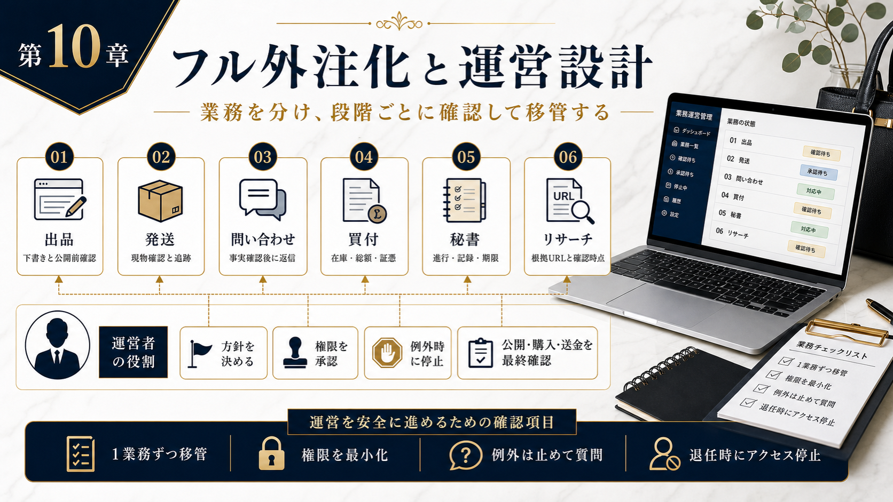

フル外注化は、すべての責任を他人へ渡すことではありません。繰り返し作業を役割ごとに分け、正常・異常・停止・承認の基準を共有し、出品者本人は運営、判断、監督、改善へ時間を使える状態を作ることです。

外注化だけで売上や自由時間が保証されるわけではありません。教育、確認、支払、個人情報、アカウント、取引先、事故対応を管理できないまま範囲を広げると、手戻りとリスクが増えます。

### 10-1 外注化の目的

旧教材では、外注化の目的を「売上を安定させる」「作業時間を減らす」としていました。新版では、結果を保証せず、次の運営状態を目的にします。

1. 出品者本人しか分からない作業を減らす
2. 正常時の定型作業を再現できるようにする
3. 異常時に作業を止め、必要な人へ上げられるようにする
4. 担当者が休止・退任しても引き継げるようにする
5. 出品者本人が、規約、資金、権限、重大判断を管理する
6. 作業量ではなく、正確性、利益、顧客対応、継続性を改善する

外注化する前に、現在の作業時間、件数、手戻り、重大ミス、問い合わせ、利益を記録します。外注後も同じ指標で比較し、作業が増えただけになっていないか確認します。

### 10-2 自分の作業を言語化する

「在庫を探す」「問い合わせへ返信する」だけでは、担当者は同じ判断を再現できません。次の項目で1業務を記録します。

#### 業務言語化シート

```text
業務名: ［名称］
目的: ［何を正しい状態にするか］
開始条件: ［注文、依頼、在庫確認等のきっかけ］
入力: ［URL、型番、注文情報、使用許可済み画像等］
手順: ［順番］
完成物: ［管理表、下書き、発送、返信等］
正常条件: ［何を満たせば完了か］
異常条件: ［不一致、欠品、価格変更、遅延、権利不明等］
停止条件: ［担当者が先へ進んではいけない状態］
承認者: ［誰が判断するか］
証拠: ［URL、画像、証憑、確認日時、履歴］
期限: ［業務別の期限］
権限: ［閲覧、編集、公開、購入、送金等］
個人情報: ［扱う項目と共有範囲］
復旧: ［担当不在・ツール停止時の代替手順］
改善記録: ［質問、ミス、修正理由、更新日］
```

まず出品者本人が一度実行し、画面操作だけでなく判断理由を記録します。言語化できない判断を、担当者の経験や「いい感じ」に依存させません。

### 10-3 マイルール・停止条件・確認方法

原教材の「最初の仕入先になければ次、最後になければ諦める」という考え方は、業務を止める線を決める点で有効です。ただし、すべての商品へ同じ仕入先順を固定しません。

#### マイルールの作り方

```text
対象: ［ブランド／カテゴリ／発送地／取引種別］
最初に確認する情報: ［公式情報・在庫・価格・販売元等］
次の候補へ進む条件: ［在庫なし／条件不一致等］
進んではいけない候補: ［禁止買付先／販売元不明等］
終了条件: ［何件・何分・何時まで／利益条件／期限］
承認が必要な変更: ［価格、発送地、関税、色、サイズ、買付先等］
記録する証拠: ［URL、確認日時、回答、証憑］
```

#### 全業務共通の停止条件

- 商品、型番、色、サイズ、数量が一致しない
- 画像・文章の利用権が分からない
- 販売元、在庫、価格、返品、配送を確認できない
- 禁止買付先や禁止出品の可能性がある
- 発送地、関税、配送条件が出品情報と変わる
- 見込利益が承認条件を下回る
- 顧客への回答に必要な事実を確認できない
- 注文後に色、サイズ、価格、配送を変える必要がある
- 不良、誤配送、紛失、漏えい、アカウント異常が疑われる
- 担当者の権限を超える公開、購入、送金が必要

停止した件数を「仕事が遅い」と評価しません。危険な取引を進めず、必要な情報を上げたことを運用品質として確認します。

### 10-4 人に依存しないマニュアルと引継ぎ

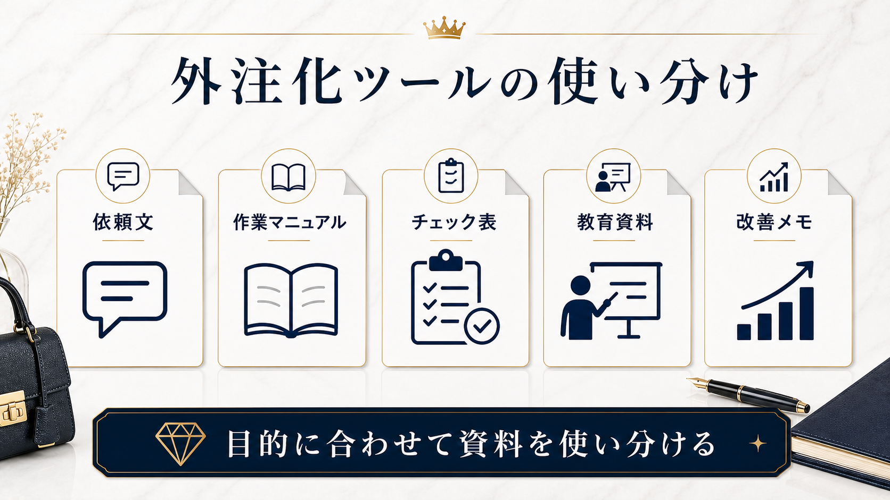

1人の記憶やチャット履歴だけで運用せず、次の5種類を分けて管理します。

| 資料 | 役割 |
|---|---|
| 依頼文 | 今回の対象、数量、期限、報酬、承認者を伝える |
| 作業マニュアル | 正常な手順と完成条件を説明する |
| チェック表 | 公開・購入・発送・送信前の確認をそろえる |
| 教育資料 | 正常例、異常例、止める例、修正理由を伝える |
| 改善メモ | 質問、事故、手戻り、公式変更を次版へ反映する |

#### マニュアルの版管理

- タイトル、版、更新日、適用範囲、作成者、確認者を記録する
- 古い版を現行版と同じ場所に混在させない
- 公式ルール、画面、配送、税、契約が変わったら更新する
- 変更理由と影響する業務を残す
- 教育済み担当者へ変更点を再共有する
- 定期確認ではなく、重大変更や事故後にも見直す

#### 引継ぎセット

```text
1. 現行SOP一覧と版
2. 役割・担当・代替担当
3. 作業中案件と期限
4. 未解決の質問・事故・精算
5. 管理表と証憑の場所
6. 権限一覧と停止方法
7. 取引先・配送先・顧客情報の共有範囲
8. 日次・週次・月次等、実際に必要な確認項目
9. 次の判断者と緊急連絡先
10. 退任時のアクセス・データ削除記録
```

会議を月1回・週1回と固定しません。業務量、重大性、担当者の習熟、変更頻度に合わせ、必要な確認項目と頻度を決めます。

### 10-5 外注化する順番

原教材の順番は、次の6段階です。

1. 出品
2. 発送
3. 問い合わせ
4. 買付
5. 秘書
6. リサーチ

これは全員に共通する絶対順ではありません。次の段階へ進む条件を満たしているかで判断します。

| 段階 | 任せる内容 | 進む前の条件 |
|---|---|---|
| 出品 | 商品情報整理、画像候補、公開前下書き | 第8〜9章の業務仕様、権利確認、下書きレビュー、利用制限歴確認 |
| 発送 | 受取、検品、梱包、購入者向け発送 | 注文照合、検品、個人情報、追跡、期限、事故時停止を再現できる |
| 問い合わせ | 事実確認、下書き、承認済み定型返信 | 30場面、確認元、変更時の同意、苦情・補償の引上げ条件がある |
| 買付 | 在庫・価格・販売元確認、承認後の購入 | 禁止買付先、予算、利益、支払、証憑、個人情報、誤購入時対応がある |
| 秘書・調整 | 進捗、精算、SOP、担当間調整 | 広い閲覧権限を分離でき、契約・支払・アクセスの最終権限を本人が持つ |
| リサーチ | 候補抽出、データ整理、検証待ち一覧 | 調査条件、除外条件、根拠、確認日、停止条件、採用判断者が決まっている |

発送、問い合わせ、買付は顧客情報・金銭・取引変更を扱います。出品より後なら自動的に安全という意味ではなく、各業務のゲートを満たすまで範囲を広げません。

### 10-6 手動運用と許諾済み補助機能を切り分ける

旧教材の自動出品ツール、月5,000品、大量リスト取得、画像の一括加工、外部ツールが止まったら別ツールを開発する手順は使いません。

BUYMAは、自動出品ソフトの中に、機械的に生成された不正確な情報で出品するものやサーバーへ過度な負荷をかけるものがあり、無許諾の外部プログラム使用はアカウント停止の対象になり得ると案内しています。大量出品や処理速度を目的に、利用可否が不明なプログラムを使いません。

#### 3つに分けて判断する

| 区分 | 例 | 扱い |
|---|---|---|
| 手動の担当業務 | 情報照合、下書き、検品、例外判断 | SOP、チェック、権限、記録を整える |
| BUYMAが提供・案内する機能 | カタログ出品、対象者向け一括編集等 | 利用条件、対象項目、最終確認を現在の公式ガイドで確認する |
| 外部ツール・プログラム | 自動ログイン、取得、加工、出品等 | BUYMAの明示許可、提供者、認証、データ、操作、停止・復旧を確認できない限り使わない |

#### ツール導入前チェック

- [ ] BUYMAが現在の用途を許可している根拠がある
- [ ] 提供者・運営者・問い合わせ先を確認した
- [ ] ログイン情報、カード、顧客情報を何に送るか分かる
- [ ] 取得・保存・再利用する画像と文章の権利を確認した
- [ ] 実行前プレビューと公開前承認がある
- [ ] 誰が、いつ、何を変更したか記録できる
- [ ] 誤操作時に停止・取消・復旧できる
- [ ] サービス終了時に手動運用へ戻せる
- [ ] 退任時に権限、トークン、端末、保存データを失効できる

複数アカウント、アカウント貸与、自動出品、禁止業務の名称変更、停止回避を「仕組み化」と呼びません。

### 10-7 秘書・担当者・運営者の役割

旧教材では、秘書1名に買付、問い合わせ、リサーチ、採用、教育、売上管理、報酬振込等を広く任せていました。新版では、役割名ではなく権限と責任を分けます。

| 役割 | 主な作業 | 任せない最終判断 |
|---|---|---|
| 出品担当 | 商品情報、画像候補、出品下書き、質問 | 権利不明、規約判断、未承認公開 |
| 発送担当 | 受取、照合、検品、梱包、発送、追跡記録 | 不一致品の無断発送、仮発送通知 |
| 問い合わせ担当 | 事実確認、定型返信、履歴記録 | 注文変更、補償、苦情、法令・規約判断 |
| 買付担当 | 在庫、価格、販売元、条件確認、承認済み購入 | 予算超過、禁止買付先、配送先変更、未承認送金 |
| リサーチ担当 | 候補抽出、根拠URL、確認日、除外理由 | 出品可否、販売元・権利・利益の最終承認 |
| リーダー | 下書き確認、質問整理、教育、改善記録 | 契約、報酬、全権限、重大事故の最終処理 |
| 秘書・調整担当 | 進捗、期限、精算準備、SOP更新、担当調整 | 銀行・カード・アカウント所有者権限、契約・解約の最終決定 |
| 出品者本人・運営者 | 規約、資金、契約、権限、重大判断、改善 | 最終責任を他者へ移さない |

担当を昇格させる場合も、在籍期間や作業速度だけで決めません。重大ミス、例外時の停止、根拠確認、情報管理、引継ぎ、他者への説明を確認します。

### 10-8 権限・証憑・公開前確認

#### 権限台帳

```text
利用者, 役割, システム, 閲覧範囲, 編集範囲, 公開可否,
購入可否, 送金可否, 個人情報範囲, 付与日, 確認日,
停止予定日, 停止日, 端末, 二要素認証, 備考
```

1人の共有IDを複数人で使い回しません。仕組み上利用者を分離できない権限は渡さず、出品者本人が操作します。パスワード、カード、復旧コードを共有表へ保存しません。

#### 証憑と記録

| 場面 | 残すもの |
|---|---|
| 出品 | 公式商品URL、画像利用根拠、在庫・価格確認、公開者・確認者 |
| 買付 | 注文内容、販売元、注文番号、決済明細、インボイス、返品条件 |
| 検品 | 注文照合、現物画像、不一致・傷、判断と連絡履歴 |
| 発送 | 配送先確認、配送会社、購入者向け追跡番号、発送日時 |
| 問い合わせ | 質問、確認元、回答、送信者、変更同意 |
| 精算 | 発注、納品、検査、報酬、費用、支払日、証憑 |
| 権限 | 付与、変更、確認、停止、セッション・トークン失効 |

証憑の保存先、閲覧者、保存期間、削除を決めます。顧客情報や決済情報を、業務に不要な人へ共有しません。

#### 運営者が確認する指標

- 処理件数と未処理件数
- 期限超過とその理由
- 下書き修正率と重大誤り
- 在庫・価格・販売元の未確認件数
- 停止・質問・承認待ち件数
- キャンセル、不良、誤配送、苦情、情報事故
- 見込利益と実績利益の差
- 未精算、未提出証憑、未停止権限
- SOPの古い版と公式変更の未反映

売上だけで担当者を評価しません。担当者が制御できない結果と、確認・記録・停止できた行動を分けます。

### 第10章チェックリスト

- [ ] 外注化の目的を、売上保証ではなく運営状態で定義した
- [ ] 業務ごとに開始、入力、手順、完成、異常、停止、承認、証拠を言語化した
- [ ] マイルールをブランド・カテゴリ・取引条件に合わせた
- [ ] 依頼文、SOP、チェック表、教育資料、改善メモを分けた
- [ ] 現行版、更新日、変更理由、教育済み担当を記録した
- [ ] 出品→発送→問い合わせ→買付→秘書→リサーチの各ゲートを確認した
- [ ] 自動出品、月5,000品、複数アカウントを運営設計へ入れていない
- [ ] 外部ツールの許可、認証、データ、記録、停止、復旧を確認した
- [ ] 役割ごとに、作業と最終判断を分けた
- [ ] 銀行、カード、契約、アカウント所有者権限を本人が管理している
- [ ] 権限台帳、証憑、公開前確認、未精算、退任処理を確認した
- [ ] 担当者が止めた案件と質問を、品質指標として確認している

### 第10章の公式確認先

確認日: **2026-07-15**

- [BUYMA 出品者登録に関するよくある質問](https://qa.buyma.com/shopper/reg/13732.html)
- [BUYMAの副業・高額コンサル・スクール勧誘に関する注意](https://qa.buyma.com/shopper/tips/30118.html)
- [BUYMA カタログから出品する機能](https://qa.buyma.com/shopper/sell/15284.html)
- [BUYMA 商品一括編集・削除機能](https://qa.buyma.com/shopper/sell/6196.html)
- [BUYMA 検品・梱包・発送](https://qa.buyma.com/shopper/order-to-delivery/4201.html)
- [BUYMA 国内で一度商品を受け取る場合の発送通知](https://qa.buyma.com/shopper/order-to-delivery/4204.html)
- [BUYMA 発送通知を行う](https://qa.buyma.com/shopper/order-to-delivery/9413.html)
- [公正取引委員会 フリーランス法特設サイト](https://www.jftc.go.jp/freelancelaw_2025/index.html)
- [個人情報保護委員会 個人情報保護法ガイドライン（通則編）](https://www.ppc.go.jp/personalinfo/legal/guidelines_tsusoku/)

<!--
第10章 出典対応:
- 10-1: ROOT-08の「売上安定・時間削減」を結果保証せず、再現・停止・継続・監督の運営目標へ現行化
- 10-2: ROOT-08の「自分の作業を全て言語化」を、開始・入力・正常・異常・停止・承認・証拠・復旧まで含む業務シートへ具体化
- 10-3: ROOT-08の仕入先順とマイルールを、ブランド・カテゴリ別の条件と共通停止条件へ現行化
- 10-4: ROOT-08の「人でなく仕組みに依存」とマニュアル・マインドマップ・引継ぎを、5資料と版管理へ再構成
- 10-5: ROOT-08の外注順6段階を保持し、第2〜9章の権利・顧客情報・金銭・契約ゲートを追加
- 10-6: ROOT-08の手動出品の継続性だけを採用。自動出品・大量取得・月5,000品・外部ツール開発は削除し、BUYMA公式機能と許諾確認へ置換
- 10-7: ROOT-08の出品、発送、問い合わせ、買付、秘書、リサーチ、リーダー役割を採用し、広すぎる秘書権限と固定人数・報酬を削除
- 10-8: ROOT-08の管理・引継ぎを、権限台帳、証憑、公開前確認、運営指標へ現行化
- 第7章へ移したROOT-08の高値売り・年間計画は本章で重複しない

不採用:
- 「すべて外注化すれば悩みが解決する」「月1回の会議と報告だけ」という保証
- ノウハウ2割・マインド8割という固定比率
- CrowdWorks、Lancers、CoconalaをBUYMA運営代行の募集先として固定推奨すること
- 秘書1名、出品3名、自動出品1名という固定組織
- 月1万〜2万円、利益5%・10%、1件50円、月3,000〜5,000円、発送200〜500円等の旧固定報酬
- HAKOBU、MindMeister、BUYER ASSIST等の特定サービス固定推奨
- 自動出品ツール、大量リスト取得、一括画像加工、月5,000品、500時間の出品設計
- ツール停止時に別の無許諾ツールを開発・導入する方法
- 「誰でもできる」問い合わせ対応という説明
- 人気順50〜100位、1万〜3万円、月200品・1,000品、毎朝・週1回等の固定リサーチ条件
- 出品数を増やせば売上が安定・最大化するという断定
- 秘書へ買付・問い合わせ・リサーチ・採用・教育・報酬振込を一括移管すること
- 過去のアカウント停止者と同じネット環境を避ければよいという旧契約条項
- 1品50円、1,000円未満繰越、秘密保持3年、固定管轄等を含む旧契約書のそのまま配布
- 第7章と重複する高値売り3戦略、固定価格帯・固定利益率・複数アカウント
- 既存の第10章章頭画像は「出品外注化実践資料集」で章名が一致しないため不採用
-->

---

## 第11章 BUYMA運営へのAI活用

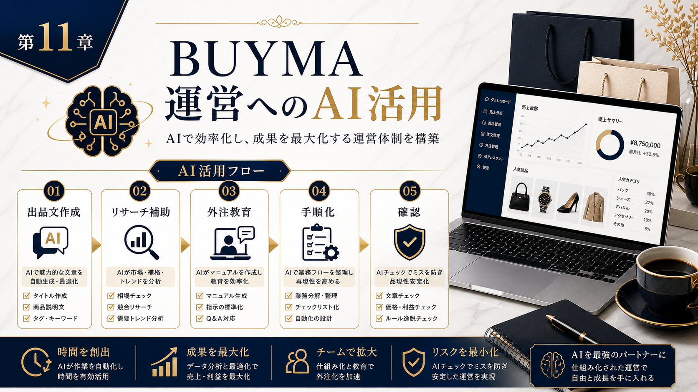

AIは、BUYMA運営の判断者ではありません。情報を整理し、文章や手順の**下書きを作る補助者**です。

公開教材のAI活用パートでは、ショップ調査、VIP交渉文、商品コメント、外注マニュアル、募集文の5場面を扱っていました。新版ではこの5用途を残し、AIが作った店名、URL、商品情報、実績、規約解釈をそのまま使う旧手順は外します。

OpenAIも、出力が常に正確とは限らず、唯一の事実情報として依存せず、利用・共有前に正確性と用途適合性を人が評価するよう案内しています。AIを使ったかどうかではなく、**入力してよい情報か、根拠を確認したか、公開責任を誰が持つか**で運用します。

### 11-1 AIが得意なこと・苦手なこと

| AIに補助させやすいこと | AIだけで決めないこと |
|---|---|
| 与えた情報の整理・分類 | ショップや商品の実在確認 |
| 文章の下書き・言い換え | BUYMA規約・法令への適合判断 |
| 表、チェックリスト、手順のたたき台 | 画像・文章・商標等の利用権判断 |
| 英文案と日本語確認案の作成 | 在庫、価格、関税、配送、返品等の最新条件 |
| 長文から確認事項・不足情報を抽出 | 商品仕様、人気、限定性、著名人利用等の事実認定 |
| 正常・異常・停止条件の整理 | 出品、購入、送金、注文変更、補償等の最終判断 |

AIは自然な文章で、存在しない店名、誤ったURL、推測した商品仕様を出すことがあります。文章が読みやすいことと、事実であることを混同しません。

古い画面手順、モデル名、利用者数、文字数上限は変わりやすいため、本章では固定しません。ChatGPTを利用するときは、OpenAIの現在の公式ページと、自分のアカウントに表示される設定を確認します。

### 11-2 AIに任せるのは下書きと整理

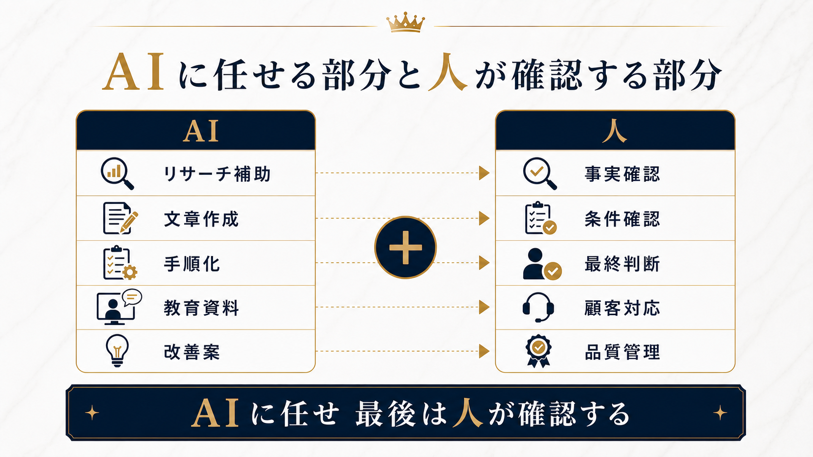

AIを使う業務は、次の3段階に分けます。

1. **入力を整える**: 利用権のある情報、確認済みの事実、目的、禁止事項を渡す
2. **AIに下書きを作らせる**: 不明点を推測せず、確認待ちとして分けさせる
3. **人が検品して採用する**: 公式情報、仕入先、現物、契約、管理表と照合する

#### AI作業票

```text
業務名: ［ショップ候補調査／交渉文／商品コメント等］
目的: ［何の下書きを作るか］
入力元: ［公式URL、許諾済み商品情報、自社資料等］
確認済みの事実: ［AIが変更してはいけない情報］
禁止事項: ［推測、架空実績、誇張、個人情報等］
出力形式: ［表、文章、チェックリスト等］
不明時の処理: 「不明」「要確認」と記載する
人が照合する先: ［公式ページ、仕入先回答、現物等］
承認者: ［公開・送信・採用を判断する人］
確認日: ［YYYY-MM-DD］
```

「プロのバイヤーとして考えて」だけでは、AIが足りない事実を補ってしまうことがあります。役割を与えるだけでなく、使える情報、使えない情報、不明時の処理、出力形式を指定します。具体的な5つの入力例は第12章で扱います。

### 11-3 人が確認する6項目

#### 1. 仕入先の実在と販売元

- 公式URLを実際に開けるか
- サイト運営者、所在地、連絡先、販売元を確認できるか
- ブランド取扱いの根拠が現在もあるか
- BUYMAの禁止・要注意買付先に該当しないか
- AIが示したURLではなく、公式サイト内の情報で裏づけたか

#### 2. 商品と在庫

- ブランド、商品名、型番、色、サイズ、素材、付属品が一致するか
- 在庫、価格、通貨、税、配送、返品条件を現在のページで確認したか
- 商品画像や説明文に、入力していない仕様が加わっていないか

#### 3. 買付条件と利益

- 割引、免税、送料、関税、消費税、決済手数料の条件を確認したか
- AIの試算ではなく、第1章の利益計算へ確認済み数値を入れたか
- 条件変更時に再計算し、承認条件を下回る取引を止めたか

#### 4. BUYMA規約と法令

- 出品、買付、画像、検品、発送、外注の現行ルールを公式情報で確認したか
- AIの「問題ありません」という回答だけで規約判断していないか
- 契約、個人情報、表示、税務等の専門判断をAIで確定していないか

#### 5. 権利と表現

- 画像・文章を使う権利と根拠があるか
- 「限定」「日本未入荷」「大人気」「残り1点」「著名人愛用」等に根拠があるか
- 競合の説明文をAIへ渡して、言い換えコピーを作っていないか
- 出力に第三者のブランドやサービスとの提携を誤認させる表現がないか

#### 6. 顧客対応と最終判断

- 注文、配送、返品、補償、キャンセルに関する回答を注文記録と公式ガイドで確認したか
- AIが勝手に約束、謝罪条件、返金、値引き、発送日を決めていないか
- 送信前に担当者名、注文内容、期限、確認元を人が確認したか

### 11-4 公開教材から残す5つの活用場面

| 活用場面 | AIに補助させる範囲 | 人が確認すること |
|---|---|---|
| 取扱ショップ候補調査 | 検索条件、候補表、未確認事項の整理 | 実在、公式URL、運営者、取扱い、買付可否、確認日 |
| VIP交渉文 | 確認済み事実を使った英文案、日本語確認案 | 実績、購入予定、宛先、条件、送信可否 |
| 商品コメント | 商品情報から説明文の下書きを作る | 仕様、権利、禁止・誇張表現、表示との一致 |
| 外注マニュアル | 入力、手順、正常・異常・停止条件を整理 | 実画面、現行手順、権限、個人情報、承認者 |
| 募集文 | 正確な業務条件から募集文を整える | 委託可否、業務、報酬、支払、個人情報、掲載先規約 |

原教材の「100ショップを一瞬で開拓」「交渉文・商品コメント・マニュアル・募集文を一瞬で完成」という表現は使いません。AIで速く作れるのは候補や下書きであり、採用可能な成果物になるまでには確認が必要です。

AIへBUYMAを直接操作させたり、公開、購入、送信を無承認で実行させたりしません。AI利用とBUYMA上の自動操作を分け、無許諾の外部プログラムは第10章の基準で判断します。

### 11-5 入力しない情報とデータ設定

#### 原則として入力しないもの

- BUYMA、メール、仕入先、決済等のパスワード
- 二要素認証コード、復旧コード、セッション、APIキー
- クレジットカード、銀行口座、本人確認書類の画像・番号
- 購入者や外注パートナーの氏名、住所、電話番号、メールアドレス
- 注文番号、追跡番号等、他情報と組み合わせて個人や取引を特定できる情報
- 非公開の契約書、仕入条件、クーポンコード、取引先担当者情報
- 他者の著作物、画像、会話、個人情報など、AIへ提供する権利がないもの

実例が必要なときは、氏名を「購入者A」、住所を「都道府県まで」、注文番号を「注文ID-A」のように置き換えます。ただし、伏せ字にすれば何でも入力してよいわけではありません。目的に不要な情報は入れません。

#### ChatGPTの設定を過信しない

OpenAIのData Controlsでは、会話をモデル改善へ使用する設定を変更できます。Temporary Chatは通常の履歴に表示されず、パーソナライズ用のメモリを参照・作成せず、モデル改善にも使われません。ただし、安全・セキュリティ目的で限定的な文脈を利用する場合があり、会話のコピーを最大30日保持する場合があると案内されています。また、GPT等が外部サービスへデータを送る機能を使う場合は、送信先のプライバシーポリシーが適用されます。

したがって、「学習オフ」や「一時チャット」だけを秘密情報の入力許可にしません。利用するAIサービス、プラン、外部連携、保存、削除、管理者権限を現在の公式案内で確認し、入力を最小化します。

### 11-6 AI出力の検品フロー

#### 検品の7手順

1. 入力前に、個人情報、秘密情報、権利のない内容を除く
2. 確認済み事実、禁止事項、不明時の処理を指定する
3. AI出力を「確認済み」「要確認」「不採用」に分ける
4. URL、運営者、商品、条件を一次情報で開いて確認する
5. BUYMA規約、法令、権利、顧客影響を人が確認する
6. 入力していない事実・数字・実績・約束を削除する
7. 公開・送信・採用した人、確認元、確認日を記録する

#### 出力別の採用条件

| 出力 | 採用前に必要な証拠 |
|---|---|
| ショップ候補 | 公式URL、運営者、取扱い、販売条件、確認日 |
| 交渉文 | 真実の実績・予定、宛先、原文、日本語確認、送信記録 |
| 商品コメント | 公式商品情報、利用権、禁止表現確認、掲載内容との一致 |
| 外注マニュアル | 実際の操作確認、正常・異常・停止、権限、承認者、版 |
| 募集文 | 正確な委託条件、報酬・支払、掲載先規約、個人情報項目 |

AI出力に誤りが見つかったら、その一文だけ直して終わらせません。誤りの原因が、入力不足、古い資料、禁止事項の欠落、確認先の誤りのどれかを記録し、次回の作業票と第10章のマニュアルへ反映します。

### 第11章チェックリスト

- [ ] AIを事実の決定者ではなく、下書き・整理の補助に限定した
- [ ] 確認済み事実、禁止事項、不明時の処理、出力形式を指定した
- [ ] 店名、URL、運営者、商品、条件を一次情報で確認した
- [ ] BUYMA規約、法令、権利をAI回答だけで判断していない
- [ ] 入力していない人気、限定性、実績、数字、約束を削除した
- [ ] 顧客対応を注文記録と公式ガイドで確認した
- [ ] パスワード、認証情報、カード、個人情報、秘密情報を入力していない
- [ ] データ設定だけを根拠に秘密情報の入力を許可していない
- [ ] AIにBUYMAの公開、購入、送信を無承認で実行させていない
- [ ] 採用した人、確認元、確認日を記録した

### 第11章の公式確認先

確認日: **2026-07-15**

- [OpenAI Terms of Use](https://openai.com/policies/terms-of-use/)
- [OpenAI Data Controls FAQ](https://help.openai.com/en/articles/7730893)
- [OpenAI Temporary Chat FAQ](https://help.openai.com/en/articles/8914046)
- [OpenAI Memory FAQ](https://help.openai.com/en/articles/8590148)
- [OpenAI Chat and File Retention Policies in ChatGPT](https://help.openai.com/en/articles/8983778)
- [BUYMA 出品を禁止されている買い付け先について](https://qa.buyma.com/shopper/prohibited-item/4007.html)
- [BUYMA 出品画像による権利侵害の禁止について](https://qa.buyma.com/shopper/prohibited-item/15733.html)
- [BUYMA 出品時の禁止事項](https://qa.buyma.com/shopper/prohibited-item/11394.html)
- [BUYMAの副業・高額コンサル・スクール勧誘に関する注意](https://qa.buyma.com/shopper/tips/30118.html)

<!--
第11章 出典対応:
- 11-1: ROOT-11のメリット・デメリットを、下書き・整理の適性と、誤情報・推測・最新性の制約へ現行化
- 11-2: ROOT-11の「指示が具体的なほど回答しやすい」を、入力元・確認済み事実・禁止事項・不明時処理・承認者を含むAI作業票へ現行化
- 11-3: ROOT-11の誤回答注意と5事例を、実在・商品・買付・規約・権利・顧客対応の人手確認へ整理
- 11-4: ROOT-11の公開5事例だけを保持。具体的なプロンプトは第12章へ集約
- 11-5: ROOT-11に不足していた個人情報・認証情報・データ設定上の注意をOpenAI公式案内に基づき追加
- 11-6: ROOT-11の出力確認を、一次情報・規約・権利・顧客影響・採用記録まで含む検品フローへ現行化

不採用:
- 2022年・2023年時点の利用者数、他サービスとの成長速度比較
- 「BUYMAで生き残るための必須手法」「成功を収める」「収益アップ」等の成果断定
- 数時間・数日・数か月の作業が一瞬で終わるという表現
- 旧OpenAIページ、TRY CHATGPT、電話番号、認証コード等の固定登録手順
- AIを「最強のビジネスパートナー」とする過度な表現
- AI回答だけで100ショップを開拓・採用する手順
- AIへBUYMA業務を自動実行させる説明
- 具体的プロンプト本文の重複掲載（第12章へ集約）
- 既存の第11章章頭画像は「成果を最大化」「自動生成・最適化」等の保証的表現を含むため不採用
-->

---

## 第12章 BUYMA実践プロンプト集

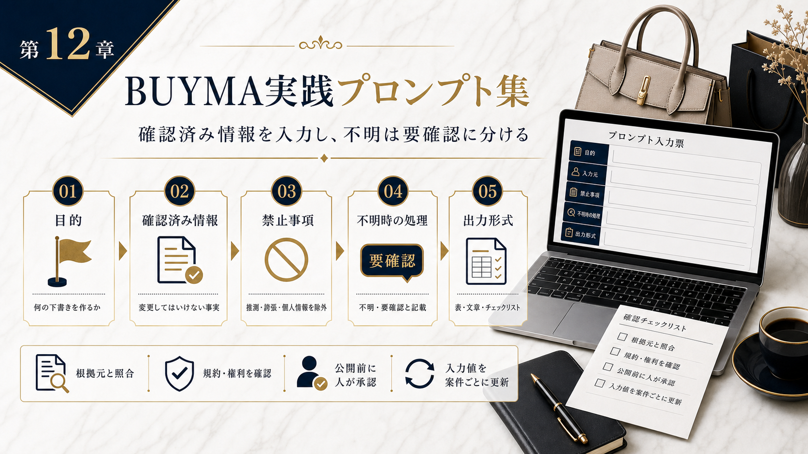

本章は、公開教材のAI活用パートに収録されていた5つの活用例を、現在のBUYMA運営で**下書きとして使える形**へ直したものです。

AIの回答は完成品ではありません。各テンプレートの［入力］を確認済みの事実へ置き換え、出力後に必ず［人が確認すること］を実行してください。個人情報、認証情報、カード情報、非公開の取引情報は入力しません。

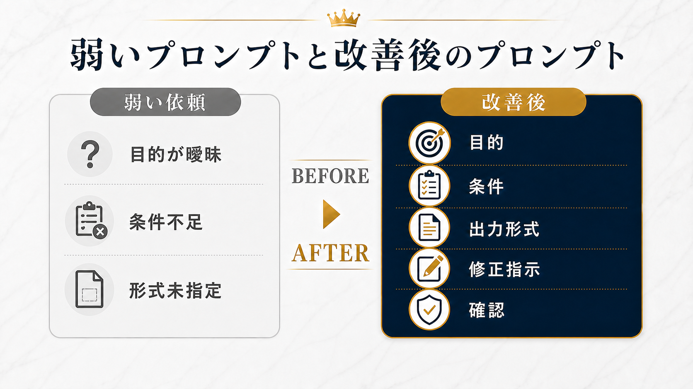

### 12-1 ショップ候補調査

原教材は、ブランド名だけを指定し、店名やURLを繰り返し出させる方法でした。しかし、AIは存在しない店舗や誤ったURLを生成することがあります。新版では、AIの出力を「仕入先リスト」ではなく、**人が調べる候補表**として扱います。

#### 入力前に用意するもの

- 調査するブランド名と公式表記
- 対象国・地域
- 実店舗、オンラインショップ等の対象
- 除外する買付先の種類
- BUYMAの禁止・要注意買付先ガイド
- 最後に人が確認する日付

#### プロンプト1

```text
目的:
［ブランド名］を取り扱う可能性があるショップの「確認候補表」を作る。
これは仕入先の採用判断ではなく、人が公式ページを確認するための下調べである。

調査条件:
- ブランド正式名: ［ブランド名］
- 対象国・地域: ［国・地域］
- 対象: ［実店舗／オンラインショップ／両方］
- 除外: CtoC、フリマ、オークション、販売元不明のサイト
- 確認基準日: ［YYYY-MM-DD］

重要なルール:
1. 店名、URL、運営者、取扱いを推測で作らない。
2. 現在のウェブページを開いて確認できない場合は「未確認」と書く。
3. ブランド取扱いを示す一次情報が見つからない候補は「根拠なし」と書く。
4. BUYMAで買付可能、安全、正規品であるとは判定しない。
5. 同じショップの重複、古いURL、まとめサイトを除く。
6. 不明な欄を自然な情報で埋めず「不明」と書く。

出力:
次の列を持つ表にする。
- 候補ショップ名
- 国・都市
- 公式トップURL
- ブランド取扱い根拠URL
- サイト運営者
- 実店舗／オンライン
- 確認できた事実
- 未確認事項
- 確認状態（確認候補／根拠なし／未確認）

最後に、この表を採用する前に人が確認すべき項目を箇条書きにする。
```

#### 人が確認すること

- [ ] URLを自分で開き、公式サイトか確認した
- [ ] 運営者、所在地、連絡先、販売元を確認した
- [ ] ブランド取扱いページと商品ページを確認した
- [ ] BUYMAの禁止・要注意買付先に該当しないか確認した
- [ ] 支払、配送、返品、税、関税、利用地域を確認した
- [ ] 確認日と根拠URLを第6章のショップ確認台帳へ記録した

AIが10件出したから10件採用する、さらに出させて100件へ増やす、という使い方はしません。確認できた候補だけを台帳へ移します。

### 12-2 VIP交渉文

AIには翻訳と文章整理を補助させます。購入実績、購入予定額、事業規模、取扱いブランド、過去の関係を作らせません。実績がない場合は、初回の問い合わせとして正直に書きます。

#### 入力前に用意するもの

- ショップ名と公式問い合わせ先
- 宛名または担当部署
- 自分が事実として説明できる活動内容
- 公開して差し支えない範囲での購入実績の有無。注文番号・日付・金額・担当者・個別条件は入力しない
- 公開して差し支えない一般的な取引関心。具体的な金額・日付・商品・購入計画は入力しない
- 尋ねたい条件
- AI出力後に人が追記する署名項目。氏名等の値はAIへ入力しない

#### プロンプト2

```text
目的:
海外ショップへ、継続購入者向け条件の有無を丁寧に問い合わせるメールの下書きを作る。

確認済みの事実:
- ショップ名: ［名称］
- 宛名・部署: ［名称／不明］
- 自分の活動: ［事実だけを記入］
- 購入実績の有無: ［あり／なし。注文番号・日付・金額・担当者・個別条件は入力しない］
- 関心のある取引: ［カテゴリ・継続購入への関心等、公開して差し支えない一般的な範囲］
- 問い合わせたいこと: ［割引、購入条件、対象外商品、期間等］
- 署名: ［AI出力後に人が追記。ここには個人情報を入れない］

重要なルール:
1. 購入実績の有無、顧客数、販売実績、関係性を捏造しない。
   注文番号、購入日、金額、担当者、個別条件、具体的な購入計画は入力・出力しない。
2. 割引が受けられる、返信が来る、特別条件を得られると断定しない。
3. 相手の規約やブランド方針に反する要求をしない。
4. 氏名等の個人情報、パスワード、カード情報、本人確認情報を入力・出力しない。
5. 入力にない事実は補わず「要確認」とする。
6. 誇張、強い催促、競合店との価格比較を使わない。

出力:
A. 件名案を3つ
B. 丁寧で簡潔な英語メール
C. 内容確認用の自然な日本語訳
D. 入力事実とメール内表現の対応表
E. 送信前に確認が必要な箇所

英語と日本語で意味が変わる箇所があれば明示する。
```

#### 人が確認すること

- [ ] 宛先が公式の問い合わせ先か確認した
- [ ] 購入実績の有無と一般的な取引関心が事実と一致する
- [ ] 注文番号、日付、金額、担当者、個別条件、具体的な購入計画はAI出力後に人が必要範囲だけ追記した
- [ ] 日本語訳で依頼内容と約束の範囲を確認した
- [ ] 割引率、購入量、免税、返品等を勝手に確約していない
- [ ] 相手の回答、条件、期限、コードの共有範囲を管理表へ記録した
- [ ] 条件を受けた後、第5章の利益計算と対象外条件を再確認した

他言語へ変換する場合も、その言語が自然か、条件の意味が変わっていないかを確認できる人または手段で検品します。

### 12-3 商品コメント

商品コメントは、商品を魅力的に見せる前に、出品内容と一致している必要があります。AIへ渡すのは、利用権があり、公式情報等で確認した商品事実だけです。

#### 入力前に用意するもの

- ブランド・商品名・型番
- 素材、寸法、色、仕様、付属品
- 公式商品ページ等の確認元
- アウトレット、店頭展示等、事前に知らせる事項
- 想定する利用場面と文章のトーン
- 使用を避ける表現

#### プロンプト3

```text
目的:
確認済みの商品情報だけを使い、BUYMAの商品コメントの下書きを作る。

確認済みの商品情報:
- ブランド: ［名称］
- 商品名: ［名称］
- 型番: ［型番／不明］
- 色: ［色］
- 素材: ［公式記載］
- 寸法・仕様: ［公式記載］
- 付属品: ［確認済み内容］
- 状態・注意事項: ［店頭展示、アウトレット等／なし］
- 確認元URL: ［利用権のある確認元］
- 想定する利用場面: ［場面／指定なし］
- 文体: ［簡潔／上品／実用的等］
- 文字量: ［希望／指定なし］

重要なルール:
1. 入力にない素材、機能、寸法、原産国、付属品を推測しない。
2. 「限定」「日本未入荷」「大人気」「残り1点」「最安値」「新作」
   「著名人愛用」「雑誌掲載」等は、根拠が入力されていない限り使わない。
3. 在庫、配送、関税、返品について、入力にない約束をしない。
4. 年齢、性別、家族構成等への決めつけや、不快な表現を使わない。
5. 他の出品者やサイトの文章を模倣・言い換えしない。
6. 不明な情報は書かず、末尾の「要確認事項」へ分ける。

出力:
A. 商品コメント本文
B. 本文で使った商品事実の一覧
C. 要確認事項
D. 誇張・権利・仕様・在庫・配送の自己点検結果
```

#### 人が確認すること

- [ ] 商品名、型番、色、素材、寸法、付属品が出品情報と一致する
- [ ] 画像と文章の利用権を確認した
- [ ] 入力していない特徴や効能が追加されていない
- [ ] 人気、限定性、著名人、掲載、在庫逼迫の表現に根拠がある
- [ ] 配送、関税、返品、到着日の説明が実際の設定と一致する
- [ ] 第9章の感性ワードを、商品事実を超えない範囲で使っている

「40代女性向け」等の属性だけで文章を作らせず、利用場面、必要な情報、文体、避ける表現を指定します。

### 12-4 外注マニュアル

AIは、出品、検品、梱包、発送等の資料を読みやすい順に並べる補助に使えます。ただし、古い資料から現在の画面やルールを推測させません。実際の手順を出品者本人が確認してから、マニュアルとして承認します。

#### 入力前に用意するもの

- 対象業務と適用範囲
- 現在の公式ガイドのURL・確認日と、必要箇所を自分の言葉でまとめた要点
- 出品者本人が確認した実手順
- 入力、完成物、正常条件
- 異常・停止・承認条件
- 扱う個人情報と権限
- 記録する証拠と保管先

#### プロンプト4

```text
目的:
次の確認済み資料を整理し、［業務名］の作業マニュアルの「たたき台」を作る。

対象:
- 業務名: ［出品／検品／梱包／発送／その他］
- 対象者: ［役割］
- 適用範囲: ［どこからどこまで］
- 版・確認日: ［版／YYYY-MM-DD］
- 承認者: ［役割］

確認済み資料:
［公式ガイドのURL・確認日・必要箇所を自分の言葉でまとめた要点と、
出品者本人が確認した手順を書く。
AIへ提供する権利のない本文・画像・会話・社内資料は貼らない］

重要なルール:
1. 入力資料にない画面、ボタン、期限、数値、規約を推測しない。
2. 古い可能性がある内容は「公式再確認」と表示する。
3. 作業者の権限を超える公開、購入、送金、注文変更を指示しない。
4. 個人情報、認証情報、カード情報を共有表へ記録させない。
5. 正常手順だけでなく、異常、停止、質問、承認の条件を分ける。
6. 不明点を埋めず「承認者確認」とする。
7. 完成版とは呼ばず、実地確認前のたたき台と明記する。
8. 入力資料をAIへ提供する権利が不明な場合は、内容を使用せず「権利確認」とする。

出力する章:
1. 目的・適用範囲・完成条件
2. 作業前の準備と必要権限
3. 入力情報と確認元
4. 正常時の手順
5. 手順ごとの確認項目と残す証拠
6. 異常例
7. 即時停止する条件
8. 承認者へ上げる内容
9. 個人情報・権限・データの扱い
10. 完了報告
11. 未確認事項
12. 版・更新日・変更履歴

各手順を「作業」「確認」「証拠」「異常時」の4列の表でもまとめる。
```

#### 人が確認すること

- [ ] 現在の画面で、本人が最初から最後まで実行した
- [ ] BUYMA公式ガイドと期限・条件が一致する
- [ ] AIへ入力した要点・資料を提供する権利がある
- [ ] 画像権利、検品、仮発送、配送変更等の禁止事項を反映した
- [ ] 正常・異常・停止・承認・証拠が区別されている
- [ ] 作業者へ不要な公開・購入・送金・個人情報権限を渡していない
- [ ] 実地確認した版だけを現行版として教育した
- [ ] 質問や事故を第10章の改善メモへ戻した

原教材に含まれていた旧出品画面や固定の発送説明は、そのまま入力資料にしません。第1章、第9章と現在の公式ガイドを確認済み資料として使います。

### 12-5 募集文

原教材は、クラウドソーシング上の他者の募集文を参考に、特定属性向けへ言い換える方法でした。新版では、他者の文章をコピーせず、自分が実際に委託できる条件から作ります。

掲載先によって、出品、商品登録、在庫管理、代理購入、アカウント共有等の依頼が禁止される場合があります。AIに募集文を作らせる前に、掲載先でその業務を委託・募集できるかを確認します。

#### 入力前に用意するもの

- 掲載先と確認したガイドライン
- 実際に委託する業務と委託しない業務
- 作業場所、必要環境、納品物、検査方法
- 報酬、費用、支払期日
- 稼働条件と連絡方法
- 選考で本当に必要な情報
- 契約・秘密保持・個人情報の扱い

#### プロンプト5

```text
目的:
確認済みの委託条件から、誤解のない募集文の下書きを作る。

掲載条件:
- 掲載先: ［サービス／自社募集等］
- 掲載先で委託可能と確認した業務: ［業務］
- ガイドライン確認日・URL: ［YYYY-MM-DD／URL］
- 募集開始日・募集終了予定日: ［日付］
- 発注者の従業員・役員状況: ［従業員を使用する／代表者以外の役員がいる／いずれも該当しない／要確認］
- 受注者の法人形態・役員・従業員状況: ［個人／法人。法人の場合は代表者以外の役員の有無。従業員を使用する／使用しない／要確認］
- 委託予定期間: ［期間］
- 更新・基本契約を含む通算期間: ［同一当事者・一定程度同一の業務・1か月未満の空白を確認］
- フリーランス法の適用義務確認結果: ［適用する義務／対象外／要専門家・行政確認］
- 第8章8-5の取引条件・期間別義務: ［確認済み／要確認］

実際の委託条件:
- 募集を行う者の氏名・名称: ［AIへ不要な個人情報を入力せず、掲載前に人が追記］
- 住所・所在地: ［原則としてビル名・階数・部屋番号まで記載。仲介事業者の照会方式を使う場合は、公式案内の例外要件と照会先を確認。AI出力後に人が追記］
- 連絡先: ［応募者が照会できる連絡先。AI出力後に人が追記］
- 業務内容: ［作業と対象外作業］
- 業務に従事する場所: ［在宅／指定場所等］
- 必要環境・スキル: ［業務上必要なもの］
- 納品物・完成条件: ［内容］
- 検査方法・期限: ［内容］
- 報酬・費用負担: ［金額または計算方法］
- 支払期日: ［期日。60日以内の支払期日設定義務が適用される場合は、
  受領日・役務提供日から60日以内のできる限り短い期間内］
- 想定する期間・稼働条件: ［条件］
- 連絡方法: ［掲載先で許可された方法］
- 選考方法: ［書類、面談、既存ポートフォリオ等。
  サンプル作業は掲載先で許可され、契約・仮払い後かつ有償の場合だけ記載］
- 応募時に必要な情報: ［必要最小限］
- 契約・秘密保持・個人情報: ［取扱い］

重要なルール:
1. 他者の募集文をコピー・言い換えしない。
2. 発注者の経歴、家族、運営年数、実績、収入例を捏造しない。
3. 性別、年齢、家族構成等、業務に不要な属性で限定しない。
4. 「誰でも」「簡単」「必ず稼げる」等の誤認表現を使わない。
5. 未確認の報酬、ボーナス、継続、仕事量、月収を約束しない。
6. アカウント共有、無許諾画像利用、規約回避を業務へ含めない。
7. 掲載先で禁止された外部連絡・直接取引へ誘導しない。
8. 条件が不足する欄は作らず「掲載前に要確認」とする。
9. 発注者側の従業員・役員、受注者側の法人形態・代表者以外の役員・従業員、
   通算委託期間、適用義務が不明なら
   「専門家・行政確認」とする。
10. 特定業務委託事業者が広告等で募集する場合は、氏名・名称、住所・所在地、
    連絡先、業務内容、業務に従事する場所、報酬の6情報を掲載前に確認する。

出力:
A. 正確で簡潔な募集タイトルを3案
B. 募集本文
C. 応募時に確認する質問
D. 掲載前の不足情報
E. 属性限定、誇張、規約、個人情報、取引条件の自己点検
```

#### 人が確認すること

- [ ] 掲載先で対象業務の募集が許可されている
- [ ] 業務、対象外作業、納品、検査、報酬、費用、支払期日が正確
- [ ] 60日以内の支払期日設定義務が適用される場合は、受領日・役務提供日から60日以内のできる限り短い支払期日を定めた
- [ ] 発注者側の従業員・役員、受注者側の法人形態・代表者以外の役員・従業員、更新を含む通算委託期間を確認し、1か月以上・6か月以上等で適用される義務を第8章8-5で確認した
- [ ] 広告等での募集に必要な6情報、または現行案内に沿う仲介事業者の照会表示を確認した
- [ ] 募集文と契約条件に食い違いがない
- [ ] 属性限定、架空の経歴、収入保証、他者文章のコピーがない
- [ ] 応募時の個人情報が選考に必要な最小限である
- [ ] アカウント共有、無許諾画像、無許諾自動化、規約回避がない
- [ ] 面談、連絡先交換、契約、支払を掲載先のルールに沿って行う
- [ ] サンプル作業は掲載先で許可され、契約・仮払い後かつ有償である
- [ ] 募集条件が変わった時に更新し、募集終了後は掲載を終了した

クラウドワークスでは、BUYMAの出品作業・商品登録・在庫管理代行や代理購入等が禁止対象として案内されています。名称を変えて掲載せず、第8章の委託可能・禁止業務確認へ戻ります。

### 12-6 AI出力レビュー

5つのプロンプトに共通する最終確認です。

#### 事実

- [ ] 人が入力した確認済み事実だけを使っている
- [ ] 店名、URL、商品、数値、実績、条件を推測で追加していない
- [ ] 不明事項が「不明」「要確認」として分かれている
- [ ] 確認元を実際に開き、確認日を記録した

#### 規約・法令・権利

- [ ] BUYMAと利用サービスの現行ルールを公式ページで確認した
- [ ] 画像・文章・ブランド表現の利用権を確認した
- [ ] 契約、表示、個人情報等をAIだけで判断していない
- [ ] 無許諾の自動操作、アカウント共有、規約回避を含まない

#### 入力情報

- [ ] パスワード、認証コード、カード、銀行、本人確認情報を入力していない
- [ ] 購入者・外注パートナー・取引先の個人情報を入力していない
- [ ] 非公開条件、コード、契約、会話を必要なく入力していない
- [ ] AIサービスの保存・外部連携設定を確認した

#### 公開・送信

- [ ] 日本語・外国語の意味、宛先、商品、条件が一致する
- [ ] 誇張、架空実績、差別的表現、成果保証がない
- [ ] 公開・送信・採用の最終判断者が確認した
- [ ] 採用版、確認元、確認日、送信・公開履歴を残した

1項目でも確認できなければ、公開・送信・採用を止めます。AIに再回答させるだけで確認済みにせず、不足する一次情報を人が確認します。

### 第12章チェックリスト

- [ ] 公開教材にある5用途だけを実践テンプレートへ現行化した
- [ ] ショップ候補を仕入先確定リストとして扱っていない
- [ ] VIP交渉文に架空の実績・購入予定・割引保証がない
- [ ] 商品コメントを確認済み商品情報だけで作った
- [ ] 外注マニュアルを実画面・公式ガイドで検証した
- [ ] 募集文を他者文章のコピーや属性限定から作っていない
- [ ] 掲載先で対象業務を募集できるか確認した
- [ ] AI出力を人が一次情報と照合した
- [ ] 個人情報、認証情報、決済情報、秘密情報を入力していない
- [ ] 公開・送信・採用の責任者と履歴を記録した

### 第12章の公式確認先

確認日: **2026-07-15**

- [OpenAI Terms of Use](https://openai.com/policies/terms-of-use/)
- [OpenAI Data Controls FAQ](https://help.openai.com/en/articles/7730893)
- [BUYMA 出品を禁止されている買い付け先について](https://qa.buyma.com/shopper/prohibited-item/4007.html)
- [BUYMA 出品画像による権利侵害の禁止について](https://qa.buyma.com/shopper/prohibited-item/15733.html)
- [BUYMA 出品時の禁止事項](https://qa.buyma.com/shopper/prohibited-item/11394.html)
- [BUYMAの副業・高額コンサル・スクール勧誘に関する注意](https://qa.buyma.com/shopper/tips/30118.html)
- [クラウドワークス 仕事依頼ガイドライン](https://crowdworks.jp/pages/guidelines/job_offer)
- [公正取引委員会 フリーランス法特設サイト](https://www.jftc.go.jp/freelancelaw_2025/index.html)

<!--
第12章 出典対応:
- 12-1: ROOT-11公開教材の取扱ショップ候補プロンプトを、実在・公式URL・運営者・取扱根拠・未確認事項を人が検証する候補調査へ現行化
- 12-2: ROOT-11公開教材のVIP交渉文プロンプトを、真実の実績だけを使う英文・日本語確認・事実対応表へ現行化
- 12-3: ROOT-11公開教材の商品コメントプロンプトを、確認済み商品情報・根拠必須表現・要確認事項を分ける下書きへ現行化
- 12-4: ROOT-11公開教材の出品・検品・梱包・発送マニュアル作成例を、正常・異常・停止・承認・証拠・版管理を含むたたき台へ現行化
- 12-5: ROOT-11公開教材の募集文プロンプトを、正確な委託条件・掲載先規約・取引条件明示・必要最小限情報から作る下書きへ現行化
- 12-6: ROOT-11の誤回答注意を、事実・規約・権利・入力情報・公開責任の共通レビューへ整理

不採用:
- 取得対象外とした非公開プロンプト教材の本文、名称、URL、画像
- ブランド名だけで10件・100件を確定ショップとして出力させる旧手順
- AIが作ったURLを未確認で開拓済みとする説明
- VIP獲得、割引、時短、利益を保証する表現
- 年齢・性別等の属性だけをターゲットにした商品コメント
- 旧出品画面・固定期限・古いBUYMA説明をそのままマニュアル化する手順
- クラウドワークスで他者のBUYMA募集文を探し、コピー・リライトする手順
- 主婦・女性限定、年齢・家族構成、固定報酬・月収例、架空プロフィール
- 出品、在庫管理、代理購入、アカウント共有等の禁止業務を名称変更して募集する手順
- 既存の第12章章頭画像は旧章名と成果保証的表現を含むため不採用
-->

---

## 特典1 海外買付パートナー実務キット

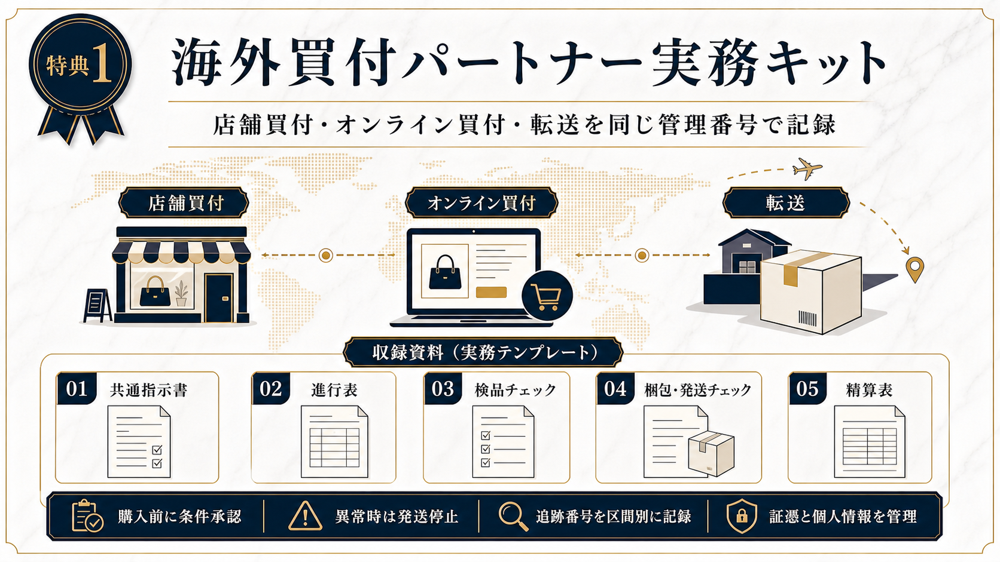

公開特典「海外買付マニュアル」にあった店舗買付、オンライン買付、転送の3方式を、現在の実務で使う指示書・確認表へまとめました。固定の連絡ツール、送金サービス、報酬、配送方法は指定せず、案件ごとに合意した条件を記録します。

クラウドワークスでは、代理購入・受取等を含むこの業務を募集しません。他の募集サービスも、業務名ではなく実際の作業内容を掲載直前の規約へ照合します。紹介・直接契約等で依頼する場合は、第8章8-5でフリーランス法の適用義務、発注者側の従業員・役員、受注者側の法人形態・代表者以外の役員・従業員、委託期間、取引条件明示、支払期日、期間別義務を確認します。60日以内の支払期日設定義務が適用される場合は、受領日・役務提供日から60日以内のできる限り短い期間内で定めます。

### 特典1-1 共通指示書

1案件につき1つの管理番号を付け、次をコピーして依頼前に埋めます。

```text
管理番号:
買付方式: ［店舗／オンライン／転送］
依頼日:
担当者:
承認者:

商品:
- ブランド:
- 商品名:
- 公式商品URL:
- 品番:
- 色:
- サイズ:
- 数量:
- 付属品:

買付:
- 店舗・サイト名:
- 公式URL:
- 販売元:
- BUYMA禁止・要注意買付先の確認日:
- BUYMA上の分類・確認結果:
- 確認根拠URL:
- 在庫確認日時:
- 価格・通貨:
- 税:
- 現地送料:
- 返品・交換条件:
- 買付期限:
- 購入上限額:

費用:
- 前払金:
- 交通費上限:
- 資材費上限:
- 発送費上限:
- 契約報酬:
- 支払方法:
- 支払期日:
- 実費証憑の提出方法:

受取・検品:
- 受取先:
- 受取予定:
- 注文番号:
- 店舗からの追跡番号:
- 検品項目:
- 検品写真:
- 異常時の停止・連絡先:
- 発送承認者:

購入者発送:
- 発送先共有者:
- 配送方法:
- 追跡:
- 補償:
- 発送期限:
- 配送変更時の承認:
- 発送控えの保存先:

個人情報:
- 共有する項目:
- 共有相手:
- 利用目的:
- 保存期限:
- 削除確認:
```

パスワード、認証コード、カード番号、復旧情報は指示書へ書きません。購入者情報は発送に必要な最小限だけを、必要な担当者へ必要な期間だけ共有します。

BUYMAの禁止・要注意買付先が未確認、禁止対象、またはマーケットプレイス等で販売元を確認できない場合は、前払・発注・買付を止めます。リストに名前がないことだけで利用可能とは判断せず、商品・販売元単位で確認します。

### 特典1-2 3方式の進行表

#### 店舗買付

| 段階 | パートナーの作業 | 出品者の確認 |
|---|---|---|
| 依頼 | 商品・店舗・上限・期限を受領 | 指示書と在庫確認先を確定 |
| 在庫確認 | 店舗へ品番・色・サイズ・数量を確認 | 回答元、日時、価格、取置期限を確認 |
| 前払 | 合意した入金を確認 | 商品代・交通費等を証拠付きで送金 |
| 買付 | 指示と一致する商品を公式経路で購入 | 購入前の変更・超過を承認 |
| 購入報告 | レシート、商品、実費を報告 | 店舗・日時・商品・価格を照合 |
| 検品 | 品番・色・サイズ・数量・付属品・状態を確認 | 写真と注文情報を照合 |
| 承認待ち | 異常があれば発送せず待つ | 返品・交換・発送を判断 |
| 梱包・発送 | 承認後に適切に梱包し追跡可能な方法で発送 | 宛先、方法、期限を確認 |
| 完了報告 | 発送日、配送会社、追跡、控えを提出 | BUYMA発送通知と取引管理 |
| 精算 | 実費証憑と差額を提出 | 前払・実費・報酬・返金を照合 |

#### オンライン買付

店舗買付との違いは、移動ではなく、販売元・注文内容・受取までの配送を重点確認することです。

1. 出品者が商品URL、販売元、品番、色、サイズ、上限、期限を指示する
2. パートナーがカート内の商品、販売元、価格、送料、税、返品条件を確認する
3. 出品者が注文内容と前払・支払方法を承認する
4. パートナーが承認済み条件で注文する
5. 注文番号、注文確認、請求額を報告する
6. 店舗発送後の追跡番号を報告する
7. 商品を受け取り、注文内容と照合する
8. 現物を検品し、写真と異常を報告する
9. 出品者の発送承認を待つ
10. 承認後に梱包し、購入者へ発送する
11. 購入者向けの追跡番号と発送控えを報告する
12. 前払、実費、為替差、返金、報酬を精算する

#### 転送

出品者が買付済みの商品をパートナーが受け取る方式です。

1. 出品者が管理番号、商品、注文番号、店舗追跡番号、受取予定を共有する
2. パートナーが荷物を受け取り、外装状態を記録する
3. 注文内容と品番・色・サイズ・数量を照合する
4. 付属品と商品状態を検品する
5. 写真と異常を報告する
6. 出品者が返品・交換・発送を判断する
7. パートナーが承認後に梱包する
8. 購入者が選んだ条件で発送する
9. 購入者向けの追跡番号と発送控えを報告する
10. 実費と報酬を精算する
11. 個人情報と不要データの削除を確認する

店舗からパートナーまでの追跡番号と、パートナーから購入者までの追跡番号を分けます。BUYMAの発送通知に使うのは、現物検品後に購入者へ発送した区間です。

### 特典1-3 検品チェック

- [ ] 管理番号と注文番号が一致する
- [ ] ブランド、商品名、品番、色、サイズ、数量が一致する
- [ ] 箱、保存袋、説明書等の付属品が商品ページ・注文内容と一致する
- [ ] 傷、汚れ、ほつれ、穴、シミ、破損、機能不良がない
- [ ] 店頭展示、アウトレット等の事前説明と現物が一致する
- [ ] 日付または取引識別子と商品状態が分かる写真を残した
- [ ] 不一致や不良がある商品を購入者へ発送していない
- [ ] 出品者が検品報告を確認し、発送を承認した

商品特性に応じて、靴の左右・サイズ表記、バッグの金具・ファスナー、時計の動作等を追加します。写真だけで判定できない事項は、パートナーの現物確認と仕入先への問い合わせで確認します。

### 特典1-4 梱包・発送チェック

原特典にあった薄葉紙、気泡緩衝材、緩衝紙、段ボール、テープ等は例です。すべての商品に同じ資材を使わず、素材、形、重量、壊れやすさ、配送会社の条件に合わせます。

- [ ] 商品を清潔な場所で扱い、衣料品は形を整えた
- [ ] 金具、角、ヒール、ガラス等の傷・破損を防いだ
- [ ] 水濡れ、圧迫、箱内移動を防いだ
- [ ] 商品・付属品・購入証明原本の同梱条件を確認した
- [ ] 価格表示を処理しても、出品者保管用の購入証明原本は残した
- [ ] 宛名、住所、国、郵便番号、電話番号を発送指示と照合した
- [ ] 発送人の氏名、住所、電話番号を事実どおり記載した
- [ ] 購入者が選んだ配送方法、追跡、補償を確認した
- [ ] 海外発送で船便を使用していない
- [ ] 配送方法を変更する場合、発送前に購入者の了承を得た
- [ ] 発送日、配送会社、追跡、送料、控えを記録した
- [ ] 発送伝票を6か月間保管する期限と保管先を記録した
- [ ] 購入者向け発送後にBUYMAの発送通知を行った

### 特典1-5 精算表

```text
管理番号:
前払日・前払額:
商品実績額:
現地税:
店舗送料:
交通費:
梱包資材:
購入者向け送料:
送金・決済手数料:
その他承認済み実費:
返金:
契約報酬:
実費証憑:
納品確認日:
支払期日:
最終精算額:
支払日:
差額理由:
```

この精算表の「商品実績額」は、現地税、店舗送料、決済・送金手数料を含まない商品本体額として入力します。決済明細が税・送料・手数料込みの総額だけを示す場合は、各項目に「決済総額へ含有済み」と記録し、別項目へ再加算しません。すべての費用に、含有済み・未包含の別を付けます。

```text
実費合計 = 商品実績額 + 税 + 送料 + 交通費 + 資材費
           + 手数料 + その他承認済み実費 - 返金

最終精算額 = 実費合計 + 契約報酬 - 前払金
```

為替は見積時と実績時を分け、実際の決済明細・着金明細で差額を確認します。報酬と支払期日は契約・発注時に文書または電磁的方法で明示します。

### 特典1-6 店舗との連絡

原特典の「店員と仲良くなれば成功率が上がる」という断定は使いません。継続連絡では、品番、色、サイズ、期限を正確に伝え、回答へのお礼、店舗方針の尊重、約束の履行、記録の更新を大切にします。担当者との関係ができても、在庫、取り寄せ、割引、国外配送を保証されたとは扱いません。

<!--
特典1 出典対応:
- ROOT-12の店舗買付11工程、オンライン買付11工程、転送10工程、検品3項目、梱包6工程、精算、店舗連絡を全件使用
- 第3章の現行経路、送金、外国提供、追跡、発送通知、証拠管理を反映して工程を更新
- CHILD-05とSHEET-OVS-01〜03の管理列を共通指示書・精算表へ反映

不採用:
- Chatwork、TransferWise、PayPal、郵便局等の固定指定
- 一律前払、一律費用負担、一律資材、固定報酬
- 店舗担当者や文化への固定観念、関係構築による成功保証
-->

---

## 特典2 国内買付パートナー実務キット

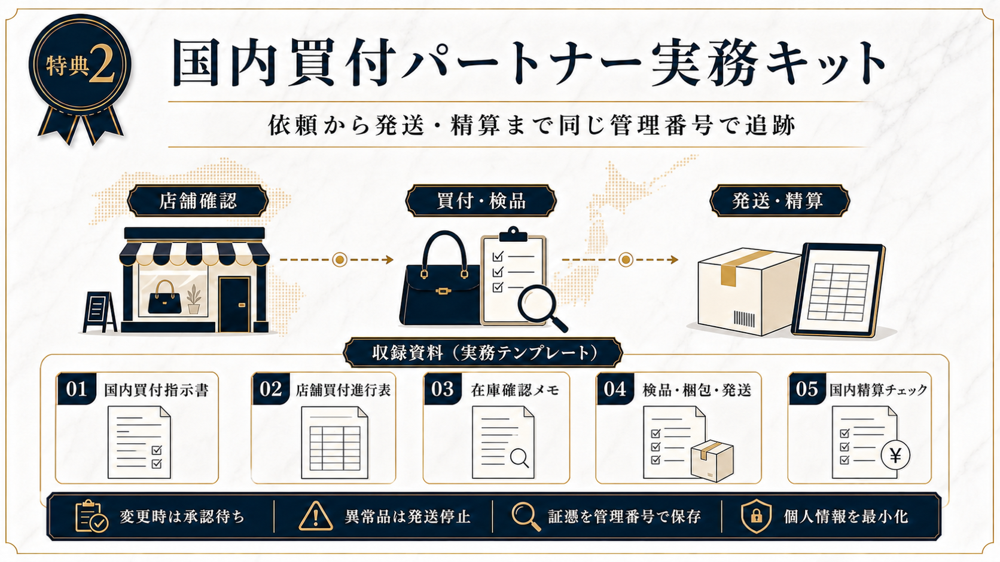

公開特典「国内買付サンプルマニュアル」の店舗買付11工程を、依頼、在庫確認、前払、買付、検品、梱包、発送、精算まで一枚で追える形へ直しました。

クラウドワークスでは、代理購入・受取等を含むこの業務を募集しません。他の募集サービスも掲載直前の規約を確認します。紹介・直接契約等で依頼する場合は、第8章8-5でフリーランス法の適用義務、発注者側の従業員・役員、受注者側の法人形態・代表者以外の役員・従業員、委託期間、取引条件明示、支払期日、期間別義務を確認します。60日以内の支払期日設定義務が適用される場合は、受領日・役務提供日から60日以内のできる限り短い期間内で定めます。

### 特典2-1 国内買付指示書

```text
管理番号:
依頼日:
担当者:
承認者:

商品:
- ブランド:
- 商品名:
- 商品URL:
- 品番:
- 色:
- サイズ:
- 数量:
- 付属品:

店舗:
- 店舗名:
- 公式店舗URL:
- BUYMA禁止・要注意買付先の確認日・結果・根拠:
- 住所:
- 公式連絡先:
- 営業確認日:
- 在庫確認日時:
- 回答者:
- 取置期限:
- 返品・交換条件:

費用と期限:
- 商品価格:
- 交通費上限:
- 資材費上限:
- 発送費上限:
- 購入上限:
- 買付期限:
- 購入者発送期限:
- 前払金:
- 契約報酬:
- 支払期日:

受取・発送:
- 店舗で確認する事項:
- 検品写真:
- 異常時の停止先:
- 発送承認者:
- 配送方法:
- 追跡:
- 補償:
- 発送先の共有方法:
- 発送控えの保存先:
```

BUYMAの買付先確認が未完了、禁止対象、または販売元不明の場合は買付を止めます。発送先等の個人情報を含む原本はアクセスを制限した保管先へ分離し、共有管理表にはマスキング済みの要約と保管先リンクだけを記録します。利用目的に応じた保存期限を決め、担当終了時にアクセス停止と不要なローカル複製の削除を確認します。

### 特典2-2 店舗買付の進行表

| 工程 | 担当 | 完了条件 |
|---|---|---|
| 1. 依頼 | 出品者 | 商品、店舗、上限、期限、報酬、証憑を指示 |
| 2. 在庫確認 | パートナー | 品番、色、サイズ、数量、価格、取置期限を店舗へ確認 |
| 3. 実行判断 | 出品者 | 販売元、総コスト、利益、期限、返品条件を確認 |
| 4. 前払・発注 | 出品者 | 合意済み商品代・交通費等を証拠付きで処理 |
| 5. 買付 | パートナー | 指示と一致する商品を公式店舗で購入 |
| 6. 買付報告 | パートナー | レシート、商品、実費、変更点を報告 |
| 7. 現物検品 | パートナー | 商品、付属品、状態を確認し写真を提出 |
| 8. 発送判断 | 出品者 | 指示・証憑・写真を照合し発送または停止を指示 |
| 9. 梱包・発送 | パートナー | 承認後、指定条件で購入者へ発送 |
| 10. 発送報告 | パートナー | 発送日、配送会社、追跡、送料、控えを提出 |
| 11. BUYMA通知 | 出品者 | 購入者向け発送後に発送通知 |
| 12. 精算 | 双方 | 前払、実費、返金、報酬、差額、支払日を確定 |

在庫、価格、店舗、色、サイズが変わった場合は、その場で代替品を購入しません。変更内容を記録し、出品者の承認を待ちます。

### 特典2-3 在庫確認メモ

```text
お問い合わせ商品:
- 商品名:
- 品番:
- 色:
- サイズ:
- 数量:

確認すること:
1. 現在の在庫
2. 税込価格
3. 取置可否と期限
4. 店頭展示・アウトレット等の状態
5. 付属品
6. 返品・交換条件
7. 他店舗取り寄せの可否・費用・期限

回答:
回答者:
回答日時:
回答根拠:
要再確認:
```

相手が店舗であることを公式サイトで確認し、電話番号や住所を検索結果だけから採用しません。

### 特典2-4 検品・梱包・発送

#### 検品

- [ ] 品番、色、サイズ、数量が依頼と一致する
- [ ] 付属品が商品ページ・注文内容と一致する
- [ ] 傷、汚れ、ほつれ、穴、シミ、破損、機能不良がない
- [ ] 店頭展示、アウトレット等の説明と一致する
- [ ] レシートの商品と現物が一致する
- [ ] 検品写真を残した
- [ ] 異常品を発送せず、出品者へ報告した

#### 梱包・発送

- [ ] 商品特性に合う資材で水濡れ・衝撃・箱内移動を防いだ
- [ ] 商品、付属品、同梱物を再確認した
- [ ] 宛名、住所、配送方法、追跡、補償を照合した
- [ ] 発送人の氏名、住所、電話番号を事実どおり記載した
- [ ] 購入者の選択と違う方法へ無断変更していない
- [ ] 発送日、配送会社、追跡、送料、控えを記録した
- [ ] 発送伝票を6か月間保管する期限と保管先を記録した
- [ ] 実際の購入者向け発送後に発送通知した

### 特典2-5 国内精算チェック

- [ ] 商品代、交通費、送料、資材費等が事前承認または追加承認の範囲内
- [ ] レシート・領収書に店舗、日付、商品、金額がある
- [ ] 個人の買物や別案件の費用が混ざっていない
- [ ] 前払金と実績額の差を計算した
- [ ] 返品・返金・キャンセルを反映した
- [ ] 契約報酬と費用を分けた
- [ ] 検査日、支払期日、支払日を記録した
- [ ] 不要なカード番号・会員番号・住所等を共有用証憑で隠した

最終精算式は特典1と同じです。国内版では外貨項目を使わず、店舗、交通費、税込価格、国内配送の証憑を同じ管理番号へまとめます。

税込の決済総額を商品実績額として使う場合は、内包される消費税や店舗送料等を別項目へ再加算しません。各費用に「決済総額へ含有済み／未包含」を記録し、未包含分だけを追加します。

<!--
特典2 出典対応:
- ROOT-14の店舗買付11工程、検品3項目、梱包6工程、発送、精算を全件使用
- 第2章の現行12工程、総コスト、証憑、BUYMA発送通知、パートナー契約を反映
- CHILD-03とSHEET-DOM-01〜03の管理列を指示書・精算チェックへ反映

不採用:
- Chatwork、銀行口座、特定配送会社の固定指定
- パートナーの自己負担・カード利用、一律前払・費用負担
- 一律資材、固定報酬、固定作業時間
-->

---

## 特典3 直営店・VIP開拓キット

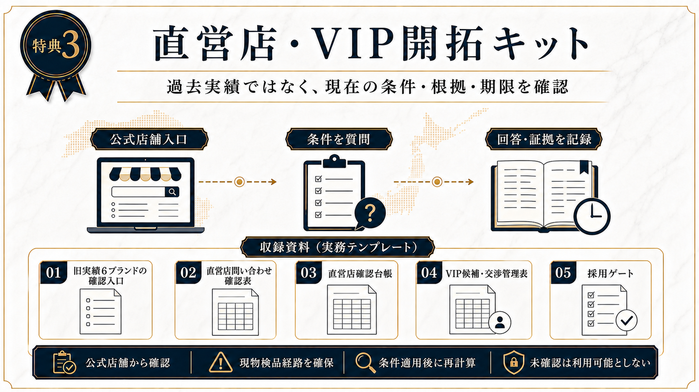

旧特典の6ブランド、直営店管理表の7項目、VIP交渉管理表を、**現在の条件を確認するための候補・質問・記録キット**へまとめます。過去に交渉できたことは、現在の国外配送、税、割引、画像提供、在庫確保を保証しません。

### 特典3-1 旧実績6ブランドの確認入口

確認日: **2026-07-15**

| 旧教材の記録 | 現在の公式店舗確認先 | 初期状態 |
|---|---|---|
| MANOLO BLAHNIK | [公式Store Locator](https://www.manoloblahnik.com/us/storelocator) | 店舗別条件は未確認 |
| Dolce&Gabbana | [公式Store Locator案内](https://support.dolcegabbana.com/hc/en-us/articles/360005976759-How-can-I-find-the-nearest-boutique) | 店舗別条件は未確認 |
| Burberry | [公式Store Locator](https://stores.burberry.com/) | 店舗別条件は未確認 |
| Max Mara | [公式Store Locator](https://store.maxmara.com/en/directory) | 店舗別条件は未確認 |
| Sergio Rossi | [公式Store Locator](https://www.sergiorossi.com/en-int/pages/store-locator) | 店舗別条件は未確認 |
| Ferragamo | [公式Store Locator](https://store.ferragamo.com/en-us) | 店舗別条件は未確認 |

旧表記の「Salvatore Ferragam」は現行のFerragamoへ修正しています。この表は交渉可能リストではなく、公式店舗を探す入口です。

### 特典3-2 直営店問い合わせ確認表

旧管理表の7項目は、現在の検品・返品・画像権利を加えた10項目で確認します。

| 項目 | 記録する内容 |
|---|---|
| 1. 店舗基本情報 | 公式店舗、国、都市、住所、連絡先、回答者、回答日 |
| 2. 検品者への配送 | 出品者または正式な買付パートナーへの配送可否・条件 |
| 3. 輸出時の税 | 税の名称、適用条件、必要書類、最終請求額、根拠 |
| 4. 支払 | 公式決済方法、通貨、手数料、名義、期限、返金方法 |
| 5. 配送 | 配送会社、送料、日数、追跡、補償、禁制品 |
| 6. 他店取り寄せ | 対象店舗、費用、日数、購入期限、キャンセル |
| 7. 連絡先 | 公式窓口、担当部署、対応時間、言語、引継ぎ先 |
| 8. 購入証明 | レシート・インボイスの内容、形式、受取方法 |
| 9. 返品・交換 | 条件、期限、送料、返金、セール・国外発送の例外 |
| 10. 検品補助・画像 | 発送前確認、写真・動画、利用許可、許可範囲・期限 |

店舗の写真・動画は事前確認の補助です。出品者または正式な買付パートナーが商品を受け取り、現物検品してから購入者へ発送します。

### 特典3-3 直営店確認台帳

```text
ブランド:
国・都市・店舗:
公式店舗URL:
公式連絡先:
対応言語・時間帯・タイムゾーン:
回答者・部署:
問い合わせ日時:

商品・品番:
在庫・取置期限:
最終価格・通貨:
輸出時の税・根拠:
支払方法・期限:
店舗から検品者への配送:
送料・日数・追跡・補償:
他店舗取り寄せ:
購入証明:
返品・交換:
画像送付:
画像利用許可:

検品者:
購入者向け発送者:
2区間の配送設計:
個人情報の共有範囲:

回答原文・根拠:
最終確認日:
状態: ［未確認／回答待ち／条件確認済み／停止］
停止理由:
次回確認日:
```

### 特典3-4 VIP候補・交渉管理表

```text
候補ID:
ショップ名:
国:
公式URL:
運営者:
ブランド取扱い根拠:
BUYMA買付先確認:
販売元確認:
発見日:
最終確認日:

連絡目的:
送信日時:
公式送信先:
送信文:
事実として伝えた購入履歴:
事実として伝えた購入予定:
回答原文:
回答者:

割引・特典の内容:
対象商品・除外商品:
最低購入条件:
有効期限:
併用条件:
輸出時の税:
送料・返品・支払:
コード保管範囲:

標準原価:
条件適用後原価:
販売価格:
成約手数料:
見込利益:
見込利益率:
採用判断:
判断者:
再確認日:
停止日・理由:
```

閉鎖済みショップ、架空形式のコード、過去の20%割引等が入った旧サンプル行は使いません。現在の回答原文、期限、根拠を登録した案件だけを「条件確認済み」にします。

回答原文、担当者情報、個別条件、クーポンコード等の原本はアクセスを制限した保管先へ分離します。共有管理表には、マスキング済みの要約、期限、確認日、保管先リンクだけを記録します。保存期限と閲覧者を決め、担当終了・条件終了時にアクセス停止、不要なローカル複製と期限切れコードの削除を確認します。

### 特典3-5 採用ゲート

- [ ] ブランド公式から店舗・ショップの実在を確認した
- [ ] 販売元とブランド取扱い根拠を確認した
- [ ] BUYMAの禁止・要注意買付先を確認した
- [ ] 商品、在庫、価格、税、送料、返品、支払を確認した
- [ ] 出品者または正式な買付パートナーによる現物検品経路がある
- [ ] 購入証明を受け取れる
- [ ] 写真・動画の利用許可を確認した
- [ ] 購入履歴・予定・実績を誇張していない
- [ ] 条件適用後の利益を再計算した
- [ ] 期限、再確認日、停止条件を記録した

1つでも未確認なら、「交渉可能」「VIP獲得済み」「利用可能」として公開・運用しません。

<!--
特典3 出典対応:
- ROOT-13の旧実績6ブランドを全件保持し、Ferragamo表記を修正。現在の公式店舗入口と未確認状態を付与
- ROOT-04とCHILD-02の旧7項目を、第4章の現行10項目・検品経路・返品・画像権利へ更新
- SHEET-DIR-01〜02とSHEET-VIP-01の管理列を、直営店確認台帳・VIP候補交渉管理表へ反映

不採用:
- 6ブランドを現在も交渉・国外配送・割引可能とする保証
- 店舗スタッフの確認だけで購入者へ直送する経路
- 無許諾の実物画像利用
- 閉鎖済みショップ、架空コード、旧割引率を含むサンプル行
-->

---

## 特典4 出品外注化スターターキット

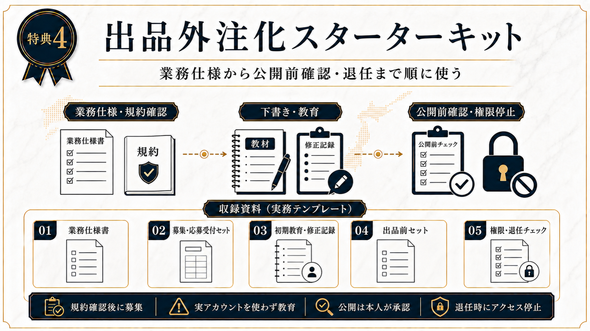

第8章の採用・教育と、第9章の出品SOP・管理表・文章素材を、最初の依頼から公開前確認までの順にまとめます。募集先の規約確認、契約、報酬、権限管理が終わっていない状態では使いません。

### 特典4-1 使う順番

1. 業務仕様を作る
2. 掲載先で委託可能な業務か確認する
3. 正確な募集条件を作る
4. 取引条件を明示し、契約する
5. 実アカウントを使わず、指定形式の下書きで教育する
6. 出品SOPに沿って下書きを作る
7. 公開前チェックを行う
8. 修正理由を記録し、SOPへ戻す
9. 権限を必要な範囲だけ付与する
10. 休止・退任時にアクセスとデータを回収する

### 特典4-2 業務仕様書

```text
業務名:
目的:
適用範囲:
開始日・終了日:
件数・納期:

入力:
- 公式商品URL:
- 買付先URL:
- 型番:
- 使用許可済み画像:
- 価格条件:
- 指定管理表:

作業:
- 商品情報の整理:
- 画像候補の整理:
- 商品コメント下書き:
- 出品下書き:
- 不明点・変更の報告:

納品物:
- 管理表:
- 下書き:
- 画像候補:
- 質問一覧:
- 確認待ち一覧:

完成条件:
- 型番・色・サイズ・素材・付属品の一致
- 販売元・在庫・価格の確認
- 画像・文章の利用根拠
- 送料・税・手数料・利益の確認
- 不明事項の分離

本仕様での禁止事項:
- 推測入力
- 第三者画像・文章の無断利用
- BUYMAアカウントの作成・貸与・認証情報共有（本教材の初期業務）
- 未承認の公開、問い合わせ、購入、送金
- 未確認の人気・限定・著名人・在庫逼迫表現

異常・停止条件:
- 在庫切れ
- 価格・発送地・関税・配送条件の変更
- 画像権利不明
- 販売元不明
- 利益条件未達
- 商品情報の不一致

確認者:
報酬・費用:
検査完了期日:
支払期日:
権限:
個人情報:
再委託:
終了時の返却・削除:
```

### 特典4-3 募集・応募受付セット

次は、掲載先でEC出品下書き業務を募集できると確認した場合、または適切に設計した直接募集で使う共通ひな型です。クラウドワークスでBUYMAの出品・商品登録・在庫管理代行を募集する文面ではありません。

```text
タイトル:
EC商品情報の整理・出品下書き作成 ［件数／期間］

募集を行う者:
氏名・名称: ［氏名または事業者名］
住所・所在地: ［原則としてビル名・階数・部屋番号まで記載。仲介事業者の照会方式を使う場合は、公式案内の例外要件と照会先を確認］
連絡先: ［応募者が照会できる連絡先］
業務に従事する場所: ［在宅／指定場所等］

業務内容:
当方が指定する公式商品ページと管理表を使い、次の作業をお願いします。
・商品名、型番、色、サイズ、素材、付属品等の整理
・使用許可を確認した提供素材による画像候補の整理
・商品コメントと出品情報の下書き
・不明点、在庫切れ、価格変更等の報告

業務に含まれないもの:
・BUYMAアカウントの新規作成、貸与、認証情報共有（本教材の初期業務では扱わない）
・確認前の公開操作
・問い合わせ、代理購入、受取、送金
・第三者画像・文章の無断利用
・確認できない情報の推測

納品物:
［管理表／下書き／画像候補／質問一覧］

件数・期間:
［実際の件数・開始日・終了日］

報酬・支払:
［報酬額または算定方法］
［検査完了期日］
［支払期日・支払方法］

必要な経験・環境:
［業務上必要な入力、表計算、文章、画像整理等］

応募時に確認する内容:
・契約に必要な氏名またはサービス上の表示名
・関連する実務経験
・対応可能な期間・曜日・時間帯
・提出可能な既存実績
・業務内容への質問

不要な応募情報:
年齢、性別、家族構成、婚姻、子どもの有無、趣味、詳細住所等
```

応募情報、既存実績、業務理解、面談を基本に選考します。候補者へBUYMAアカウントを作成・出品・退会させる旧パッチテストは行いません。実作業の確認が必要な場合も、掲載先規約、業務、納品物、報酬、利用権、データ削除を合意してから個別に設計します。

### 特典4-4 初期教育・修正記録

#### 初期教育票

```text
担当者:
対象業務:
現行SOP版:
教育日:
確認者:

共有したもの:
- 業務仕様
- 正常例
- 異常例
- 停止条件
- 使用できる情報源
- 使用できる画像・文章
- 質問方法
- 納品形式

下書き確認:
- 商品事実:
- 販売元:
- 画像権利:
- 在庫・価格:
- 配送・関税:
- 利益:
- 不明点:

任せる範囲:
任せない範囲:
次回確認日:
```

#### 修正記録

```text
管理番号:
担当者:
作成日:
確認者:

修正前:
修正後:
分類: ［商品事実／権利／価格／配送／税／利益／表現／その他］
根拠:
なぜ修正したか:
同じ誤りを防ぐ方法:
SOP更新箇所:
再教育日:
```

作業速度だけで評価せず、不明点を止めて質問できたか、根拠を記録できたか、同じ誤りが減ったかを確認します。

### 特典4-5 出品前セット

同じBrain内の第9章に、次の購入者用素材を全文収録しています。

| 素材 | 使う場所 |
|---|---|
| 資料1 現行化した出品SOP完全版 | 商品情報取得から公開記録まで |
| 資料2 公開前チェック表 | 公開直前の事実・権利・利益・設定確認 |
| 資料4 感性ワード251候補 | 商品事実から説明できる補助語の選択 |
| 資料5 商品コメント28カテゴリ | カテゴリ固有の仕様確認と文章下書き |
| 資料6 現行化した募集文と応募受付 | 募集条件と応募受付 |
| 資料8 Excel 6ファイル・39シートの項目 | 配布用管理表の列設計 |
| 資料9 契約・発注時の確認項目 | 取引条件明示と個人情報・権限確認 |

外部のNotionへ移動する必要はありません。本教材の第9章から必要な表・文章をコピーし、この特典の業務仕様・教育票と組み合わせます。

#### 公開前チェック

- [ ] 商品、型番、色、サイズ、素材、付属品が根拠と一致する
- [ ] 買付先、販売元、在庫、価格、確認日時を記録した
- [ ] 1枚目で商品全体が分かる
- [ ] 画像・文章の使用許可と根拠がある
- [ ] カテゴリ、ブランド、商品名、買付地、発送地を公開前に確認した
- [ ] 配送、送料、関税、到着目安、返品条件が実態と一致する
- [ ] 商品価格・配送料・成約手数料等を含む見込利益を計算した
- [ ] 人気、限定、新作、最安値、著名人等の表現に根拠がある
- [ ] 不明事項を推測で埋めていない
- [ ] 公開者、確認者、公開日時、URLを記録した

### 特典4-6 権限・退任チェック

- [ ] 利用者、端末、閲覧、編集、公開、購入、個人情報の範囲を台帳化した
- [ ] パスワード、カード、復旧コードを共有表へ保存していない
- [ ] 実アカウント操作前にBUYMA利用・運営補助経験と利用制限歴を確認した
- [ ] 仕組み上分離できない権限は出品者本人が操作している
- [ ] 休止・退任時に新規割当てを停止した
- [ ] 作業中、未納品、質問、未精算を一覧化した
- [ ] 管理表、ストレージ、連絡、端末、セッション、トークンを失効した
- [ ] 二要素認証、復旧先、復旧コードを見直した
- [ ] ローカルコピー、個人情報、機密情報の削除を確認した
- [ ] 返却、精算、アクセス停止、削除、未解決事項を記録した

<!--
特典4 出典対応:
- ROOT-09の募集前準備、応募、教育、品質確認、管理、引継ぎを業務仕様・教育票・修正記録・退任チェックへ反映
- ROOT-10、CHILD-01／04／06／08、PDF-SOP、PDF-REC、SHEET-COM-01〜28、recruit.xlsxを第9章の全文素材と接続
- 第8〜9章の現行規約、フリーランス法、画像権利、個人情報、アカウント管理を反映

不採用:
- 旧パッチテスト、候補者アカウント作成・出品・退会
- クラウドワークスでのBUYMA出品・商品登録・在庫管理代行募集
- 女性・主婦限定、年齢・家族構成、固定報酬・収入例
- 無断画像取得、無断公開、アカウント共有
- 旧固定税率・手数料式を含む原管理表のそのまま配布
-->

---

## 特典5 問い合わせ・運営テンプレート集

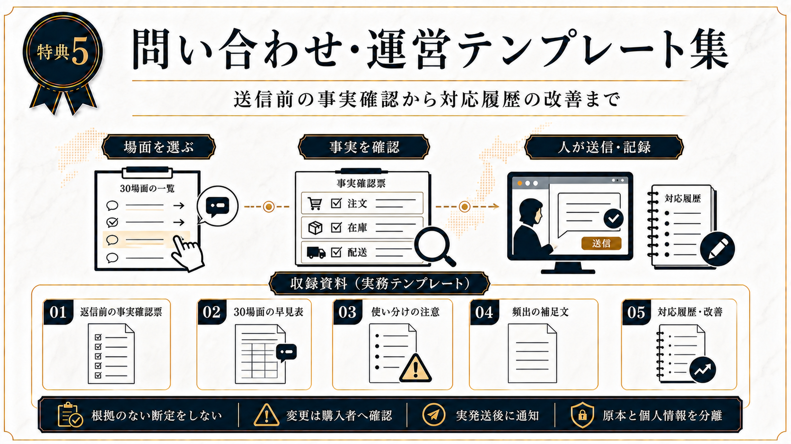

第9章資料3には、取得済み19ページPDFを現行化した問い合わせ30場面と、返品補償、初期不良、価格差、評価、発送通知の補足文を全文収録しています。この特典では、送信前に必要な事実と、30場面の選び方、対応履歴を一つにまとめます。

### 特典5-1 返信前の事実確認票

```text
問い合わせID:
管理番号・注文ID:
購入者:
商品:
問い合わせ日時:
返信期限:

質問の要点:
選ぶ場面番号:

確認した事実:
- 在庫:
- 品番:
- 色:
- サイズ:
- 価格:
- 買付先:
- 配送:
- 発送期限:
- 現在地:
- 返品・補償:

確認元:
確認日時:
未確認事項:
購入者の同意が必要な変更:
承認者:

使用テンプレート:
置換した箇所:
送信者:
送信日時:
次回確認日:
解決状態:
```

氏名、住所、注文番号等をAIへ入力しません。AIで文章を整える場合は匿名化し、送信直前にBUYMAの取引情報と照合して人が追記します。

購入者・注文・問い合わせの原本はアクセスを制限した保管先へ分離し、共有管理表にはマスキング済みの要約と保管先リンクだけを記録します。利用目的に応じた保存期限を決め、担当終了時にアクセス停止と不要なローカル複製の削除を確認します。

### 特典5-2 30場面の早見表

| 番号 | 場面 |
|---:|---|
| 1 | 受注前・基本返信 |
| 2 | 受注前・在庫あり・ワンサイズ |
| 3 | 受注前・在庫あり・サイズ展開 |
| 4 | 受注前・希望サイズなし・別サイズ提案 |
| 5 | 受注前・別サイズ・価格変更あり |
| 6 | 受注前・希望色なし・別色提案・ワンサイズ |
| 7 | 受注前・希望色なし・同サイズの別色提案 |
| 8 | 受注前・別色・価格変更あり・ワンサイズ |
| 9 | 受注前・別色・同サイズ・価格変更あり |
| 10 | 受注前・在庫なし・再入荷確認中 |
| 11 | 受注前・完売・代替なし |
| 12 | 再入荷の連絡 |
| 13 | 身長・体重からサイズを聞かれた |
| 14 | ウエスト等の寸法を聞かれた |
| 15 | 靴が小さめ・大きめか聞かれた |
| 16 | お届けまでの日数を聞かれた |
| 17 | 指定日までに間に合うか聞かれた |
| 18 | 購入者から返信がない |
| 19 | 仕入先等へ確認中 |
| 20 | レシート・インボイスの同梱依頼 |
| 21 | 領収書発行の依頼 |
| 22 | 受注後・支払確定・注文のお礼 |
| 23 | 受注後・支払確定前 |
| 24 | 受注後・希望サイズなし・別サイズ提案 |
| 25 | 受注後・希望色なし・別色提案・ワンサイズ |
| 26 | 受注後・希望色なし・同サイズの別色提案 |
| 27 | 代替提案後にキャンセル希望を受けた |
| 28 | 受注後・在庫なし・代替なし |
| 29 | 発送期限の延長申請 |
| 30 | 予期しない配送・通関遅延による延長連絡 |

コピー用の各本文は、第9章「資料3 現行化した問い合わせテンプレート30場面」にあります。外部リンクではなく、このBrain本文内です。

### 特典5-3 使い分けの注意

#### 在庫・代替提案

- 確認先と確認日時を入れる
- 根拠のない「人気」「残りわずか」「再入荷予定」を書かない
- 色、サイズ、商品URL、価格、配送条件を明示する
- 受注後の変更は、購入者が選べる形で案内する
- 価格差がある代替商品は元取引のまま追加請求しない

#### サイズ案内

- 公式サイズ表と商品実寸の出典を示す
- 身長・体重だけで最適サイズを断定しない
- 着用感の個人差を明記する
- 靴の「小さめ・大きめ」を未確認で断定しない

#### 日数・発送期限

- 出品時の到着目安、現在地、配送会社の案内を確認する
- 「必ず間に合う」と断定しない
- 発送期限は注文完了日時から18日後の同時刻を基本として確認する
- 延長は期限前に理由と新しい見込みを伝え、BUYMA上で申請する
- 支払方法ごとの最大延長期間と購入者の回答を確認する
- COVID専用文や一律1か月延長を使わない

#### 返品・不良

- イメージ・サイズ違いと、初期不良・注文相違を分ける
- 返品補償は、あんしんプラス、対象カテゴリ、新品・未使用等の現在条件を確認する
- 不良を返品補償へ誘導して出品者対応を避けない
- 評価・取引完了前に、BUYMAの取引欄で連絡してもらう
- 写真、注文内容、検品記録、配送記録を確認する

### 特典5-4 頻出の補足文

#### 受注後・価格差がある代替商品

```text
［購入者名］様
ご注文商品の在庫を［確認先］へ確認しましたが、同じ条件では買付できませんでした。
代替候補の［商品名／色／サイズ］は、元のご注文と価格が異なります。

注文完了後の取引金額は変更できないため、元の取引を「買付けできなかった」としてキャンセルし、正しい価格で再出品する必要があります。
キャンセル完了後に再出品ページをご案内しますので、内容をご確認のうえ、再注文するかをご判断ください。
ご迷惑をおかけし、申し訳ございません。
```

#### イメージ・サイズ違いの返品補償案内

```text
［購入者名］様
ご連絡ありがとうございます。
商品に不良はなく、イメージ・サイズ違いによる返品をご希望の場合は、BUYMAの返品補償制度の対象となる可能性があります。

あんしんプラスへの加入、対象カテゴリ、新品・未使用、申請期限等の条件がありますので、評価・取引完了前にBUYMAの現在の案内をご確認ください。
対象可否はBUYMAの審査となるため、当方から承認を確約することはできません。
```

#### 初期不良・注文相違の確認

```text
［購入者名］様
商品についてご心配をおかけし、申し訳ございません。
初期不良または注文内容との相違として確認するため、評価・取引完了の前に、問題箇所と商品全体、タグ・品番が分かる画像を取引欄からお送りください。

注文内容、発送前の検品記録、いただいた画像を確認し、BUYMAの現在の手順に沿って対応をご案内します。
```

#### 発送通知の補足

```text
［購入者名］様
本日、［配送会社・配送方法］で商品を発送しました。
追跡番号: ［購入者のお届け先まで確認できる番号／追跡なし］
現在の到着目安: ［期間］

到着後は、注文内容と商品状態をご確認ください。
問題がある場合は、評価や取引完了の前に取引欄からご連絡ください。
```

発送通知は、商品を購入者の届け先へ実際に発送した後に行います。買付先から出品者・買付パートナーへ送られた段階の追跡番号を使いません。

### 特典5-5 対応履歴・改善

```text
月:
問い合わせ件数:
未返信:
期限超過:
在庫確認:
代替提案:
キャンセル:
発送延長:
返品補償案内:
初期不良・注文相違:
不満評価:

事実誤認:
テンプレート誤選択:
確認元不足:
約束の過不足:
個人情報の共有ミス:
重大案件:

修正したテンプレート:
修正理由:
公式情報の変更:
再教育した担当:
次回確認日:
```

同じ質問が増えた場合は返信文だけを増やさず、商品ページ、到着目安、サイズ情報、返品説明、在庫確認の運用に不足がないか見直します。

<!--
特典5 出典対応:
- PDF-INQ-01〜19の30場面を早見表として全件保持し、本文は第9章資料3に全文収録
- ROOT-01とPDF-INQの評価、発送通知、延長、キャンセル文を頻出補足へ反映
- BUYMA現行ガイドに基づく価格差キャンセル、返品補償、初期不良、仮発送禁止を反映

不採用:
- 根拠のない人気・在庫逼迫・再入荷・到着保証
- 受注後の価格差を元取引の追加請求で処理する手順
- COVID専用文、一律1か月延長、期限後申請
- 初期不良を返品補償へ誘導して回避する文
- 評価変更の要求、購入者を責める文、仮発送通知
-->

---
