# 0から始めるBUYMAロードマップ

## 仕入れ・高値売り・外注化・AI活用まで

更新確認日: 2026-07-10

※本教材はBUYMA運営元とは一切関係のない非公式教材です。

この教材は、これまで別々に提供していたBUYMA教材を、初心者が上から順番に進められる1本のロードマップへ再構成したものです。

古い画面操作やサービス名を覚えるのではなく、BUYMAのルールが変わっても判断できるように「何を確認し、どの順番で進めるか」を中心にまとめています。

### 大切な前提

- 本教材は成果や利益を保証するものではありません。
- BUYMA、各ショップ、ブランド、配送会社、決済サービスの規約や条件は変わります。実践前に必ず最新情報を確認してください。
- 商品画像・商品説明・限定表記・著名人の愛用表記などは、権利と事実を確認できる範囲だけで使用してください。
- AIの出力はそのまま公開せず、商品情報、買付先、価格、法令、BUYMA規約を人が確認してください。
- 本教材および特典（リスト・文章テンプレートを含む）の転載・再配布・共有・二次販売を禁止します。
- デジタルコンテンツの性質上、購入後の返金には対応できません。

---

## 総合目次

### START UP

1. 第0章 全体ロードマップと実践前の注意
2. 第1章 BUYMA START UP

### 仕入れ

3. 第2章 BUYMA国内買付完全解説マニュアル
4. 第3章 海外買付完全解説マニュアル
5. 第4章 直営店直送仕入れ完全解説マニュアル
6. 第5章 BUYMA オンラインVIP仕入れ完全解説マニュアル
7. 第6章 BUYMAショップリスト

### 高値売り・運営設計

8. 第7章 高値売りの戦略
9. 第8章 フル外注化&高値売り戦略

### 外注化

10. 第9章 出品外注化・採用・教育マニュアル
11. 第10章 出品外注化 実践資料集

### AI活用

12. 第11章 BUYMA運営へのAI活用
13. 第12章 ChatGPTプロンプトマニュアル

### 特典

14. 特典1 海外買付 補足マニュアル
15. 特典2 直営店直送 交渉実績のあるブランドリスト
16. 特典3 国内買付サンプルマニュアル
17. 特典4 海外買付 交渉文テンプレート
18. 特典5 出品外注化 文章テンプレート

<!-- ★Brain入稿時: ここに有料ラインを設定する -->

---

## 第0章 全体ロードマップと実践前の注意


### この教材の進め方

BUYMA初心者は、最初から全戦略を同時に始める必要はありません。

1. 第1章でアカウント、ルール、利益計算、出品の基礎を理解する
2. 第2章または第3章から、まず1つの仕入れ方法を選ぶ
3. 第7章で「安く売る」以外の選ばれる理由を作る
4. 自分で再現できた作業から、第8章から第10章を使って外注化する
5. 第11章と第12章のAIは、確認と下書きを速くする補助として使う

### 初心者向け30日ロードマップ

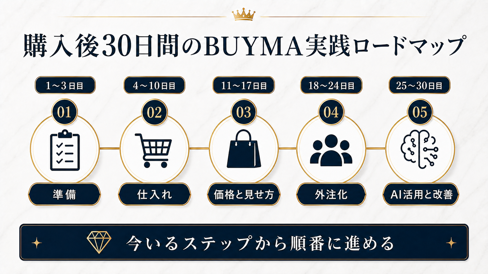

| 期間 | やること | 完了の目安 |
|---|---|---|
| 1〜3日目 | BUYMA公式ガイド、禁止買付先、画像ルールを読む | 禁止事項を自分の言葉で説明できる |
| 4〜7日目 | アカウント準備、利益計算表、管理表を用意する | 仕入総額と最低販売価格を計算できる |
| 8〜14日目 | 1つのカテゴリと1つの仕入れルートで候補商品を調べる | 根拠のある候補を10件以上記録する |
| 15〜21日目 | 少数ずつ出品し、表示・問い合わせ・在庫状況を確認する | 誤記のない出品と返信ができる |
| 22〜30日目 | 数字と作業時間を振り返り、続ける型を1つ決める | 次月の出品・改善計画ができる |

### 最初に守る5つのルール

1. **買付先を確認する**
   国内ECやCtoCなど、BUYMAが禁止している買付先を使わない。公式一覧は随時更新されます。
2. **画像の権利を確認する**
   ブランドやECサイトの画像は、加工しても無断利用できません。自分が権利を持つ画像、または利用許諾を得た画像だけを使います。
3. **出品者責任で検品する**
   仕入先から購入者への未検品直送は禁止です。出品者本人または出品者が管理する検品担当が、注文内容と品質を確認してから発送します。
4. **事実だけを記載する**
   「限定」「日本未入荷」「著名人愛用」「残り1点」などは、確認できる場合だけ使います。
5. **アカウントの責任は自分にある**
   外注先が行った操作を含め、アカウント上の行為は登録者の責任です。権限を必要最小限にし、公開前の確認工程を残します。

### 実践前に確認するBUYMA公式ページ

- [出品を禁止されている買付先](https://qa.buyma.com/shopper/prohibited-item/4007.html)
- [出品画像による権利侵害の禁止](https://qa.buyma.com/shopper/prohibited-item/15733.html)
- [検品・梱包・発送で気をつける点](https://qa.buyma.com/shopper/order-to-delivery/4201.html)
- [出品時の禁止事項](https://qa.buyma.com/shopper/prohibited-item/11394.html)
- [出品が禁止されている商品](https://qa.buyma.com/shopper/prohibited-item/11397.html)

---


## 第1章 BUYMA START UP


### 1. BUYMAの基本構造

BUYMAでは、出品した商品に注文が入ってから買付を行う運営が可能です。在庫を先に大量保有する必要はありませんが、注文後の在庫切れ、価格変動、発送遅延までなくなるわけではありません。

初心者が最初に作るべきものは、出品数ではなく次の4つです。

- 正しい買付先を判断する基準
- 1件ごとの利益計算
- 在庫確認から発送までの記録
- 問い合わせへ正確に返答する型

### 2. 出品者登録の条件

一般出品者の必須条件は、BUYMA公式ガイド上、満20歳以上、日本語で購入者と円滑にやり取りできること、日本へ商品を発送できることです。一般出品者は個人登録です。登録画面や必要項目は変わるため、古いスクリーンショットではなく公式画面に沿って入力してください。

[出品者になるための条件](https://qa.buyma.com/shopper/reg/2303.html)

プロフィールには、実際にない経歴、コネクション、仕入れ能力を書かないでください。ニックネームは変更できないため、長く使える名称を選びます。

### 3. 開始前に準備するもの

- BUYMA専用のメールアドレス
- 入出金を分けて確認できる銀行口座
- 自分の資金計画に合った決済手段
- 利益計算表、出品管理表、取引管理表
- レシート、注文書、検品画像、発送伝票の保管場所
- 自分で撮影した画像、または利用許諾を確認できる画像素材

クレジットカードや銀行は、特定の1社を一律に推奨しません。年会費、海外利用、為替手数料、締日、利用可能枠、繰上返済の条件を比較し、生活費を圧迫しない範囲で選びます。

### 4. 手数料と利益計算

2026年7月10日時点のBUYMA公式ガイドでは、出品は無料、成約手数料は商品価格の5.5〜7.7%税込で、一般出品者は原則7.7%です。振込手数料は1回につき、海外口座1,000円、国内口座385円、楽天銀行220円と案内されています。必ず自分のアカウントと最新ガイドで再確認してください。

[出品者側の手数料](https://qa.buyma.com/bm/usage-fee/4503.html)

最低販売価格を考えるときは、次をすべて入れます。

```text
仕入商品代
+ 現地税・送料
+ 国際送料
+ 関税・輸入消費税・立替手数料（出品者負担の場合）
+ 決済・為替コスト
+ 国内送料
+ 外注費・梱包費
+ BUYMA成約手数料
+ 返品・再送などに備える余裕
+ 確保したい利益
= 必要な売上額
```

固定の「利益率20%」を前提にせず、商品ごとに計算してください。

### 5. 初出品の流れ

1. 買付先と商品を確認する
2. 権利を確認できる画像を準備する
3. 商品名、型番、色、サイズ、素材、付属品を仕入先情報と照合する
4. 配送日数、発送地、関税負担、返品条件を実態どおりに設定する
5. 公開前に別の目で確認する

BUYMAでは、一定の条件に一致した商品が「出品審査中」になります。審査は最大4営業日で、登録情報、出品方法、買付先情報などの確認を求められる場合があります。最初の1品だけに限った手続きと決めつけず、メールを確認し、レシートや注文明細は取引完了から1年程度保管してください。

[出品審査について](https://qa.buyma.com/shopper/sell/12609.html)

### 6. 商品ページの基本

#### 商品名

ブランド名、商品名、型番、色など、商品を正しく特定できる言葉を優先します。商品と関係ない検索語の羅列は禁止です。

#### 商品コメント

次の順に書くと、事実と魅力を分けやすくなります。

1. 何の商品か
2. 素材・仕様・サイズ
3. 使用場面や合わせ方
4. 買付・発送・関税の案内
5. 在庫確認のお願い

```text
【商品について】
ブランド: [ブランド名]
商品名・型番: [確認できる情報]
素材・仕様: [仕入先で確認できる事実]
付属品: [実際に付属するもの]

【ご注文前に】
在庫は変動します。ご注文前に在庫状況をお問い合わせください。
買付後は出品者責任のもとで検品し、問題がないことを確認して発送します。
お届け目安と関税負担は、商品ページの設定をご確認ください。
```

#### 画像

第三者の画像は、加工すれば使えるわけではありません。自分で撮影した画像、利用許諾を得た画像、または権利を保有している画像を使います。許諾の根拠も保存します。

### 7. 初心者のリサーチ

参考にするのは「他の出品者の文章や画像」ではなく、「売れている理由」です。

比較する項目:

- 最近の取引で動いているブランド、カテゴリ、価格帯
- 国内完売、国内未入荷、新シーズンなどの需要理由
- 買付先の信頼性と在庫の取りやすさ
- 自分の仕入総額と最低販売価格
- 配送日数、検品、問い合わせ対応など価格以外の差

参考にする出品者は3〜5名に絞り、商品名・説明・画像をコピーしません。また、他者の注文実績から利益額を断定しないでください。見えるのは販売価格の一部であり、実際の仕入値、送料、割引、返品コストまでは分からないためです。

### 第1章チェックリスト

- [ ] 最新の禁止買付先を確認した
- [ ] 1件ごとの利益計算ができる
- [ ] 画像の権利を説明できる
- [ ] 出品情報を仕入先と照合した
- [ ] レシート・検品画像・発送伝票の保管場所を決めた

---


## 第2章 BUYMA国内買付完全解説マニュアル


### 1. 国内買付とは

本章の国内買付は、日本国内の実店舗で商品を買い付ける方法です。

**国内のオンラインECサイトからの買付はBUYMAで禁止されています。** 公式ガイドには楽天市場、Amazon.co.jp、Yahoo!ショッピング、Qoo10などが例示されています。メルカリ、ラクマ、ヤフオクなどのCtoCも禁止です。リストは更新されるため、毎回確認してください。

[出品を禁止されている買付先](https://qa.buyma.com/shopper/prohibited-item/4007.html)

### 2. 国内買付の強みと注意点

強み:

- 実店舗在庫を確保できれば配送までの工程を短くしやすい
- 商品を直接確認しやすい
- 店舗限定、地域限定、国内完売品などを提案できる場合がある
- 返品や交換条件を店頭で確認しやすい

注意点:

- 参入しやすく、同じ商品に出品が集中すると価格競争になりやすい
- 交通費、買付時間、発送費を入れると利益が消えることがある
- 「国内定価より高くても必ず売れる」わけではない
- 店舗の取り置き、電話注文、決済、転売に関する条件は店舗ごとに違う


### 3. 3ステップの実務フロー

#### STEP 1 リサーチして出品候補を作る

1. BUYMA内で買付地、カテゴリ、ブランド、価格帯を絞る
2. 最近の取引、問い合わせ、出品者数を確認する
3. 商品名と型番をブランド公式情報で照合する
4. 自分が行ける実店舗または契約済みの買付担当の地域で在庫ルートを確認する
5. 仕入総額と最低販売価格を計算する

価格帯は固定しません。薄利になる商品、高額で回転が遅い商品を分け、自分の資金と実績に合う範囲から始めます。

#### STEP 2 問い合わせ・受注後に在庫確認する

```text
お世話になっております。
[ブランド名]の[商品名・型番]について、店頭在庫を確認したくご連絡しました。

カラー: [色]
サイズ: [サイズ]
型番: [型番]

在庫の有無、取り置きの可否、受取期限、付属品、返品・交換条件を教えていただけますでしょうか。
```

確認事項:

- 型番、色、サイズ、数量
- 商品状態と付属品
- 取り置き期限
- 購入方法と本人確認の要否
- 返品・交換条件
- レシートまたは購入証明

#### STEP 3 買付・検品・発送する

1. 在庫と注文内容を再確認する
2. 商品代、交通費、報酬の承認を残す
3. 実店舗で買付し、レシートを受け取る
4. 型番、色、サイズ、付属品、傷、汚れ、機能を検品する
5. 日付と取引IDが分かる検品画像を残す
6. 商品を保護して梱包する
7. 追跡可能な方法で購入者へ発送する
8. 購入者へ発送した時点で発送通知する

### 4. 国内買付パートナーへ任せる場合

パートナーへ渡す情報は、商品URLだけでは足りません。

- 取引ID
- ブランド、商品名、型番、色、サイズ
- 店舗名、連絡先、取り置き名義、期限
- 支払上限、交通費上限、報酬
- 検品項目と撮影例
- 梱包方法、発送方法、発送期限
- 異常時に止める条件

前払いをする場合は、いきなり高額商品を任せず、小さな案件で連絡、証憑、精算の精度を確認します。身分証の取得は必要性と保管方法を検討し、クラウドソーシングの本人確認や電子契約など、目的に合う方法を選んでください。

### 第2章チェックリスト

- [ ] 国内オンラインECを買付先にしていない
- [ ] 型番・色・サイズ・付属品を確認した
- [ ] 交通費と外注費まで利益計算に入れた
- [ ] 店舗のレシートと検品画像を保存した
- [ ] 購入者へ発送してから発送通知した

---

## 第3章 海外買付完全解説マニュアル


### 1. 海外買付の3つの型

1. **店舗買付**: 現地パートナーが実店舗で買付し、検品・梱包・発送する
2. **オンライン買付**: 現地パートナーが正規オンラインショップで買付し、受取後に検品・発送する
3. **転送・受取**: 出品者が購入し、現地パートナーが受取・検品・発送する

いずれも、問題のない商品を購入者へ届ける責任は出品者にあります。

### 2. 海外買付のメリットとリスク

メリット:

- オンラインに掲載されない実店舗在庫を探せる
- 国や都市ごとに異なる在庫へアクセスできる
- 店舗スタッフとの関係から入荷情報を得られる場合がある
- 国内完売、現地限定、新シーズンなどの提案幅が広がる

リスク:

- パートナー報酬、交通費、国際送料、為替差、関税などコスト項目が増える
- 前払い後の連絡途絶、誤購入、紛失、返品困難などがある
- 国ごとの税、輸出、配送、個人情報、契約の確認が必要
- 「特定ブランドはこの方法しかない」と断定できない。ブランドと地域の販売方針は変わる


### 3. 店舗買付の標準フロー

1. 出品者が商品情報と在庫確認先を指定する
2. パートナーが店舗へ在庫確認する
3. 出品者が商品代、交通費、上限額を承認する
4. パートナーが型番・色・サイズを再確認して買付する
5. レシートと買付完了報告を送る
6. パートナーが検品し、写真・動画を送る
7. 出品者が注文情報と検品証跡を照合する
8. 問題がなければ梱包・発送を承認する
9. 追跡番号と発送伝票を受け取る
10. 購入者へ発送した時点でBUYMAの発送通知を行う

### 4. パートナー募集と選考

クラウドソーシング、現地掲示板、紹介、SNSなどが候補になります。ただし、各サービスの募集規約を「すり抜ける」表現は使わず、実際の業務内容、報酬、立替、個人情報の扱いを正確に記載してください。

確認する項目:

- 居住地域と店舗・配送拠点までの時間
- 現地語での在庫確認能力
- 稼働可能時間と返信目安
- 立替の可否と上限
- 検品・撮影・梱包の環境
- 過去のBUYMA利用制限や関連業務の有無
- 契約、守秘、証憑提出への同意

パスポート画像の相互交換を一律必須にはしません。必要な本人確認は、クラウドソーシングの本人確認、ビデオ面談、契約、少額テストなどを組み合わせ、個人情報は必要最小限だけ取得・保管します。

### 5. 送金と精算

特定の送金サービスを固定で推奨しません。対応国、受取通貨、手数料、為替レート、着金時間、返金条件、本人確認を比較します。

管理表に残す項目:

- 取引ID
- 商品代、現地税、交通費、送料、梱包費、報酬
- 送金日、通貨、換算レート、着金確認
- レシート、請求書、配送伝票の保存先
- 立替と精算の差額

### 6. 関税と発送通知

通常の海外発送商品で関税等が請求された場合、購入者が負担するのが原則です。一方、「関税込」「関税負担なし」として出品した取引は、最終的に出品者負担です。課税の有無と金額は税関が判断するため、固定額を保証しません。

[関税の支払い](https://qa.buyma.com/buy/pay/3104.html)

買付先からパートナーまでの配送開始時にBUYMAの発送通知をしてはいけません。発送通知は、検品を終えた商品をパートナーまたは出品者が購入者へ発送した時点で行います。

### 第3章チェックリスト

- [ ] パートナーとの役割、上限額、異常時対応を決めた
- [ ] レシート、検品画像、発送伝票を保存した
- [ ] 追跡可能な発送方法を選んだ
- [ ] 関税負担を商品ページと一致させた
- [ ] 購入者へ発送した時点で発送通知した

---

## 第4章 直営店直送仕入れ完全解説マニュアル

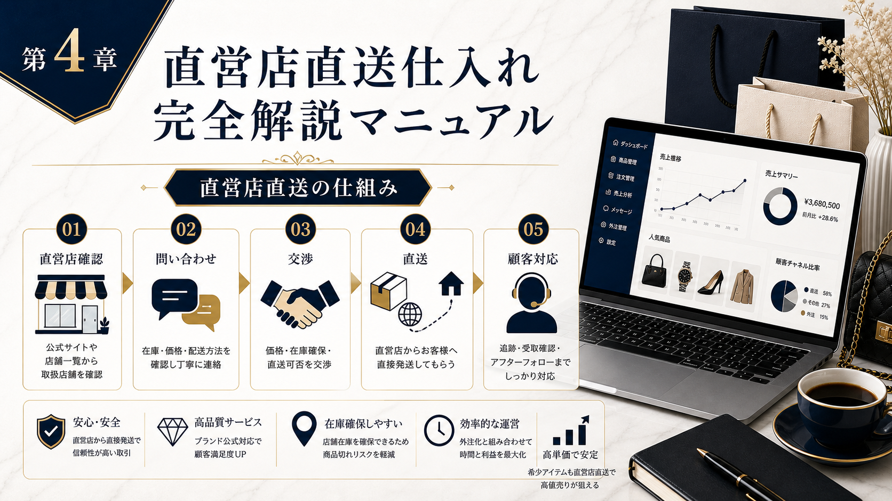

> 重要: 旧教材では「直営店から購入者へ直接送る」方法を扱っていましたが、BUYMA公式ガイドでは、出品者責任での検品を経ない仕入先からの直送は禁止されています。本章では、直営店との仕入れ関係を作り、出品者または管理下の検品担当を経由して購入者へ発送する「直営店連携仕入れ」として解説します。

<!-- A04_第4章_直営店直送の仕組み.png は「店舗からお客様へ直接届ける」と記載され、現行ルールと矛盾するため未挿入。公開前に差し替える。 -->


### 1. この仕入れ方法の価値

- 直営店の店頭在庫を確認できる
- 公式オンラインにないサイズ・色を探せる場合がある
- 店舗スタッフと継続的な連絡ルートを作れる
- 在庫確認、取り寄せ、購入証明、配送条件を直接確認できる

ただし、VAT免税、国外配送、割引、他店取り寄せ、実物画像の提供は、国・ブランド・店舗・担当者によって異なります。獲得を保証できる条件ではありません。

### 2. 問い合わせ前に準備すること

- ブランド、国、店舗名、公式連絡先
- 商品名、型番、色、サイズ
- 購入者への発送ではなく、出品者または検品担当への配送先
- 決済方法と名義
- 検品担当、発送担当、返品時の受取先
- 送料、税、返品、輸出の条件
- 連絡履歴を残す管理表

### 3. 店舗へ確認する項目

1. 在庫の有無と取り置き期限
2. 型番・色・サイズ・付属品
3. 出品者または検品担当住所への配送可否
4. 配送会社、追跡、送料、所要日数
5. 現地税・VATの扱い
6. 支払方法、本人確認、決済上限
7. 他店舗からの取り寄せ可否
8. レシートまたはインボイスの発行
9. 返品・交換条件
10. 継続連絡に使える公式メール等

### 4. 交渉から発送まで

1. 公式サイトのストアロケーターで店舗を確認する
2. 店舗の公式連絡先から問い合わせる
3. 回答を管理表へ記録する
4. 注文が入ったら在庫と総額を再確認する
5. 出品者または検品担当へ配送してもらう
6. 型番、色、サイズ、付属品、品質を検品する
7. 検品画像と購入証明を保存する
8. 追跡可能な方法で購入者へ発送する
9. 購入者へ発送した時点で発送通知する

直営店スタッフによる確認は参考情報です。最終的な検品責任を店舗へ移すことはできません。

### 5. 管理表の列

| 店舗 | 国・都市 | 連絡先 | 対応言語 | 配送先 | 送料 | 税の扱い | 支払方法 | 取り寄せ | 返品 | 最終確認日 |
|---|---|---|---|---|---:|---|---|---|---|---|

情報は日付と担当者名を添えて残し、受注のたびに再確認します。

### 第4章チェックリスト

- [ ] 仕入先から購入者へ未検品で直送しない
- [ ] 公式の店舗・連絡先であることを確認した
- [ ] 検品担当と配送先を決めた
- [ ] 税・送料・返品条件を注文ごとに確認した
- [ ] 購入証明と検品証跡を保存した

---

## 第5章 BUYMA オンラインVIP仕入れ完全解説マニュアル


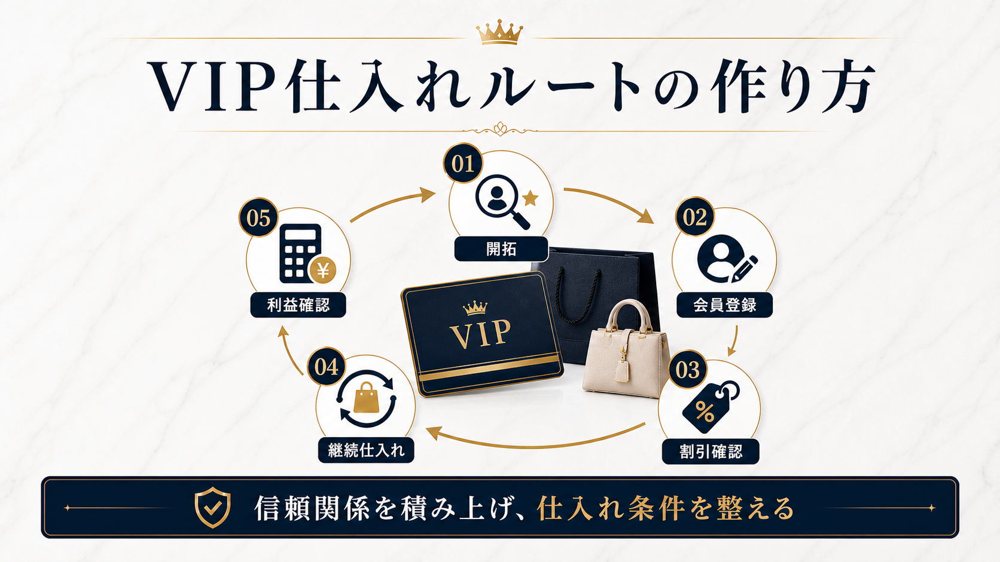

### 1. オンラインVIP仕入れとは

海外の正規セレクトショップ等と取引実績や関係を作り、個別クーポン、会員条件、卸条件などを相談する仕入れ方法です。

割引率、適用ブランド、セール併用、税、配送国、最低購入額は店舗ごとに異なります。「10〜30%割引」「免税になる」といった数字を前提に利益計算しないでください。

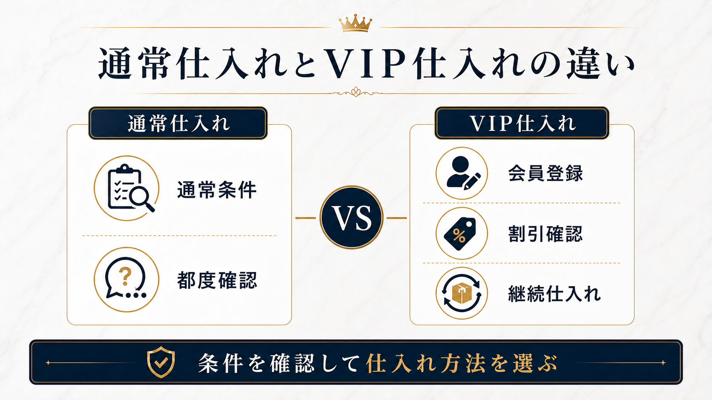

### 2. 交渉先を選ぶ

候補店は、ブランド取扱店の検索サイトやブランド公式の販売店一覧から探します。候補が見つかったら、次を確認します。

- 会社名、住所、連絡先、返品規約が明記されている
- ブランド公式または正規販売代理店として確認できる
- BUYMAの禁止買付先に該当しない
- 日本への販売・発送条件が明確
- 商品単位で販売元と真贋を確認できる
- 支払方法と返金条件が現実的

### 3. 交渉管理表

| 店舗 | URL | 取扱ブランド | 初回連絡日 | 返信 | 条件 | 適用外 | 有効期限 | 購入実績 | 再確認日 |
|---|---|---|---|---|---|---|---|---|---|

最初の連絡で条件が得られなくても、購入後や取引実績ができた後に、相手の迷惑にならない間隔で再相談できます。

### 4. 交渉で守ること

- 実在しない購入実績、月間購入額、会社規模を伝えない
- 架空の俳優・インフルエンサーを名乗らない
- 同一文面を大量送信しない
- 相手の言語と営業時間を尊重する
- 条件をもらったら、対象ブランド、有効期限、併用、返品を確認する
- クーポンや担当者情報を第三者へ再配布しない

### 5. 誠実な交渉文

```text
Subject: Inquiry about a regular customer or trade discount

Dear Customer Support Team,

My name is [name], and I purchase authentic fashion items for customers in Japan.
I am interested in building a regular purchasing relationship with your store.

Could you please let me know whether you offer any regular-customer, trade, or volume-purchase program?
If available, I would appreciate details about eligible brands, minimum purchase requirements, validity, and shipping conditions to [country].

I understand that approval and discount conditions are at your discretion.
Thank you for your time.

Kind regards,
[name]
```

日本語の意味を確認し、自分の実績と条件に合わせて書き換えてから送信してください。

### 第5章チェックリスト

- [ ] 正規性とBUYMAの利用可否を確認した
- [ ] 実績や購入予定額を誇張していない
- [ ] 割引対象・期限・返品・送料を確認した
- [ ] 条件がなくても利益が成立するか計算した
- [ ] 交渉履歴を管理表へ残した

---

## 第6章 BUYMAショップリスト


この章は、第2〜5章の知識を前提に使う実務資料です。ショップ名が載っていることは「BUYMAで使える」「正規品である」「現在営業している」という保証ではありません。

### ショップを使う前の10項目

1. BUYMAの禁止買付先・要注意買付先を確認する
2. ブランド公式の取扱店情報を確認する
3. 運営会社、住所、電話番号を確認する
4. 返品・返金・配送規約を確認する
5. 販売元がマーケットプレイス出店者ではないか確認する
6. 商品名、型番、素材、付属品が一致するか確認する
7. 日本への送料、関税、税、手数料を決済直前まで確認する
8. 追跡と配送日数を確認する
9. 注文書・レシート・インボイスを保存できるか確認する
10. 最終確認日を管理表へ記録する

### 旧教材に掲載されていた探索先

- ShoppingMap.it
- FARFETCHのブティック一覧
- 海外通販WALKER
- FRMODA

これらは「候補を探す入口」として旧教材に掲載されていた例です。現在の安全性やBUYMAでの利用可否を保証する推薦リストではありません。最終判断は商品と販売元ごとに行ってください。

### ショップリスト管理テンプレート

| 判定 | ショップ | 国 | 公式・正規性の根拠 | 販売元 | 日本配送 | 返品 | 証憑 | BUYMA確認日 | 最終確認日 |
|---|---|---|---|---|---|---|---|---|---|
| 未確認 |  |  |  |  |  |  |  |  |  |

<!-- 入稿保留: 旧Notionの「ショップリスト.pdf」は公開ページ上でダウンロードできず、本文を取得できていない。PDF受領後にこの位置へ実データを移植し、各行へ最終確認日を付ける。 -->

---

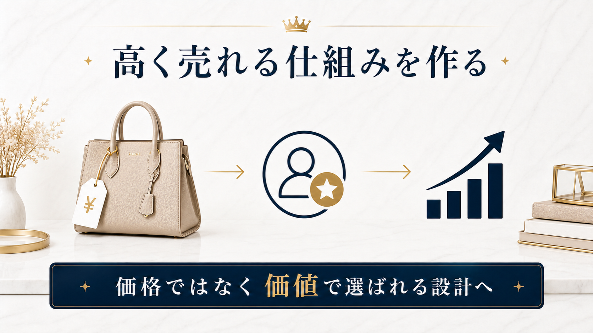

## 第7章 高値売りの戦略


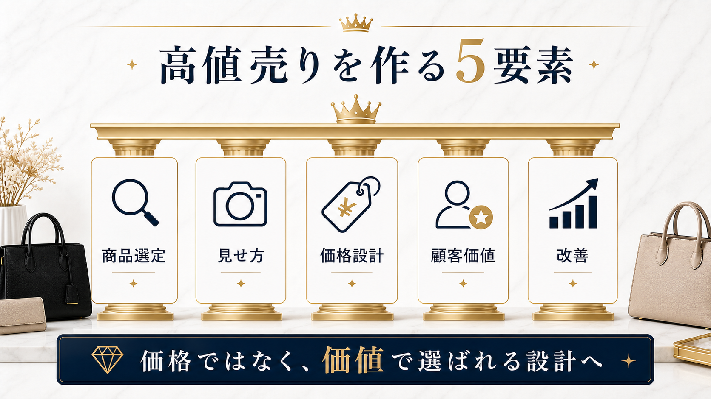

### 1. 高値売りの定義

高値売りは、理由なく価格を上げることではありません。購入者が「この出品者から、この条件で買う理由」を理解でき、その価値に見合う価格を設定することです。

旧教材で挙げていた候補は次のとおりです。

- 新シーズン商品
- 国内完売品
- 国内未入荷品
- 国内未入荷ブランド
- 国・店舗・期間限定の商品や色
- ニッチなブランドでサイズ展開が残っている商品

いずれも、表示する前に事実確認が必要です。

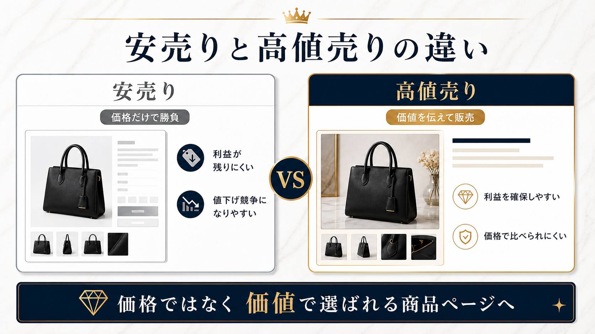

### 2. 高値売りを作る5要素

1. **希少性**: 国内完売、限定、入手ルートの少なさ
2. **在庫確保力**: 国・都市・店舗をまたいで探せること
3. **安心**: 正規性、検品、証憑、追跡、丁寧な説明
4. **速さ**: 在庫確認と返信、買付、発送の予測精度
5. **提案力**: サイズ、素材、使用場面、比較情報を分かりやすく伝えること

### 3. 候補商品の絞り方

次の条件を満たす商品から検証します。

- 需要の根拠がある
- 同じ条件の出品者が多すぎない
- 買付先が正規で、在庫を再確認できる
- 総コストを入れても利益が残る
- 価格以外の違いを説明できる
- 返品、遅延、関税のリスクを受け止められる

### 4. 価格設定

競合の最安値から決めるのではなく、自分の必要売上額を先に計算します。その後、同一条件の競合、国内価格、配送日数、関税負担、評価、在庫状況を比較します。

値下げ判断は次の順番です。

1. 商品ページの誤記や分かりにくさを直す
2. 画像、タイトル、仕様、配送案内を改善する
3. 買付先や配送方法を見直す
4. 需要が弱い商品は期限を決めて停止する
5. それでも必要なら、最低利益を割らない範囲で価格を調整する

### 5. 禁止したい見せ方

- 根拠のない「限定」「完売必至」「残り1点」
- 許可のない著名人・モデル画像
- 実際には確認していない「愛用」「雑誌掲載」
- 関係ない検索キーワード
- 参考価格を不当に高く見せる二重価格

### 第7章チェックリスト

- [ ] 高く売れる理由を1文で説明できる
- [ ] 希少性や掲載実績の証拠を残した
- [ ] 総コストと最低販売価格を計算した
- [ ] 同じ配送・関税条件の競合と比較した
- [ ] 誤認を招く言葉や画像を使っていない

---

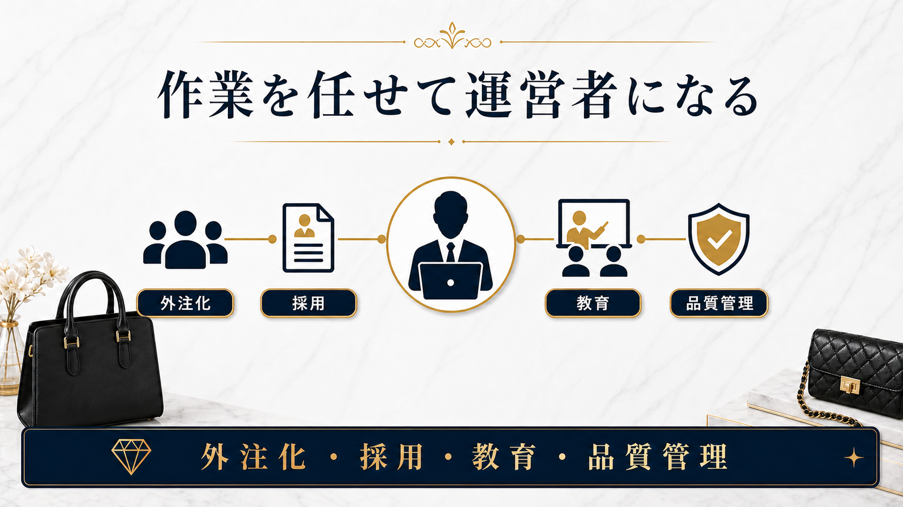

## 第8章 フル外注化&高値売り戦略

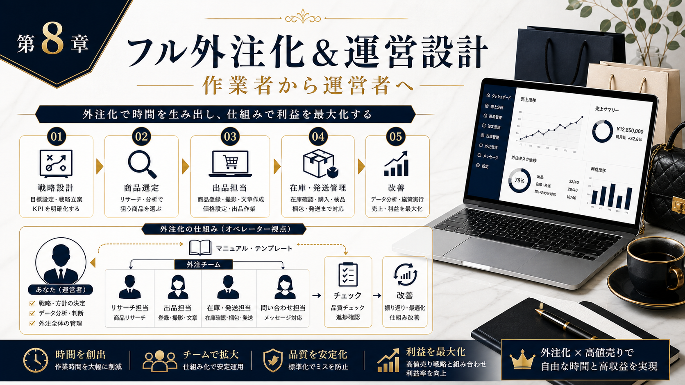

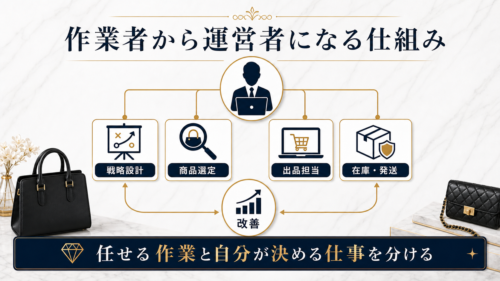

### 1. 外注化の目的

外注化の目的は、作業を手放すこと自体ではありません。

- 出品・問い合わせ・買付・発送の品質を安定させる
- 自分が商品戦略、価格、改善へ時間を使えるようにする
- 誰か1人が休んでも止まらない運営にする

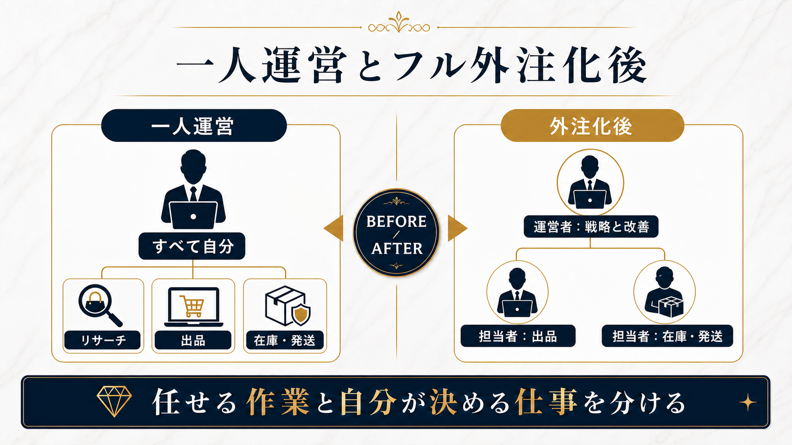

### 2. 外注化前に作る3つ

1. **作業手順**: 何を、どの順番で行うか
2. **判断基準**: どこまで進め、どこで止めるか
3. **証跡**: 誰が、いつ、何を確認したか

「優秀な人に任せる」だけでは、その人が辞めたときに止まります。マニュアル、チェック表、承認工程、代替担当を作り、人ではなく仕組みに知識を残します。

### 3. 外注化する順番

1. 手動出品の下書き
2. 検品・梱包・発送
3. 定型問い合わせの下書き
4. 在庫確認と買付候補の整理
5. 売上・外注費・シフト等の事務
6. リサーチ候補の収集

**自動出品ツールによる大量出品は本教材では扱いません。** BUYMAは、サイト運営を妨げる自動出品ツールや許諾していない外部プログラムについて、アカウント停止リスクを公式に注意喚起しています。

[自動出品ツール等へのBUYMA公式注意喚起](https://qa.buyma.com/information/news/30118.html)

### 4. 段階的に権限を渡す

| 段階 | 任せる範囲 | 公開・決済 |
|---|---|---|
| 1 | オフラインの練習課題 | なし |
| 2 | 管理表への候補入力 | なし |
| 3 | BUYMAで下書き作成 | 出品者が確認・公開 |
| 4 | 定型業務 | 例外時は停止・承認依頼 |
| 5 | リーダー業務 | 権限と監査方法を個別設定 |

外部委託やパートナーのログイン自体はBUYMAで一律禁止されていませんが、すべての行為の責任はアカウント登録者にあります。過去に利用制限を受けたユーザーが検知されると、別アカウントも制限される場合があります。

[外部委託時のアカウント管理](https://qa.buyma.com/shopper/reg/13732.html)

### 5. 高値売りと外注化の役割分担

外注担当へ任せやすいもの:

- 事実情報の収集
- 型番、色、サイズの照合
- 管理表入力
- 定型文の下書き
- 検品写真と発送証跡の提出

運営者が残すもの:

- 仕入先の最終判断
- 高値で売る理由の設計
- 最低販売価格と値下げ判断
- 例外対応、クレーム、アカウント責任
- マニュアルと権限の更新

### 第8章チェックリスト

- [ ] 自分の作業を言語化した
- [ ] 停止条件と承認者を決めた
- [ ] 自動出品ツールを前提にしていない
- [ ] 1人に依存しない代替手順がある
- [ ] 公開・決済・個人情報の権限を絞った

---

## 第9章 出品外注化・採用・教育マニュアル

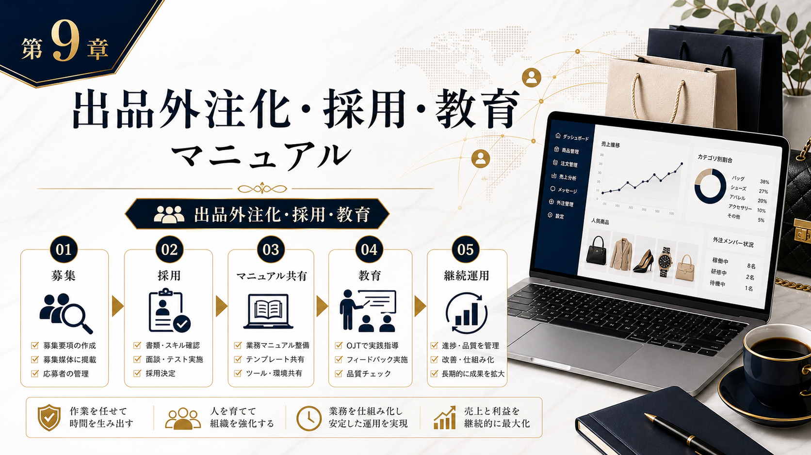

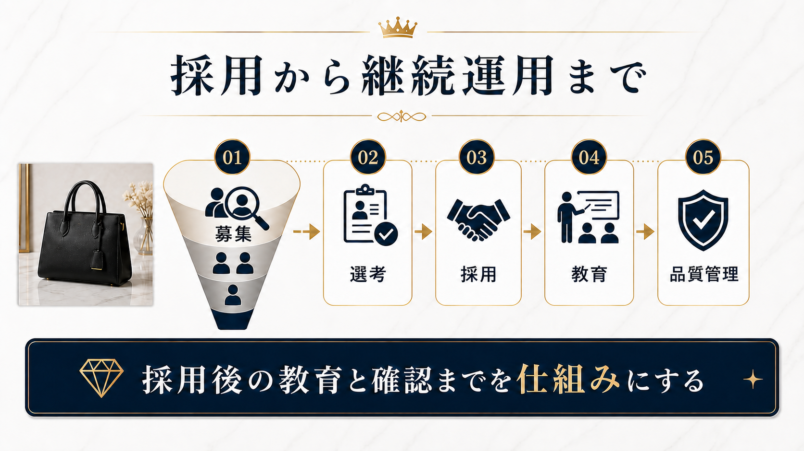

### 1. 採用フロー

1. 業務を定義する
2. 募集文を掲載する
3. 応募内容を確認する
4. オフラインのサンプル課題を依頼する
5. 面談する
6. 契約と権限設定を行う
7. 少数件で教育する
8. 品質を確認して段階的に増やす

旧教材の「応募者自身にBUYMAアカウントを作らせ、1品出品後に退会させるパッチテスト」は使いません。重複登録や不適切な出品を誘発するためです。代わりに、実際のBUYMAアカウントへ触れないサンプル課題で、正確さ、期限、報告、画像権利への理解を確認します。

### 2. 募集文の作り方

募集文には次を明記します。

- 業務内容と対象範囲
- 1件の定義と納品物
- 作業環境
- 報酬、締日、支払日
- 研修とチェック方法
- 禁止事項と守秘義務
- BUYMA利用制限歴・関連業務歴の確認

「女性限定」「主婦限定」「年齢で選別」など、業務上必要のない属性条件は使いません。報酬は古い相場を固定せず、現在の募集市場、作業時間、難易度、品質責任に合わせます。

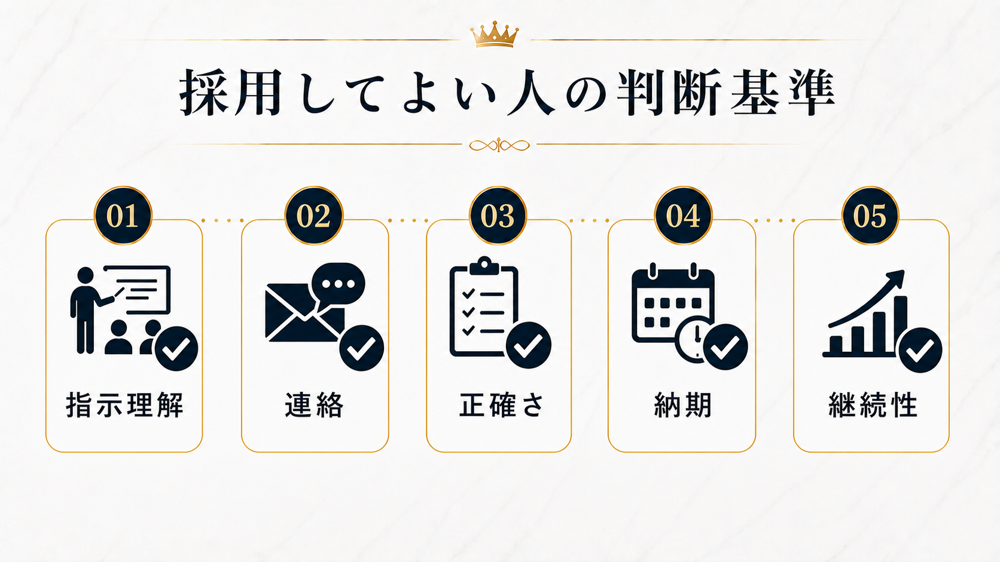

### 3. サンプル課題

実在商品の情報を使う場合も、公開やアカウント操作はさせません。

提出物:

- 商品名、型番、色、サイズ、素材、付属品の整理
- 使用できる画像かどうかの判断と根拠
- 事実だけで作った商品コメント案
- 不明点と確認が必要な箇所
- 作業時間と質問事項

評価項目:

| 項目 | 見る点 |
|---|---|
| 正確さ | 型番・色・サイズの誤りがない |
| 権利 | 無断画像や文章コピーを提案しない |
| 報告 | 不明点を隠さず止められる |
| 期限 | 遅れる前に相談できる |
| 再現性 | マニュアルに沿って同じ品質を出せる |

### 4. 面談で確認すること

- 現在と過去のBUYMA活動、他出品者の業務経験、利用制限歴
- 作業可能時間と連絡可能時間
- PC、通信、共有環境
- 商品情報や個人情報を扱う場所
- 作業で迷ったときの行動
- 契約、守秘、データ削除への同意

### 5. 教育フロー

1. マニュアルを先に読んでもらう
2. 画面共有で1件を一緒に行う
3. 3〜5件を下書きで作成してもらう
4. 出品者が全件確認し、理由付きで修正する
5. 誤りを改善メモへ記録する
6. 同じ誤りが減ったら件数を増やす
7. 定期的に抜き取り確認する

### 6. 契約で検討する項目

- 委託業務と納品物
- 報酬、経費、締日、支払日
- 守秘義務、個人情報、アカウント情報
- 画像・文章・マニュアルの権利
- 再委託の可否
- 誤購入、紛失、返品、損害時の責任
- 契約期間、解除、データ返却・削除
- 準拠法、合意管轄

契約文は参考テンプレートをそのまま使わず、実際の業務と当事者に合わせ、必要に応じて専門家へ確認してください。

### 第9章チェックリスト

- [ ] 業務上不要な属性条件を募集文から外した
- [ ] 実アカウントを使わないサンプル課題にした
- [ ] 過去の利用制限歴と関連業務歴を確認した
- [ ] 公開前チェックを出品者側に残した
- [ ] 契約・権限・データ削除方法を決めた

---

## 第10章 出品外注化 実践資料集

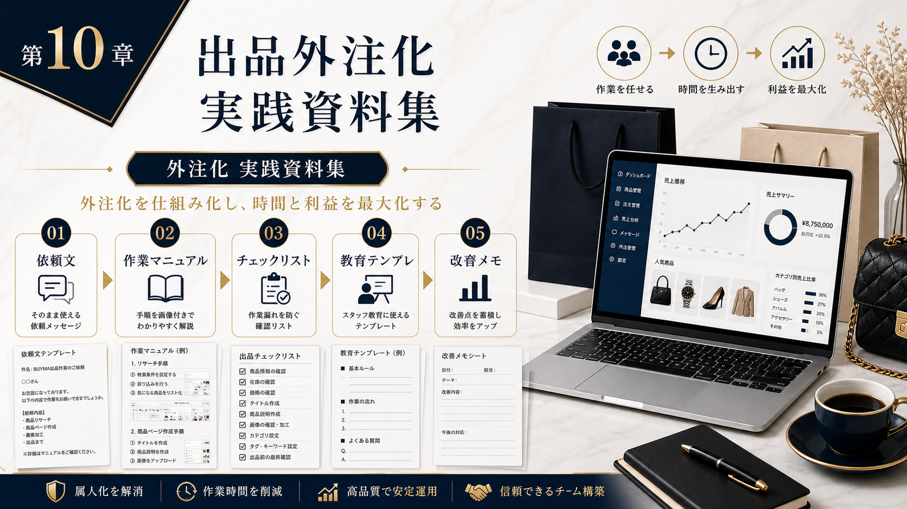


### 資料1 募集文テンプレート

```text
タイトル
【在宅・継続】ファッション商品の情報整理・出品下書きサポート

本文
ご覧いただきありがとうございます。
BUYMAで販売する商品の情報整理と、出品下書きをお手伝いいただける方を募集します。

【業務内容】
・指定商品の型番、色、サイズ、素材、付属品の整理
・利用許諾を確認できる画像の登録補助
・商品コメントの下書き
・管理表への進捗記録

公開、価格の最終決定、購入者対応は当方が確認します。
第三者サイトの画像・文章の無断転載は禁止です。

【納品物】
1商品につき、管理表1行とBUYMAの下書き1件

【報酬】
[1件または時間単価、研修中の条件、締日、支払日を明記]

【応募時に教えてください】
・関連業務の経験
・1週間の稼働時間
・作業環境
・BUYMA活動、他出品者の業務経験、利用制限歴の有無
・不明点があるときにどのように確認するか

採用前に、BUYMAへ公開しないサンプル課題をお願いします。
```

### 資料2 出品SOPの型

```text
SOP名:
目的:
担当:
開始条件:
必要な入力:
手順:
公開前チェック:
停止条件:
報告先:
納品物:
更新日:
```

### 資料3 公開前チェック表

- [ ] 商品名・型番・色・サイズが仕入先と一致
- [ ] 素材・付属品・シーズンが確認できる
- [ ] 画像の権利または利用許諾を確認
- [ ] 限定・完売・著名人愛用等の根拠を確認
- [ ] 買付先が禁止先ではない
- [ ] 仕入総額と販売価格を再計算
- [ ] 発送地・日数・関税負担が実態と一致
- [ ] 誤字、リンク、メモ欄を確認
- [ ] 出品者が最終承認

### 資料4 感性ワード集

商品コメントは形容詞を並べるのではなく、商品の事実を説明した後に1〜2語だけ使います。

- シンプル: 落ち着いた、知的な、上品な、洗練された、都会的な、控えめな、ベーシックな
- やわらかい: フェミニンな、愛らしい、可憐な、ソフトな、軽やかな、優しい
- 華やか: 鮮やかな、存在感のある、華やかな、印象的な、ドラマティックな
- クール: シャープな、スタイリッシュな、凛とした、モダンな、ミニマルな
- 実用: 合わせやすい、オンオフ使える、持ち運びやすい、収納しやすい

「新作」「限定」「希少」「日本未入荷」「著名人愛用」「雑誌掲載」は感性ワードではなく事実表示です。裏付けがある場合だけ使います。

### 資料5 商品コメント基本テンプレート

```text
[ブランド名]の[商品名]です。
[素材・形・色・仕様]が特徴で、[確認できる使用場面]に合わせやすいアイテムです。

商品名・型番: [ ]
素材: [ ]
色: [ ]
サイズ: [ ]
付属品: [ ]

在庫は変動しますので、ご注文前にお問い合わせください。
```

カテゴリ別の差し替え例:

| カテゴリ | 事実として確認して入れる項目 | 使用場面の例 |
|---|---|---|
| シャツ | 襟、袖、素材、透け感 | 通勤、食事、重ね着 |
| ニット | 編み、厚み、ネック、素材 | 秋冬、重ね着、普段使い |
| ワンピース | 丈、シルエット、袖、裏地 | 食事、行事、普段使い |
| カーディガン | 丈、ボタン、厚み | 羽織り、温度調整 |
| スカート | 丈、形、スリット、裏地 | 通勤、休日、食事 |
| パンツ | 股上、形、裾、伸縮 | 通勤、旅行、普段使い |
| コート | 丈、素材、裏地、開閉 | 通勤、防寒、フォーマル |
| ジャケット | 素材、襟、開閉、ポケット | オンオフ、重ね着 |
| 水着 | 形、裏地、パッド、調整 | ビーチ、プール |
| スニーカー | 素材、ソール、留め方 | 普段使い、旅行 |
| パンプス | ヒール高、つま先、素材 | 通勤、食事、行事 |
| サンダル | ストラップ、ソール、留め方 | 春夏、旅行 |
| ブーツ | 丈、ヒール、開閉、素材 | 秋冬、雨天可否 |
| レインブーツ | 防水範囲、丈、ソール | 雨天、通勤 |
| カードケース | ポケット数、開閉、寸法 | 通勤、ミニバッグ |
| 財布 | 札・小銭・カード収納、開閉 | 普段使い、贈り物 |
| バッグ | 寸法、持ち手、開閉、収納 | 通勤、旅行、休日 |
| ピアス | 素材、寸法、留め具 | 普段使い、食事 |
| イヤリング | 素材、寸法、留め具 | 普段使い、行事 |
| ネックレス | 長さ、素材、留め具 | 重ね付け、食事 |
| ブレスレット | 内周、素材、留め具 | 普段使い、贈り物 |
| その他アクセサリー | 用途、素材、寸法 | 商品に合わせる |
| 腕時計 | ケース径、ベルト、ムーブメント、防水 | 通勤、普段使い |
| サングラス | レンズ、フレーム、寸法、UV表記 | ドライブ、旅行 |
| 眼鏡 | フレーム、寸法、デモレンズの有無 | 普段使い |
| 帽子 | 頭周り、素材、調整 | 普段使い、旅行 |
| スカーフ・ストール | 寸法、素材、柄 | 首元、バッグ、羽織り |
| マフラー | 寸法、素材、厚み | 防寒、贈り物 |

### 資料6 改善メモ

| 日付 | 商品・作業 | 発生した誤り | 原因 | 修正 | SOP更新 | 担当確認 |
|---|---|---|---|---|---|---|

同じ誤りを個人の注意力だけで防がず、チェック表またはSOPへ戻します。

---

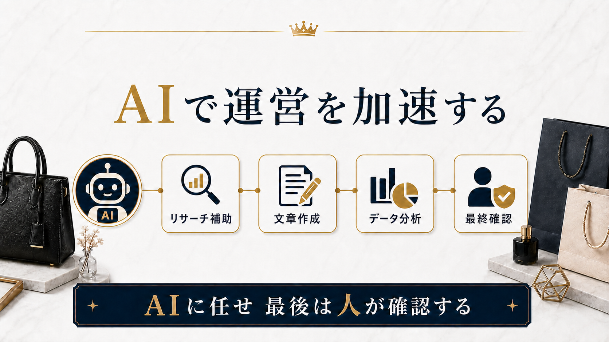

## 第11章 BUYMA運営へのAI活用


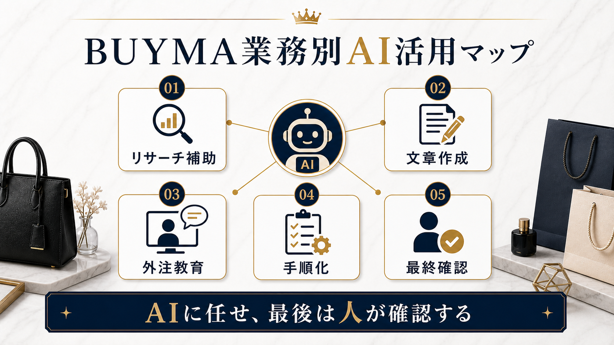

### 1. AIに任せる役割

- 候補の整理
- 文章の下書き
- 翻訳と逆翻訳
- マニュアルの構造化
- チェック項目の作成
- データから仮説を出す

### 2. 人が残す役割

- 買付先の正規性とBUYMA利用可否
- 在庫、価格、型番、素材、付属品の事実確認
- 画像や文章の権利確認
- 利益計算、公開、決済
- 購入者対応と例外判断


### 3. AI利用の禁止事項

- AIが挙げたショップを未確認で買付先にする
- AIが作った商品情報を仕入先と照合せず公開する
- 実在しない限定、掲載、愛用、割引、購入実績を書く
- BUYMAのパスワード、購入者の住所・氏名、カード情報を入力する
- 自動出品や大量投稿をAIに実行させる
- 他者の募集文や商品コメントを丸ごと入力して模倣する

### 4. 5つの活用例

#### ショップ候補の調査

AIには候補と確認項目を出させます。URLの存在、正規性、BUYMA利用可否は人が確認します。

#### VIP交渉文

自分の実績、希望条件、送付先を入力し、誇張のない下書きと日本語訳を作ります。

#### 商品コメント

仕入先で確認した情報だけを入力し、「与えていない事実を追加しない」と指示します。

#### 外注マニュアル

自分が実際に行った手順を入力し、目的、入力、手順、停止条件、チェック、納品物へ整理します。

#### 募集文

業務、納品物、報酬、必要能力を入力し、不要な属性条件や誇大表現がない文章へ整えます。

### 5. AIの出力を検品する

1. 数字、URL、固有名詞を元資料と照合する
2. BUYMAの最新公式ガイドと矛盾しないか確認する
3. 与えていない事実が追加されていないか確認する
4. 誤認、差別、著作権侵害、過度な煽りがないか確認する
5. 公開前に人が最終承認する

---

## 第12章 ChatGPTプロンプトマニュアル

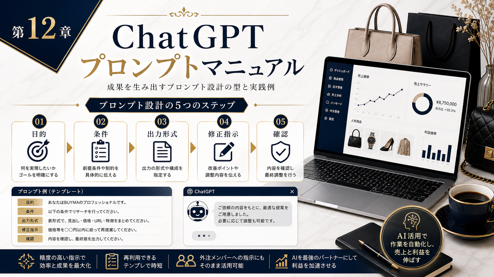

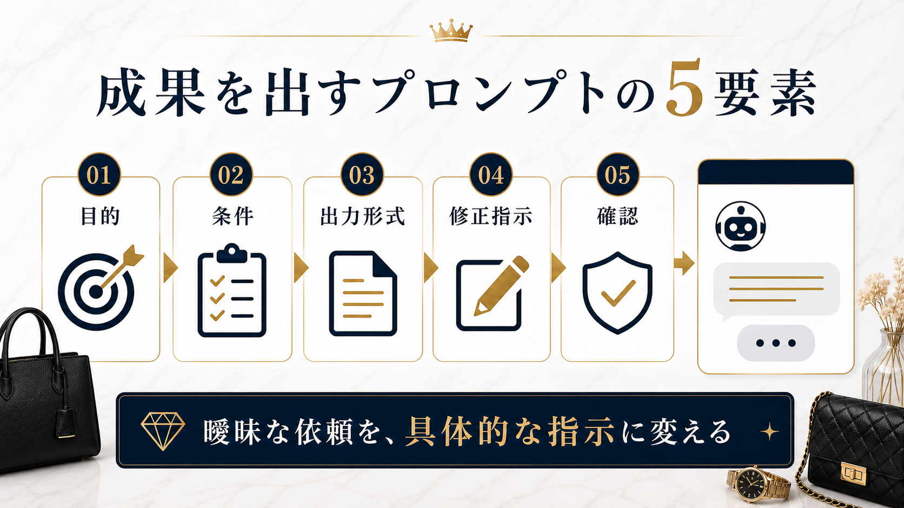

### 1. プロンプトの5要素

1. **目的**: 何を作るか
2. **入力情報**: 何を根拠にするか
3. **制約**: してよいこと、してはいけないこと
4. **出力形式**: 表、箇条書き、文字数など
5. **確認方法**: 不明点、根拠、要確認をどう示すか

OpenAI公式のプロンプトガイドでも、役割・指示・例・関連コンテキストを明確に分け、望む出力例を示す方法が案内されています。

[OpenAI Prompt engineering guide](https://developers.openai.com/api/docs/guides/prompt-engineering)


### 2. 商品コメント作成

```text
目的:
BUYMAの商品コメントの下書きを作る。

入力情報:
ブランド: [ ]
商品名・型番: [ ]
素材: [ ]
色・サイズ: [ ]
仕様・付属品: [ ]
想定する使用場面: [ ]

制約:
- 入力にない事実を追加しない
- 「限定」「日本未入荷」「著名人愛用」「完売必至」を勝手に使わない
- 他者の文章を模倣しない
- 120〜200字

出力形式:
1. 商品コメント
2. 根拠が足りない箇所
3. 公開前に確認する項目
```

### 3. ショップ候補調査

```text
目的:
[ブランド名]の正規取扱店候補を調べるための確認表を作る。

制約:
- 実在を確認できない店名やURLを作らない
- 分からない項目は「未確認」と書く
- BUYMAで利用可能とは断定しない

出力列:
店名 / 国 / 公式URL / 正規性の確認先 / 日本配送 / 返品 / 要確認事項
```

AIがウェブを確認できない状態では、候補生成より「調査項目の作成」に使います。

### 4. VIP交渉文の翻訳

```text
あなたはビジネスメールの編集者です。
次の事実だけを使って、丁寧で簡潔な英語メールを作ってください。

送信者: [ ]
過去の購入実績: [事実のみ]
希望: [通常顧客・取引・数量割引制度の有無を質問]
配送国: [ ]

制約:
- 月間購入額を創作しない
- 割引を要求口調にしない
- 承認を保証する表現を使わない

英語メール、日本語訳、誇張に見える箇所の3つを出力してください。
```

### 5. 外注マニュアル作成

```text
次の実作業メモを、外注担当向けSOPへ整理してください。

[実際に行っている手順を貼る]

出力:
目的 / 担当 / 入力 / 手順 / チェック / 停止条件 / 報告 / 納品物

制約:
- 元の手順にないBUYMA操作を追加しない
- 公開・決済・個人情報操作は出品者承認にする
- 不明点は推測せず「要確認」とする
```

### 6. 募集文作成

```text
次の条件で業務委託の募集文を作ってください。

業務: [ ]
納品物: [ ]
報酬: [ ]
稼働: [ ]
必要能力: [ ]
禁止事項: [ ]

制約:
- 性別、年齢、家族構成など業務上不要な条件を入れない
- 「簡単に稼げる」「お小遣い」など仕事を軽視する表現を使わない
- 画像や文章の無断利用を禁止する
- BUYMA利用制限歴と関連業務歴の確認を入れる
```

### 7. AI出力のレビュー

```text
次の文章を公開前レビューしてください。

[文章を貼る]

確認観点:
1. 入力にない事実
2. 誇大・誤認を招く表現
3. 著作権・画像利用の問題
4. BUYMA規約と衝突する可能性
5. 個人情報・機密情報

出力:
問題箇所 / 理由 / 修正案 / 人が公式情報で確認すること
```

### 8. うまくいかないとき

- 目的を1つに絞る
- 元資料を追加する
- 禁止事項を明記する
- 欲しい形式の例を1つ見せる
- 1回で完成させず、事実確認と文章調整を分ける

---

## 特典1 海外買付 補足マニュアル

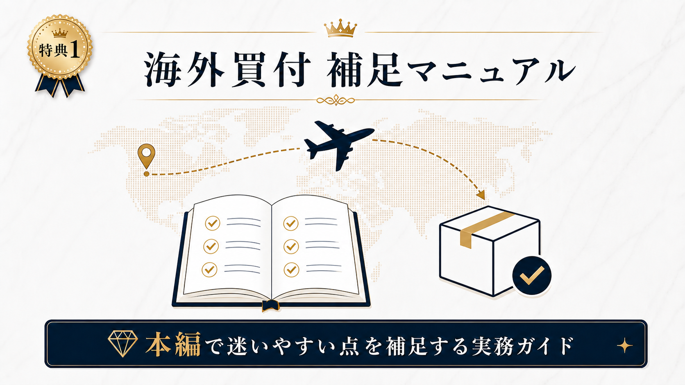

### パートナーへ渡す実務指示書

```text
取引ID:
商品URL:
ブランド・商品名:
型番:
色・サイズ:
付属品:
店舗・連絡先:
商品代上限:
交通費上限:
報酬:
買付期限:
発送期限:
指定配送方法:
```

### 検品チェック

1. 商品名、型番、色、サイズ、数量
2. 商品ページに記載された付属品
3. 傷、汚れ、ほつれ、破損、機能
4. タグ、シリアル、箱等の状態
5. 日付と取引IDが分かる全体・細部写真

問題があれば発送せず、写真と状況を報告します。

### 梱包チェック

- 衣類はきれいに畳み、必要に応じて薄葉紙等で保護する
- 傷つきやすい商品は気泡緩衝材で保護する
- 箱の中で商品が動かないよう緩衝材を入れる
- 水濡れ対策をする
- 外箱をH貼り等で確実に封かんする
- 追跡可能な方法で発送する

### 精算チェック

- 商品代、交通費、送料、梱包費、報酬を分ける
- 立替にはレシートまたは明細を付ける
- 通貨と換算レートを残す
- 送金日と着金確認を記録する

---

## 特典2 直営店直送 交渉実績のあるブランドリスト


旧教材作成時に、直営店との交渉実績が記録されていたブランドです。

- MANOLO BLAHNIK
- Dolce & Gabbana
- Burberry
- Max Mara
- Sergio Rossi
- Salvatore Ferragamo

このリストは、現在の直送・割引・国外配送・VAT免税を保証するものではありません。店舗、国、担当者、時期によって条件は変わります。また、現在のBUYMAルールでは、仕入先から購入者への未検品直送は行わず、出品者または管理下の検品担当を経由してください。

特典のブランド・ショップ情報は変動します。同一文面での一斉交渉など、相手方の迷惑になる使い方はしないでください。リストの共有・再配布を禁止します。

---

## 特典3 国内買付サンプルマニュアル


### 店舗買付担当向け

1. 出品者から商品情報と店舗情報を受け取る
2. 店舗へ在庫、取り置き、付属品、返品条件を確認する
3. 出品者から商品代、交通費、報酬の承認を受ける
4. 店舗で型番、色、サイズを再確認して買付する
5. レシートと買付完了を報告する
6. 商品、付属品、傷、汚れ、機能を検品する
7. 取引IDと日付が分かる画像を送る
8. 出品者の確認後に梱包する
9. 指定の追跡可能な方法で購入者へ発送する
10. 追跡番号と発送伝票を報告する
11. 立替経費を証憑付きで精算する

### 異常時は発送しない

- 型番、色、サイズ、数量が違う
- 傷、汚れ、破損、付属品不足がある
- 注文時と価格や条件が違う
- 指定の追跡方法を使えない
- 購入者情報または配送先に不明点がある

---

## 特典4 海外買付 交渉文テンプレート


文章テンプレートはそのまま使用せず、ご自身の状況に合わせて書き換えてください。

### 在庫確認

```text
Subject: Stock inquiry for [product name / reference]

Dear [store name] Team,

Could you please confirm the availability of the following item?

Product: [ ]
Reference: [ ]
Color: [ ]
Size: [ ]

If available, please also let me know the total price, included accessories, hold period, and shipping options to [inspection address/country].

Thank you for your assistance.
Kind regards,
[name]
```

### 継続購入・VIP制度の確認

```text
Subject: Inquiry about regular purchasing options

Dear [store name] Team,

My name is [name], and I purchase authentic fashion items for customers in Japan.
I am interested in purchasing from your store on a regular basis.

Could you please let me know whether you offer a regular-customer, trade, or volume-purchase program?
If so, I would appreciate details about eligibility, eligible brands, validity, shipping, and return conditions.

Thank you for your time.
Kind regards,
[name]
```

### 購入後の再相談

```text
Subject: Follow-up regarding regular purchasing

Dear [store name] Team,

Thank you for your support with my recent order [order number].
I was pleased with [事実として伝えられる具体的な対応].

I would like to continue purchasing from your store. If you have a regular-customer or trade program, could you please share the current conditions?

Thank you again.
Kind regards,
[name]
```

---

## 特典5 出品外注化 文章テンプレート


文章テンプレートはそのまま使用せず、ご自身の状況に合わせて書き換えてください。

### 応募受付

```text
ご応募ありがとうございます。

選考のため、次の点を確認させてください。
・関連業務の経験
・1週間の稼働可能時間
・作業環境
・BUYMAでの活動、他出品者の業務経験、利用制限歴の有無
・不明点がある場合の確認方法

ご回答を確認後、BUYMAへ公開しないサンプル課題をご案内します。
```

### サンプル課題の案内

```text
次の商品資料をもとに、管理表のサンプル1行を作成してください。

提出物:
1. 商品名・型番・色・サイズ・素材・付属品
2. 使用できる画像かどうかの判断と根拠
3. 事実だけで作った商品コメント案
4. 不明点・要確認事項
5. 作業時間

BUYMAへの登録・公開は行わないでください。
期限は[日時]です。難しい場合は期限前にご相談ください。
```

### 採用連絡

```text
サンプル課題へのご対応ありがとうございました。
内容を確認し、ぜひ継続してお願いしたいと考えています。

次に、業務範囲、報酬、支払日、守秘義務、アカウント情報の取扱いを契約書で確認します。
契約後は、マニュアル説明と少数件の研修から開始します。
公開と価格の最終決定は当方が行います。
```

### 修正依頼

```text
ご対応ありがとうございます。
[商品・項目]について、次の修正をお願いします。

現状: [ ]
正しい内容: [ ]
確認元: [ ]
理由: [ ]
期限: [ ]

同じ判断が必要な場合に使えるよう、改善メモにも追記してください。
```

### 不採用連絡

```text
このたびはご応募とサンプル課題へのご対応をありがとうございました。
検討の結果、今回は募集条件との一致を踏まえ、契約を見送ることとなりました。
お時間をいただいたことに感謝いたします。
```

---

## 最終注意事項

※本教材はBUYMA運営元とは一切関係のない非公式教材です。

本教材は、2026年7月10日時点で確認できたBUYMA公式ガイドを基準に旧教材を再構成しています。規約、画面、手数料、サービス条件は変更されるため、実践時点の公式情報を優先してください。

本教材および特典（リスト・文章テンプレートを含む）の転載・再配布・共有・二次販売を禁止します。

デジタルコンテンツの性質上、購入後の返金には対応できません。

AIの出力、交渉文、契約文、募集文は必ず人が確認し、ご自身の状況に合わせて使用してください。
