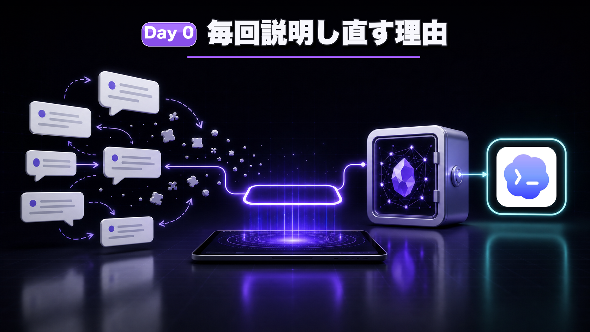
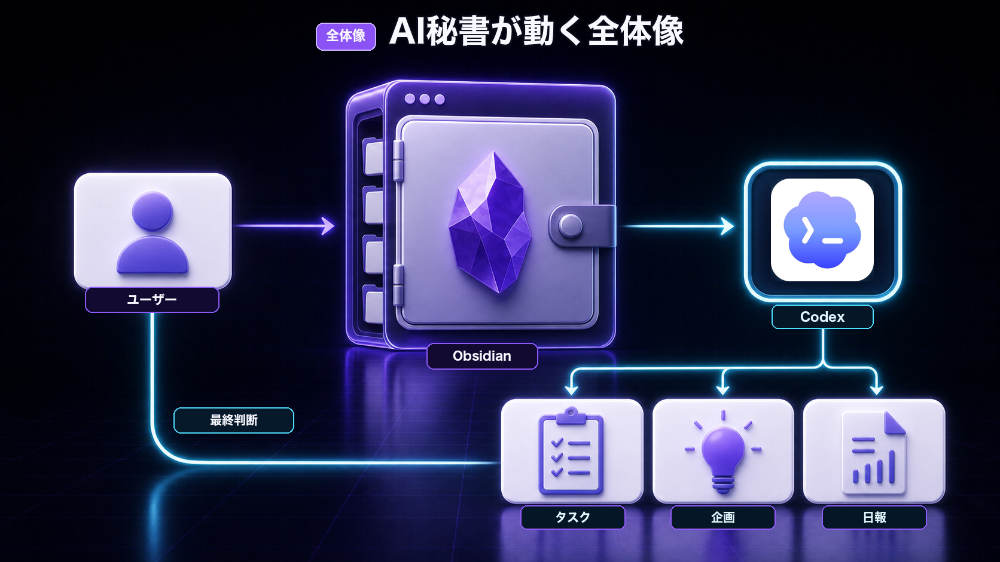
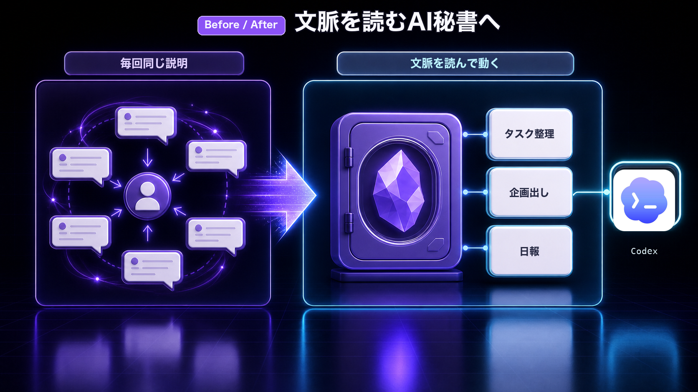
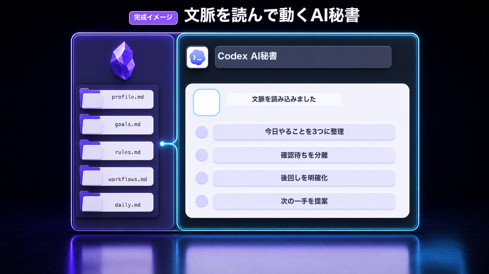
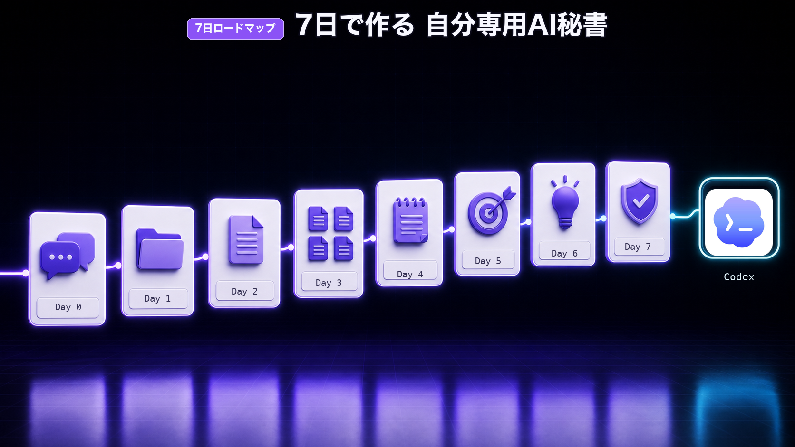

# Day 0: なぜAIに毎回説明し直すのか



作成日: 2026-07-04
参照: [[教材_Codex×Obsidian_AI秘書_商品設計]] / [[教材_Codex×Obsidian_AI秘書_Brain販売ページ下書き]]

## 今日のゴール

Day 0では、まだ細かい設定作業には入りません。

今日のゴールは、次の4つを理解することです。

- この教材で作る `2nd-brain` とは何か
- なぜAIに毎回同じ説明をし直す必要があるのか
- なぜObsidianがAIの記憶になるのか
- Codex × Obsidianで、どんなAI秘書環境を作るのか

ここが分かると、Day 1以降の作業が「ただの設定」ではなく、自分専用AI秘書を育てるための土台作りに見えてきます。

## ステップ0: この教材で作る `2nd-brain` とは何か

この教材では、Obsidian上に `2nd-brain` という保管庫を作ります。

`2nd-brain` は、直訳すると「第2の脳」です。

といっても、最初から巨大な知識ベースを作るわけではありません。

この教材で作る `2nd-brain` は、**Codexに読ませるための小さなAI秘書用の記憶置き場** です。

イメージはこうです。

```text
2nd-brain/
├── 自分のプロフィール
├── 今の目標
├── AIに守ってほしいルール
├── 今日のメモ
├── タスク
└── 企画の種
```

ここに自分の情報を置いておくことで、Codexに毎回ゼロから説明しなくても、

> この `2nd-brain` を読んで、今日やることを整理して

と頼めるようになります。

つまり、`2nd-brain` は「AIに自分の文脈を渡すための置き場所」です。

AI秘書は、その `2nd-brain` を読んで動く存在だと考えてください。



## 毎回AIに同じ説明をしていませんか？

ChatGPTやCodexで新しい会話や別の作業を始める時、こんなことはありませんか？

- 自分が何をしている人なのか、毎回説明している
- 今の目標や作業状況を、毎回説明している
- 過去に話したアイデアを、もう一度貼り直している
- タスクやメモを見せるたびに、前提から説明している
- AIは便利だけど、自分のことを覚えている感じがしない

これは、あなたの使い方が悪いわけではありません。

多くのAIチャットは、基本的に「その場の会話」に強い道具です。

相談すれば答えてくれる。
文章も作ってくれる。
アイデアも出してくれる。

でも、あなたの仕事、目標、過去のメモ、いつものルールを、最初から深く知っているわけではありません。

だから、毎回こうなります。

> 自分の状況を説明する  
> AIに回答してもらう  
> 次の日、また同じ説明をする

このループが続くと、AIは便利なのに、だんだん面倒になります。



## 問題は「AIの頭が悪いこと」ではなく「文脈が渡っていないこと」

AIに毎回説明し直す理由は、AIが悪いからではありません。

一番の原因は、**あなたの文脈がAIに渡っていないこと**です。

文脈とは、たとえばこういうものです。

- あなたが何をしている人か
- 今どんな目標があるか
- どんな仕事をしているか
- どんな口調で文章を書きたいか
- どんなルールで作業したいか
- どんなメモや企画が途中なのか
- 何をAIに任せてよくて、何を任せてはいけないのか

この文脈がない状態でAIに頼むと、AIは一般論で答えるしかありません。

逆に、この文脈を渡せるようになると、AIの返答はかなり変わります。

毎回ゼロから説明するのではなく、

> この人はこういう仕事をしている  
> 今はこの目標に向かっている  
> このルールは守る必要がある  
> このメモはこの企画につながっている

という前提を持った状態で、相談や整理を手伝ってもらいやすくなります。

## Obsidianは「AIの記憶置き場」になる

そこで使うのがObsidianです。

Obsidianは、かんたんに言うと、メモを自分のPC内に保存できるノートアプリです。

特徴は、メモが普通のテキストファイルとして保存されること。

つまり、あなたのプロフィール、目標、ルール、メモ、タスクを、ファイルとして整理できます。

この教材では、Obsidianに次のような情報を置いていきます。

- 自分のプロフィール
- 今の目標
- AIに守ってほしいルール
- 作業の進め方
- デイリーノート
- メモ
- タスク
- 企画の種

これらがObsidianにまとまっていると、Codexにこう頼めるようになります。

> このフォルダを読んで、今の目標に沿って今日やることを整理して

> このメモを読んで、企画案にまとめて

> このルールに沿って、文章を直して

> 今日のメモからタスクと学びを分けて

これが、ObsidianをAIの記憶にするということです。

正確には、AIが勝手に永遠に覚えてくれるわけではありません。

大事なのは、**AIが読み返せる場所に、自分の文脈を置いておくこと**です。

## Codexは「記憶を読んで動く実行役」になる

Obsidianが記憶置き場だとしたら、Codexはそれを読んで動く実行役です。

Codexは、開いているフォルダの中にあるファイルを読んだり、編集したりできます。

だから、ObsidianのフォルダをCodexで開くと、AIに自分のメモやルールを読ませながら作業できます。

たとえば、こんな使い方です。

- デイリーノートを読んで、タスクを整理してもらう
- 目標ファイルを読んで、今日やることを考えてもらう
- 企画メモを読んで、YouTubeやnoteのネタにしてもらう
- 自分の文章ルールを読ませて、文体を合わせてもらう
- AGENTS.mdを読ませて、AIの動き方を固定する

ポイントは、AIにその場で全部説明するのではなく、必要な情報をファイルとして置いておくことです。

そうすると、AIに頼む時の言葉が短くなります。

Before:

> 私はこういう仕事をしていて、今はこういう目標があって、この前こういうメモをしていて、文章はこういうトーンで、今日はこの作業をしたいです……

After:

> この `2nd-brain` を読んで、今日やることを整理して

これが、Codex × Obsidianで作るAI秘書の基本です。



## AGENTS.mdはAIへの「最初の指示書」

この教材では、AGENTS.mdというファイルも作ります。

AGENTS.mdは、Codexに対して、

- どんな役割で動くか
- どんなルールを守るか
- どのファイルを読むか
- 何を勝手にやってはいけないか
- どういう口調で返すか

を伝えるための指示書です。

人間で言えば、新しく来た秘書に渡す「業務マニュアル」のようなものです。

AGENTS.mdがあると、AIに毎回細かく説明しなくても、最初に守るべきルールを共有できます。

この教材では、初心者向けに最小構成のAGENTS.mdから作っていきます。

## この7日間で作るもの

この教材では、7日間で次のものを作ります。



### Day 1: Obsidianの土台

最小限のフォルダ構成を作ります。

いきなり複雑な情報管理システムは作りません。
まずは、AIが読みやすい場所を作ることが目的です。

### Day 2: AGENTS.md

Codexに読ませる最初の指示書を作ります。

AIの役割、守るルール、禁止事項を書いていきます。

### Day 3: 自分用コンテキスト

自分のプロフィール、目標、ルール、作業手順をファイル化します。

毎回AIに説明していたことを、Obsidian側に置いていきます。

### Day 4: デイリーノートとメモ整理

日々のメモをObsidianに残し、Codexに整理してもらう流れを作ります。

### Day 5: タスクと目標管理

今日やること、確認待ち、完了ログをAIに見てもらいやすい形にします。

### Day 6: 企画出し

メモや過去のアイデアをもとに、YouTube、note、Brain、SNSの企画出しに使います。

### Day 7: 運用ルール

個人情報、削除、外部投稿、任せていい作業と任せない作業を整理します。

AI秘書を便利にしながら、事故らないためのルールを作ります。

## この教材で目指す完成形

7日後に目指すのは、次の状態です。

- Obsidianに自分の情報が整理されている
- Codexが読むためのAGENTS.mdがある
- 自分の目標、ルール、作業手順がファイル化されている
- 日々のメモをAIに整理してもらえる
- タスクや企画をAIに相談しやすくなる
- 毎回ゼロから説明する手間が減る

これは、完全自動で何でもやってくれる魔法の仕組みではありません。

でも、AIをただのチャット相手から、自分の文脈を読んで動く仕事の相棒に近づける大事な土台になります。

## 注意: 秘密情報は入れすぎない

Obsidianに自分の情報を置くと、AIに文脈を渡しやすくなります。

ただし、何でも入れていいわけではありません。

次のような情報は、むやみに保存したりAIに読ませたりしないでください。

- パスワード
- APIキー
- トークン
- クレジットカード情報
- 個人情報
- 顧客情報
- 公開してはいけない機密情報

AI秘書を作る時は、便利さと安全性のバランスが大事です。

この教材では、AIに任せる範囲と任せない範囲も整理しながら進めます。

## Day 0のまとめ

AIに毎回説明し直す原因は、あなたの文脈がAIに渡っていないことです。

Obsidianにプロフィール、目標、ルール、メモ、タスクを置くことで、AIが読み返せる記憶置き場を作れます。

Codexは、その記憶を読んでメモ整理、タスク整理、企画出しを手伝う実行役になります。

この7日間で作るのは、派手な全自動システムではありません。

まずは、毎回説明しなくてもAIが自分の文脈を読める環境。

ここから、自分専用AI秘書を育てていきましょう。

## Day 0 完了チェック

- AIに毎回説明し直す原因が分かった
- `2nd-brain` がAIに自分の文脈を渡す場所だと分かった
- ObsidianがAIの記憶置き場になる理由が分かった
- CodexがObsidianを読んで動くイメージが分かった
- AGENTS.mdの役割がなんとなく分かった
- 7日間で作るものの全体像が分かった

ここまで理解できたら、Day 1でObsidianの土台を作っていきます。
