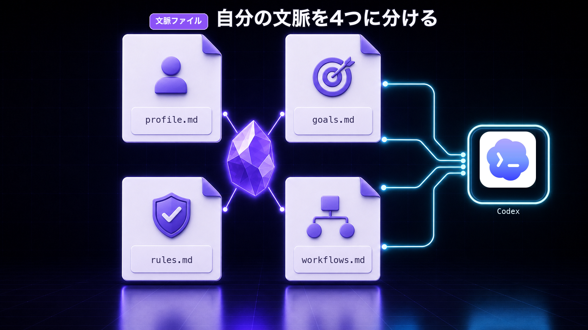

# Day 3: 自分の文脈を4つのファイルに分ける


作成日: 2026-07-04

## 今日のゴール

Day 3では、AI秘書があなたを理解するための4つのファイルを具体的に作ります。

今日作るファイルはこれです。

```text
2nd-brain/
└── 00_system/
    ├── profile.md
    ├── goals.md
    ├── rules.md
    └── workflows.md
```

Day 1で空のファイルを作りました。

Day 3では、その中身を入れていきます。

この4つがあると、Codexに毎回説明していたことをかなり減らせます。

## なぜ4つに分けるのか

AIに自分のことを理解してもらうには、いろいろな情報が必要です。

たとえば、

- 自分は何をしている人か
- 今どんな目標があるか
- どんなルールで作業したいか
- よくやる作業はどう進めるか

これを1つのファイルに全部書くこともできます。

でも、1つに詰め込みすぎると読みにくくなります。

そこで、この教材では4つに分けます。

| ファイル | 役割 |
|---|---|
| `profile.md` | 自分が何者か |
| `goals.md` | 今どこへ向かっているか |
| `rules.md` | AIに守ってほしいこと |
| `workflows.md` | よくやる作業の手順 |

この4つは、AI秘書に渡す自己紹介セットです。



## profile.md: 自分が何者かを書く

`profile.md` には、あなたの基本情報を書きます。

ここで大事なのは、履歴書のように立派に書くことではありません。

Codexが作業を手伝う時に必要な情報を書くことです。

### profile.mdテンプレ

```markdown
# Profile

## 私は何をしている人か

私は、これからひとりで発信活動やコンテンツ販売に取り組もうとしています。

主な活動:
- 
- 
- 

## AIに手伝ってほしいこと

- メモ整理
- タスク整理
- 企画出し
- 文章作成の補助
- 作業の次の一手の整理

## よく作るもの

- X投稿
- note記事
- Brain教材
- YouTube企画
- メモまとめ

## 大事にしたいこと

- 続けやすさ
- 分かりやすさ
- 自分の時間を増やすこと
- 無理なく仕組み化すること
```

### 書き方のコツ

最初は短くてOKです。

たとえば、こういう一文でも十分です。

```markdown
私は、これからSNS発信とコンテンツ販売を始めたい個人です。
AIには、メモ整理・タスク整理・企画出しを手伝ってほしいです。
```

大事なのは、AIが「この人は何をしている人か」をつかめることです。

## goals.md: 今どこへ向かっているかを書く

`goals.md` には、今の目標を書きます。

AIに相談する時、目標があるかないかで返答が変わります。

目標がなければ、AIは一般的に良さそうな提案をします。

目標があれば、その目標に近づく提案をしやすくなります。

### goals.mdテンプレ

```markdown
# Goals

## 今月の目標

- 
- 
- 

## 今週の目標

- 
- 
- 

## 今いちばん進めたいこと

- 

## 判断基準

迷ったら、次の順番で判断する。

1. 続けやすいか
2. 発信準備とコンテンツ販売が前に進むか
3. 自分の時間が増えるか
4. 将来の資産になるか
```

### 記入例

```markdown
# Goals

## 今月の目標

- Brain教材を1本完成させる
- Xで毎日1投稿する
- Obsidianに毎日メモを残す

## 今週の目標

- 教材のDay 0〜Day 3を書く
- 販売ページの下書きを作る
- 表紙画像を作る

## 今いちばん進めたいこと

- Codex × Obsidian教材を完成させる

## 判断基準

迷ったら、発信とコンテンツ販売の準備が続きやすくなる方を選ぶ。
```

### 書き方のコツ

目標は、かっこよく書く必要はありません。

「何を進めたいか」が分かればOKです。

また、目標は変わって大丈夫です。

変わったら書き直せばいい。

`goals.md` は固定された宣言文ではなく、今の向きをAIに伝えるためのファイルです。

## rules.md: AIに守ってほしいことを書く

`rules.md` には、AIに守ってほしいルールを書きます。

ここはかなり大事です。

AIに「何をしてほしいか」だけでなく、「何をしてはいけないか」も伝えます。

### rules.mdテンプレ

```markdown
# Rules

## 基本ルール

- 初心者にも分かる言葉で説明する
- まず結論から伝える
- 提案は多くても3つまでにする
- 分からないことは決めつけずに確認する

## ファイル操作ルール

- 勝手にファイルを削除しない
- 不要なものは削除ではなく `90_archive/` に移動する
- 大きく変更する前に、何を変えるか説明する

## 安全ルール

- パスワード、APIキー、トークンは扱わない
- 個人情報や顧客情報を外に出さない
- 外部サービスへの投稿は勝手にしない

## 文章ルール

- 難しい専門用語を使いすぎない
- 読者が真似できる手順にする
- 抽象論だけで終わらせない
```

### 書き方のコツ

最初に入れるべきルールは、この3つです。

- 勝手に削除しない
- 外部投稿しない
- 秘密情報を扱わない

この3つは、初心者ほど先に入れておいた方がいいです。

AIを便利にするほど、事故防止のルールも大事になります。

## workflows.md: よくやる作業の手順を書く

`workflows.md` には、よくやる作業の流れを書きます。

毎回同じ作業を頼むなら、手順をファイル化しておくと楽です。

たとえば、

- メモ整理
- タスク整理
- 企画出し
- 日報作成
- 記事構成作り

などです。

### workflows.mdテンプレ

```markdown
# Workflows

## メモ整理

1. 対象のメモを読む
2. アイデア、タスク、学びに分ける
3. タスクはチェックリストにする
4. 企画になりそうなものは候補として残す
5. 最後に次の一手を1つ出す

## タスク整理

1. 今日のメモと目標を読む
2. 今日やることを3つ以内に絞る
3. 確認が必要なものを分ける
4. 後でいいものは後回しにする

## 企画出し

1. 関連メモを読む
2. 読者の悩みを決める
3. タイトル案を出す
4. 目次案を作る
5. 最初に作るべき本文を決める

## 日報作成

1. 今日のメモを読む
2. やったことをまとめる
3. 残ったタスクを整理する
4. 明日の一手を出す
```

### 書き方のコツ

workflows.mdは、最初から完璧に作る必要はありません。

よく頼む作業が出てきたら、そのたびに追加していきます。

AIにこう頼んでもOKです。

```text
今やった作業の流れを、次回も使えるworkflowとしてまとめてください。
```

このようにして、作業するほど `workflows.md` が育っていきます。

## 4ファイルをCodexに読ませる

4つのファイルを作ったら、Codexにこう頼んでみてください。

```text
`00_system/profile.md`
`00_system/goals.md`
`00_system/rules.md`
`00_system/workflows.md`

この4つを読んで、私のAI秘書として動くために不足している情報があれば、初心者にも分かる言葉で指摘してください。
ただし、最初なので複雑にしすぎないでください。
```

この確認をすると、足りない情報が見えてきます。

たとえば、

- 目標が曖昧
- ルールが少ない
- よくやる作業が書かれていない
- AIに任せたいことが分かりにくい

などです。

指摘されたら、必要なところだけ直します。

## ここまででAI秘書は何ができるようになるか

Day 3まで終わると、Codexはかなりあなたの文脈を読みやすくなります。

たとえば、こう頼めます。

```text
`00_system/` を読んで、今の目標に沿って今日やることを3つに絞ってください。
```

```text
`03_memos/brain-ideas.md` を読んで、私の目標に合うBrain教材案に整理してください。
```

```text
今日のデイリーノートを読んで、タスクと学びに分けてください。
```

Day 0では「毎回説明し直す問題」を理解しました。

Day 1では `2nd-brain` の作業部屋を作りました。

Day 2では `AGENTS.md` でAI秘書の働き方を決めました。

Day 3では、AI秘書があなたを理解するための文脈を入れました。

ここまでで、かなり土台ができています。

## よくある失敗

### 失敗1: profile.mdを立派に書こうとしすぎる

短くて大丈夫です。

AIが作業を手伝うために必要な情報があれば十分です。

### 失敗2: goals.mdが空のまま

目標がないと、AIの提案がぼやけます。

小さくてもいいので、今週やりたいことを書いてください。

### 失敗3: rules.mdに禁止事項がない

AIに何をしてほしいかだけを書くと危険です。

何を勝手にしてはいけないかも書いてください。

### 失敗4: workflows.mdを作らず毎回口で説明する

毎回同じ作業を頼んでいるなら、それはworkflowにできます。

よく頼む作業ほど、ファイル化しておくと楽になります。

## Day 3 完了チェック

- `00_system/profile.md` に自分の基本情報を書いた
- `00_system/goals.md` に今の目標を書いた
- `00_system/rules.md` にAIに守ってほしいルールを書いた
- `00_system/workflows.md` によくやる作業の手順を書いた
- Codexに4ファイルを読ませて、不足情報を確認した

ここまでできたら、Day 4でデイリーノートとメモ整理の実践に入ります。
