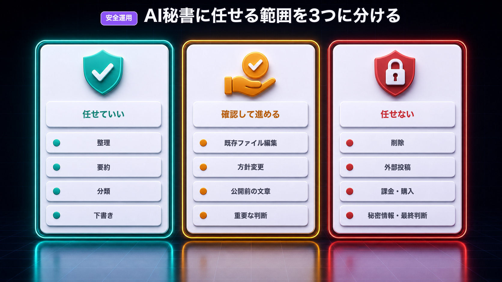
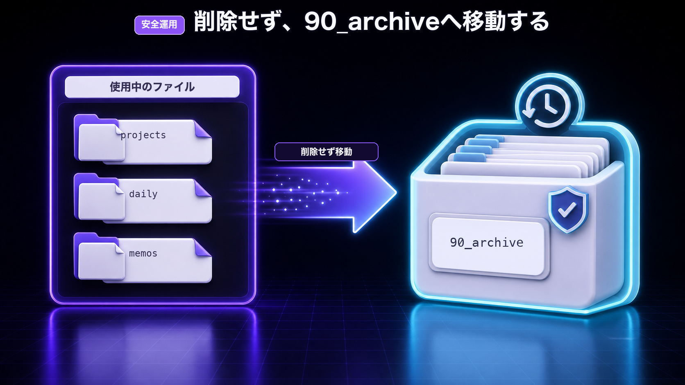

# Day 7: AI秘書を安全に使い続ける運用ルール


作成日: 2026-07-05
参照: [[教材_Codex×Obsidian_AI秘書_商品設計]] / [[教材_Codex×Obsidian_AI秘書_Day6本文ドラフト]]

## 今日のゴール

Day 7では、ここまで作った `2nd-brain` とAI秘書を、安全に使い続けるためのルールを作ります。

今日のゴールは、次の3つです。

- AIに任せていいことを決める
- 必ず自分で確認することを決める
- `rules.md` と `workflows.md` に運用ルールを追記する

Day 1では、Obsidianに `2nd-brain` の土台を作りました。

Day 2では、AGENTS.mdでAI秘書の働き方を決めました。

Day 3では、自分の文脈をファイル化しました。

Day 4では、メモ整理をAI秘書に頼めるようにしました。

Day 5では、タスクと目標を整理できるようにしました。

Day 6では、メモと目標から企画を作れるようにしました。

Day 7では、最後に「壊さず続けるためのルール」を作ります。

## AI秘書は万能ではない

ここまで進めると、Codexにかなりいろいろなことを頼めるようになります。

メモ整理、タスク整理、企画出し、日報作成。

これだけでも、かなり便利です。

ただし、AI秘書は万能ではありません。

ときどき勘違いします。

勝手に判断させすぎると、意図と違う整理をすることもあります。

大事な情報まで書き換えてしまう可能性もあります。

だから、AI秘書を作るときは「何を任せるか」と同じくらい、「何を任せないか」を決めることが大事です。

AI秘書は、あなたの代わりに人生を決める存在ではありません。

あなたの考え、メモ、タスク、企画を整理して、次の一手を見えやすくしてくれる存在です。

## まず3つに分ける

AI秘書に任せる作業は、次の3つに分けます。

| 区分 | 内容 |
|---|---|
| 任せていいこと | 整理、要約、分類、下書き、候補出し |
| 確認してから進めること | ファイル編集、方針変更、公開前の文章、重要な判断 |
| 任せないこと | 削除、課金、外部投稿、秘密情報の扱い、最終判断 |

この3つを分けるだけで、かなり安全に使えるようになります。

特に初心者のうちは、「確認してから進めること」を多めにしておくのがおすすめです。

慣れてきたら、少しずつ任せる範囲を広げれば大丈夫です。



## 任せていいこと

まず、AI秘書に任せていいことを決めます。

最初は、次のような作業から始めるのが安全です。

- メモを分類する
- タスクを抜き出す
- 今日やることを3つに絞る
- 企画案を出す
- 文章の下書きを作る
- 日報を作る
- 週次の振り返りを作る
- 既存メモから関連しそうな情報を探す

これらは、失敗しても大きな事故になりにくい作業です。

間違っていたら、自分で直せば済みます。

AI秘書の最初の仕事は、このくらいで十分です。

## 確認してから進めること

次に、AIに勝手に進めさせないことを決めます。

たとえば、次のような作業です。

- 既存ファイルを書き換える
- `rules.md` を変更する
- `goals.md` を変更する
- 販売ページの文章を完成版として扱う
- 外に出す文章を作る
- 重要な方針を決める
- 複数のファイルをまとめて整理する

こういう作業は、AIに提案してもらうのはOKです。

ただし、実際に反映する前に自分で確認します。

たとえば、Codexにはこう頼みます。

```text
まず提案だけ出してください。
まだファイルは編集しないでください。
私がOKと言ったら反映してください。
```

この一文があるだけで、かなり安心して使えます。

## 任せないこと

最後に、AIに任せないことを決めます。

最初のうちは、次の作業は任せない方が安全です。

- ファイルを削除する
- 外部サービスに投稿する
- 有料サービスに申し込む
- お金に関わる操作をする
- APIキーやパスワードを扱う
- 個人情報を含むデータをそのまま扱う
- 自分の代わりに最終判断する

AIは下書きや整理には強いです。

でも、外に出す・消す・お金が動く・秘密情報を扱う作業は、必ず自分で確認します。

これは怖がりすぎではありません。

AI秘書を長く使うための基本ルールです。

## 秘密情報を入れすぎない

`2nd-brain` は便利ですが、何でも入れていい場所ではありません。

特に、次のものはそのまま入れないようにします。

- パスワード
- APIキー
- 認証トークン
- Cookie
- クレジットカード番号
- 銀行口座情報
- 住所や電話番号
- 顧客情報
- 個別の取引先情報
- 外に出せない売上や契約の詳細

どうしてもメモしたい場合は、ぼかして書きます。

例:

```markdown
NG:
APIキー: sk-xxxxxxxxxxxxxxxx

OK:
OpenAI APIキーは別の安全な場所で管理している。
Codexにはキーそのものを貼らない。
```

```markdown
NG:
山田太郎さん 090-xxxx-xxxx 住所...

OK:
購入者Aさんから、導入部分が分かりにくいというフィードバックあり。
```

AI秘書に読ませる場所には、「AIに読まれても困らない形」にして置きます。

## 削除ではなくアーカイブにする

初心者がやりがちな失敗は、いらないと思ったファイルをすぐ削除することです。

でも、AIと一緒に作業するときは、削除よりアーカイブがおすすめです。

この教材では、Day 1で `90_archive/` を作りました。

使わなくなったものは、まずここに移動します。

```text
90_archive/
```

削除しなければ、あとから戻せます。

Codexに整理を頼むときも、こう伝えます。

```text
不要そうなファイルがあっても削除しないでください。
削除候補として一覧にしてください。
移動する場合は `90_archive/` に移動する提案だけ出してください。
```

最初は「消さない」が正解です。



## 外部投稿は最後に自分で確認する

Day 6では、X、note、Brain、YouTubeなどの企画に変換する方法を扱いました。

AI秘書は、投稿文や販売ページの下書きを作るのが得意です。

ただし、外に出す前の最終確認は自分でやります。

たとえば、AIに任せていいのはここまでです。

- 投稿案を作る
- タイトル案を出す
- 販売ページの構成を作る
- 誤字脱字を確認する
- 読みにくい部分を指摘する

逆に、最後は自分でやります。

- 投稿ボタンを押す
- 販売開始する
- 価格を変える
- 読者への約束を決める
- 実績や数字を載せる

外に出るものは、AI秘書の下書きを自分が確認して出す。

この形にしておくと、安心して使えます。

## rules.mdに運用ルールを追記する

ここまでの内容を、`00_system/rules.md` に追記します。

そのまま使えるテンプレはこちらです。

```markdown
# Rules

## 基本ルール

- AIは、私のメモ・タスク・企画を整理する秘書として動く
- 最終判断は私が行う
- 分からないことは決めつけず、確認する
- いきなり大きく変更せず、小さく提案する

## AIに任せていいこと

- メモの分類
- タスクの抜き出し
- 今日やることの整理
- 企画案の作成
- 文章の下書き
- 日報の作成
- 週次振り返りの作成

## 確認してから進めること

- 既存ファイルの編集
- goals.md の変更
- rules.md の変更
- workflows.md の変更
- 販売ページや投稿文の完成版作成
- 複数ファイルをまたぐ整理
- 重要な方針変更

## 任せないこと

- ファイル削除
- 外部投稿
- 課金や購入
- パスワード、APIキー、トークンの保存
- 個人情報の保存
- お金に関わる最終判断
- 私の代わりに重要な決断をすること

## ファイル操作ルール

- ファイルを削除しない
- 不要そうなものは削除候補として一覧にする
- 移動する場合は `90_archive/` を使う
- 既存ファイルを大きく書き換える前に確認する
- 変更した内容は最後に簡単に報告する

## 外部公開ルール

- X、note、Brain、YouTubeなどに出す文章は下書きまで作る
- 投稿や販売開始は私が行う
- 数字、実績、価格、約束は必ず私が確認する
- 誇張表現や断定表現は避ける
```

最初から完璧にする必要はありません。

使いながら、必要なルールを少しずつ追加していけば大丈夫です。

## workflows.mdに週次メンテを追加する

AI秘書を育てるには、週1回だけ見直す時間を作るのがおすすめです。

毎日細かく直そうとすると、続きません。

週1回、10分だけで十分です。

`00_system/workflows.md` に、次の内容を追記します。

```markdown
## 週次メンテ

目的:
- 2nd-brainの中身を軽く見直す
- goals.md が古くなっていないか確認する
- rules.md に追加すべきルールがないか確認する
- workflows.md に追加できる定型作業がないか確認する

手順:
1. 今週のデイリーノートを確認する
2. 完了したタスクを振り返る
3. 残っているタスクを整理する
4. よく繰り返した作業を探す
5. ルールに追加すべき失敗や注意点を探す
6. 来週の最初の一手を決める

出力:
- 今週できたこと
- 来週やること
- rules.mdに追記した方がいいこと
- workflows.mdに追記した方がいいこと
- 不要になったメモやタスク
```

週次メンテを入れておくと、`2nd-brain` が散らかりにくくなります。

## 週次メンテ用プロンプト

Codexに週次メンテを頼むときは、次のように伝えます。

```text
`00_system/profile.md`
`00_system/goals.md`
`00_system/rules.md`
`00_system/workflows.md`
`02_daily/`
`03_memos/`

この範囲を見て、今週の振り返りを作ってください。

やってほしいこと:
1. 今週できたことをまとめる
2. 残っているタスクを整理する
3. 来週やることを3つに絞る
4. rules.mdに追加した方がいいルールを提案する
5. workflows.mdに追加した方がいい作業手順を提案する

ルール:
- まだファイルは編集しない
- まず提案だけ出す
- 削除はしない
- 不明点は確認する
```

ここでも大事なのは、いきなり編集させないことです。

まず提案してもらい、自分が確認してから反映します。

## AI秘書に頼むときの型

今後、AI秘書に何かを頼むときは、次の型を使うと安定します。

```text
目的:
何をしたいかを書く

読んでほしいファイル:
- 00_system/profile.md
- 00_system/goals.md
- 02_daily/YYYY-MM-DD.md

やってほしいこと:
- 具体的な作業を書く

触っていい範囲:
- 編集していいファイルやフォルダを書く

触ってほしくない範囲:
- 編集してほしくないファイルやフォルダを書く

出力形式:
- 箇条書き
- 表
- チェックリスト
- 下書き

注意:
- 削除しない
- まず提案だけ
- 不明点は確認する
```

この型を使うと、AI秘書が迷いにくくなります。

特に大事なのは、

- 読んでほしいファイル
- 触っていい範囲
- 触ってほしくない範囲

この3つです。

ここが曖昧だと、AIは勝手に広く解釈してしまいます。

## 危ない頼み方と安全な頼み方

同じ作業でも、頼み方で安全度が変わります。

| 危ない頼み方 | 安全な頼み方 |
|---|---|
| 全部整理して | `03_memos/` だけ見て、分類案を出して |
| いらないファイル消して | 削除候補を一覧にして。まだ消さないで |
| 投稿しておいて | 投稿文の下書きを3案作って |
| いい感じに直して | 読みにくい箇所を指摘して、修正案を出して |
| 売れるようにして | 誇張せず、読者の悩みが伝わる販売文にして |

AI秘書には、広すぎる指示より、範囲を決めた指示の方が向いています。

「全部」「いい感じに」「任せる」は便利な言葉ですが、最初のうちは事故りやすいです。

## 失敗したらルールにする

AI秘書を使っていると、たまに失敗します。

たとえば、

- 余計な見出しを増やされた
- 勝手に文章を盛られた
- タスクを増やされすぎた
- 企画案が抽象的だった
- 大事なメモを見落とされた

こういうときに、ただ怒って終わるともったいないです。

失敗したら、`rules.md` にルールとして追加します。

例:

```markdown
## 追加ルール

- タスク整理では「今日やること」を3つまでにする
- 企画案は5つまでにする
- 元メモにない実績や数字を勝手に追加しない
- 販売ページでは、できない約束をしない
- 迷ったら確認待ちに入れる
```

AI秘書は、失敗をルールに変えるほど使いやすくなります。

## 今日作る完成形

Day 7が終わった時点で、`2nd-brain` には次のものが揃います。

```text
2nd-brain/
├── AGENTS.md
├── 00_system/
│   ├── profile.md
│   ├── goals.md
│   ├── rules.md
│   └── workflows.md
├── 01_projects/
├── 02_daily/
├── 03_memos/
├── 04_outputs/
└── 90_archive/
```

そして、`rules.md` には次の3つが書かれています。

- AIに任せていいこと
- 確認してから進めること
- 任せないこと

`workflows.md` には、週次メンテの手順が入っています。

ここまでできれば、AI秘書の土台は完成です。

## 最後の確認プロンプト

Day 7の最後に、Codexへこう頼みます。

```text
この `2nd-brain` の中身を見て、AI秘書として安全に使い続けるために不足しているルールがないか確認してください。

確認してほしいもの:
- AGENTS.md
- 00_system/profile.md
- 00_system/goals.md
- 00_system/rules.md
- 00_system/workflows.md

見てほしい観点:
1. AIに任せていいことが明確か
2. 確認が必要なことが明確か
3. 任せないことが明確か
4. 秘密情報を入れすぎないルールがあるか
5. 削除や外部投稿を勝手にしないルールがあるか

ルール:
- まだファイルは編集しない
- 不足している点を一覧で出す
- 追加するならどこに何を書くか提案する
```

この確認までできれば、かなり安心して使い始められます。

## よくある失敗

### 失敗1: AIに全部任せようとする

最初から全部任せると、どこで間違ったのか分からなくなります。

まずは、メモ整理やタスク整理など、小さい作業から任せます。

### 失敗2: 秘密情報をそのまま入れる

パスワード、APIキー、トークン、個人情報はそのまま入れません。

AIに読ませる場所には、読まれても困らない形にして置きます。

### 失敗3: rules.mdを作って放置する

ルールは一度作って終わりではありません。

失敗したとき、迷ったとき、作業が増えたときに少しずつ育てます。

### 失敗4: 削除を軽く考える

ファイル削除は、最初のうちはAIに任せない方が安全です。

不要なものは `90_archive/` に移動するか、削除候補として一覧にします。

### 失敗5: 外に出す文章を確認しない

AIが作った投稿文や販売文は、必ず自分で確認します。

特に、数字、実績、価格、約束は自分で見ます。

## Day 7 完了チェック

最後に、次のチェックをします。

- [ ] AIに任せていいことを決めた
- [ ] 確認してから進めることを決めた
- [ ] 任せないことを決めた
- [ ] 秘密情報を入れすぎないルールを確認した
- [ ] 削除ではなくアーカイブにするルールを確認した
- [ ] `rules.md` に運用ルールを追記した
- [ ] `workflows.md` に週次メンテを追記した
- [ ] 最後の確認プロンプトをCodexに投げた

## 7日間の完成形

ここまでで、Codex × Obsidian の自分専用AI秘書の土台ができました。

これは、完成された巨大システムではありません。

でも、最初の一歩としては十分です。

あなたの `2nd-brain` には、

- 自分のプロフィール
- 今の目標
- AIに守ってほしいルール
- よくやる作業の手順
- 日々のメモ
- タスク
- 企画の種

が入っています。

そしてCodexは、それらを読みながら、メモ整理・タスク整理・企画出しを手伝えるようになっています。

最初から完璧なAI秘書を作る必要はありません。

使いながら、少しずつ育てていけば大丈夫です。

大事なのは、AIに毎回ゼロから説明する状態を抜け出すことです。

`2nd-brain` に自分の文脈を置き、Codexに読ませる。

それだけで、AIはただのチャット相手ではなく、あなたの作業を支える秘書に近づきます。
