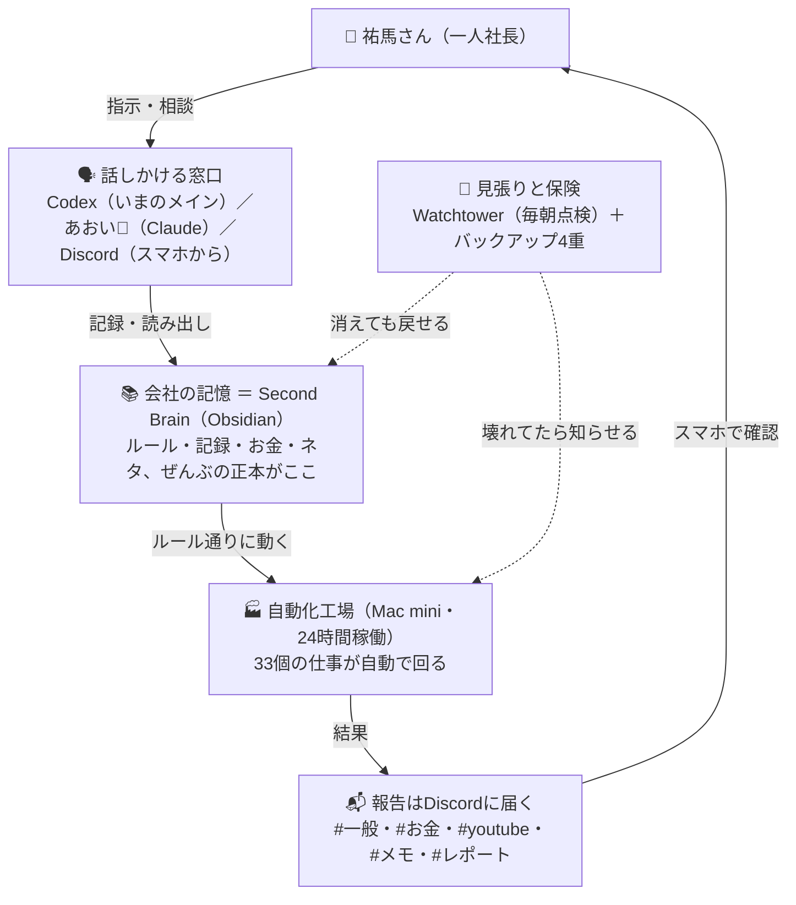

# 🎛 AIシステムダッシュボード

最終更新: 2026-07-16（作成: あおい / Claude Code）

> 祐馬さんの「一人社長＋AI部隊」がいまどう回っているかを、1枚で見るページ。
> 前半は祐馬さん向け（やさしい言葉）、後半はエージェント向けの技術メモ。
> 数字・状態の正本はリンク先（特に [[01_プロジェクト/AI自動化/導入済み|自動化ジョブ台帳]]）。食い違ったらリンク先が正しい。
>
> 🎨 ビジュアル版: 同フォルダの `AIシステムダッシュボード.html`（ブラウザで開くと図とタイル付きで見られる）。正本はこのmd。

## この会社、いまこうなってる

**祐馬さんがAIに話しかける → ぜんぶSecond Brainに記録される → Mac miniが24時間、33個の仕事を自動で回す → 結果はDiscordに届く。** 壊れてないか見張る警備員と、消えても戻せるバックアップ付き。

## 🧑‍💼 AI社員名簿

| 名前 | ひとことで | 何をしてくれる？ |
|---|---|---|
| **あおい🌊** | 秘書 兼 マネージャー（Claude） | Discordで話しかければいつでも返事。Mac miniに住んでいて、自動化の実行役も担当 |
| **Codex** | メインの作業員（引き継ぎ中） | 調べ物・ファイル編集・計画づくり。いま日常の入口をあおいから引き継ぎ中 |
| **Fable 5** | 社外の軍師 | 作戦会議・整理・図解の担当。自分では手を動かさない（考える専門） |
| **Watchtower🗼** | 警備員（AIではなくプログラム） | 毎朝8:30に全設備を点検。異常があった時だけ知らせてくる |

## 🏭 自動でやってくれてる仕事（全33個）

**元気に稼働中 27 ／ 様子見 2 ／ 止めてある 4**（2026-07-16時点。詳しくは [[01_プロジェクト/AI自動化/導入済み|台帳]]）

### 💰 お金係
- 毎晩23:00、Uberの売上を集計して **#お金** に報告
- 毎週月曜の朝、freeeに週次で記帳して **#お金** に報告
- 毎月1日、freeeで「振り分け待ちのお金」がいくらあるかチェックして **#お金** に報告
- 月2回（1日・16日）、出前館の実績PDFのダウンロードをリマインド
- 毎月アタマ、経理の数字を別ルートで検算（静かに実施・レポートはVault内）

### 📺 YouTube係
- YouTubeの収益を毎日デイリーノートに記録（静かに実施）
- 毎週月曜、チャンネル統計をスプレッドシートに更新
- 創作スレの学習（ネタ収集=日曜夜 / 文体学習=日曜夜 / 台本の振り返り=毎月1日）
- 毎月25日、「来月のネタ草案つくろう」と **#youtube** でリマインド

### 🧠 記憶・メモ係
- 毎朝4:00、朝ダイジェスト（今月の数字＋今日のタスク）を作って **#一般** に配達
- 毎晩23:30、今日の日誌から知識を拾い出して **#メモ** に報告
- 日曜夜、ノートのお手入れ（リンク付け・重複整理）
- 日曜20:00、たまったタスクから5個だけ「やる？いつか？捨てる？」と質問（週次棚卸し）
- 毎週月曜、不要メールのお掃除

### 🛡️ 守り係
- 10分ごとに全記録を自動保存し、毎日GitHubにも控えを送る
- 日曜4:30に週次バックアップ、毎月1日に大型バックアップ、毎月2日に「本当に復元できるか」の練習
- 外付けSSDにも控えを置く（MacとGoogleが同時に壊れても戻せる最終保険）
- 毎晩、あおいの頭を就寝中にリフレッシュ（朝はフル回転で始業）

## 📅 AI社員の1日

| 時刻 | 起きること | 届く場所 |
|---|---|---|
| 3:10 | あおいの頭を夜間リフレッシュ | （静か） |
| 4:00 | ☀️朝ダイジェスト配達 | #一般 |
| 8:30 | 🗼Watchtowerが全設備を点検 | 異常時だけ#レポート |
| 12:00 | YouTube収益をノートに記録 | （静か） |
| 23:00 | Uber売上の集計 | #お金 |
| 23:30 | 今日の学びを知識として保存 | #メモ |

- **月曜の朝**: メール掃除 → 週次経理 → チャンネル統計更新
- **日曜の夜**: 週次バックアップ（早朝）→ 棚卸し＆Uber週間プラン（20:00）→ ノート手入れ＆ネタ収集（21:00）→ 文体学習（22:00）
- **毎月1日**: バックアップと経理チェックのまとめDAY（2日は復元練習、25日はネタ草案リマインド）

## 📋 今日のタスク・ノート（Obsidianで開くとここに実物が出る）

> 下の埋め込みはObsidianで開いた時だけ中身が表示される（GitHubやHTMLでは枠だけ）。
> ✅の付け方: **期日タスクはここで直接チェックしてOK**（あれが正本・督促も止まる）。
> **タスクボードは見るだけ**（完了はDiscordで「済: ◯◯」と言えば原本まで消し込まれる）。
> メモの追加はDiscordで「メモ: ◯◯」→ 今日のデイリーノートに入る。

### 📌 今週やる（タスクボードより・見るだけ）

![[06_エージェント運用/00_司令塔/タスクボード#📌 今週やる（最大5件・祐馬さんが選ぶ）]]

### ⏰ 期日つき（ここでチェックしてOK）

![[06_エージェント運用/00_司令塔/期日タスク]]

### 📓 今日のデイリーノート

Obsidian左のリボン「今日のデイリーノート」で開く／スマホからはDiscordで「メモ: ◯◯」。ノートは `05_日誌/` にある。

## 🚨 調子が悪いときの見分け方

**「来るはずの報告が来ない」= 故障のサイン。** 特にこの3つ：

1. 毎朝4時の☀️朝ダイジェスト（#一般）
2. 毎晩23時のUber売上（#お金）
3. 月曜朝の週次経理（#お金）

おかしいと思ったら、Discordであおいに「**◯◯の報告来てないよ**」と言えばOK。調べて直すのはAIの仕事。

## 🤝 AIとの約束ごと

AIが**勝手にやらない**こと（必ず祐馬さんに確認してから）：
**削除**・**外部への投稿**・**お金の確定処理**・**アカウント設定の変更**・**自動化の停止や追加**

---

## 🔧 エージェント向け技術メモ

> ここから下はAIエージェント・技術向け。祐馬さんは読まなくてOK。

### 構成の実体

- 入口: Codexメイン移行フェーズ1／Claude Code（あおい）は補助・退避先／Discordはスマホ受付・通知（正本ではない）
- 4正本（各git管理）: `~/2nd-Brain`（知識）／`~/Projects/youtube`（制作作業場）／`~/agent-skills`（スキル正本）／`~/agent-adapters`（AI入口＋agent-run）
- 実行: Mac mini launchd（Claude / Codex / Python混在）。agent-run＝AIベンダー差し替え口（段階移行中）
- バックアップ4層: ローカルgit(10分毎) → GitHub日次push → 週次snapshot＋月次tar＋restore-drill(毎月2日) → SSD(鍵抜き版)

### ジョブ状態の内訳（2026-07-16時点・正本は台帳）

- 🟡 様子見 2: youtube-revenue（last exit 0・要観察）／vault-snapshot（launchd tarに売上証憑が入るかの確認・台帳2026-07-05記載）
- 🛑 停止・退避済み 4: channel-lifecycle／monthly-accounting（Claude実行のため停止）／kicho-weekly（旧記帳）／vault-mirror（旧Driveミラー）
- 停止の作法: 削除せず plist を `~/.claude/archived-launchagents/` へ退避＋Watchtower EXPECTED_JOBS 整合（現在29本＝🟢27＋🟡2と一致）
- 移行・観察中: script-learning＝Codex shadow（判定 2026-08-02）／corpus-collect＝agent-run配線済み・日曜21:00の自然実行を観察

### 絶対に誤解しないこと

- Codexメイン入口 ＝ 全自動化のCodex化完了、**ではない**
- `com.claude.*` ＝ 今もClaudeで動いている、**ではない**
- Driveの2nd-Brain ＝ 正本、**ではない**（証憑フォルダだけは正本）
- Discord / Channels ＝ 正本、**ではない**

### 一次面リンク集

| 知りたいこと | 見る場所 |
|---|---|
| 今の状態・最優先 | [[06_エージェント運用/00_司令塔/NOW\|NOW]] |
| タスク | [[06_エージェント運用/00_司令塔/タスクボード\|タスクボード]]＋[[06_エージェント運用/00_司令塔/期日タスク\|期日タスク]] |
| 実行ログ・申し送り | [[06_エージェント運用/00_司令塔/作業ログ_ツバキとあおい\|作業ログ]] |
| 自動化が動いてるか | [[06_エージェント運用/30_ヘルスチェック/ヘルスチェックログ\|ヘルスチェックログ]]＋[[01_プロジェクト/AI自動化/導入済み\|台帳]] |
| 重要な決定 | [[06_エージェント運用/40_判断ログ/決定事項\|決定事項]]（保留は[[06_エージェント運用/40_判断ログ/保留判断\|保留判断]]） |
| ルール・権限 | [[00_システム/10_Agent/rules\|rules]]＋[[06_エージェント運用/00_司令塔/権限と禁止事項\|権限と禁止事項]] |
| 全エージェント共通の運用契約 | [[00_システム/20_Agent_Portable/specs/agent-neutral-contract\|agent-neutral-contract]] |
| 仕組みの詳しい監査・改善案 | [[06_エージェント運用/50_レポート/2026-07-03_現行AI運用_マインドマップ\|現行AI運用マインドマップ]] |

### 更新ルール

- このページは地図。構成が変わった時（入口・正本・エージェント編成・レイヤー）だけ図と名簿を直す
- ジョブ本数・様子見の項目は、台帳（導入済み.md）を更新したら同じターンでここも直し、冒頭の「最終更新」日付を変える
- ビジュアル版HTMLは md→HTML の一方向で作り直す（HTMLだけ直さない）。図の元データはこのmdのMermaidブロック
- このページの数字は「その日時点のスナップショット」。正本はあくまでリンク先
