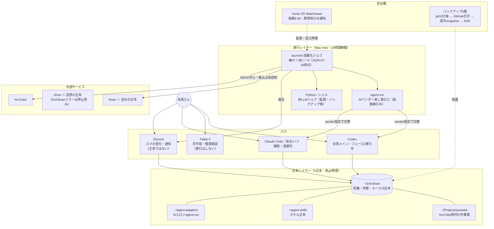

# 🎛 AIシステムダッシュボード

最終更新: 2026-07-16（作成: あおい / Claude Code）

> ここは「今のAIの仕組み」を1枚で見るための**地図**。数字・状態の正本はリンク先（特に [[01_プロジェクト/AI自動化/導入済み|自動化ジョブ台帳]]）で、ここは入口。食い違ったらリンク先が正しい。
>
> 使い方: ①全体像 → 下のマップ ②「ちゃんと動いてる？」→ 状態サマリー＋[[06_エージェント運用/30_ヘルスチェック/ヘルスチェックログ|ヘルスチェックログ]] ③作業に入る → [[06_エージェント運用/00_司令塔/NOW|NOW]]

## 一言でいうと

**入口はCodexへ移行中（フェーズ1）、記憶の正本はObsidian、実行はMac miniのlaunchd（Claude / Codex / Python混在）**。それをWatchtowerとバックアップ4層が見張っている。

## 全体マップ

## エージェント編成

| 名前 | 中身 | 役割 | 備考 |
|---|---|---|---|
| あおい🌊 | Claude（discord-monitor常駐＋Claude Code） | マネージャー・実行・Discord応対 | 全窓口で名前統一（2026-06-16）。旧ツバキ🌸/さくら🌸の呼び分けは廃止。役割分離（実装者≠確認者）は品質ゲートとして維持 |
| Codex | OpenAI Codex | 日常メイン入口（移行フェーズ1）・調査・編集・計画 | カスタムスキルは `~/.codex/skills → ~/agent-skills` のsymlink運用（21件verify PASS） |
| Fable 5 | Claude Fable 5 | 司令塔・整理相談・図解 | 実行はしない。再構築案件は「Fable司令塔・Codex実行」型（2026-07-03採用・[[00_システム/20_Agent_Portable/specs/fable-command-codex-execution|spec]]） |
| Yuma OS Watchtower | Python（非LLM） | launchd全ジョブの監視・自己修復 | 毎朝8:30。経理系は通知のみ（二重計上防止）。EXPECTED_JOBS=29本 |

## 自動化ジョブ 状態サマリー

正本: [[01_プロジェクト/AI自動化/導入済み|AI自動化ジョブ台帳]]（時刻・報告先・止め方はすべてここ）

2026-07-16時点・計33本（Mac mini集約。MacBook Airは普段使い＋オンデマンドスキルのみ）:

| 状態 | 本数 | 中身 |
|---|---|---|
| 🟢 稼働中 | 27 | discord-monitor（あおい本体）、Watchtower、バックアップ系、経理READ系、YouTube系ほか |
| 🟡 観察中 | 2 | youtube-revenue（last exit 0だが要観察）／vault-snapshot（launchd tarに売上証憑が入るかの確認・台帳2026-07-05記載） |
| 🛑 停止・退避済み | 4 | channel-lifecycle／monthly-accounting（Claude実行のため停止）／kicho-weekly（旧記帳）／vault-mirror（旧Driveミラー） |

移行・観察中の特記:

- **script-learning**: Codex shadow中。判定予定 **2026-08-02**（launchd既定・Discord本番投稿は未変更）
- **corpus-collect**: 通知レッグを `agent-run` 経由へ配線済み（vendor=Claude固定）。日曜21:00の自然実行を観察
- 🛑停止ジョブのplistは削除せず `~/.claude/archived-launchagents/` へ退避＋Watchtower期待リスト整合、が作法

## どこに何が届くか（チャンネル別）

> 「報告が来ない＝壊れてる疑い」のクイック確認用。正確な時刻は台帳の📬早見表。

| チャンネル | 届くもの |
|---|---|
| #一般 | ☀️朝ダイジェスト（毎日4:00）／週次棚卸し（日20:00）／gmail-cleanup（月曜）／trash-cleanup（毎月1日）／リスナー復旧通知 |
| #お金 | Uber売上（毎日23:00）／週次経理（月曜9:05）／Uber週間プラン（日20:00）／出前館リマインド（1日・16日）／freee消込待ち（毎月1日10:45） |
| #メモ | 知識抽出（毎日23:30・抽出ゼロの日は沈黙） |
| #youtube | コーパス収集（日21:00・収集/失敗がある時のみ）／来月ネタ草案リマインド（毎月25日） |
| #レポート | Watchtower（異常時＋日曜サマリ）／monthly-backup・restore-drill・ssd-backup／vault-snapshot（失敗時のみ）／script-learning（毎月1日）／knowledge-gardener（日21:00）／nightly-refresh痕跡 |
| （通知なし） | youtube-revenue／neta-retrain／monthly-accounting-recheck／vault・satellite-autocommit／YouTube下書きSSDミラー |

## バックアップ・安全網（4層）

1. **ローカルgit auto-commit**（10分毎）— vault正本＋衛星3repo（agent-skills / agent-adapters / Projects/youtube）
2. **GitHub private 日次push**
3. **週次スナップショット＋月次バックアップ＋復元演習** — vault＋Drive証憑→`~/claude-backups/`（日曜4:30）、`~/.claude`丸ごとtar（毎月1日）、restore-drill（毎月2日）
4. **外付けSSD** — 鍵抜き（-nosecrets）版の最終防衛線。トークンは置かない（復旧は再認証チェックリストで）

## 今の最優先（正本: [[06_エージェント運用/00_司令塔/NOW|NOW]]）

1. 会計正本整理の完了（freee正本／旧AI帳簿は参考凍結）
2. AI自動化ジョブの台帳管理・ゾンビ化防止
3. Second BrainをClaude Code / Codex共通の事業OSに整える
4. YouTube制作フローの安定運用

進行中の大物: **YMM4動画編集AI社員**（Level 1完了待ち→Level 2はその後。詳細はNOW.md）

## 迷ったらここ（一次面リンク集）

| 知りたいこと | 見る場所 |
|---|---|
| 今の状態・最優先 | [[06_エージェント運用/00_司令塔/NOW\|NOW]] |
| タスク | [[06_エージェント運用/00_司令塔/タスクボード\|タスクボード]]＋[[06_エージェント運用/00_司令塔/期日タスク\|期日タスク]] |
| 実行ログ・申し送り | [[06_エージェント運用/00_司令塔/作業ログ_ツバキとあおい\|作業ログ]] |
| 自動化が動いてるか | [[06_エージェント運用/30_ヘルスチェック/ヘルスチェックログ\|ヘルスチェックログ]]＋[[01_プロジェクト/AI自動化/導入済み\|台帳]] |
| 重要な決定 | [[06_エージェント運用/40_判断ログ/決定事項\|決定事項]]（保留は[[06_エージェント運用/40_判断ログ/保留判断\|保留判断]]） |
| ルール・権限 | [[00_システム/10_Agent/rules\|rules]]＋[[06_エージェント運用/00_司令塔/権限と禁止事項\|権限と禁止事項]] |
| 全エージェント共通の運用契約 | [[00_システム/20_Agent_Portable/specs/agent-neutral-contract\|agent-neutral-contract]] |
| 仕組みの詳しい監査・改善案 | [[06_エージェント運用/50_レポート/2026-07-03_現行AI運用_マインドマップ\|現行AI運用マインドマップ]] |

## 権限のツボ（確認が必要な操作）

削除／外部投稿／会計・税務の確定変更／外部アカウント設定変更／自動化ジョブの停止・削除・新規追加／新MCP導入 → **必ず確認してから**。詳細: [[06_エージェント運用/00_司令塔/権限と禁止事項|権限と禁止事項]]

## 絶対に誤解しないこと

- Codexメイン入口 ＝ 全自動化のCodex化完了、**ではない**
- `com.claude.*` ＝ 今もClaudeで動いている、**ではない**
- Driveの2nd-Brain ＝ 正本、**ではない**（証憑フォルダだけは正本）
- Discord / Channels ＝ 正本、**ではない**

## 更新ルール

- このページは地図。**構成が変わった時**（入口・正本・エージェント編成・レイヤー）だけマップと編成表を直す
- **状態サマリーの本数・観察中項目**は、台帳（導入済み.md）を更新したら同じターンでここも直し、冒頭の「最終更新」日付を変える
- 数字の正本はあくまでリンク先。このページの数字は「その日時点のスナップショット」として扱う
