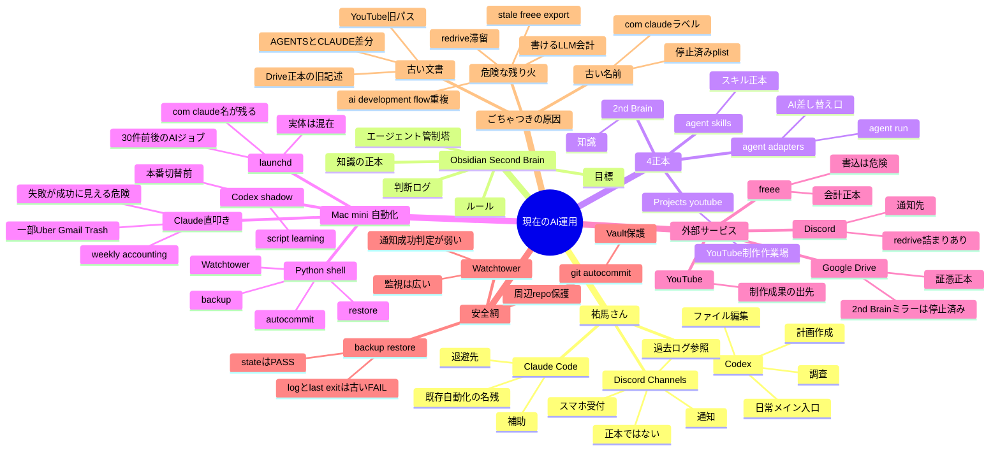
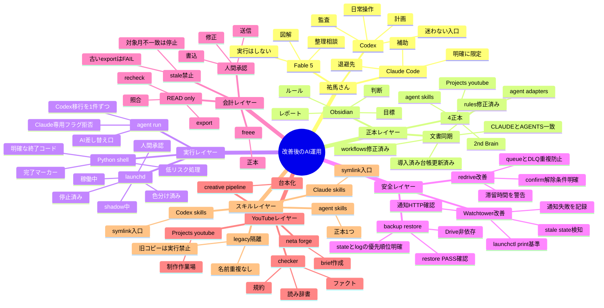

# 現行AI運用 マインドマップ

作成日: 2026-07-03  
元資料: `2026-07-03_現行AI運用_10エージェント再監査.md`  
目的: 祐馬さん本人とFable 5が、現在の仕組みと改善後の姿を直感的に理解するための整理。

## 1. まず一言で

今のAI運用は、**入口はCodexへ移行中、記憶の正本はObsidian、実行部隊はまだClaudeやPythonが混在**している状態。

悪い意味で全部バラバラなのではなく、土台はできている。問題は、古い説明書・古いジョブ名・一部危険な自動化が残っていて、「どれが本物の現在地か」が見えにくいこと。

## 2. 現在の仕組み



### 現在の読み方

```text
祐馬さん
  ↓
Codexで相談・調査・編集する
  ↓
Obsidianに正本がある
  ↓
4つの本物の置き場に分かれている
  ↓
Mac miniのlaunchdが自動化を動かす
  ↓
でも実行の中身は Claude / Codex / Python が混在中
  ↓
Watchtowerやbackupが見張っている
  ↓
freee・Drive証憑・Discord・YouTubeへつながる
```

ポイント:

- **Codexが入口**。でも全自動化がCodex化されたわけではない。
- **Obsidianが記憶と判断の正本**。DiscordやChannelsは正本ではない。
- **Driveの2nd-Brainミラーは停止済み**。ただしDrive証憑は別扱いで正本。
- **名前にClaudeと付いていても、今もClaudeで動いているとは限らない**。
- **危険なのは、会計書込・削除・外部投稿・通知失敗・古いデータ参照**。

## 3. 修正改善後の仕組み



### 改善後の読み方

```text
祐馬さん
  ↓
Codexをメイン入口にする
  ↓
Obsidianと4正本だけを本物として扱う
  ↓
文書と実機状態を一致させる
  ↓
launchdジョブを 稼働中 停止済み shadow 承認必須 に色分けする
  ↓
Watchtowerが本当に届いた通知だけを成功扱いする
  ↓
会計は READ only と 書込承認 を分ける
  ↓
Codex移行は1ジョブずつ進める
```

## 4. 現在と改善後の違い

| 観点 | 現在 | 改善後 |
|---|---|---|
| 入口 | Codexがメインになり始めた | Codexが迷わない入口 |
| 自動化 | Claude / Codex / Python混在 | 混在は残しても状態ラベルで整理 |
| 文書 | 古いDrive正本・YouTube旧パスが残る | CLAUDE / AGENTS / rules / workflowsが一致 |
| 会計 | `weekly-accounting` がまだ書けるLLM | READ-onlyと人間承認書込に分離 |
| freee照合 | 古いexportを拾える余地あり | 対象月・生成日時が合わなければ停止 |
| 通知 | Watchtower通知失敗を握りつぶす余地 | HTTP成功確認と失敗記録 |
| redrive | confirm-mode + queue/DLQ重複 | 重複防止と解除条件を明確化 |
| restore | state PASSとlog FAILが混在 | state/logの優先順位を明記 |
| スキル | 正本は整理済みだがlegacy同名が見える | legacy隔離で迷わない |
| YouTube | 実体はProjectsだが旧パス記述あり | Projects youtubeに統一 |

## 5. 祐馬さん向けの超要約

今はこう:

```text
入口はCodex
記憶はObsidian
作業場は4つに分離
自動化はMac mini
でも中身はClaude名や古い文書がまだ混ざっている
```

直した後はこう:

```text
入口はCodexで迷わない
正本はObsidianと4正本だけ
自動化は状態別に色分け
会計と削除は人間承認
監視は本当に届いた時だけ成功
古いコピーは隔離
```

## 6. まず直す5つ

1. 文書同期: `CLAUDE.md` / `AGENTS.md` / `rules.md` / `workflows.md` / `導入済み.md`
2. Watchtower修正: `launchctl print`基準、通知成功判定、通知失敗記録
3. 経理安全化: `weekly-accounting`をREAD-onlyまたは承認制へ
4. redrive整理: queue/DLQ重複とconfirm-modeを解消
5. legacy隔離: `ai-development-flow`同名SKILLと`codex-skills-ready`を紛らわしくない状態へ

## 7. 絶対に誤解しないこと

- Codexメイン入口 = 全自動化Codex化完了、ではない。
- `com.claude.*` = 今もClaudeで動いている、ではない。
- Driveの2nd-Brain = 正本、ではない。
- Discord/Channels = 正本、ではない。
- script-learningのdry-run = 本番切替、ではない。
- Watchtowerログがある = 通知が届いた、ではない。
- monthly recheck WARN = 全部OK、ではない。
